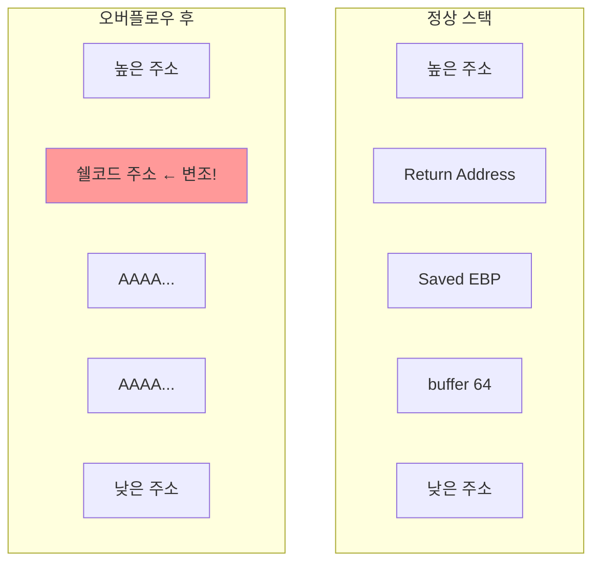
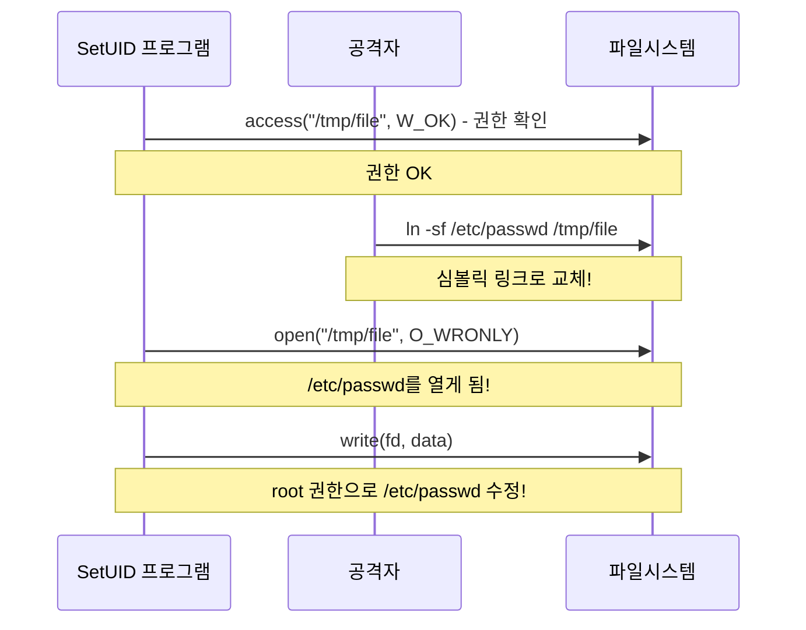

## 🌐 개요 (Overview)

시스템 공격은 운영체제나 애플리케이션의 취약점을 이용하여 권한 상승, 임의 코드 실행, 서비스 거부 등을 수행합니다. 이 문서에서는 주요 시스템 공격 기법을 다룹니다.

## 💥 버퍼 오버플로우 (Buffer Overflow)

### 정의

프로그램이 할당된 메모리 버퍼보다 **더 많은 데이터를 입력받아** 인접한 메모리 영역을 덮어쓰는 공격입니다.

### 취약한 코드

```c
// ❌ 취약한 코드
#include <string.h>

void vulnerable(char *input) {
    char buffer[64];
    strcpy(buffer, input);  // 길이 검사 없음!
}

int main(int argc, char *argv[]) {
    vulnerable(argv[1]);
    return 0;
}
```

### 스택 오버플로우 (Stack Overflow)

**로컬 변수가 저장되는 스택 영역**을 덮어써서 복귀 주소(Return Address)를 변조합니다.



**공격 과정**:
```plaintext
1. 버퍼를 넘치게 하여 Return Address까지 덮어씀
2. Return Address를 공격자의 쉘코드 주소로 변조
3. 함수 반환 시 쉘코드 실행
4. 공격자가 쉘 획득 (권한 상승)
```

### 힙 오버플로우 (Heap Overflow)

**동적 메모리 할당 영역(Heap)** 을 공격합니다.

```c
// 힙 오버플로우 취약점
char *buf1 = malloc(64);
char *buf2 = malloc(64);  // buf1 뒤에 할당

strcpy(buf1, very_long_input);  // buf2 영역까지 덮어씀
```

### 대응 방안

#### 1. 안전한 함수 사용

| 취약한 함수 | 안전한 대안 |
|------------|------------|
| `strcpy()` | `strncpy()` |
| `strcat()` | `strncat()` |
| `gets()` | `fgets()` |
| `sprintf()` | `snprintf()` |
| `scanf()` | 길이 제한 사용 `%63s` |

```c
// ✅ 안전한 코드
void safe(char *input) {
    char buffer[64];
    strncpy(buffer, input, sizeof(buffer) - 1);
    buffer[sizeof(buffer) - 1] = '\0';
}
```

#### 2. 운영체제 보호 기법

| 기법 | 설명 |
|------|------|
| **스택 가드 (Stack Canary)** | 복귀 주소 앞에 랜덤 값 삽입, 변조 시 탐지 |
| **ASLR** | 주소 공간 배치 난수화 (쉘코드 주소 예측 불가) |
| **NX bit (DEP)** | 스택/힙 영역 실행 방지 |
| **PIE** | 실행 파일 주소 난수화 |

```bash
# Linux에서 보호 기법 확인
cat /proc/sys/kernel/randomize_va_space  # ASLR (2 = 활성화)
readelf -l /bin/ls | grep GNU_STACK      # NX bit

# 컴파일 시 보호 기법 활성화
gcc -fstack-protector-strong  # 스택 가드
gcc -pie -fPIE               # PIE
gcc -z noexecstack           # NX bit
```

---

## 📝 포맷 스트링 (Format String)

### 정의

`printf` 등의 함수에서 **포맷 인자를 검증하지 않고** 사용할 때 발생하는 취약점입니다.

### 취약한 코드

```c
// ❌ 취약한 코드
char *user_input = argv[1];
printf(user_input);  // 포맷 스트링 없이 직접 출력!

// ✅ 안전한 코드
printf("%s", user_input);
```

### 공격 기법

**메모리 읽기 (%x)**:
```bash
$ ./vuln "AAAA.%x.%x.%x.%x"
AAAA.bffff5a0.100.b7e8b000.41414141
                          ^^^^^^^^ "AAAA"가 스택에서 출력됨
```

**메모리 쓰기 (%n)**:
```c
// %n은 지금까지 출력된 문자 수를 해당 주소에 씀
// 매우 위험한 공격 벡터
printf("AAAA%n", &count);  // count에 4가 저장됨
```

### 대응

```plaintext
1. 항상 포맷 스트링 지정
   printf("%s", user_input);

2. 사용자 입력을 포맷 스트링에 직접 사용 금지

3. 정적 분석 도구 사용
```

---

## 🏃 레이스 컨디션 (Race Condition)

### 정의

프로세스가 임시 파일 등을 생성할 때 **실행 순서의 틈(TOCTOU)** 을 이용하는 공격입니다.

> **TOCTOU**: Time of Check to Time of Use

### 공격 시나리오



**공격 과정**:
```plaintext
1. SetUID 프로그램이 access()로 파일 권한 확인
2. 확인 후 open() 전에 공격자가 파일을 심볼릭 링크로 교체
3. 프로그램이 의도치 않은 파일(예: /etc/passwd)을 수정
4. 공격자가 root 권한 획득
```

### 대응

```c
// ❌ 취약한 코드
if (access(filename, W_OK) == 0) {  // Check
    fd = open(filename, O_WRONLY);   // Use (TOCTOU gap!)
    write(fd, data, len);
}

// ✅ 안전한 코드
fd = open(filename, O_WRONLY);
if (fd != -1 && fstat(fd, &st) == 0) {
    // fd로 권한 확인 (원자적 연산)
    if (st.st_uid == getuid()) {
        write(fd, data, len);
    }
}
```

**추가 대응**:
- 임시 파일에 `O_EXCL` 플래그 사용
- `/tmp` 대신 안전한 디렉토리 사용
- umask 설정으로 권한 제한

---

## 🚫 자원 고갈 공격 (DoS)

### 디스크 자원 고갈

```bash
# 공격 예시
while true; do
    cat /dev/urandom >> /tmp/garbage
done
```

**대응**:
```bash
# 사용자별 디스크 쿼터 설정
edquota -u username
# 소프트 리밋: 90%, 하드 리밋: 100%
```

### 프로세스/메모리 고갈 (Fork Bomb)

```bash
# Fork Bomb (절대 실행 금지!)
:(){ :|:& };:
```

**대응**:
```bash
# ulimit으로 사용자별 제한
ulimit -u 100      # 최대 프로세스 수
ulimit -v 1048576  # 최대 가상 메모리 (1GB)
ulimit -f 100000   # 최대 파일 크기 (100MB)

# /etc/security/limits.conf에서 영구 설정
username  hard  nproc   100
username  hard  nofile  1024
```

---

## 🔐 권한 상승 공격 방어

### SetUID 파일 관리

```bash
# SetUID 파일 찾기
find / -perm -4000 -type f 2>/dev/null

# 불필요한 SetUID 제거
chmod u-s /path/to/file

# SetUID 파일 모니터링
find / -perm -4000 -type f -ls > /var/log/setuid.txt
diff /var/log/setuid.txt /var/log/setuid.txt.prev
```

### 최소 권한 원칙

```plaintext
1. root로 실행하는 서비스 최소화
2. sudo 권한 세분화 (/etc/sudoers)
3. 능력(Capabilities) 사용하여 권한 분리
4. 서비스별 전용 계정 사용
```

## 🔗 연결 문서 (Related Documents)

- [[kernel-structure]] - 운영체제 커널 구조
- [[process-states-lifecycle]] - 프로세스와 메모리 구조
- [[linux-account-security]] - SetUID 와 권한 관리
- [[malware-types]] - 악성코드와 시스템 공격
