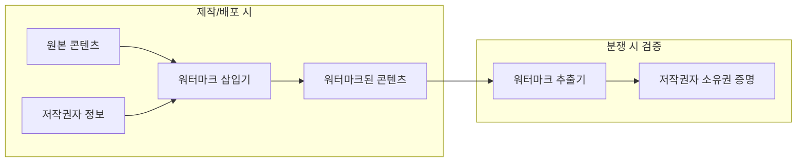
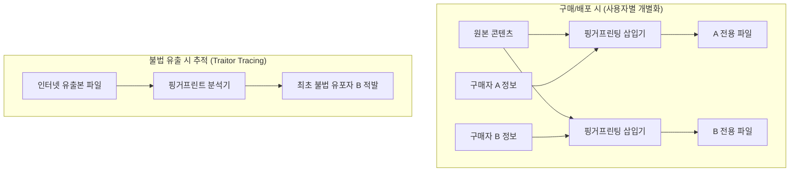

## 💡 1. 개념 및 쉬운 비유 (Concept & Intuitive Analogy)

| 구분 | 디지털 워터마킹 (Digital Watermarking) | 핑거프린팅 (Fingerprinting) |
|------|------------------------------------|---------------------------|
| **한 줄 요약** | 디지털 콘텐츠에 **저작권자(원작자) 정보**를 보이지 않게 삽입하여 저작권을 증명하는 기술 | 디지털 콘텐츠에 **구매자(사용자) 정보**를 보이지 않게 삽입하여 불법 유포자를 추적하는 기술 |
| **쉬운 비유** | 🎨 **미술관 소장 도장 / 화가의 서명 (저작권자 증명)** "이 그림은 A회사/작가 원작이다"라는 원작자 인장을 은닉합니다. | 🎫 **영화 시사회 티켓의 개별 일련번호 (구매자/유포자 추적)** "이 파일은 고객 B가 구매한 것"이라는 개별 식별자를 은닉하여 유출 시 최초 유포자를 찾아냅니다. |

---

## ❓ 2. 왜 비교가 필요한가? (Why Comparison Matters)

디지털 콘텐츠(이미지, 음원, 비디오, 문서)는 원본 손상 없이 무제한 복제가 가능하기 때문에 사후 권리 보호 기술이 필수적입니다.

1. **소유권 증명 vs 최초 유포자 추적**: 콘텐츠 유출 시 "이것이 내 저작물인가?"를 밝히는 기술과 "누가 인터넷에 퍼뜨렸는가?"를 추적하는 기술은 적용 대상이 다릅니다.
2. **삽입 시점 및 파일의 고유성**: 워터마킹은 제작 시점에 모든 고객에게 동일한 워터마크가 삽입되지만, 핑거프린팅은 **배포/구매 시점마다 구매자별로 서로 다른 정보**가 삽입됩니다.
3. **공모 공격(Collusion Attack) 위험**: 여러 구매자가 자신의 핑거프린팅된 파일을 비교하여 변형된 부분을 찾아 제거하려는 공격에 대비하는 기술적 메커니즘 차이를 파악해야 합니다.

---

## ⚙️ 3. 핵심 원리 및 동작 방식 (Core Mechanism & Workflow)

### (1) 워터마킹 동작 방식: 저작권자 정보 삽입 및 검증

### (2) 핑거프린팅 동작 방식: 구매자 정보 삽입 및 유포자 추적 (Traitor Tracing)

---

## 📊 4. 주요 특징 및 상세 비교 (Detailed Comparison)

| 비교 항목 | 디지털 워터마킹 (Digital Watermarking) | 핑거프린팅 (Fingerprinting) |
|----------|------------------------------------|---------------------------|
| **삽입되는 정보** | **저작권자 (원작자 / 제작사) 정보** | **구매자 (사용자 / 수신자) 정보** |
| **주요 목적** | 저작권 소유권 증명, 무결성 검증 | **불법 유포자 추적 (Traitor Tracing)**, 재유포 방지 |
| **정보 삽입 시점** | 콘텐츠 제작 및 패키징 시점 | 사용자 구매 및 배포/다운로드 시점 |
| **파일의 고유성** | 모든 배포본이 **동일한 워터마크**를 가짐 | 배포본마다 **구매자별 고유한 식별자**를 가짐 |
| **주요 위협/공격** | 워터마크 제거/위조 공격, 기하학적 왜곡 (Stirmark) | **공모 공격 (Collusion Attack)** (여러 파일 비교 제거) |
| **요구되는 특성** | 강인성(Robustness) 또는 연성(Fragility), 비가시성 | 공모 저항성(Collusion Resistance), 비가시성 |
| **주요 비유** | 미술품의 작가 서명 / 도서관 소장 도장 | 영화 시사회 초대권의 개별 일련번호 |

---

## 🚀 5. 실무 활용 및 관련 문서 (Real-world Use Cases & Related Documents)

### 실무 활용 패턴
- **디지털 워터마킹**:
  - **스톡 이미지/디지털 아트**: GettyImages, Shutterstock 등에서 저작권 침해를 막기 위해 원본 이미지에 보이지 않는 센서/패턴 삽입 (강성 워터마킹).
  - **위변조 검증**: 무기명 서류나 의료 영상 변조 시 워터마크가 깨지도록 설정 (연성 워터마킹).
- **핑거프린팅**:
  - **OTT 사전 시사회**: 넷플릭스, 디즈니+ 등에서 개봉 전 언론/평론가용 스크리너 제공 시 개별 평론가 ID를 영상에 은닉.
  - **기업 보안 문서**: 사내 기밀 PDF 문서 다운로드 시 다운로드한 임직원의 사번과 IP를 배경 및 여백에 은닉 삽입.

### 연결 문서 (Related Documents)
- [digital-content-protection](digital-content-protection.md) - 디지털 콘텐츠 보호 기술 전반 (DRM, DOI 포함)
- [cryptography-basics](fundamentals/cryptography-basics.md) - 암호학 기초 및 해시 함수
- [security-fundamentals](fundamentals/security-fundamentals.md) - 기밀성 및 무결성 보안 속성
