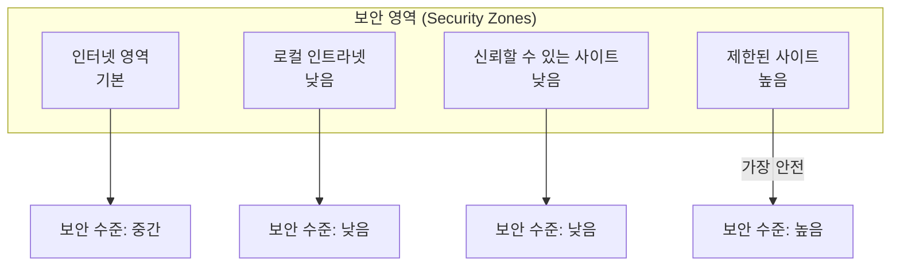

## 🌐 개요 (Overview)

**웹 브라우저**는 인터넷 접속의 주요 수단으로, 다양한 보안 위협에 노출됩니다. 이 문서에서는 쿠키 관리, 액티브 콘텐츠 제어, 보안 영역 설정 등 클라이언트 측 브라우저 보안을 다룹니다.

---

## 🍪 쿠키 (Cookie)

### 정의

웹 서버가 클라이언트 브라우저에 저장하는 **작은 텍스트 파일**로, 사용자 식별 및 세션 유지에 사용됩니다.

### 쿠키 유형

| 유형 | 설명 | 보안 위험 |
|------|------|----------|
| **세션 쿠키** | 브라우저 종료 시 삭제 | 낮음 |
| **영구 쿠키** | 만료일까지 보관 | 중간 (추적 가능) |
| **First-party** | 현재 방문 사이트가 설정 | 낮음 |
| **Third-party** | 광고 등 외부 사이트가 설정 | **높음 (추적)** |

### 쿠키 보안 속성

```http
Set-Cookie: session_id=abc123; 
    Secure;           # HTTPS에서만 전송
    HttpOnly;         # JavaScript 접근 차단 (XSS 방어)
    SameSite=Strict;  # 크로스사이트 요청 시 미전송 (CSRF 방어)
    Path=/;
    Domain=.example.com;
    Expires=Thu, 01 Jan 2027 00:00:00 GMT
```

| 속성 | 설명 | 방어 대상 |
|------|------|----------|
| **Secure** | HTTPS에서만 전송 | 도청 |
| **HttpOnly** | JavaScript에서 접근 불가 | XSS |
| **SameSite=Strict** | 동일 사이트 요청만 전송 | CSRF |
| **SameSite=Lax** | GET 요청만 허용 | CSRF (완화) |

### 쿠키 관리 권장사항

```plaintext
✅ DO:
- 민감 정보는 쿠키에 저장 금지 (세션 ID만 저장)
- HttpOnly, Secure, SameSite 속성 활용
- 주기적인 쿠키 삭제
- Third-party 쿠키 차단 설정

❌ DON'T:
- 자동 로그인 장기간 유지
- 공용 PC에서 쿠키 저장
- 신뢰할 수 없는 사이트에서 쿠키 허용
```

---

## 📜 히스토리 및 캐시 관리

### 브라우저 저장 정보

| 항목 | 저장 내용 | 보안 위험 |
|------|----------|----------|
| **히스토리** | 방문 URL 목록 | 프라이버시 침해 |
| **캐시** | 웹 페이지, 이미지, JavaScript | 민감 정보 노출 |
| **자동완성** | 폼 데이터, 비밀번호 | 자격증명 유출 |
| **다운로드 기록** | 파일 목록 | 프라이버시 |

### 보안 설정

```plaintext
권장 설정:
1. 브라우저 종료 시 자동으로 삭제:
   - 쿠키 및 사이트 데이터
   - 캐시된 이미지/파일
   - 히스토리

2. 비밀번호 자동 저장 비활성화
   - 대신 패스워드 매니저 사용

3. 양식 데이터 자동완성 비활성화

4. 개인정보 보호 모드 (시크릿 모드) 활용
```

---

## 🔌 액티브 콘텐츠 (Active Content)

### 정의

웹 페이지 내에서 **실행되는 코드**로, 사용자 동의 없이 시스템에 영향을 줄 수 있습니다.

### 주요 액티브 콘텐츠

| 유형 | 설명 | 보안 위험 | 현재 상태 |
|------|------|----------|----------|
| **ActiveX** | Microsoft IE 전용 플러그인 | **매우 높음** | IE 지원 종료 |
| **Java Applet** | 브라우저 내 Java 실행 | 높음 | 대부분 사용 중단 |
| **Flash** | Adobe Flash Player | 높음 | 2020년 지원 종료 |
| **JavaScript** | 모든 브라우저 지원 | 중간 | 현재 표준 |
| **WebAssembly** | 고성능 바이너리 코드 | 중간 | 현재 표준 |

### ActiveX 보안

```plaintext
ActiveX 위험성:
- 시스템 전체 접근 권한 가능
- 코드 서명 우회 가능
- 취약한 ActiveX 컨트롤을 통한 악성코드 설치
- Kill Bit 설정으로 특정 ActiveX 차단 가능

레지스트리 Kill Bit 설정:
HKLM\SOFTWARE\Microsoft\Internet Explorer\ActiveX Compatibility\{CLSID}
Compatibility Flags = 0x00000400
```

### JavaScript 보안

```javascript
// 위험한 JavaScript 기능
eval("악성코드");           // 문자열을 코드로 실행
document.cookie             // 쿠키 접근
XMLHttpRequest              // 크로스사이트 요청
localStorage/sessionStorage // 로컬 데이터 저장
```

**브라우저 방어 기능**:

| 기능 | 설명 |
|------|------|
| **동일 출처 정책 (SOP)** | 다른 도메인 리소스 접근 차단 |
| **CSP** | 허용된 스크립트만 실행 |
| **Subresource Integrity** | 외부 스크립트 무결성 검증 |

---

## 🛡️ 브라우저 보안 영역 (IE/Edge Legacy)

### Internet Explorer 보안 영역



| 영역 | 기본 보안 수준 | 용도 |
|------|--------------|------|
| **인터넷** | 중간-높음 | 일반 웹사이트 |
| **로컬 인트라넷** | 낮음 | 회사 내부 사이트 |
| **신뢰할 수 있는 사이트** | 낮음 | 관리자가 지정한 안전 사이트 |
| **제한된 사이트** | 높음 | 위험한 것으로 알려진 사이트 |

### 보안 영역별 설정

| 설정 | 인터넷 | 인트라넷 | 신뢰 | 제한 |
|------|--------|---------|------|------|
| **ActiveX 실행** | 확인 | 허용 | 허용 | 사용 안 함 |
| **스크립트 실행** | 허용 | 허용 | 허용 | 사용 안 함 |
| **파일 다운로드** | 허용 | 허용 | 허용 | 사용 안 함 |
| **혼합 콘텐츠** | 확인 | 허용 | 허용 | 사용 안 함 |

---

## 🔒 SSL/TLS 인증서 검증

### 인증서 오류 유형

| 오류 | 원인 | 위험도 | 대응 |
|------|------|--------|------|
| **만료됨** | 인증서 유효기간 초과 | 중간 | 사이트 관리자 문의 |
| **도메인 불일치** | CN/SAN이 URL과 다름 | **높음** | 접속 중단 |
| **신뢰할 수 없는 CA** | 자체 서명 또는 미등록 CA | **높음** | 접속 중단 |
| **해지됨** | CA가 인증서 폐기 | **매우 높음** | 접속 금지 |

### 안전한 연결 확인

```plaintext
✅ 확인 사항:
1. 주소창: https:// 및 자물쇠 아이콘
2. 인증서 정보 확인 (발급 대상, CA, 유효기간)
3. EV 인증서: 회사명 표시 (고신뢰)
4. 혼합 콘텐츠 경고 없음

⚠️ 위험 신호:
- 인증서 오류 경고
- HTTP로 로그인 페이지
- 자물쇠에 경고 표시
```

---

## 🌐 현대 브라우저 보안 기능

### Chrome/Edge/Firefox 보안 기능

| 기능 | 설명 |
|------|------|
| **Safe Browsing** | 피싱/악성 사이트 차단 |
| **사이트 격리** | 탭별 프로세스 분리 |
| **샌드박스** | 브라우저 프로세스 격리 |
| **HTTPS 우선** | HTTP 사이트 경고 |
| **추적 방지** | Third-party 쿠키/트래커 차단 |
| **팝업 차단** | 악성 팝업 자동 차단 |

### 브라우저 보안 설정 권장

```plaintext
필수 설정:
☑ HTTPS 전용 모드
☑ 사이트 격리 활성화
☑ 세이프 브라우징 활성화
☑ 팝업 차단
☑ Third-party 쿠키 차단
☑ Do Not Track 전송
☑ 위험한 다운로드 차단
```

---

## ⚠️ 브라우저 공격 유형

### 주요 공격

| 공격 | 설명 | 방어 |
|------|------|------|
| **피싱** | 정상 사이트 위장 | URL 확인, Safe Browsing |
| **드라이브 바이 다운로드** | 방문만으로 악성코드 설치 | 브라우저/플러그인 최신화 |
| **클릭재킹** | 투명 프레임으로 클릭 유도 | X-Frame-Options |
| **세션 하이재킹** | 쿠키 탈취 | HttpOnly, Secure |
| **MitB (Man in the Browser)** | 브라우저 내 악성코드 | 신뢰할 수 있는 확장만 설치 |

### 브라우저 확장 프로그램 보안

```plaintext
✅ 권장:
- 공식 스토어에서만 설치
- 최소 권한 확장만 사용
- 정기적으로 미사용 확장 제거
- 권한 요청 주의 깊게 검토

❌ 위험:
- 모든 사이트 데이터 접근 권한
- 알 수 없는 개발자
- 과도한 권한 요청
```

---

## 📋 클라이언트 보안 체크리스트

```plaintext
브라우저 설정:
☐ 브라우저/플러그인 자동 업데이트
☐ HTTPS 전용 모드 활성화
☐ Third-party 쿠키 차단
☐ 팝업 차단
☐ Safe Browsing 활성화

쿠키/캐시 관리:
☐ 종료 시 쿠키/캐시 삭제
☐ 비밀번호 자동 저장 비활성화
☐ 자동완성 데이터 정리

액티브 콘텐츠:
☐ 불필요한 플러그인 비활성화
☐ JavaScript 필요 시만 허용 (고급)
☐ Flash/Java 제거

인증서 확인:
☐ 인증서 오류 시 접속 중단
☐ 주소창 확인 습관화
```

---

## 🔗 연결 문서 (Related Documents)

- [[web-security]] - OWASP 웹 공격 (XSS, CSRF)
- [[network-security-protocols]] - SSL/TLS 프로토콜
- [[email-security]] - 피싱 이메일 대응
- [[malware-types]] - 드라이브 바이 다운로드 악성코드
