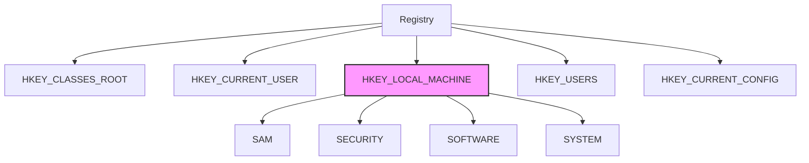
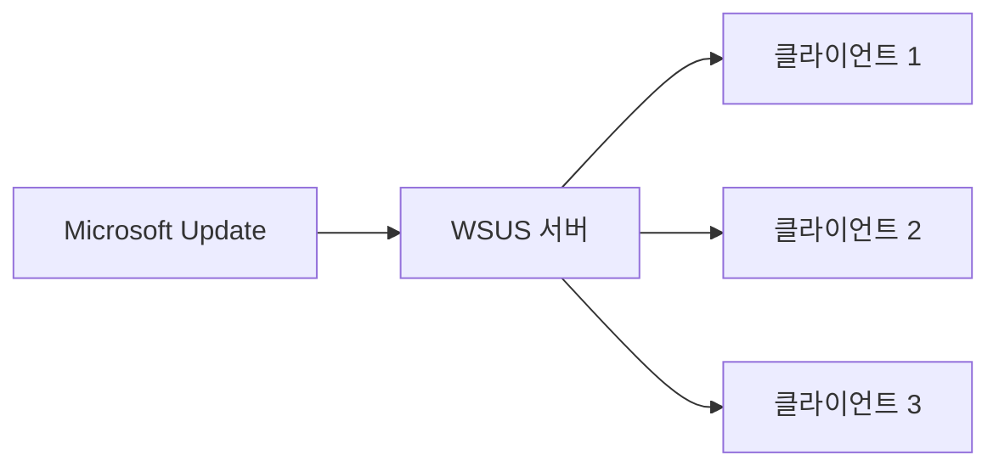

## 🌐 개요 (Overview)

Windows 클라이언트 보안은 사용자 계정 관리, 레지스트리 보호, 공유 폴더 관리, 원격 접속 제어 등을 포함합니다. 이 문서에서는 Windows 시스템의 보안 관리 핵심 개념을 다룹니다.

## 🖥️ Windows 운영체제 특징

### 주요 특징

| 특징 | 설명 |
|------|------|
| **GUI** | 아이콘과 윈도우 창을 통한 직관적 인터페이스 |
| **Plug & Play (PnP)** | 하드웨어 자동 인식 및 드라이버 설치 |
| **OLE** | 객체 연결 및 삽입 (다른 프로그램 객체 공유) |
| **긴 파일 이름** | VFAT 으로 최대 255 자 지원 (기존 8.3 제한 해제) |
| **선점형 멀티태스킹** | OS 가 CPU 제어권을 가지고 프로그램 실행 시간 제어 |

### NTFS 파일 시스템

Windows NT 계열의 표준 파일 시스템입니다.

| 기능 | 설명 |
|------|------|
| **ACL** | 접근 제어 목록으로 세밀한 권한 설정 |
| **대용량 지원** | 최대 16EB 볼륨, 256TB 파일 |
| **압축** | 파일/폴더 단위 압축 |
| **EFS** | 파일 시스템 수준 암호화 |
| **저널링** | 비정상 종료 시 빠른 복구 |
| **디스크 쿼터** | 사용자별 디스크 공간 제한 |

#### ADS (Alternate Data Stream)

하나의 파일에 **여러 개의 데이터 스트림**을 가질 수 있는 NTFS 기능입니다.

```cmd
:: ADS 생성
echo "hidden data" > normal.txt:hidden.txt

:: ADS 확인
dir /r

:: ADS 읽기
more < normal.txt:hidden.txt
```

**⚠️ 보안 위험**: 악성코드를 숨기는 데 악용될 수 있음

---

## 👤 사용자 계정 및 그룹 관리

### 로컬 사용자 계정

| 계정 | 설명 | 보안 권고 |
|------|------|----------|
| **Administrator** | 최고 관리자, 삭제 불가 | 이름 변경, 강력한 패스워드 |
| **Guest** | 제한적 권한의 임시 계정 | 비활성화 |
| **User** | 일반 사용자 | 최소 권한 원칙 적용 |

### 그룹 관리

| 그룹 | 설명 |
|------|------|
| **Administrators** | 모든 권한을 가진 관리자 그룹 |
| **Backup Operators** | 파일 권한과 상관없이 백업/복구 가능 |
| **Users** | 일반 사용자, 시스템 파일 변경 불가 |
| **Everyone** | 익명 사용자 포함 모든 사용자 (⚠️ 주의) |

### 계정 정책 설정

```powershell
# 로컬 보안 정책 열기
secpol.msc

# 암호 정책
# 계정 정책 → 암호 정책
# - 암호 복잡성 요구사항: 사용
# - 최소 암호 길이: 12자
# - 최대 암호 사용 기간: 90일
# - 최근 암호 기억: 24개

# 계정 잠금 정책
# 계정 정책 → 계정 잠금 정책
# - 계정 잠금 임계값: 5회
# - 계정 잠금 기간: 30분
# - 다음 시간 후 계정 잠금 수를 원래대로 설정: 30분
```

---

## 📁 레지스트리 (Registry)

### 정의

Windows 시스템의 설정, 하드웨어 정보, 사용자 정보 등을 담고 있는 **계층형 데이터베이스**입니다.

### 주요 루트 키



| 루트 키 | 약어 | 설명 |
|---------|------|------|
| **HKEY_CLASSES_ROOT** | HKCR | 파일 확장자 ↔ 프로그램 연결, OLE 정보 |
| **HKEY_CURRENT_USER** | HKCU | 현재 로그인 사용자 설정 |
| **HKEY_LOCAL_MACHINE** | HKLM | 시스템 전반 정보 **(가장 중요)**, SAM 포함 |
| **HKEY_USERS** | HKU | 모든 사용자 프로파일 |
| **HKEY_CURRENT_CONFIG** | HKCC | 현재 하드웨어 프로파일 |

### 레지스트리 편집

```cmd
:: 레지스트리 편집기 실행
regedit

:: 명령줄에서 레지스트리 조회
reg query "HKLM\SOFTWARE\Microsoft\Windows\CurrentVersion\Run"

:: 값 추가
reg add "HKLM\SOFTWARE\MyApp" /v Setting1 /t REG_SZ /d "value"

:: 값 삭제
reg delete "HKLM\SOFTWARE\MyApp" /v Setting1
```

### 보안 관련 레지스트리 키

```plaintext
# 자동 실행 프로그램 (악성코드 확인 필요)
HKLM\SOFTWARE\Microsoft\Windows\CurrentVersion\Run
HKCU\SOFTWARE\Microsoft\Windows\CurrentVersion\Run

# 서비스 설정
HKLM\SYSTEM\CurrentControlSet\Services

# SAM 데이터베이스 (패스워드 해시)
HKLM\SAM
```

---

## 📂 공유 폴더 (Shared Folder)

### 개요

네트워크를 통해 파일을 공유하는 기능으로, **NetBIOS**와 **SMB(Server Message Block)** 프로토콜을 사용합니다.

### 기본 공유 (Default Share)

Windows 가 **관리 목적으로 자동 생성**하는 숨겨진 공유 폴더입니다.

| 공유명 | 경로 | 설명 |
|--------|------|------|
| **C$, D$** | 각 드라이브 루트 | 드라이브 전체 공유 |
| **ADMIN$** | %SystemRoot% | Windows 디렉토리 (C:\Windows) |
| **IPC$** | - | 프로세스 간 통신 (Named Pipe) |
| **PRINT$** | 프린터 드라이버 | 프린터 드라이버 공유 |

```cmd
:: 공유 목록 확인
net share

:: 공유 삭제
net share C$ /delete
net share ADMIN$ /delete

:: 강제 삭제
net share IPC$ /delete
```

### ⚠️ 널 세션 (Null Session)

**사용자 ID 와 패스워드 없이** IPC$ 공유에 접속하는 것입니다.

```cmd
:: 널 세션 연결 시도
net use \\target\IPC$ "" /u:""
```

**위험성**:
- 사용자 목록 수집 (Enumeration)
- 공유 정보 수집
- 시스템 정보 수집

**대응**:
```reg
:: 레지스트리로 널 세션 차단
[HKEY_LOCAL_MACHINE\SYSTEM\CurrentControlSet\Control\Lsa]
"restrictanonymous"=dword:00000002

:: 기본 공유 자동 생성 방지
[HKEY_LOCAL_MACHINE\SYSTEM\CurrentControlSet\Services\LanmanServer\Parameters]
"AutoShareServer"=dword:00000000
"AutoShareWks"=dword:00000000
```

---

## 🖥️ 원격 접속 보안

### RDP (Remote Desktop Protocol)

| 항목 | 값 |
|------|-----|
| **기본 포트** | TCP 3389 |
| **프로토콜** | RDP |
| **암호화** | TLS/SSL 지원 |

### RDP 보안 설정

```powershell
# 1. 기본 포트 변경 (레지스트리)
[HKEY_LOCAL_MACHINE\SYSTEM\CurrentControlSet\Control\Terminal Server\WinStations\RDP-Tcp]
"PortNumber"=dword:00000d3d  # 예: 3389 → 3389

# 2. NLA (Network Level Authentication) 활성화
# 시스템 속성 → 원격 → "네트워크 수준 인증" 사용

# 3. 방화벽에서 RDP 제한
netsh advfirewall firewall add rule name="RDP-Restrict" dir=in action=allow protocol=TCP localport=3389 remoteip=192.168.1.0/24
```

### 보안 권고사항

```plaintext
✅ DO
- 복잡한 패스워드 사용
- NLA(Network Level Authentication) 활성화
- VPN을 통한 접속
- 로그인 실패 시 계정 잠금
- 방화벽으로 접근 IP 제한

❌ DON'T
- 인터넷에 직접 노출
- 기본 포트(3389) 사용
- Administrator 계정으로 직접 접속
- 불필요할 때 활성화
```

---

## 📋 Windows 주요 프로세스

### 정상 시스템 프로세스

| 프로세스 | 설명 | 비고 |
|---------|------|------|
| **lsass.exe** | 인증 처리 (LSA) | 악성코드 위장 주의 |
| **services.exe** | 서비스 관리 | |
| **svchost.exe** | DLL 기반 서비스 실행 | 여러 인스턴스 정상 |
| **winlogon.exe** | 로그인 관리 | |
| **csrss.exe** | Client/Server Runtime | |
| **smss.exe** | Session Manager | |

### 악성코드 탐지

```powershell
# 의심스러운 프로세스 확인
tasklist /v
Get-Process | Where-Object {$_.Path -notlike "C:\Windows*"}

# 네트워크 연결 확인
netstat -ano | findstr ESTABLISHED

# 프로세스와 네트워크 연결 연결
Get-NetTCPConnection | Select-Object LocalAddress,LocalPort,RemoteAddress,RemotePort,OwningProcess
```

---

## 🔐 WSUS (Windows Server Update Services)

기업 내부망에서 **중앙 서버가 업데이트를 다운받아 배포**하는 시스템입니다.



**장점**:
- 네트워크 트래픽 감소
- 패치 현황 중앙 관리
- 업데이트 승인/거부 제어

## 🔗 연결 문서 (Related Documents)

- [[secure-operating-systems]] - Windows 보안 구조 (SAM, LSA, SRM)
- [[network-security-protocols]] - 원격 접속 보안
- [[linux-account-security]] - Linux 계정 보안과 비교
