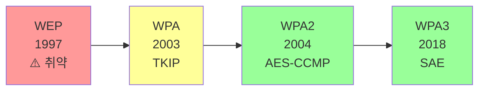
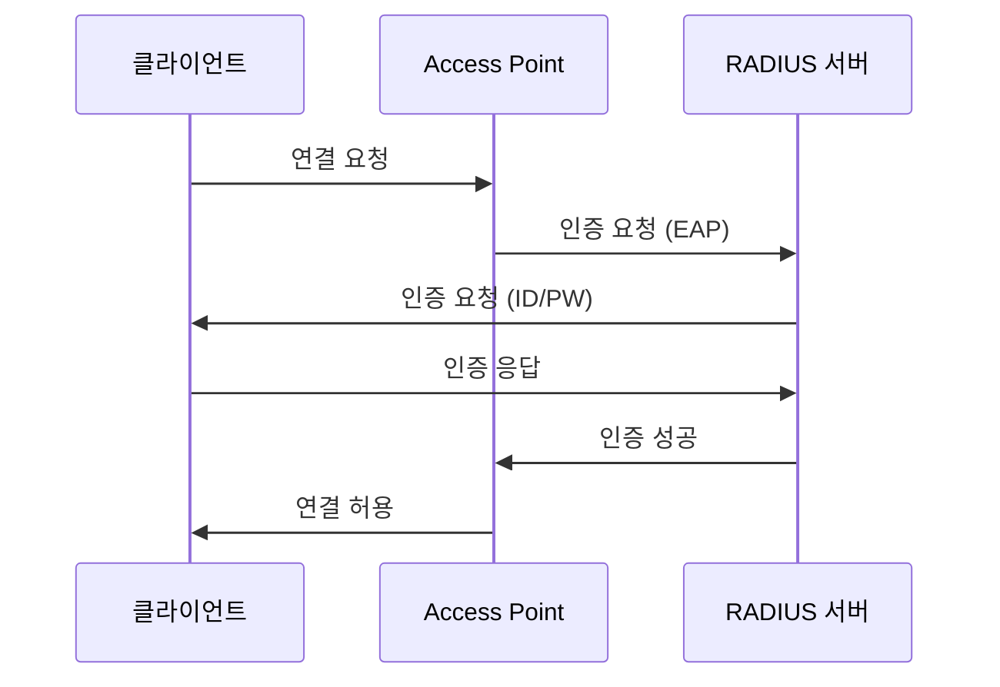
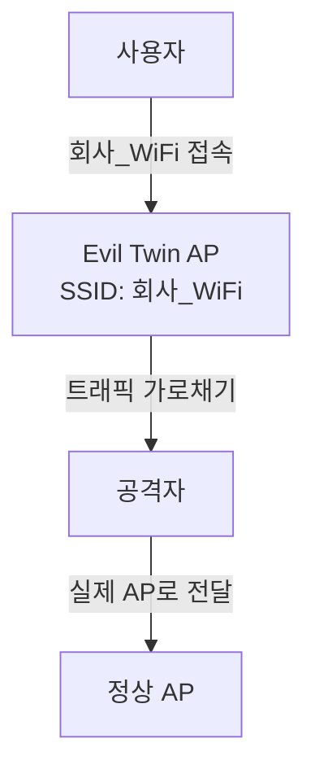

## 🌐 개요 (Overview)

무선 구간은 **도청이 쉬우므로 암호화가 필수**입니다. 이 문서에서는 무선 LAN 표준, 보안 프로토콜의 발전, 그리고 주요 무선 위협을 다룹니다.

## 📡 무선 LAN 표준 (IEEE 802.11)

### 물리적 표준

| 표준 | 주파수 | 최대 속도 | 특징 |
|------|--------|----------|------|
| 802.11a | 5 GHz | 54 Mbps | OFDM |
| 802.11b | 2.4 GHz | 11 Mbps | DSSS |
| 802.11g | 2.4 GHz | 54 Mbps | OFDM |
| 802.11n (Wi-Fi 4) | 2.4/5 GHz | 600 Mbps | MIMO |
| 802.11ac (Wi-Fi 5) | 5 GHz | ~Gbps | MU-MIMO |
| 802.11ax (Wi-Fi 6) | 2.4/5/6 GHz | ~10 Gbps | OFDMA |

### 무선 LAN 운영 모드

| 모드 | 설명 |
|------|------|
| **Infrastructure** | AP (Access Point)를 통해 통신 |
| **Ad-hoc** | AP 없이 단말기끼리 직접 통신 (P2P) |

### CSMA/CA

무선 환경에서는 **충돌을 감지할 수 없어** 충돌을 **회피**하는 방식을 사용합니다.

```plaintext
CSMA/CA (Collision Avoidance):
1. 채널이 비어있는지 확인
2. 사용 중이면 대기 (Random Backoff)
3. 채널이 비면 RTS/CTS 교환 후 전송
```

---

## 🔐 무선 보안 프로토콜의 발전



---

## ❌ WEP (Wired Equivalent Privacy)

**초기 무선 보안 표준**이지만 **심각한 취약점**으로 사용이 금지되었습니다.

### 특징

| 항목 | 값 |
|------|-----|
| **암호화** | RC4 (스트림 암호) |
| **키 길이** | 40-bit 또는 104-bit |
| **IV (초기화 벡터)** | 24-bit |
| **인증** | 공유키 (Shared Key) |

### 취약점

| 취약점 | 설명 |
|--------|------|
| **IV 재사용** | 24-bit IV가 너무 짧아 반복 사용됨 |
| **고정 키** | 동일한 공유키 계속 사용 |
| **FMS 공격** | IV와 암호문 분석으로 키 복구 가능 |
| **약한 인증** | Challenge-Response 취약 |

```plaintext
WEP 키 = 고정 비밀키 (40/104 bit) + IV (24 bit)
           └── 변경 안 됨         └── 평문 전송, 반복

문제: 약 5000개 패킷 수집으로 키 크래킹 가능!
```

---

## ⚠️ WPA (Wi-Fi Protected Access)

WEP의 취약점을 **임시 보완**하기 위한 표준입니다.

### 특징

| 항목 | 값 |
|------|-----|
| **암호화** | RC4 + TKIP |
| **키 관리** | 동적 키 (패킷마다 변경) |
| **무결성** | MIC (Michael) |

### TKIP (Temporal Key Integrity Protocol)

```plaintext
WEP 개선점:
- 패킷마다 다른 키 사용 (Per-Packet Key)
- 48-bit 시퀀스 카운터로 재전송 공격 방지
- MIC로 무결성 강화
```

**한계**: 여전히 RC4 기반이라 근본적 취약점 존재

---

## ✅ WPA2 (IEEE 802.11i)

**현재 가장 권장**되는 표준입니다.

### 특징

| 항목 | 값 |
|------|-----|
| **암호화** | **AES-CCMP** |
| **키 길이** | 128-bit |
| **무결성** | CBC-MAC |
| **인증** | PSK 또는 802.1X |

### AES-CCMP

```plaintext
CCMP = Counter Mode with CBC-MAC Protocol

- AES 블록 암호 사용 (128-bit)
- Counter Mode: 기밀성
- CBC-MAC: 무결성 및 인증

→ WEP/WPA보다 훨씬 강력한 보안
```

---

## 🔒 WPA3

2018년 발표된 **최신 표준**입니다.

### 개선점

| 특징 | 설명 |
|------|------|
| **SAE** | Simultaneous Authentication of Equals (Dragonfly) |
| **전방 비밀성** | 키 노출 시에도 과거 통신 보호 |
| **오프라인 공격 방지** | 사전 공격에 강함 |
| **192-bit 보안** | WPA3-Enterprise |

---

## 🏠 인증 방식

### WPA-PSK (Personal)

**가정용**으로 사전 공유된 비밀번호(Pre-Shared Key)를 사용합니다.

```plaintext
설정:
- 8~63자 비밀번호
- 모든 장치가 동일한 키 사용

취약점:
- 사전 공격 (약한 비밀번호)
- 4-Way Handshake 캡처 후 오프라인 크래킹
```

### WPA-Enterprise (802.1X)

**기업용**으로 RADIUS 인증 서버를 통해 사용자별 인증을 수행합니다.



---

## 📊 무선 보안 프로토콜 비교

| 특성 | WEP | WPA | WPA2 | WPA3 |
|------|-----|-----|------|------|
| **암호화** | RC4 | RC4+TKIP | **AES-CCMP** | AES-GCMP |
| **IV/카운터** | 24-bit | 48-bit | 48-bit | 48-bit |
| **키 관리** | 고정 | 동적 | 동적 | SAE |
| **무결성** | CRC-32 | MIC | CBC-MAC | GCM |
| **보안 수준** | ❌ 취약 | ⚠️ 약함 | ✅ 양호 | ✅ 우수 |

---

## 🚨 무선 보안 위협

### Rogue AP (불법 AP)

관리자 승인 없이 내부에 설치된 **사설 공유기**입니다.

```plaintext
위험:
- 보안 설정 미흡
- 내부망 침입 경로
- 네트워크 정책 우회
```

**대응**: 무선 IDS, 정기적 무선 스캔

### Evil Twin (쌍둥이 AP)

합법적인 AP와 **동일한 SSID로 위장**하여 사용자 접속을 유도합니다.



**피해**:
- 인증 정보 탈취
- 중간자 공격 (MITM)
- 악성코드 삽입

### War Driving

**차량으로 이동하며** 취약한 무선 네트워크를 탐지하는 행위입니다.

**도구**: 무선 어댑터, GPS, 스캔 소프트웨어

### Deauthentication 공격

802.11 관리 프레임을 위조하여 **클라이언트를 강제로 연결 해제**합니다.

```bash
# 공격 예시 (aireplay-ng)
aireplay-ng --deauth 100 -a [AP MAC] -c [Client MAC] wlan0mon
```

**용도**: 4-Way Handshake 캡처 유도, DoS

---

## 🛡️ 무선 보안 권장사항

```plaintext
✅ DO
- WPA2/WPA3 사용
- 강력한 비밀번호 (12자 이상, 복잡)
- SSID 숨기기 (Hidden SSID)
- MAC 필터링 (보조 수단)
- 정기적 비밀번호 변경
- 기업환경은 802.1X 사용

❌ DON'T
- WEP 사용
- 기본 비밀번호 유지
- 공개 Wi-Fi에서 민감한 작업
- 관리 인터페이스 무선 노출
```

## 🔗 연결 문서 (Related Documents)

- [[osi-7-layer-model]] - OSI 7계층
- [[network-security-protocols]] - TLS/SSL
- [[cryptography-basics]] - 암호화 알고리즘
- [[attack-types]] - 네트워크 공격 유형
