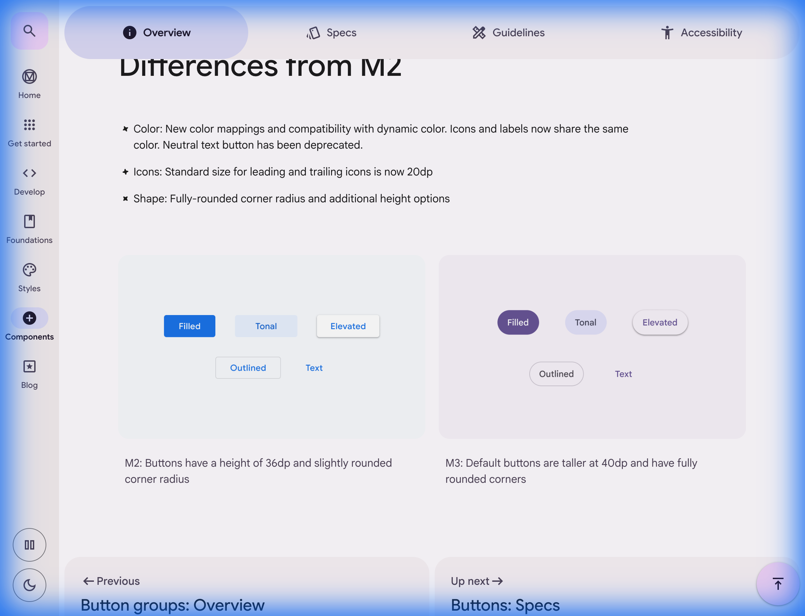

## ⚡ Actions (액션): 반응성에서 표현으로

M3 의 액션은 단순히 기능을 실행하는 수단을 넘어, **사용자와 대화하는 피드백 루프**입니다. "Expressive" 업데이트의 핵심은 상태 변화를 시각적인 '이야기'로 전달하는 것입니다.

---

## 🔘 Button Types: 위계에 따른 컴포넌트 선택

M3 의 버튼은 시각적 강조(Prominence) 수준에 따라 5 가지 유형으로 나뉩니다. 올바른 버튼 선택은 사용자가 화면에서 가장 중요한 행동을 즉각 인지하도록 돕습니다.

### 1. Filled Button (채워진 버튼)

- **위계**: 가장 높음 (Highest)
- **용도**: 프로세스를 완료하는 최종 동작(예: '저장', '확인', '구매하기').
- **권장**: 화면당 하나만 사용하는 것이 이상적입니다. FAB 다음으로 가장 눈에 띄는 요소입니다.

### 2. Filled Tonal Button (채워진 토널 버튼)

- **위계**: 중간 높음 (Medium-high)
- **용도**: 보조적이지만 여전히 주목이 필요한 동작(예: '다음' 단계, '공유하기').
- **의도**: Filled Button 보다 덜 강렬하면서도 Outlined 보다는 강조하고 싶을 때 적합합니다.

### 3. Outlined Button (외곽선 버튼)

- **위계**: 중간 (Medium)
- **용도**: 중요한 버튼 옆의 대안적 선택지(예: '취소', '전체 보기', '장바구니 담기').
- **의도**: 배경이 단순한 곳에 배치하여 Filled Button 과의 시각적 균형을 맞춥니다.

### 4. Elevated Button (플로팅 버튼)

- **위계**: 배경에 따라 가변적
- **용도**: 카드나 복잡한 이미지 배경 위에서 버튼을 물리적으로 분리해야 할 때.
- **의도**: Tonal Button 에 그림자(Shadow) 가 추가된 형태이며, busy 한 레이아웃에서 가시성을 확보합니다.

### 5. Text Button (텍스트 버튼)

- **위계**: 가장 낮음 (Lowest)
- **용도**: 부가적인 정보 확인이나 덜 중요한 동작(예: '상세 보기', '나중에 하기').
- **의도**: 카드, 다이얼로그, 스낵바 내부에서 시각적 노이즈를 최소화하며 정보를 제공합니다.

---

## 🌓 Advanced Button Patterns: 복합 액션 처리

M3 Expressive 에서는 더 정교한 인터랙션을 위해 고급 버튼 패턴을 제공합니다.

### 1. Split Buttons (스플릿 버튼) - [NEW]

- **구조**: 주요 액션을 수행하는 앞부분(Leading) 과 추가 옵션 메뉴를 여는 뒷부분(Trailing) 이 결합된 형태입니다.
- **용도**: 하나의 기능에 여러 파생 동작이 있을 때 사용합니다 (예: '글쓰기' 버튼 클릭 시 바로 작성 / 옆의 화살표 클릭 시 '임시 저장 리스트' 노출).
- **시각 피드백**: 메뉴가 열릴 때 트레일링 아이콘(화살표) 이 180 도 회전하며 형태가 부드럽게 변하는 애니메이션이 특징입니다.

### 2. Connected Button Groups (연결된 버튼 그룹)

- **개념**: 기존의 Segmented Buttons 를 대체하는 새로운 표준입니다. 여러 관련 옵션을 하나의 덩어리로 묶어 제공합니다.
- **선택 유형**:
    - **Single-choice (단일 선택)**: 라디오 버튼처럼 하나만 선택 가능. 뷰 전환(목록형/격자형) 이나 정렬 기준 선택에 적합합니다.
    - **Multi-choice (다중 선택)**: 체크박스처럼 여러 개 선택 가능. 필터 적용 등에 사용됩니다.
- **가이드라인**:
    - **개수**: 최소 2 개에서 최대 5 개까지의 옵션을 권장합니다. 그 이상은 Chips 를 고려하세요.
    - **일관성**: 그룹 내에서는 아이콘만 사용하거나, 텍스트만 사용하여 시각적 균형을 맞춰야 합니다.
    - **접근성**: 선택 상태를 단순히 색상 차이로만 보여주지 않고, 체크 아이콘 등을 병행 표기하여 명확히 인지하게 합니다.

---

## 🎨 Expressive Buttons: Shape Morphing Feedback

M3 버튼의 가장 큰 특징은 **Shape Morphing(형태 변형)** 입니다.

*<단순한 색상 변화를 넘어, 형태의 곡률이 변하며 '눌림'을 인지시키는 방식>*

### UX 적 개선 사항

1. **상태 피드백의 극대화**: Hover 상태에서 버튼의 둥글기가 미세하게 변하거나, Press 상태에서 완전히 다른 형태로 모르핑(Morphing)되는 것은 사용자가 자신의 행동이 성공적으로 입력되었음을 본능적으로 이해하게 합니다.
2. **Segmented Buttons 의 활용**: 여러 옵션을 하나로 묶어 표현하는 세그먼트 버튼은 연관된 행동들 사이의 시각적 리듬을 조절하여 디자인의 '표현력'을 높입니다.
3. **IconButton 의 위계**: Filled, Filled Tonal, Outlined 등 아이콘 버튼에도 세분화된 위계를 적용하여 화면의 복잡도를 제어합니다.

---

## 🏗️ FAB & Extended FAB: 핵심 동작의 중심

Floating Action Button (FAB) 은 화면에서 가장 상징적이고 중요한 '단일 액션' 을 담당합니다. M3 Expressive 에서는 형태와 크기, 그리고 메뉴 변형 방식이 혁신되었습니다.

### 1. Expressive FAB Sizing (새로운 사이즈 체계)

- **FAB**: 기존의 Small 사이즈가 정규 FAB 에서는 생략되고, **Medium (기본)** 사이즈가 표준이 되었습니다.
- **Extended FAB (확장형)**: 이제 **Small, Medium, Large** 의 세 가지 크기를 제공하여 레이아웃의 밀도에 맞춰 유연하게 대응합니다.

### 2. FAB Menus: Shape Morphing 의 정점 [Expressive 핵심]

- **과거 방식**: 여러 개의 작은 FAB 을 위로 쌓아 올리는(Speed dial) 방식.
- **M3 Expressive 방식**: FAB 이 부드러운 애니메이션과 함께 **작은 메뉴 패널(Panel)** 로 직접 변형(Morphing) 됩니다.
- **효과**: 시각적 흐름이 끊기지 않으며, FAB 아이콘이 '닫기(X)' 로 자연스럽게 변하며 사용자에게 명확한 인터랙션 상태를 전달합니다.

### 3. Contextual Scaling (상황별 적응)

- **Collapse on Scroll**: 사용자가 콘텐츠를 아래로 스크롤할 때, Extended FAB 은 아이콘만 남기고 **축소(Collapse)** 되어 본문 가독성을 확보합니다.
- **Expand on Top**: 다시 최상단으로 오거나 위로 스크롤 시 레이블이 나타나며 **확장(Expand)** 되어 동작을 명확히 안내합니다.

### 4. 사용 가이드라인

- **단일성**: 원칙적으로 화면 하나당 **단 하나의 FAB(또는 Extended FAB)** 만 배치하여 시선 분산을 방지합니다.
- **배치**: 일반적으로 우측 하단에 배치하지만, 하단 바(Bottom App Bar) 와 결합하여 중앙이나 특정 위치에 고정할 수 있습니다.

---

## ♿ Accessibility (A11y): 성공적인 인터랙션의 필수 조건

Actions 컴포넌트는 사용자가 시스템과 직접 소통하는 통로이므로, 모든 사용자가 장애물 없이 접근할 수 있어야 합니다.

### 1. Touch Targets (터치 타겟 사양)

- **최소 크기**: 모든 버튼과 FAB 은 최소 **48 x 48 dp** 의 터치 타겟 면적을 확보해야 합니다.
- **포인터 최적화**: 마우스나 스타일러스 환경에서는 최소 **44 x 44 dp** 를 권장합니다.
- **시각적 요소와의 차이**: 버튼의 실제 아이콘이나 라벨이 24dp 이더라도, 주변 패딩을 포함하여 물리적 사격 면적을 `48dp` 이상으로 설계하여 오터치와 사용성 저하를 방지합니다.

### 2. Contrast & Color (대비와 색상)

- **텍스트 대비**: 버튼의 배경색과 글자색은 최소 **4.5:1** (WCAG AA 기준) 의 대비를 유지해야 합니다. M3 의 `onPrimary` 등 전용 텍스트 컬러를 사용하면 이 수치가 자동 보장됩니다.
- **상태 구분**: 버튼의 활성(Enabled), 비활성(Disabled), 호버(Hover) 상태가 오직 '색상' 만으로 구분되지 않도록, 불투명도(Opacity) 나 외곽선 두께 등을 병행 활용합니다.

---

## 🔗 관련 문서

- [[../material3_walkthrough|Material Design 3 개요 (Expressive Deep Dive)]]
- [[components-containment-navigation|Containment & Navigation]]
- [[components-typography|Typography: 의미론적 가독성과 폰트 역할]]
- [[components-color-theme|Color & Theme: 지능적인 컬러 시스템과 HCT]]
