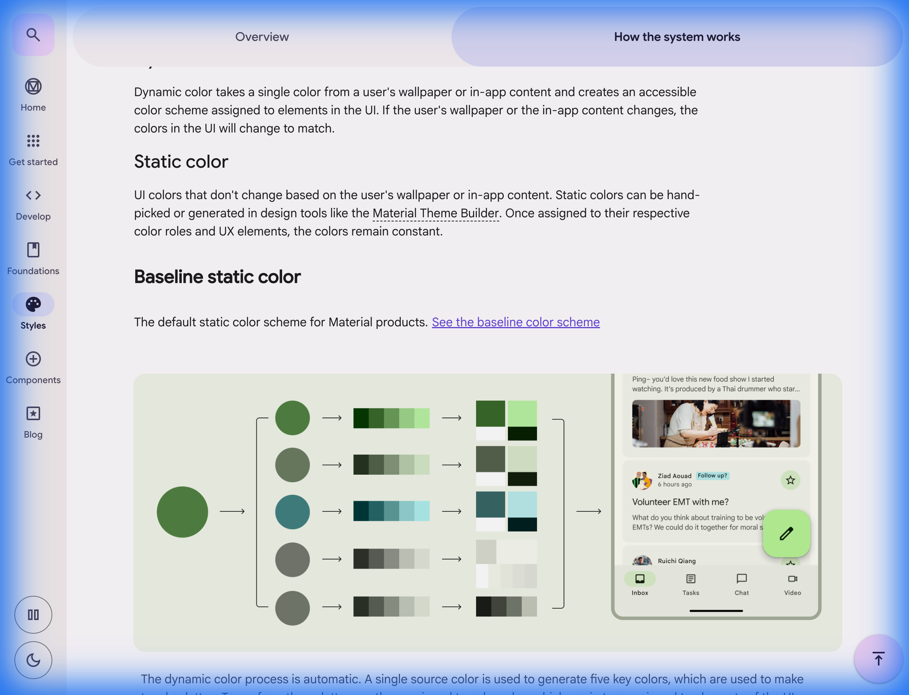

## 🎨 Material Design 3 Expressive 개요

**Material Design 3 (M3)**는 "Material You"라는 개인화 철학을 넘어, **"Expressive(표현형)"** 업데이트를 통해 인간의 감성과 기기의 반응성 사이의 간극을 좁혔습니다. 단순히 '예쁜' 디자인을 넘어, 디자인이 사용자에게 어떻게 **말을 거는지**, 그리고 어떻게 **정서적 가치**를 제공하는지에 집중합니다.

---

## 🚀 왜 M3로 진화했는가? (Evolution: M2 vs M3)

기존 Material Design 2 (M2)가 '일관성'과 '브랜드 정체성'에 집중했다면, M3는 **'개인화'**와 **'적응성'**, 그리고 **'표현력'**을 최우선 가치로 둡니다.

| 특징             | Material Design 2 (M2) | Material Design 3 (M3)             | UX 개선점               |
| :------------- | :--------------------- | :--------------------------------- | :------------------- |
| **색상 (Color)** | 고정된 브랜드 컬러 중심          | **Dynamic Color (사용자 배경화면 기반)**    | 정서적 소속감 및 자동 대비 조절   |
| **모양 (Shape)** | 정형화된 둥근 모서리            | **Variable/Expressive Shapes**     | 시각적 위계 명확화 및 브랜드 표현  |
| **애니메이션**      | 정해진 가속도(Easing)        | **Physics-based Motion (Springs)** | 자연스러운 피드백, 인지 부하 감소  |
| **접근성**        | 수동 설정 중심               | **System-level Adaptive Contrast** | 모든 사용자에게 최적화된 시인성 제공 |

**UX적 가치**:
1. **감성적 연결 (Emotional Resonance)**: 사용자 배경화면에서 추출된 색상과 물리 법칙을 따르는 애니메이션은 기기를 단순한 도구가 아닌, 나의 개성이 투영된 '나의 일부'로 느끼게 합니다.
2. **인지 부하 감소 (Reduced Cognitive Load)**: 상태 변화가 갑작스럽지 않고 '형태 변형(Shape Morphing)'을 통해 부드럽게 이어지면, 뇌는 정보의 변화를 더 쉽게 받아들입니다.
3. **발견 가능성 (Discoverability)**: 표현력이 풍부한(Emphasized) 컴포넌트는 사용자의 시선을 자연스럽게 유도하여 핵심 기능을 직관적으로 찾게 합니다.

---

## 🌈 핵심 철학 1: Personalization (Material You)

Material You의 핵심은 사용자가 디자인의 공동 제작자가 된다는 것입니다.

### Dynamic Color & Tonal Palettes
단순히 배경색이 바뀌는 것이 아닙니다. M3 알고리즘은 사용자의 배경화면에서 핵심 색상을 추출하고, 이를 5개의 톤 범위(Tonal Palettes)로 나눕니다.

*<사용자 배경에서 추출된 Source Color가 시스템 전체의 Tonal Palette로 확장되는 과정>*

**UX적 가치**:
- **정서적 연결**: 사용자가 직접 고른 사진이 UI 전체의 톤을 결정하면서 기술과 인간 사이의 정서적 유대를 강화합니다.
- **예측 가능한 접근성**: 동적 색상 시스템은 어떤 색상이 선택되더라도 텍스트와 배경 간의 최소 대비를 자동으로 보장합니다.

---

## ✨ 핵심 철학 2: Expressive System Deep Dive

### 1. Motion Physics: Standard vs Expressive Schemes
M3는 고정된 Easing 곡선 대신 **물리 기반 스프링(Motion Springs)**을 사용합니다.

- **Standard Scheme**: 유틸리티 중심의 정밀하고 빠른 피드백. 효율성이 중요한 작업에 사용됩니다.
- **Expressive Scheme**: 더 탄성 있고 역동적인 움직임. 사용자의 정서적 반응이 중요한 '즐거운 순간'에 적용됩니다.
    - *Stiffness(강성)*, *Damping(감쇠)*, *Initial Velocity(초기 속도)* 조절을 통해 실제 사물이 움직이는 듯한 생동감을 줍니다.

*<스프링 기반 모션이 적용된 형태 변형 예시>*

### 2. Shape System & Morphing
형태는 브랜드의 개성을 드러내는 핵심 언어입니다.
- **Shape Morphing**: 버튼을 누를 때 모서리가 둥글게 변하거나 카드가 화면으로 확장될 때의 '모르핑'은 시각적 연속성(Continuity)을 제공합니다.
- **Corner Radii Tokens**: 10단계 이상의 세분화된 곡률 토큰을 통해 브랜드 고유의 '리듬'을 형성합니다.

### 3. Emphasized Typography
단순히 글자 크기를 키우는 것이 아니라, **가변 폰트(Variable Fonts)**의 축을 활용합니다.
- 중요한 정보는 굵기(Weight)뿐만 아니라 너비(Width) 등을 미세하게 조정하여 시각적 위계(Hierarchy)를 극적으로 강조합니다.

---

## 📦 컴포넌트 라이브러리 (Components)

각 컴포넌트가 Expressive 철학 아래 어떻게 구현되었는지 확인해 보세요.

- [[components/components-actions|M3 Actions: 표현력이 풍부한 버튼과 위계]]
- [[components/components-containment-navigation|M3 Containment: 몰입과 적응형 레이아웃]]
- [[components/components-selection-inputs|M3 Selection: 직관적인 입력과 동적 피드백]]

---

## 🏗️ 적응형 및 몰입형 레이아웃 (Adaptive & Immersive)

M3 Expressive는 모바일을 넘어 **XR(AR/VR)** 및 대화면 기기로 확장됩니다.
- **Adaptive Layouts**: 화면 크기에 따라 컴포넌트가 단순 축소가 아닌, 구조적으로 변형(Bar → Rail)됩니다.
- **Immersive Spacing**: 캔버스의 여백을 대담하게 사용하여 정보의 '호흡'을 조절하고 몰입감을 극대화합니다.

---

## 🔗 참고 링크 (References)
- [Material Design 공식 웹사이트](https://m3.material.io)
- [Design Google - Material 3 Expressive](https://design.google/library/material-3-expressive/)
