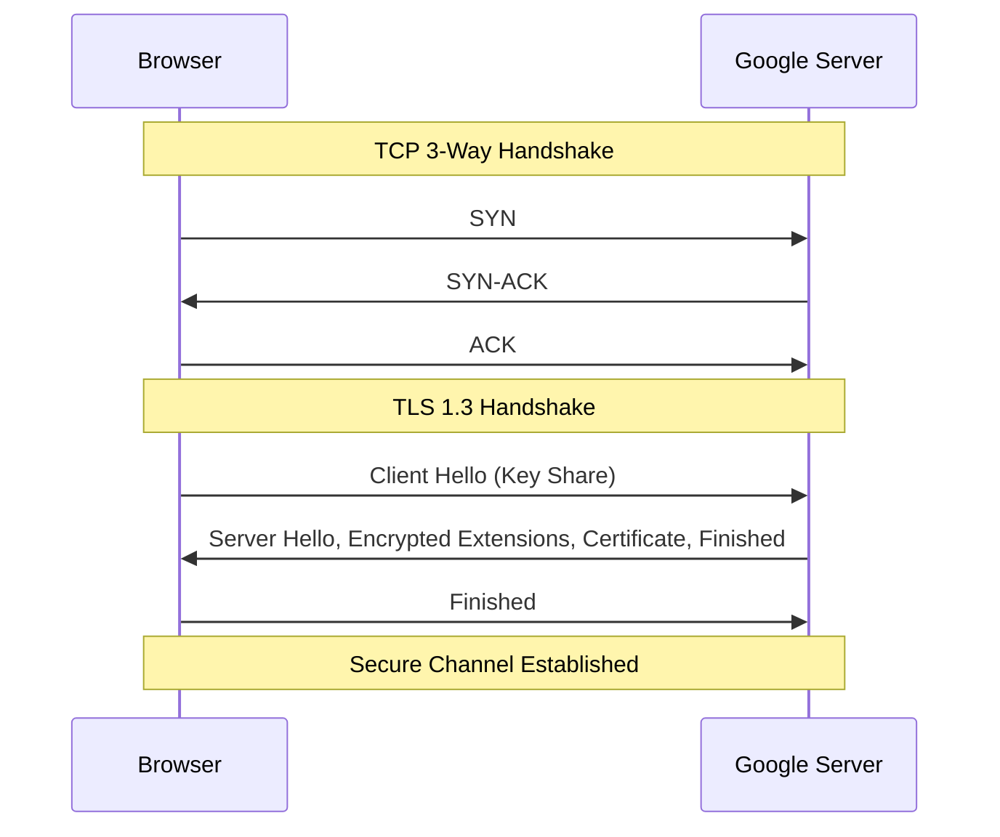

# "google.com을 치면 일어나는 일" 이라는 질문에 다시 한번 답해보다
> 정보보안기사 학습을 통해 보게 된 '복잡성'의 미학: 단순한 연결 뒤에 숨겨진 거대한 보안 아키텍처

---

## 1. 프롤로그: 뻔한 질문, 뻔하지 않은 답변

신입 개발자 시절, 면접장에서 가장 자주 받았던 질문 중 하나는 바로 이것이었습니다.
**"브라우저 주소창에 google.com을 입력하면 어떤 일이 벌어지나요?"**

당시 저의 답변은 정답이었지만, 단조로웠습니다.
> "먼저 DNS 서버에 물어봐서 google.com의 IP 주소를 알아냅니다. 그 다음 그 IP 주소로 HTTP 요청을 보내고, 서버가 보내준 HTML을 브라우저가 화면에 그려줍니다."

이 답변은 마치 "서울에서 부산까지 어떻게 가나요?"라는 질문에 "차를 타고 경부고속도로를 따라가면 됩니다"라고 답하는 것과 비슷합니다. 틀린 말은 아니지만, 도로의 포장 상태, 톨게이트의 요금 징수 체계, 신호등의 동기화, 그리고 사고를 방지하기 위한 수많은 안전 장치들을 생략한 답변이죠.

최근 정보보안기사(Information Security Engineer)를 공부하며 네트워크 계층(OSI 7 Layers)과 각종 보안 프로토콜을 깊이 파고들다 보니, 이 단순한 1초의 동작 속에 얼마나 경이로운 보안 메커니즘들이 얽혀 있는지 다시금 깨닫게 되었습니다. 이제는 더 이상 'IP를 찾아간다'는 말 한마디로 이 과정을 갈음할 수 없게 되었습니다.

오늘 저는 2026년의 관점에서, 그리고 보안 엔지니어의 시각에서 이 질문에 다시 한번 답해보려 합니다. 우리가 무심코 엔터 키를 누르는 순간, 내 방 안의 무선 환경부터 지구 반대편의 데이터센터까지 이어지는 거대한 '보안의 여정'을 추적해 보겠습니다.

---

## 2. 출발 전: 내 방 안의 네트워크 (Layer 1~2)

여정은 내 손가락이 엔터 키를 누르는 물리적 접점에서 시작됩니다. 하지만 패킷이 공기 중으로 흩어지기 전, 가장 먼저 마주하는 관문은 **데이터 링크 계층(Layer 2)**의 보안입니다.

### 2.1 WPA3와 SAE 핸드쉐이크: 공기 중의 요새
만약 여러분이 카페나 집에서 Wi-Fi를 사용하고 있다면, 패킷은 무선 전파라는 개방된 매체를 통해 전달됩니다. 과거의 WEP나 WPA2는 오프라인 사전 공격(Dictionary Attack)에 취약했지만, 현대적인 **WPA3** 환경에서는 이야기가 다릅니다.

연결이 확립되는 순간, 기기와 AP(Access Point)는 **SAE(Simultaneous Authentication of Equals)**, 일명 'Dragonfly' 핸드쉐이크를 수행합니다. 
- 이 과정은 **디피-헬먼(Diffie-Hellman)** 키 교환 방식을 사용하여, 누군가 패킷을 엿듣더라도 통신에 사용된 세션 키를 유추할 수 없게 합니다. 
- 설령 비밀번호가 노출되더라도 과거의 통신 내용을 복호화할 수 없는 **순방향 비밀성(Forward Secrecy)**이 여기서부터 보장됩니다.

### 2.2 ARP: 보이지 않는 신뢰의 이름
이제 패킷은 공유기(Default Gateway)로 전달되어야 합니다. 브라우저는 게이트웨이의 IP는 알고 있지만, 실제 물리적인 주소인 **MAC 주소**는 모릅니다. 이때 **ARP(Address Resolution Protocol)** 요청이 발생합니다.

> "누가 192.168.0.1이지? 내 MAC 주소는 AA:BB...인데, 네 MAC 주소를 알려줘!"

보안 엔지니어의 눈에 ARP는 매우 위험한 프로토콜입니다. 인증 절차가 전혀 없기 때문입니다. 공격자가 "내가 바로 192.168.0.1이야!"라고 거짓 응답을 보내는 **ARP 스푸핑(Spoofing)**을 시도한다면, 우리의 모든 트래픽은 구글로 가기 전 공격자의 PC를 거쳐가게 될 것입니다. 우리가 안전하게 패킷을 보낼 수 있는 이유는 OS 수준의 ARP 테이블 관리와 현대적인 스위치 장비의 **Dynamic ARP Inspection(DAI)** 같은 방어 기제 덕분입니다.

### 2.3 캡슐화: 데이터에 '보안의 옷'을 입히다
Layer 2 단계를 지나며 데이터는 **이더넷 프레임(Ethernet Frame)**으로 감싸집니다. 상위 계층에서 내려온 데이터(Segment -> Packet)에 출발지/목적지 MAC 주소와 무결성 검사를 위한 **FCS(Frame Check Sequence)**가 붙습니다. 전송 중 단 1비트라도 물리적 간섭으로 변조된다면, 수신 측은 이 FCS를 통해 오류를 감지하고 패킷을 폐기할 것입니다.

---

## 3. 이름 찾기: DNS의 심연 (Layer 7 -> 4)

게이트웨이를 나선 패킷이 가장 먼저 해결해야 할 과제는 "google.com"이라는 문자를 32비트(IPv4) 또는 128비트(IPv6)의 숫자로 바꾸는 것입니다. 과거에 저는 이를 단순한 '조회'라고 생각했지만, 보안 엔지니어의 눈에 비친 DNS는 거대한 **신뢰의 체인(Chain of Trust)**입니다.

### 3.1 재귀적 쿼리와 반복적 쿼리
브라우저는 먼저 OS 캐시와 `/etc/hosts`를 확인한 후, 응답이 없으면 ISP의 **Recursive DNS 서버**에 쿼리를 던집니다. 이 서버는 우리가 원하는 주소를 찾을 때까지 루트 네임서버(.), .com 네임서버, 구글 네임서버를 차례로 방문하는 **Iterative 쿼리**를 수행합니다.

### 3.2 DNSSEC: 데이터의 신분증
DNS는 기본적으로 UDP 53번 포트를 사용하며, 응답자가 진짜인지 확인할 방법이 없습니다. 이를 악용한 것이 바로 **DNS 캐시 포이즈닝(Cache Poisoning)** 공격입니다. 

이를 방어하기 위해 도입된 것이 **DNSSEC(DNS Security Extensions)**입니다. 
- 각 레코드에 **RRSIG(Resource Record Signature)**라는 디지털 서명을 붙입니다.
- 상위 존(Zone)이 하위 존의 공개키를 보증하는 **DS(Delegated Signer)** 레코드를 통해 루트 네임서버까지 이어지는 신뢰의 사슬을 형성합니다.
- 패킷 하나하나가 "나는 정말 구글의 IP가 맞아"라는 인증서를 달고 다니는 셈입니다.

### 3.3 DoH(DNS over HTTPS): 프라이버시의 최전선
최근에는 DNS 쿼리 내용 자체가 평문으로 노출되는 것을 막기 위해 **DoH(DNS over HTTPS)**나 **DoT(DNS over TLS)**가 널리 사용됩니다. 이제 중간의 공격자나 ISP조차도 우리가 구글에 접속하려 한다는 사실을 쉽게 알 수 없습니다.

---

## 4. 악수와 약속: TCP와 TLS (Layer 4 & Security)

IP 주소를 알아냈다면, 이제 실제로 구글 서버와 대화를 시작할 차례입니다. 하지만 무작정 데이터를 던지는 것이 아니라, 서로의 상태를 확인하고 안전한 '터널'을 먼저 뚫어야 합니다.

### 4.1 TCP 3-Way Handshake: 연결의 약속
가장 먼저 수행되는 것은 **TCP 3-Way Handshake**입니다. `SYN -> SYN-ACK -> ACK` 과정을 통해 양측은 시퀀스 번호를 맞추고 통신 준비가 되었음을 확인합니다. 보안기사 시험의 단골 주제인 **SYN Flooding** 공격은 바로 이 단계에서 ACK를 보내지 않고 서버의 자원(Backlog Queue)을 고갈시키는 공격입니다.

### 4.2 TLS 1.3 Handshake: 1회의 악수로 끝내는 보안
TCP 연결이 맺어지자마자 그 위에서 **TLS(Transport Layer Security)** 핸드쉐이크가 시작됩니다. 특히 현대적인 **TLS 1.3**은 성능과 보안을 동시에 잡았습니다.
- **1-RTT Handshake**: 과거 2회의 왕복이 필요했던 과정을 1회로 단축했습니다.
- **Diffie-Hellman Key Exchange**: 서버와 클라이언트는 세션마다 일회성 키를 생성하여 공유합니다. 이는 **완전 순방향 비밀성(PFS)**을 보장하여, 나중에 서버의 비밀키가 탈취되더라도 과거의 통신 내용을 복호화할 수 없게 만듭니다.

### 4.3 PKI와 인증서 체인: 너는 진짜 구글이니?
서버는 자신의 **인증서**를 보냅니다. 브라우저는 이 인증서가 신뢰할 수 있는 **CA(Certificate Authority)**에 의해 서명되었는지, 유효기간은 남았는지, 폐기되지는 않았는지(CRL/OCSP)를 꼼꼼히 검토합니다. 
구글 서버가 보낸 인증서 뒤에는 중간 CA, 그리고 내 OS에 이미 저장된 루트 CA가 버티고 서서 구글의 신원을 보증합니다.

### 4.4 HSTS: 다운그레이드 공격 차단
브라우저는 구글 서버로부터 **HSTS(HTTP Strict Transport Security)** 헤더를 받으면, 이후 모든 접속을 강제로 HTTPS로만 수행합니다. 이는 공격자가 중간에서 강제로 평문 HTTP로 접속을 유도하는 'SSL Stripping' 공격을 원천 봉쇄하는 강력한 방어선입니다.

---

## 5. 국경을 넘어서: 라우팅과 BGP (Layer 3)

안전한 터널(TLS)을 뚫기로 약속했다면, 이제 실제 패킷이 전 세계를 누비며 구글의 데이터센터를 찾아갈 차례입니다. 이 과정은 마치 여러 국가의 국경을 넘는 것과 같습니다.

### 5.1 AS(Autonomous System)와 BGP: 인터넷의 외교관
인터넷은 거대한 하나의 네트워크가 아니라, 수많은 소규모 네트워크(AS)들이 얽힌 집합체입니다. 우리 패킷은 ISP의 라우터를 시작으로 여러 AS를 거치게 됩니다. 이때 경로를 결정하는 것이 **BGP(Border Gateway Protocol)**입니다. 

보안 엔지니어에게 BGP는 '신뢰의 취약점'이기도 합니다. 어떤 라우터가 "내가 구글로 가는 가장 빠른 길이야!"라고 거짓 정보를 퍼뜨리면 전 세계의 트래픽이 그곳으로 쏠리는 **BGP 하이재킹(Hijacking)**이 발생할 수 있기 때문입니다. 이를 막기 위해 현대의 인터넷은 **RPKI(Resource Public Key Infrastructure)**와 같은 암호화 기반의 경로 인증 체계를 강화하고 있습니다.

### 5.2 IP 헤더와 TTL: 패킷의 생존 시간
라우터를 하나씩 지날 때마다 IP 패킷 헤더의 **TTL(Time to Live)** 값이 1씩 감소합니다. 만약 라우팅 루프가 발생하여 패킷이 뱅글뱅글 돌게 되더라도, TTL이 0이 되면 패킷은 폐기됩니다. 이는 네트워크 자원 고갈을 막는 중요한 보안 및 가용성 장치입니다.

---

## 6. 서버의 응답과 렌더링: 끝이 아닌 시작

패킷이 드디어 구글의 데이터센터 입구에 도착했습니다. 하지만 이곳에도 수많은 파수꾼이 기다리고 있습니다.

### 6.1 WAF와 로드 밸런서: 첫 번째 방어선
패킷은 서버에 직접 닿기 전 **WAF(Web Application Firewall)**를 거칩니다. 이곳에서 SQL Injection이나 XSS와 같은 악의적인 패턴이 있는지 심층 패킷 검사(DPI)를 받습니다. 이후 로드 밸런서가 수천 대의 서버 중 가장 여유로운 곳으로 우리 패킷을 안내합니다.

### 6.2 HTTP/3와 QUIC: 더 빠르고 더 안전하게
현대의 구글은 **HTTP/3**를 주로 사용합니다. 기존 TCP 대신 UDP 기반의 **QUIC** 프로토콜을 사용하는데, 이는 연결 설정 속도를 획기적으로 줄여줄 뿐만 아니라, 사용자가 Wi-Fi에서 5G로 네트워크를 바꿔도 연결이 끊기지 않는 **Connection Migration** 기능을 제공합니다. 이 모든 과정이 TLS와 밀합되어 설계되어 있어, 처음부터 '보안이 내재된(Secure by Design)' 통신을 수행합니다.

### 6.3 역캡슐화(Decapsulation): 옷을 벗는 데이터
서버는 도착한 이더넷 프레임을 벗겨내고(L2), IP 헤더를 확인하고(L3), TCP/QUIC 세션을 확인한 후(L4), 마침내 TLS 복호화를 거쳐 우리의 원래 요청인 "GET / HTTP/1.1"을 읽어냅니다. 그리고 그에 대한 응답으로 HTML 데이터를 다시 보안의 옷을 입혀 우리에게 보내줍니다.

---

## 7. 에필로그: 보이지 않는 1초의 경이로움

과거의 저에게 "google.com을 치면 일어나는 일"은 단순히 '주소를 찾아가는 과정'이었습니다. 하지만 정보보안기사를 공부하며 다시 들여다본 이 과정은, 인류가 수십 년간 쌓아 올린 **보안 기술의 집약체**였습니다.

- 공기 중의 전파를 지키는 WPA3
- 이름의 신원을 보증하는 DNSSEC
- 데이터의 터널을 뚫는 TLS 1.3
- 전 세계의 경로를 감시하는 BGP/RPKI

우리가 엔터를 누르고 화면이 뜨기까지 걸리는 그 짧은 1초 미만의 시간 동안, 수십 개의 프로토콜과 보안 장비들이 수천 번의 계산과 인증을 수행합니다. 지식의 파편들이 하나로 연결될 때 느끼는 이 즐거움이야말로 제가 보안을 공부하는 가장 큰 원동력이 아닐까 싶습니다.

다음에 누군가 저에게 이 질문을 다시 한다면, 저는 이제 더 즐거운 표정으로 답할 수 있을 것 같습니다.
**"그건 말이죠, 아주 정교한 '신뢰의 여정'입니다."**
