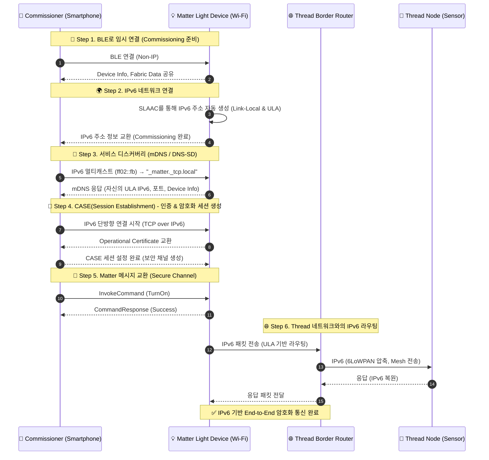

어떻게 쓰지..

스마트홈 프로토콜 / 물리적 통신 방식에 대해 우선 정의

짚고 넘어갈 부분: 프로토콜 vs. 전송 방식

사용자님의 정의가 혼란스러운 이유는 **[[Wi-Fi]] 와 [[Bluetooth]] 가 ' 응용 프로토콜 (언어)' 이 아니라, 데이터를 실어 나르는 ' 전송 기술 (운송 수단)'**에 해당하기 때문입니다.

전송 방식 (Transport/Physical Layer): 데이터가 오고 가는 ' 길 ' 또는 ' 운송 수단 ' 입니다. (예: [[Wi-Fi]], [[Ethernet|이더넷]], [[Thread]], [[Bluetooth]])

응용 프로토콜 (Application Protocol): 그 길 위에서 기기들이 서로 알아듣도록 정한 ' 언어 ' 입니다. (예: [[Matter]], 또는 제조사별 고유 언어)

1. ' 구시대 유산들 ' 의 수정된 논리
사용자님이 지적하신 ' 구시대 ' 의 진짜 문제는, ' 언어 (프로토콜)' 가 통일되지 않고 파편화되어 있었다는 점입니다.

[[Wi-Fi]] (수정된 설명):

전송 방식: [[Wi-Fi]] (IEEE 802.11)

프로토콜: 제조사별 고유 프로토콜 (예: [[Tuya]], [[Xiaomi|샤오미]], [[SmartThings]] 등) 또는 [[MQTT]], [[HTTP]] 등.

설명: [[Wi-Fi]] 스마트 플러그는 '[[Wi-Fi]]' 라는 언어로 말하는 게 아닙니다. [[Wi-Fi]] 라는 전송망을 통해 인터넷에 접속하고, 거기서 **제조사 서버와 고유한 언어 (프로토콜)**로 대화합니다. 이게 바로 기기마다 앱이 따로 필요했던 이유입니다.

[[Bluetooth]] (수정된 설명):

전송 방식: [[Bluetooth]] (특히 [[BLE]])

프로토콜: [[BLE]] GATT 프로파일 또는 제조사별 고유 프로토콜.

설명: [[Bluetooth]] 스피커나 전구 역시 [[Bluetooth]] 라는 전송 기술 위에서, 표준화된 오디오 프로파일 (A2DP) 이나 저전력 규격 (GATT) 또는 제조사 고유의 ' 언어 ' 로 통신합니다.

[[Zigbee]] & [[Z-Wave]] (사용자님 설명이 거의 맞음):

이 둘은 좀 특별합니다. 이들은 전송 방식 (IEEE 802.15.4 기반) 과 응용 프로토콜 (ZCL 등) 을 모두 포함하는 ' 풀 스택 (Full-stack)' 기술입니다.

그래서 ' 프로토콜=Zigbee, 전송=Zigbee' 라고 단순화해도 아주 틀린 말은 아닙니다. 다만, 이 '[[Zigbee]]' 라는 울타리 안에서만 통신이 가능하다는 한계가 있었죠.

1. ' 새로운 표준 ' 의 정확한 정의
이 부분은 100% 정확하게 이해하셨습니다.

[[Matter]] (프로토콜):

[[Zigbee]] 나 [[Z-Wave]] 처럼 자체 네트워크 계층을 가지는 게 아니라, **[[IP Address|IP]] 위에서 동작**

바로 이겁니다. [[Matter]] 는 제조사별로 파편화되었던 ' 언어 (프로토콜)' 를 하나로 통일하려는 **' 표준 응용 프로토콜 '**입니다.

어떤 ' 운송 수단 (전송 방식)' 을 쓰든 ([[Wi-Fi]], [[Thread]], [[Ethernet|이더넷]]), 그 위에서 [[Matter]] 라는 ' 공용어 ' 를 쓰자고 약속한 것입니다. (Bluetooth 는 설정 ([[Commissioning]]) 단계에서 사용됩니다.)

[[Thread]] (전송 방식):

말씀대로 저전력 메쉬 ([[Mesh Network|Mesh]]) **' 전송 방식 '** 이 맞습니다.

Matter 라는 ' 언어 ' 를 실어 나르는 여러 ' 운송 수단 ' 중, 특히 저전력 기기 (센서, 도어락 등) 에 최적화된 새로운 길 (IP 기반) 입니다.

zigbee 에 대한 설명이 조금 잘못되지 않았니? application layer 까지 올려서 mqtt 를 사용하는 경우가 많은데 그렇다면 zigbee 는 전송 방식일 뿐이고 mqtt 가 protocol 이 되는거 아냐?

오, 아주 날카로운 지적이십니다.

말씀하신 내용 (Zigbee 위에 MQTT 를 올리는 경우) 은 **'Zigbee-to-MQTT 브릿지 '**라는, 특히 DIY 스마트홈 (Home Assistant 등) 에서 매우 인기 있는 아키텍처를 정확히 짚으신 겁니다.

하지만 이 구조를 자세히 들여다보면, 'Zigbee 가 전송 방식일 뿐 ' 이라는 결론에는 논리적 비약이 있습니다. 이는 **두 개의 서로 다른 네트워크가 ' 번역 '**되는 과정을 하나로 보고 오해한 것입니다.

제가 두 네트워크로 나누어 설명해 드릴게요.

1. 네트워크 1: Zigbee 메시 (Mesh) 네트워크
구간: Zigbee 전구/센서 %3C-%3E Zigbee 코디네이터 (USB 동글 등)

설명:

이 구간에서 Zigbee 는 **완전한 풀 스택 (Full-stack)**으로 작동합니다.

전송 방식 (PHY/MAC): IEEE 802.15.4

응용 프로토콜 (언어): ZCL (Zigbee Cluster Library)

핵심: Zigbee 전구나 센서 같은 말단 기기는 MQTT 가 무엇인지 전혀 모릅니다. 이 기기들은 오직 Zigbee 고유의 ' 언어 ' 인 ZCL(예: 'On/Off 클러스터, On 명령 ') 로만 말합니다.

1. 네트워크 2: IP 네트워크
구간: Zigbee2MQTT 소프트웨어 (허브/PC) %3C-%3E MQTT 브로커 (서버)

설명:

이 구간은 우리가 흔히 아는 Wi-Fi 또는 이더넷 기반의 IP 네트워크입니다.

전송 방식 (Transport): Wi-Fi / Ethernet (TCP/IP)

응용 프로토콜 (언어): MQTT

결론: Zigbee 는 ' 번역 ' 되는 것입니다.

사용자님이 말씀하신 'Zigbee 위에 MQTT 를 올리는 ' 시스템의 실체는 다음과 같습니다.

Zigbee 전구가 ZCL 언어로 " 나 켜져 " 라고 말합니다.

Zigbee 코디네이터 (동글) 가 이 ZCL 메시지를 받습니다.

Zigbee2MQTT 같은 ' 번역기 (게이트웨이)' 소프트웨어가 이 ZCL 메시지를 **' 번역 '**합니다.

"ZCL 메시지 'On/Off 클러스터, 상태=On' 이 도착했군. 이걸 MQTT 메시지 zigbee2mqtt/living_room_light 토픽에 {"state": "ON"}이라는 내용 (Payload) 으로 바꿔서 보내야지."

이 ' 번역된 ' MQTT 메시지가 IP 네트워크 (Wi-Fi 등) 를 타고 MQTT 브로커 (서버) 로 전송됩니다.

따라서,

Zigbee 는 그 자체로 전송 방식 (802.15.4) 과 응용 프로토콜 (ZCL) 을 모두 갖춘 풀 스택이 맞습니다.

MQTT 는 Zigbee 네트워크의 ' 언어 ' 가 아니라, 그 Zigbee 네트워크를 IP 네트워크 (홈서버, 앱 등) 에 연결하기 위해 게이트웨이 (허브) 가 사용하는 별개의 응용 프로토콜입니다.

이 ' 번역 ' 과정이 바로 스마트홈이 복잡했던 이유이며, Matter 는 이 ' 번역기 ' 가 필요 없이 처음부터 IP 기반의 ' 공용어 (Matter)' 를 사용하자는 것입니다.

이 ' 번역 (Bridge)' 개념이 좀 더 명확하게 설명되었나요?

Zigbee 프로토콜 아키텍처 이 영상은 Zigbee 프로토콜이 물리 계층부터 응용 계층까지 어떻게 구성되어 있는지 시각적으로 설명해 줍니다.

Zigbee Protocol Architecture - YouTube

deva Sena · 1.7 천 조회수

그러면 zigbee 는 기술의 발전단계로 봤을 때 wifi, bluetooth(자체 규약 사용) -%3E matter(공식 규약 사용) 의 중간 단계에 있는 기술이라고 생각하면 오류가 없니?

그렇게 생각하시는 것, 아주 훌륭한 통찰입니다. 논리적으로 거의 완벽에 가깝습니다.

다만, ' 중간 단계 ' 라는 표현을 조금 더 정확하게 다듬으면 스마트홈 표준의 핵심을 꿰뚫어 보실 수 있습니다.

Zigbee 는 단순히 스쳐 지나가는 중간 단계 (A -%3E B -%3E C) 라기보다, Matter 라는 결과물을 있게 한 ' 성공적인 프로토타입 (시제품)' 또는 **' 직계 조상 '**에 가깝습니다.

기술 발전 단계를 이렇게 정리하면 오류가 없습니다.

1 단계: 파편화 시대 (Wi-Fi / Bluetooth + 제조사 앱)

문제: ' 전송 방식 '(Wi-Fi, Bluetooth) 은 표준이었지만, 그 위에서 작동하는 ' 언어 '(프로토콜) 가 제조사마다 달랐습니다. (Tuya, 샤오미, SmartThings 앱이 다 따로 노는 이유)

비유: 도로는 깔려있는데 (Wi-Fi), 자동차 회사마다 바퀴 모양이 달라서 (프로토콜) 서로 호환이 안 됐습니다.

2 단계: 고립된 생태계 시대 (Zigbee / Z-Wave)

해결책: " 그럴 거면 우리만의 **' 전용 도로 (전송 방식)'**와 우리만의 **' 표준 차량 (언어)'**을 만들자!"

결과: Zigbee 라는 울타리 안에서는 모든 기기가 **ZCL (Zigbee Cluster Library)**이라는 표준 ' 언어 ' 로 완벽하게 통신했습니다. 저전력, 안정성, 속도 모두 잡았죠.

한계: 이 ' 전용 도로 ' 는 바깥세상 (인터넷, Wi-Fi) 과 직접 연결되지 않아, 반드시 **' 게이트웨이/허브 (번역기)'**가 필요했습니다.

3 단계: 만국 공용어 시대 (Matter)

혁신: "2 단계의 그 ' 표준 차량 (ZCL)' 디자인이 아주 훌륭하군. 이걸 가져와서 모든 ' 공용 도로 (Wi-Fi, Thread, Ethernet)' 에서 달릴 수 있게 개조하자!"

핵심: Matter 의 ' 언어 (데이터 모델)' 는 바로 Zigbee 의 ' 언어 (ZCL)' 를 기반으로 발전시킨 것입니다. (실제로 Matter 를 주관하는 CSA 는 과거 Zigbee Alliance 였습니다.)

결과: 이제 제조사들은 Matter 라는 ' 공용어 ' 만 지키면, 기기가 Wi-Fi 를 쓰든 Thread 를 쓰든 상관없이 서로 대화할 수 있게 되었습니다.

결론

사용자님의 말씀대로 Zigbee 는 그 중간 단계에 있는 것이 맞습니다.

Wi-Fi/BT (언어 파편화) -%3E Zigbee (고립된 표준 언어 ZCL) -%3E Matter (IP 기반의 표준 언어)

이 흐름에서 Zigbee 는 **" 표준화된 응용 프로토콜 (언어) 이 얼마나 강력한지 "**를 시장에 증명해낸 핵심 기술이며, Matter 는 그 Zigbee 의 ' 언어 ' 를 물려받아 IP 네트워크 (인터넷) 세상으로 확장시킨 버전이라고 보시면 완벽합니다.

이제 이 그림에서 'Thread' 가 왜 Matter 와 환상의 짝꿍인지도 바로 이해가 되실 겁니다.

혹시 이어서 Matter 가 Wi-Fi 와 Thread 를 어떻게 다르게 활용하는지 (예: Thread 보더 라우터) 에 대해 더 설명해 드릴까요?

matter wifi 와 thread 가 어떻게 다르게 활용하는지 더 알려줘.

Matter 가 Wi-Fi 와 Thread 를 어떻게 다르게 활용하는지 알려달라고 하셨죠. 아주 좋은 질문입니다. Matter 의 핵심 전략이 바로 이 두 기술을 ' 각자의 역할 ' 에 맞게 사용하는 것입니다.

한마디로 요약하면 이렇습니다.

Wi-Fi (고속도로): 항상 전원이 연결되어 있고, **빠른 속도 (대용량 데이터)**가 필요한 기기에 사용됩니다.

Thread (골목길/자전거 배달망): 배터리로 작동하고, 적은 데이터만 가끔 보내는 저전력 기기에 사용됩니다.

1. Wi-Fi 의 역할: 고속 데이터 + 허브 기능
Matter 는 이미 모든 집에 깔려있는 Wi-Fi 를 ' 주요 간선망 ' 으로 사용합니다.

사용되는 기기:

항상 전원이 꽂혀 있는 기기 (전력 소모가 커도 됨)

많은 데이터가 필요한 기기 (영상, 음성 등)

예시: 스마트 스피커 (구글 홈, HomePod), 스마트 TV, 월패드, 스마트 디스플레이, CCTV 카메라, Matter 허브 (컨트롤러)

장점:

고속: 영상 스트리밍이나 고음질 음성 명령을 처리할 수 있습니다.

범용성: 이미 집에 공유기 (AP) 가 다 설치되어 있습니다.

직접 연결: 기기가 라우터 (공유기) 를 통해 바로 인터넷과 연결됩니다.

단점:

높은 전력 소모: 배터리로 작동하는 작은 센서에는 치명적입니다. 배터리가 며칠 만에 방전될 것입니다.

1. Thread 의 역할: 저전력 + 그물망 (Mesh)
Matter 는 Wi-Fi 의 ' 높은 전력 소모 ' 라는 단점을 보완하기 위해 'Thread' 라는 새로운 길을 함께 사용합니다.

사용되는 기기:

배터리로 작동해야 하는 기기 (전력 소모가 매우 적어야 함)

가끔 작은 데이터만 보내는 기기 (예: " 문 열림 ", " 온도 23 도 ")

예시: 도어 센서, 모션 센서, 온습도 센서, 스마트 전구, 스마트 스위치, 도어락

장점:

초저전력: 동전 배터리 하나로 1~2 년 이상 작동할 수 있습니다.

메시 (Mesh) 네트워크: 기기들이 서로 신호를 전달해 (그물망처럼) 음영 지역 없이 네트워크 범위를 스스로 확장합니다. (Wi-Fi 공유기 한 대로 커버하기 힘든 구석방까지 신호가 닿음)

빠른 반응 속도: 데이터가 작기 때문에 절전 모드에서 깨어나 반응하는 속도가 매우 빠릅니다. (스위치 누르면 불이 바로 켜짐)

단점:

저속: 대용량 데이터 (영상 등) 는 보낼 수 없습니다.

1. [핵심] 이 둘을 어떻게 연결하는가?: " 스레드 보더 라우터 (Thread Border Router)"
이제 "Wi-Fi(고속도로) 를 쓰는 내 스마트폰 " 이 "Thread(골목길) 를 쓰는 도어 센서 " 와 어떻게 대화할 수 있는지 궁금하실 겁니다.

이 둘 사이의 ' 번역기 ' 또는 ' 환승 센터 ' 가 필요한데, 이것이 바로 **" 스레드 보더 라우터 (Thread Border Router)"**입니다.

역할: Thread 네트워크 (골목길) 와 Wi-Fi 네트워크 (고속도로) 를 연결해주는 다리 (Bridge) 역할을 합니다.

어떻게 작동하나요?

도어 센서 (Thread) 가 " 문 열림 " 신호를 보냅니다.

이 신호는 Thread 망을 타고 ' 보더 라우터 ' 로 전달됩니다.

' 보더 라우터 ' 가 이 신호를 받아서, Wi-Fi 신호로 ' 번역 (변환)' 합니다.

Wi-Fi 망을 타고 사용자의 스마트폰 (Wi-Fi) 으로 " 문 열림 " 알림이 도착합니다.

어떤 기기가 보더 라우터인가요?

이것은 ' 새로 사야 하는 별도의 허브 ' 가 아닐 수도 있습니다.

이미 가지고 있는 스마트 스피커나 허브가 펌웨어 업데이트를 통해 이 ' 보더 라우터 ' 기능을 수행합니다.

대표적인 예: Apple HomePod mini, Google Nest Hub (2 세대), Amazon Echo (4 세대), SmartThings Hub 등.

1. (보너스) 그럼 Bluetooth 는 어디에 쓰나요?
Matter 에서 Bluetooth(BLE) 는 딱 한 가지 역할만 합니다: " 최초 기기 설정 (Commissioning)"

비유: 새 기기를 집에 들였을 때, Wi-Fi 비밀번호나 Thread 네트워크 정보를 알려주는 ' 안내원 ' 역할입니다.

기기가 네트워크에 성공적으로 연결되고 나면, Bluetooth 는 더 이상 통신에 사용되지 않고 Wi-Fi 나 Thread 로만 작동합니다.

요약 표

구분	Wi-Fi (고속도로)	Thread (자전거 배달망)	Bluetooth (최초 안내원)

Matter 역할	고속/대용량 통신	저전력/소용량 통신	최초 기기 설정 (Setup)

주요 사용 기기	스마트 스피커, TV, 카메라, 허브	센서, 전구, 스위치, 도어락	(설정 시에만 사용)

전력 소모	매우 높음 (항시 전원)	매우 낮음 (배터리 사용)	매우 낮음

네트워크 연결	Wi-Fi 공유기에 직접 연결	스레드 보더 라우터를 통해 Wi-Fi/인터넷에 연결	기기에 1:1 로 직접 연결

이것이 바로 Matter 가 기존 기술 (Wi-Fi, Bluetooth) 과 신기술 (Thread) 을 각자의 장점에 맞게 조합하여 스마트홈 생태계를 완성하는 방식입니다.

그럼 zwave 는 전송 방식과 표준언어를 동시에 구현하고 있다고 했는데, 이 점에 대해 좀 자세히 설명해줘.

맞습니다. 그 점을 정확히 짚으셨네요. Z-Wave(그리고 Zigbee) 가 Matter 와 근본적으로 다른 지점입니다.

Z-Wave 는 **" 우리만의 완벽한 스마트홈 세상을 만들겠다 "**는 철학으로 시작했습니다. 그래서 남의 기술을 빌려 쓰지 않고, 통신에 필요한 모든 것을 처음부터 끝까지 직접 다 만들었습니다.

이것을 ' 풀 스택 (Full-stack)' 솔루션이라고 부릅니다.

Z-Wave 가 하나의 패키지로 묶어서 제공하는 두 가지 핵심 요소는 다음과 같습니다.

1. 전용 전송 방식 (우리만의 ' 길 ')
독자적인 Sub-1 GHz RF 사용: Z-Wave 는 Wi-Fi, Bluetooth, Zigbee, Thread 가 사용하는 혼잡한 2.4 GHz 대역을 사용하지 않습니다.

대신, 국가별로 허가된 **1 GHz 미만 (Sub-1 GHz)**의 저주파 대역을 사용합니다. (예: 미국 908.42 MHz)

이게 왜 중요한가요?

간섭 회피: 2.4 GHz 대역은 이미 Wi-Fi, 블루투스, 전자레인지 등이 쓰고 있어서 매우 혼잡합니다. Z-Wave 는 텅 빈 ' 전용 도로 ' 를 달리는 셈이라 신호 간섭이 거의 없습니다.

회절성 (벽 투과율): 주파수가 낮을수록 파장이 길어져, 벽이나 장애물을 더 잘 통과하고 더 멀리 갑니다.

1. 표준 언어 (우리만의 ' 언어 ')
독자적인 응용 프로토콜: Z-Wave 는 이 ' 전용 도로 ' 위에서 달릴 ' 표준화된 언어 ' 도 직접 정의했습니다.

Z-Wave 인증을 받은 모든 기기는 (제조사가 달라도) 이 ' 언어 ' 를 사용해야만 합니다.

결과 (장점): Z-Wave 울타리 안에서는 "A 사 스위치로 B 사 전구를 켜는 " 호환성이 매우 강력하게 보장되었습니다. (최소한 이론적으로는요.)

🧐 Z-Wave 방식의 치명적 한계 (Matter 와 비교)

이 ' 완벽한 패키지 ' 방식은 강력한 장점이 있었지만, 스마트홈 시장이 커지면서 명확한 한계에 부딪혔습니다.

"Z-Wave 는 Z-Wave 하고만 대화한다."

' 번역기 ' 가 필수: Z-Wave 기기는 Wi-Fi 를 쓰는 당신의 스마트폰이나 인터넷과 직접 통신할 방법이 전혀 없습니다.

따라서 Z-Wave 의 ' 전용 도로 ' 와 ' 전용 언어 ' 를 우리가 쓰는 ' 공용 도로 (Wi-Fi/이더넷)' 와 ' 공용어 (IP)' 로 번역해 줄 **게이트웨이 (허브)**가 반드시 필요합니다.

이것이 바로 SmartThings 허브나 수많은 Z-Wave USB 동글이 존재해야만 했던 이유입니다.

정리하자면:

Z-Wave: " 이것이 우리가 만든 ' 전용 도로 (Sub-1GHz RF)' 와 ' 표준 자동차 (Z-Wave 언어)' 다. 오직 이것만 써야 한다." (풀 스택 / 닫힌 생태계)

Matter: " 어떤 ' 도로 (Wi-Fi, Thread)' 를 쓰든 상관없다. 대신 모든 ' 자동차 (기기)' 가 이 ' 표준 운전 수칙 (Matter 언어)' 만 지켜라." (응용 프로토콜 / 개방형 생태계)

이 때문에 Z-Wave 는 Matter 의 ' 경쟁자 ' 이자, 동시에 Matter 가 왜 등장해야 했는지를 보여주는 ' 선배 ' 기술이라고 볼 수 있습니다.

zwave 의 기술적 디테일에 대해 더 자세히 설명해줘.

Z-Wave 의 기술적인 디테일은 흥미로운 부분이 많습니다. 특히 Matter, Zigbee 와의 차이점을 만드는 핵심적인 부분들이죠.

Z-Wave 의 기술적인 특징을 주파수, 네트워크, 보안 세 가지 측면에서 자세히 설명해 드리겠습니다.

1. 📡 주파수 및 통신 방식: Sub-1 GHz 의 힘
Z-Wave 의 가장 독특하고 강력한 특징입니다.

항목	상세 내용	Z-Wave 의 이점

주파수 대역	Sub-1 GHz (1 GHz 미만) 대역 사용. (예: 미국 908.42 MHz, 유럽 868.42 MHz)	Wi-Fi, 블루투스, Zigbee, Thread 가 사용하는 2.4 GHz 대역과의 간섭을 완벽히 회피하여 신뢰성이 높습니다.

파동 특성	주파수가 낮아 파장이 길어집니다.	벽, 가구, 장애물 투과율이 매우 우수합니다. 신호가 더 멀리, 더 안정적으로 도달합니다.

속도 (데이터율)	최대 100 kbps (구 버전 9.6/40 kbps)	Zigbee(250 kbps) 나 Wi-Fi 에 비해 느립니다. 하지만 스마트홈 명령 (조명 켜기/끄기, 온도 보고) 은 데이터 용량이 매우 작기 때문에 실사용 체감 속도는 충분히 빠릅니다. (50 밀리초 이내 응답)

지역 의존성	주파수가 지역마다 다릅니다.	미국에서 산 Z-Wave 장치는 유럽에서 작동하지 않습니다. 이는 제조 및 유통의 복잡성을 증가시키는 단점입니다.

재미있는 사실: Z-Wave 는 낮은 데이터율 때문에 배터리로 작동하는 기기의 전력 소모를 극도로 낮출 수 있습니다. 이는 저전력과 안정성을 최우선으로 설계되었다는 것을 보여줍니다.

1. 🕸️ 네트워크 구조: 메시 (Mesh) 와 홉 (Hop) 제한
Z-Wave 는 Zigbee 나 Thread 와 마찬가지로 메시 (Mesh) 네트워크를 사용하지만, 몇 가지 차이점이 있습니다.

메시 네트워킹:

라우터 (상시 전원 기기, 예: 스위치, 전구) 역할을 하는 모든 장치가 신호를 중계 (Repeater) 하여 네트워크 범위를 확장합니다.

장애물이 있어 신호가 막혀도 다른 경로를 찾아 목적지까지 메시지를 전달합니다 (자가 복구 기능).

홉 (Hop) 제한:

Z-Wave 는 신호가 중간 기기를 거쳐갈 수 있는 횟수, 즉 홉 (Hop) 횟수를 최대 4 회로 제한합니다.

장점: 경로 탐색 및 데이터 전송의 복잡성이 낮아져 네트워크의 안정성이 높아집니다.

단점: Zigbee/Thread 에 비해 네트워크 확장에 한계가 있어, 매우 큰 집이나 복잡한 환경에서는 4 회 이상의 중계가 필요할 수 있습니다.

최대 노드 수:

최대 232 개 기기를 지원합니다. (Zigbee 는 65,000 개 이상)

일반적인 가정집에서는 232 개면 충분하지만, 대형 빌딩이나 상업 시설에는 적합하지 않습니다.

1. 🔒 보안: S2 (Security 2) 프로토콜
Z-Wave 는 한때 보안 취약점 문제로 비판을 받았으나, S2(Security 2) 프로토콜을 도입하며 보안 수준을 크게 강화했습니다.

암호화 표준: 업계 표준인 AES-128 암호화를 사용하여 데이터를 보호합니다.

키 교환 방식: 초기 설정 시 공개 키 암호화 (Asymmetric Key Exchange) 방식을 사용하여 ' 중간자 공격 (Man-in-the-Middle attack)' 을 방지합니다.

보안 클래스 분리: Z-Wave 는 장치의 중요도에 따라 3 가지 보안 등급으로 네트워크를 분리합니다.

S2 Access Control: 도어락, 차고 문 등 접근 제어 장치 (가장 높은 보안)

S2 Authenticated: 일반 센서, 스위치 등 일상적인 장치

S2 Unauthenticated: 인터페이스가 제한적인 단순 장치

효율성 개선: S2 는 이전 버전 (S0) 보다 데이터 전송에 필요한 ' 프레임 (패킷)' 수를 크게 줄여, 보안을 강화했음에도 오히려 전력 효율성과 반응 속도를 개선했습니다.

Z-Wave 의 기술적 요약: ' 신뢰성 장인 '

Z-Wave 의 기술적 디테일은 결국 **' 신뢰성 (Reliability)'**과 **' 호환성 (Interoperability)'**이라는 두 가치에 집중되어 있습니다.

전용 주파수: 2.4 GHz 간섭을 피하고 벽을 뚫어 신호 전달의 신뢰성을 확보.

엄격한 인증: 모든 기기가 표준 프로토콜을 따르도록 강제하여 브랜드 간 호환성을 100% 보장.

이런 기술적 강점 때문에 Z-Wave 는 특히 보안 제품 (도어락, 센서) 이나 병원 등 안정적인 작동이 절대적으로 필요한 환경에서 여전히 강력한 선호도를 유지하고 있습니다.

Z-Wave 에 대해 더 궁금한 점 (예: Z-Wave Long Range 기술) 이 있으신가요?

zigbee 의 기술적 디테일에 대해 조금 더 자세히 설명해줘.

Z-Wave 의 디테일을 보셨으니, 이제 그 ' 사촌 ' 격인 Zigbee 의 기술적인 면모를 자세히 살펴보겠습니다.

Zigbee 는 Z-Wave 와 달리 개방형 국제 표준을 기반으로 하며, ' 저전력 메시 네트워크 ' 의 선두 주자로서 오늘날 Matter 의 근간을 마련한 중요한 기술입니다.

핵심적인 기술적 디테일은 주파수 및 기반 표준, 네트워크 구조, 애플리케이션 계층 세 가지입니다.

1. 📡 주파수 및 기반 표준: 개방형의 선택
Z-Wave 가 독자적인 Sub-1 GHz 를 선택했다면, Zigbee 는 이미 널리 쓰이는 표준을 기반으로 합니다.

항목	상세 내용	Zigbee 의 특징

물리적 기반	IEEE 802.15.4 표준을 사용합니다.	Zigbee 는 이 국제 표준에 네트워크 계층과 응용 계층을 얹어 완성한 프로토콜입니다.

주파수 대역	2.4 GHz 대역을 주로 사용합니다. (전 세계 공통)	Wi-Fi 및 블루투스와 주파수를 공유하여 간섭에 취약할 수 있지만, 전 세계 어디서나 사용 가능합니다.

속도 (데이터율)	최대 250 kbps (Z-Wave 의 2~3 배 빠름)	저전력 프로토콜 중에서는 상대적으로 빠른 속도를 제공하여 센서 데이터 전송에 충분합니다.

Z-Wave 와의 큰 차이: Zigbee 는 2.4 GHz 를 사용하여 칩 가격이 저렴하고 광범위하게 쓰일 수 있지만, Wi-Fi 간섭 관리가 중요해집니다.

1. 🕸️ 네트워크 구조: 대규모 메시 네트워크
Zigbee 의 네트워크 구조는 엄청난 확장성과 유연성에 중점을 둡니다.

메시 (Mesh) 네트워킹: Z-Wave 와 동일하게 라우터 (상시 전원 기기) 를 통해 신호를 중계합니다.

장점: 네트워크 커버리지가 자동으로 확장되며, 하나의 라우터가 고장나도 다른 경로로 통신이 가능하여 높은 신뢰성을 가집니다.

최대 노드 수: 65,000 개 이상 (Z-Wave 232 개 대비 압도적)

의미: 가정용뿐 아니라 산업용 IoT 환경 (공장, 농장 등) 과 같은 대규모 네트워크 구축에 적합합니다.

홉 (Hop) 제한: Z-Wave 와 달리 홉 수에 대한 기술적 제한이 훨씬 유연합니다.

1. 🧠 응용 계층: Matter 의 직계 조상 (ZCL)
이 부분이 가장 중요하며, Matter 가 Zigbee 를 기반으로 한다는 증거입니다.

ZCL (Zigbee Cluster Library):

Zigbee 기기가 실제로 무엇을 하는지, 어떻게 상호 작용하는지를 정의하는 ' 언어 ' 입니다.

ZCL 은 장치를 기능별로 **클러스터 (Cluster)**라는 그룹으로 나눕니다. (예: On/Off 클러스터, 밝기 조절 클러스터, 온도 측정 클러스터)

예시: " 스마트 전구 " 는 On/Off 클러스터와 밝기 조절 클러스터를 구현해야 합니다.

강력한 호환성:

모든 Zigbee 인증 제품은 이 ZCL 표준을 따라야 합니다.

이 덕분에 제조사가 달라도 " 이 장치는 On/Off 클러스터를 지원하니 불을 켜고 끌 수 있다 " 는 것을 확실히 알 수 있습니다.

Matter 와의 관계:

Matter 의 데이터 모델은 이 ZCL 의 개념을 그대로 물려받아 IP 네트워크 위에 적용한 것입니다. Matter 가 ZCL 기반이라는 것은 이 ' 언어 (클러스터)' 구조가 그만큼 성공적이고 효율적이었다는 것을 증명합니다.

1. 🔋 전력 관리: 초저전력의 핵심
Zigbee 는 배터리 구동 장치를 위해 태어난 만큼, 전력 관리가 매우 효율적입니다.

Sleep Mode (수면 모드): 배터리로 작동하는 최종 장치 (End Device) 는 대부분의 시간을 깊은 수면 모드에서 보냅니다.

빠른 깨어남: 데이터 전송이 필요할 때만 잠시 깨어나 데이터를 보낸 후 즉시 다시 잠듭니다. 이 전환 시간이 매우 짧습니다 (밀리초 단위).

결과: 코인 셀 배터리 하나로 수년 동안 작동할 수 있어, 센서와 같은 작은 장치에 이상적입니다.

최종 요약: Zigbee vs. Z-Wave (기술 관점)

특징	Zigbee	Z-Wave

주파수	2.4 GHz (전 세계 공통, Wi-Fi 와 혼잡)	Sub-1 GHz (지역별 상이, 간섭 적음)

기반 표준	개방형 국제 표준 (IEEE 802.15.4)	독자적인 표준 (폐쇄적이었으나 현재는 개방됨)

최대 기기 수	65,000 개 이상 (대규모 적합)	232 개 (가정용 적합)

앱 계층 (언어)	ZCL (Matter 의 기반)	독자적인 Z-Wave 언어

데이터 속도	최대 250 kbps (상대적으로 빠름)	최대 100 kbps (상대적으로 느림)

Zigbee 는 ' 저전력, 대규모, 개방형 표준 ' 의 성공적인 모델을 제시했으며, 그 핵심 언어를 Matter 에 물려줌으로써 스마트홈 기술의 진화에 결정적인 역할을 했습니다.

wifi 는 그러면 왜 전력을 많이 사용하니?

와이파이 (Wi-Fi) 가 Zigbee 나 Z-Wave 같은 저전력 프로토콜에 비해 전력을 많이 사용하는 이유는 명확합니다.

이는 근본적으로 Wi-Fi 가 달성해야 하는 목표와 설계 철학이 다르기 때문입니다. 한마디로, " 빠르고 멀리, 많은 데이터를 보내기 위해 " 설계되었기 때문입니다.

와이파이가 전력을 많이 쓰는 네 가지 기술적 이유를 자세히 설명해 드리겠습니다.

1. ⚡ 높은 전송 속도와 대역폭 (Bandwidth)
와이파이는 대용량 데이터 전송을 위해 설계되었습니다.

높은 처리량: 와이파이는 수 메가비트 (Mbps) 에서 기가비트 (Gbps) 단위의 데이터를 처리해야 합니다. (4K 영상 스트리밍, 대용량 파일 다운로드 등)

전력 소모: 많은 양의 데이터를 빠르게 처리하고, 복잡한 인코딩/디코딩 작업을 수행하려면 칩셋과 무선 통신 부품이 더 높은 클럭 속도와 처리 능력을 요구하며, 이는 곧 더 많은 전력 소모로 이어집니다.

비유: 트럭에 짐을 가득 싣고 고속도로를 밟는 것에 비유할 수 있습니다. 경차 (Zigbee/Thread) 가 살짝 움직이는 것과는 비교할 수 없는 에너지가 필요합니다.

1. 📶 높은 전송 파워와 넓은 범위
와이파이는 넓은 커버리지를 목표로 합니다.

강한 송신 전력: 벽이나 장애물을 통과해 집 전체를 커버하려면, 기기는 신호를 더 강하게 쏘아 올려야 합니다. 송신 전력 (TX Power) 이 높을수록 전력 소모도 비례하여 커집니다.

수신 감도 유지: 또한, 기기는 멀리서 오는 약한 신호를 포착하기 위해 수신 부품 (RX) 의 감도와 성능을 높은 상태로 유지해야 합니다.

비유: 옆방의 친구에게 조용히 속삭이는 것 (Zigbee) 과, 집 밖의 사람에게 확성기로 소리치는 것 (Wi-Fi) 의 차이입니다. 후자가 훨씬 많은 에너지를 사용합니다.

1. ⏱️ 지속적인 연결 유지 및 대기 시간
와이파이는 항상 ' 연결 대기 ' 상태를 유지합니다.

IP 기반 통신: Wi-Fi 는 인터넷 프로토콜 (IP) 을 사용하며, 기기는 항상 라우터 (공유기) 와 TCP/IP 연결 상태를 유지하려고 합니다.

절전 모드의 한계: Zigbee 나 Thread 기기는 명령이 없을 때 수면 (Sleep) 모드에 들어가 몇 년 동안 전력을 아낄 수 있습니다. 하지만 Wi-Fi 기기는 패킷 손실 없이 언제든 데이터를 수신할 수 있도록 깊은 절전 모드로 진입하는 데 한계가 있습니다.

깊은 잠에 빠지면 패킷을 놓칠 위험이 있고, 잠에서 깨어나는 데 시간이 오래 걸려 반응 속도가 느려지기 때문입니다.

결과: " 상시 대기 " 상태를 유지하는 것 자체가 상당한 전력을 지속적으로 소모합니다.

1. 🤼 혼잡한 2.4 GHz 대역 사용 (전송 재시도)
Wi-Fi 도 Zigbee 와 마찬가지로 2.4 GHz 대역을 사용합니다.

혼잡 문제: 이 대역은 수많은 Wi-Fi 네트워크, 블루투스, 심지어 전자레인지까지 사용하는 가장 혼잡한 주파수 대역입니다.

재전송 발생: 신호가 간섭으로 인해 충돌하거나 손실되는 일이 잦습니다. 기기는 데이터를 안정적으로 보내기 위해 실패한 데이터를 계속해서 다시 보내야 (Re-transmission) 합니다.

전력 낭비: 불필요한 재전송은 고스란히 추가적인 전력 낭비로 이어집니다.

최종 결론

Wi-Fi 는 ' 전력 효율 ' 대신 ' 속도와 데이터 처리량 ' 을 선택한 프로토콜입니다. 따라서 배터리 구동 장치 (센서, 도어락 등) 에는 적합하지 않고, 전원에 상시 연결된 장치 (TV, 카메라, 허브 등) 에 주로 사용됩니다.

이것이 바로 Matter 가 저전력 배터리 기기를 위해 Wi-Fi 대신 Thread(IEEE 802.15.4 기반, 저전력 특화) 를 활용하도록 설계된 이유이기도 합니다. 각자의 임무에 충실한 것이죠.

---

💡 상황 예시

스마트폰 (Commissioner) 이 Wi-Fi 에 연결된 Matter 조명 기기 (Light) 를 네트워크에 추가하고,

이후 Thread Border Router 를 거쳐 통신하는 과정을 예로 듭니다.

📘 각 단계별 IPv6 활용 포인트

단계	IPv6 요소	설명

주소 구성	Link-Local (fe80::/10) / ULA (fd00::/8)	장치가 DHCP 없이 자동으로 IP 를 구성 (SLAAC)

발견 (Discovery)	mDNS / DNS-SD (ff02::fb)	멀티캐스트를 이용해 장치 서비스 검색

보안 연결	CASE (Certificate Authenticated Session Establishment)	IPv6 TCP/UDP 상에서 직접 인증 및 암호화 세션 생성

데이터 통신	IPv6 UDP / TCP + Matter TLV Payload	Application layer 메시지를 IPv6 로 직접 전송

Thread 통합	6LoWPAN (IPv6 압축)	저전력 네트워크에서도 동일한 IPv6 패킷 구조 유지

🧠 핵심 요약

BLE 는 오직 설정용 (Non-IP)

모든 실질적인 통신은 IPv6 위에서 진행

mDNS → CASE → Matter 메시지 교환 순으로 동작

Thread ↔ Wi-Fi ↔ Ethernet 간에도 IPv6 기반으로 통일된 라우팅 가능

아주 좋은 질문이에요 🔥

정확히 짚으셨습니다 — Bluetooth, BLE, Thread 모두 2.4GHz ISM 대역을 사용하지만,

그렇다고 해서 Thread 디바이스가 반드시 BLE 를 지원해야 하는 것은 아닙니다.

이 부분을 조금 세밀하게 정리해드릴게요 👇

📡 1️⃣ 주파수 대역 관점

프로토콜	대역	채널 수	대역폭	비고

Bluetooth Classic	2.4GHz (2.402–2.480GHz)	79ch (1MHz 간격)	1MHz	BR/EDR (Legacy)

Bluetooth Low Energy (BLE)	2.4GHz (2.402–2.480GHz)	40ch (2MHz 간격)	2MHz	Matter 초기 연결용

Thread (IEEE 802.15.4)	2.4GHz (2.400–2.4835GHz)	16ch (5MHz 간격, 11~26 번)	2MHz 유효폭	IPv6 Mesh, 6LoWPAN 기반

즉, 모두 2.4GHz 대역을 사용하지만 주파수 채널 구성과 PHY 계층 프로토콜은 완전히 다릅니다.

Thread 는 IEEE 802.15.4 PHY 를 사용하고, BLE 는 Bluetooth PHY 를 사용해요 — 물리적으로는 같은 안테나 대역이지만 호환되지 않습니다.

🔧 2️⃣ Thread 디바이스의 커미셔닝 (Commissioning) 경로

Matter 에서 Thread 장치 (End Device) 는 네트워크에 처음 합류할 때 반드시 " 커미셔닝 (commissioning)" 을 거칩니다.

이때 BLE 를 사용할 수도 있고, 다른 방법도 있습니다.

🧩 가능한 커미셔닝 경로

| 커미셔닝 방법                             | 필요 조건                               | 설명                                             |
| ----------------------------------- | ----------------------------------- | ---------------------------------------------- |
| **BLE 커미셔닝**                        | Thread 장치가 BLE 칩셋 포함                | 스마트폰 (Commissioner) 이 BLE 로 연결해 네트워크 자격증명 전달      |
| **On-network 커미셔닝**                 | 이미 Wi-Fi, Ethernet, Thread 상에 있는 장치 | 네트워크 내 다른 장치가 브리지 역할을 해서 추가 (예: Border Router) |
| **QR / NFC / Manual Code + 브릿지 경유** | BLE 불필요                             | Thread Border Router 가 커미셔닝 프록시 역할을 수행          |

⚙️ 3️⃣ 정리하면

항목	설명

BLE 와 Thread 모두 2.4GHz	✅ 맞습니다. 하지만 물리/링크 계층이 다름 (호환 안 됨)

Thread End Device 가 반드시 BLE 필요?	❌ 아닙니다. BLE 없이도 커미셔닝 가능

BLE 의 역할	임시 연결 (Out-of-band commissioning) 용으로 편의 제공

대체 가능성	다른 Matter 장치 (예: Thread Border Router) 가 커미셔닝을 중계할 수 있음

💡 예시 시나리오

Thread 센서가 BLE 미포함:

자체 BLE 칩셋이 없더라도, 같은 네트워크의 Thread Border Router (예: Nest Hub, HomePod mini) 가 대신 BLE 통신을 담당해줍니다.

→ Border Router 가 센서를 Thread 네트워크에 커미셔닝함.

BLE 내장형 Thread 조명:

조명에 BLE 가 포함되어 있다면, 사용자는 스마트폰 → BLE 연결 → 네트워크 자격증명 전달 → Thread 합류 과정이 바로 가능.

✅ 결론 요약

질문	답변

Bluetooth, BLE, Thread 모두 2.4GHz 인가요?	✅ 네. 모두 2.4GHz ISM 대역 사용하지만 PHY 구조는 다릅니다.

Thread 디바이스는 반드시 BLE 를 지원해야 하나요?	❌ 아닙니다. BLE 는 선택 사항이며, 커미셔닝은 다른 경로로도 가능합니다.

그럼 BLE 의 역할은?	✅ 스마트폰과 직접 연결하기 위한 편의용 임시 채널 (Out-of-band setup)
