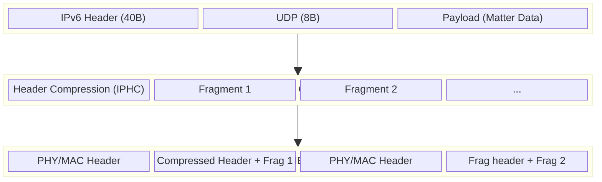

## 🌐 개요 (Overview)

**6LoWPAN**(IPv6 over Low-Power Wireless Personal Area Networks) 은 거대한 **[IPv6](IPv6.md)** 패킷을 **[IEEE 802.15.4](../connectivity/IEEE_802_15_4/IEEE%20802.15.4.md)** 와 같은 제한된 링크 레이어 위에서 전송할 수 있게 해주는 **적응 계층 (Adaptation Layer)** 기술입니다.

>[!NOTE]
> **[Thread](../thread/Thread.md)** 가 "저전력 IPv6 메시 네트워크"가 될 수 있는 핵심 비결이 바로 6LoWPAN 입니다.

## 🚧 문제점 : 코끼리를 냉장고에 넣기

1. **IPv6 [MTU](MTU.md)**: IPv6 는 최소 **1280 바이트** 의 패킷 크기를 요구합니다.
2. **802.15.4 [MTU](MTU.md)**: 하지만 저전력 무선 규격 (IEEE 802.15.4) 은 한 번에 최대 **127 바이트** 만 보낼 수 있습니다.
3. **오버헤드**: IPv6 헤더 (40B) + UDP 헤더 (8B) + MAC 헤더 등을 합치면 실제 데이터를 실을 공간이 거의 없습니다.

## 🛠️ 해결책 : 6LoWPAN 의 마법

1. **헤더 압축 (Header Compression)**:
    - IPHC (IP Header Compression) 등을 통해 40 바이트의 IPv6 헤더를 최소 **2~3 바이트** 까지 줄입니다.
    - 소스/목적지 주소가 로컬인 경우 생략하거나, 공통된 접두사 (Prefix) 를 생략합니다.
2. **단편화 및 재조립 (Fragmentation & Reassembly)**:
    - 1280 바이트짜리 큰 패킷을 127 바이트 이하의 작은 조각으로 잘라서 (Slicing) 보내고, 수신 측에서 다시 조립합니다.
3. **계층 2.5 (Layer 2.5)**:
    - OSI 모델에서 데이터 링크 계층 (MAC) 과 네트워크 계층 (IP) 사이에 위치합니다.

## 📐 패킷 구조 및 처리 과정 (Packet Structure)

IPv6 패킷이 802.15.4 무선 프레임으로 변환되는 과정의 도식화입니다.

1. **L3 (IPv6)**: 거대한 원본 패킷입니다. 1280 바이트 이상일 수 있습니다.
2. **Adaptation (6LoWPAN)**:
    - 거대한 **헤더 (40B)**를 **2B** 로 압축합니다.
    - 나머지 데이터가 127 바이트보다 크면 **조각 (Fragments)** 냅니다.
3. **L2 (802.15.4)**: 실제로 공중으로 날아가는 작은 무선 프레임들입니다.

## 🧠 활용 (Applications)

- **[Thread](../thread/Thread.md)**: Thread 스택의 필수 구성 요소입니다.
- **스마트 미터링**: 원격 검침 등 저전력 장거리 통신에 활용됩니다.
