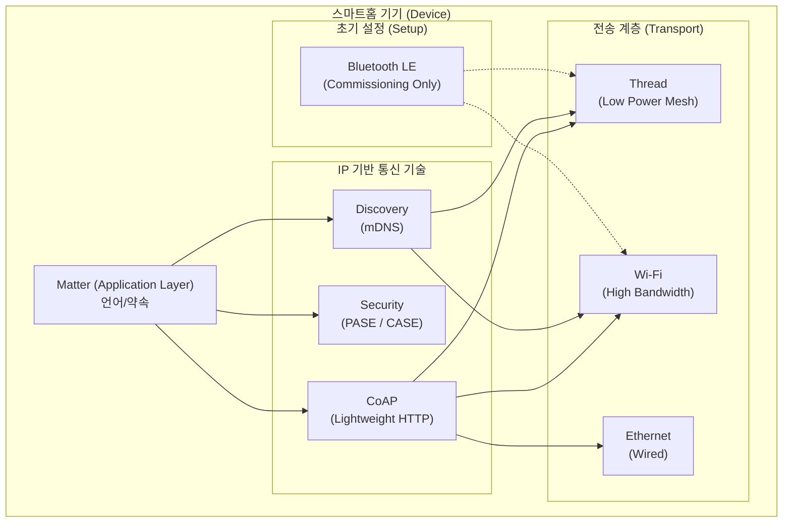
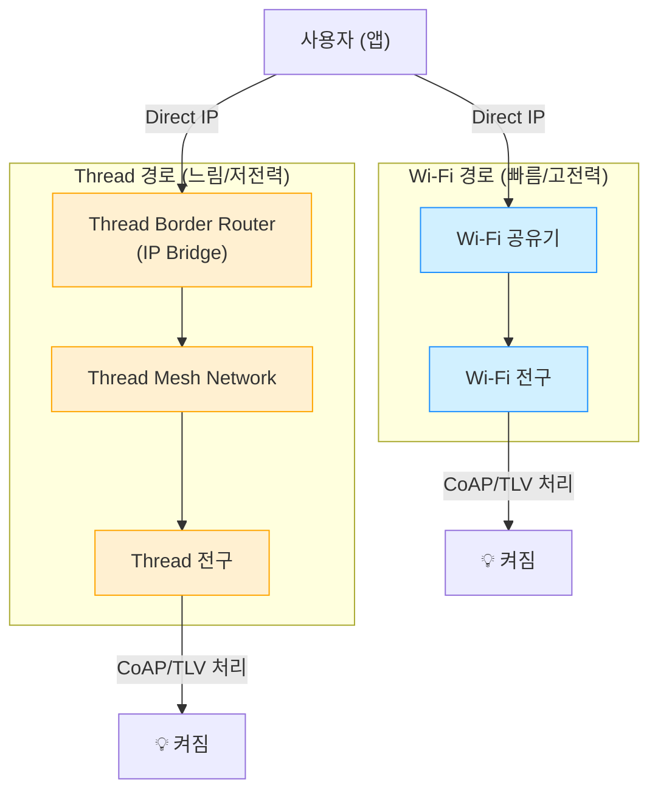

## 🏗️ Matter 와 전송 프로토콜의 관계 (Architecture)

"Matter 는 약속 (언어) 이고, Thread/Wi-Fi 는 전송 수단 (도로) 이다"라는 개념을 사용자 수준별로 정리한 문서입니다.

### 1. 🧍‍♀️ 일반인 (General)

> **비유**:**"언어" vs "통신 수단"**

스마트홈 기기들을 사람이라고 생각해보세요. 삼성, 구글, 애플 기기는 서로 다른 언어를 써서 대화가 안 되었습니다.

- **Matter**=**"우리 이제부터 영어로 대화하자!"** (공통 언어 약속)
- **Thread / Wi-Fi / Bluetooth**=**"전화로 할래? 편지로 할래?"** (전달 수단)

즉, **Matter** 는**대화하는 규칙** 이고,**Wi-Fi 나 Thread** 는 그 대화가 지나가는**길 (Road)** 입니다.

### 2. 💻 초급 개발자 (Beginner Dev)

> **상위 레벨의 "약속" vs 물리적인 "파이프"**-** Matter (Application Layer)**: "전등을 켜라"는 명령문의 형식을 정의합니다. 내가 누구고 (Device Type), 무슨 기능이 있는지 (Cluster) 를 표준화합니다.
- **Transport Layer**: Matter 가 정의한 명령을 실제로 나르는 파이프입니다.
    - **Wi-Fi**: 크고 넓은 파이프 (빠르지만 전력 소모 큼)
    - **Thread**: 작고 효율적인 파이프 (느리지만 배터리 오래 감)

### 3. 🧠 중급 개발자 (Intermediate Dev)

> **IP 기반의 애플리케이션 프로토콜** Matter 는 철저하게**IP (Internet Protocol)** 위에서 동작합니다.

| 계층 (Layer)            | 기술 (Tech)                                                           | 역할                                       |
| :-------------------- | :------------------------------------------------------------------ | :--------------------------------------- |
| **Application**|**[Matter](Matter.md)**                                             | 상호운용성 규격 (Data Model, Interaction Model) |
| **Transport/Network**|** TCP/UDP, IPv6**                                                   | 데이터 패킷 전송 및 주소 지정                        |
| **PHY/MAC**|**[Wi-Fi](../connectivity/Wi-Fi.md), [Thread](../thread/Thread.md), [Ethernet](../connectivity/Ethernet.md)** | 실제 무선/유선 신호 전달                           |
| **Commissioning**|**[Bluetooth](../connectivity/Bluetooth.md) LE**                                    | 초기 설정을 위한 임시 통신 (IP 아님)                  |

- **핵심**: Matter 는** IP 네트워크**라면 어디든 올라갈 수 있습니다. Bluetooth 는 IP 가 아니므로** 초기 설정 (Commissioning)** 때만 길잡이 역할로 쓰고 빠집니다.

### 4. 🧑‍💻 고급 개발자 (Advanced Dev)

> **Protocol Stack Deep Dive** Matter 는**IPv6** 위에서 동작하는**Application Layer** 프로토콜이며, 내부적으로 다음과 같은 기술 스택을 사용합니다.

1. **Transport Layer**:** UDP**를 주로 사용 (신뢰성 확보를 위해 자체적인 Message Reliability 메커니즘 보유).
2. **Messaging**:**[CoAP](../foundation/CoAP.md) (Constrained Application Protocol)** 기반의 가벼운 메시징.
3. **Data Serialization**:**[TLV](../foundation/TLV.md) (Type-Length-Value)** 포맷으로 데이터를 바이너리 인코딩하여 효율성 극대화.
4. **Security**:
    - **PASE** (Password Authenticated Session Establishment): 초기 설정 시 사용 (PIN 코드).
    - **CASE** (Certificate Authenticated Session Establishment): 운영 중 기기 간 상호 인증 (mTLS 와 유사).
5. **Discovery**:**[mDNS / DNS-SD](../foundation/mDNS.md)** 를 사용하여 로컬 네트워크 내에서 별도 서버 없이 기기를 찾음.

---

## 📊 아키텍처 다이어그램 (Diagrams)

### 1. 계층 구조 (Layer Hierarchy)

### 2. Wi-Fi vs Thread 동작 흐름 비교

**시나리오**: 앱에서 "전구 켜기" 버튼을 눌렀을 때.

### 3. 멀티 패브릭 & 상호 통신 (Interoperability)

**핵심**: Wi-Fi 기기와 Thread 기기는 물리적으로 다른 길을 쓰지만,**[Matter](Matter.md)** 라는 논리적 계층에서 하나로 연결됩니다.

- **Wi-Fi 전구** 가**Thread 스위치** 의 신호를 받을 수 있는 이유:
    1. Thread 스위치 → [Border Router](../thread/Border%20Router.md) (IP 변환) → Wi-Fi 공유기 → Wi-Fi 전구
    2. 이 모든 과정에서 데이터 내용 (Matter Command) 은 변하지 않음.
