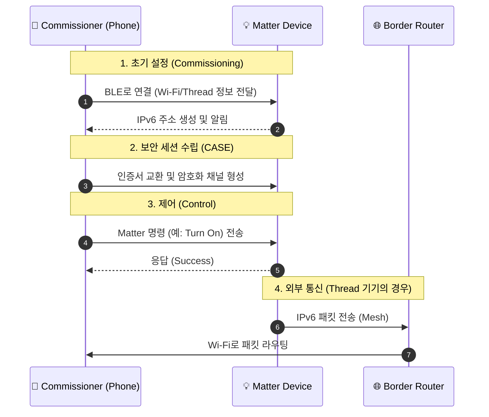

## 🌐 개요 (Overview)

**Matter**는 스마트홈 기기를 위한 오픈 소스, 로열티 프리 연결 표준으로, **CSA (Connectivity Standards Alliance)** 가 관리합니다. 서로 다른 생태계 (Apple, Google, Amazon, Samsung) 간의 파편화 문제를 해결하여 기기들이 기본적으로 상호 운용될 수 있도록 하는 것을 목표로 합니다.

>[!IMPORTANT]
>Matter 는 **애플리케이션 계층 (Application Layer)** 프로토콜입니다. 무선 라디오 프로토콜이 아니며, 기존의 IP 네트워크 *위에서* 동작합니다.
>
>🧩 **개념 이해**: "Matter 는 언어이고, Thread 는 도로입니다."
>👉 자세한 설명과 아키텍처 다이어그램은 **[Matter Architecture](Matter%20Architecture.md)** 문서를 참고하세요.

## 🏗️ 프로토콜 스택 (Protocol Stack)

Matter 는 [Zigbee](../connectivity/Zigbee.md) 나 [Z-Wave](../connectivity/Z-Wave.md) 와 같은 풀 스택 (Full-Stack) 프로토콜이 아닙니다. 대신 상위 계층을 통합하고, 전송 계층은 표준 IP 네트워크에 의존합니다.

| 계층 (Layer)                | 기술 (Technology)                                                     | 상세 내용 (Details)                                                     |
| :------------------------ | :------------------------------------------------------------------ | :------------------------------------------------------------------ |
| **Layer 7** (Application) | **Matter**                                                          | 데이터 모델 (Data Model), 명령 구조 (Command layout), 보안 (Security) 을 정의합니다. |
| **Layer 4** (Transport)   | **TCP / UDP**                                                       | 운영 메시징에는 UDP 를, 대용량 데이터 전송에는 TCP 를 사용합니다.                           |
| **Layer 3** (Network)     | **IPv6**                                                            | **필수 (Mandatory)**입니다. Matter 기기는 반드시 IPv6 주소를 가져야 합니다.             |
| **Layer 1-2** (PHY/MAC)   | **[Thread](../thread/Thread.md), [Wi-Fi](../connectivity/Wi-Fi.md), [Ethernet](../connectivity/Ethernet.md)** | 물리적 라디오 계층입니다. Matter 는 이러한 전송 기술들을 명시적으로 지원합니다.                    |

### 🛠️ 주요 구성 요소 및 역할

>[!TIP] 자세한 역할 정의
>Controller, Commissioner, Bridge 등 각 장치의 역할에 대한 상세 정의는 **[Matter Roles](Matter%20Roles.md)** 문서를 참고하세요.

1. **데이터 모델 (Data Model)**: [Zigbee](../connectivity/Zigbee.md) 의 **[ZCL](../foundation/ZCL.md) (Zigbee Cluster Library)** 에서 크게 파생되었습니다. "클러스터 (Cluster)"를 사용하여 기능 (예: On/Off 클러스터, 레벨 제어 클러스터) 을 정의합니다. 즉, Matter 는 Zigbee 의 입증된 언어를 IP 세상으로 확장한 직계 후손입니다.
2. **멀티 어드민 (Multi-Admin)**: 하나의 기기를 여러 생태계에 동시에 연결할 수 있습니다 (예: Siri 와 Alexa 로 동시에 제어 가능).
3. **보더 라우터 (Border Routers)**: Matter 는 IPv6 를 사용하므로, 특정 라디오 ([Thread](../thread/Thread.md)) 의 IPv6 패킷을 메인 [Wi-Fi](../connectivity/Wi-Fi.md)/이더넷 네트워크로 변환해 줄 **[Thread Border Router](../thread/Border%20Router.md)** 가 필요합니다. 이는 로직을 번역하는 독점적 허브/브리지와 달리, 단순히 패킷 라우팅 (Routing) 역할만 수행합니다.

## 🌉 Wi-Fi 와 Thread 의 역할 분담

Matter 는 두 가지 전송 방식을 각자의 장점에 맞게 전략적으로 사용합니다.

| 구분        | [Wi-Fi](../connectivity/Wi-Fi.md) (고속도로) | [Thread](../thread/Thread.md) (골목길/자전거) | [Bluetooth](../connectivity/Bluetooth.md) (안내원) |
| :-------- | :----------------------- | :---------------------------- | :------------------------------ |
| **역할**    | 고속/대용량 통신                | 저전력/소용량 통신                    | **최초 기기 설정 (Commissioning)**    |
| **사용 기기** | 스피커, TV, 카메라, 허브         | 센서, 전구, 스위치, 도어락              | (설정 시에만 사용)                     |
| **전력 소모** | 매우 높음 (상시 전원 필수)         | 매우 낮음 (배터리 수년 사용)             | 매우 낮음                           |
| **연결 방식** | 공유기 (AP) 직접 연결           | **[보더 라우터](../thread/Border%20Router.md)**를 통해 인터넷 연결         | 스마트폰과 1:1 연결                    |

## 🚀 동작 원리 (Commissioning & Control)

Matter 기기가 네트워크에 연결되고 제어되는 과정은 **IPv6**를 중심으로 이루어집니다.

## 🏠 스마트홈에서의 역할 (Smart Home Role)

- **상호 운용성 (Interoperability)**: 스마트홈의 "만국 공통어" 역할을 합니다.
- **로컬 제어 (Local Control)**: Matter 기기는 LAN/[Thread](../thread/Thread.md) 메시 내에서 로컬로 통신합니다. 클라우드 연결은 선택 사항입니다.
- **보안 (Security)**: 기기 인증 (DAC - Device Attestation Certificates) 을 위해 블록체인 스타일의 분산 원장을 사용합니다.
