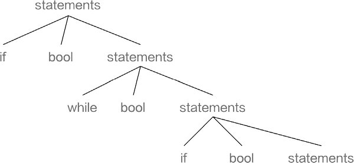
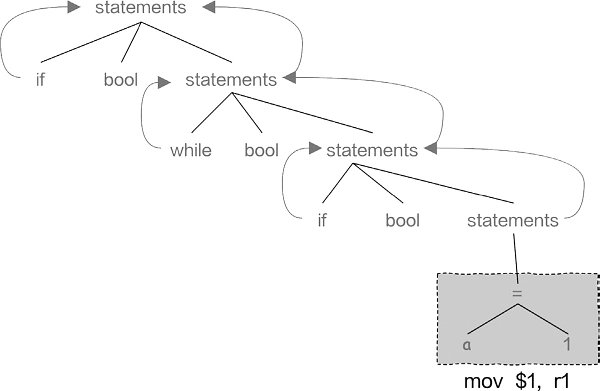
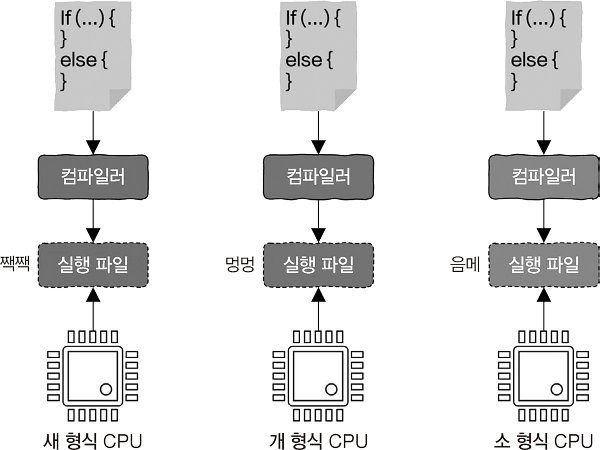

## 책 "컴퓨터 밑바닥의 비밀" 정리, 읽고 든 생각들

이 펴고 읽기 시작했을 때 들었던 생각은 다음과 같다.

> 쉽고 재밌는 비유 때문에 책장을 넘기기 쉬운 책.

책의 전반을 간단히 정리하고, 간단한 생각들을 정리하고자 한다.

### 1. 프로그래밍 언어부터 프로그램 실행까지, 이렇게 진행된다

#### Section 1.1 여러분이 프로그래밍 언어를 발명한다면?

**TL;DR:** 프로그래밍 언어의 발전은 다음 과정을 따른다.

```plaintext
1. Binary
2. Assembly
3. C, Pascal 같은 (당시 고수준, 현 저수준) 언어
4. 가상 머신을 사용하는 언어, 인터프리터 언어
```

#### (0) 기본 원리: CPU의 본질 이해

> CPU = "똑똑한 바보"

컴퓨팅의 시작은 스위치 조합으로 bool logic을 표현할 수 있다는 사실의 발견에서 시작하였다. 간단한 개폐(on-off) 를 숫자로 표현하면 0과 1로 표현하여 숫자를 표현하는 일을 시키고 이를 Computing 이라 부르기 시작한다. CPU 는 연산(Computing) 을 처리(Processing)하는 기관(Unit) 으로 컴퓨터의 중심이라고 볼 수 있다.

CPU가 할 수 있는 일은 단순하다.

```plaintext
- 데이터를 한 곳에서 다른 곳으로 옮기기
- 간단한 연산하기
- 그 데이터를 또 다른 자리로 옮기기
```

하지만 엄청나게 빠르다. 간단한 연산에서는 인간이 절대 CPU를 따라잡을 수 없다.

##### (1) 기계 언어를 따라하자: `Binary`

초기 컴퓨터를 디자인한 사람들은 기계에게 명령을 내리기 위해 우선 사람의 언어가 아닌 연산, 계산을 위한 언어로 소통하기로 결정한다.


```plaintext
1101101010011010
1001001100101001
1100100011011110
1011101101010010
```

조금만 읽어봐도 사람이 이해하기 힘들다는 것을 알 수 있다.

##### (2) 이해할 수 있는 명령으로 변환하자: `Assembly`

연구자들은 사람이 이해할 수 있도록 명령을 작성하는 방법을 연구하다 다음 사실을 발견한다.

> CPU는 가산 명령어, 점프 명령어 등 겨우 몇 가지 명령어만 실행할 수 있다

따라서 사람들은 기계어와 해당 특정 작업을 간단하게 대응시켜 기계어를 인간이 읽고 이해할 수 있는 단어와 대응 시킨다. 인간 관점에서 Binary 보다는 이해하기 쉬운 언어 버전이 탄생한다. 이에 Assembly 라는 이름을 지었고, [0,1] 은 다음과 같이 바뀐다.

```assembly
sub  $8, %rsp
mov  $.LC0, %edi
call puts
mov  $0, %eax
```

읽을 수는 있게 되었지만, 너무 자세한 내용 때문에 일부만 보고 무슨 내용인지는 알기 힘들다. 인간은 천성적으로 추상화된 명령에 익숙하다.

##### (3) 저수준 계층의 세부 사항 대 고수준 계층의 추상화: `고수준 언어`와 이를 구현할때 필요한 것들

`추상화된 명령` 이라는 말이 와닿지 않는다면 다음을 확인해보자.

추상화된 명령

```plaintext
물 한잔 주세요
```

이를 수행하기 위해 해야할 세부사항

```plaintext

> 오른쪽 다리를 내딛는다
> 멈춘다
> 왼쪽 다리를 내딛는다
> 멈춘다
> 앞의 걸음을 음료대 옆에 도착할 때까지 반복한다
> 물컵을 찾는다
> 오른손을 들어올린다
> 물컵을 잡는다
> 수도꼭지로 이동한다
> 왼손을 뻗는다
> 수도꼭지를 연다
> 물이 아직 가득 차지 않았다면 계속 기다린다
> 물이 이미 가득 찼다면 수도꼭지를 잠근다
```

매일 매우 작은 에너지를 사용하는 일도 위처럼 지나치게 많은 세부사항에 신경 써야한다는 것을 알 수 있다. 사용하기 어렵고 불편하다는건 자명하다.

선대 컴퓨터 연구자들은 위와 같은 명령에서 다음과 같은 공통 패턴이 존재한다는 것을 발견한다.

```plaintext
1. 단도직입적인 명령(statement)
2. 만약의 가정 (조건문, if else)
3. 일정 명령어의 반복 (반복문, while)
```

패턴을 찾고 이에 대한 개념을 세울 순 있었지만, 이를 현실적 어려움을 뚫고 구현하는 것은 다른 문제일 것이다. 더 추상적인 개념으로 바꿀 때는 다음 문제가 생긴다.

```plaintext
문제 1
단도직입적 명령안에 명령 또는 반복,조건이 존재할 수 있어 이를 대치하기 어렵다.

문제 2
Assembly 처럼 단순한 대치가 아니라면 이를 어떻게 기계어로 대치할 것인가?
```

이를 해결하기 위해 선대 연구자들은 다음의 개념을 빌려와 사용하였다.

```plaintext
문제 1
단도직입적 명령안에 명령 또는 반복, 조건이 존재할 수 있어 이를 대치하기 어렵다.
-> 수학적 재귀

문제 2
Assembly 처럼 단순한 대치가 아니라면 이를 어떻게 기계어로 대치할 것인가?
-> 나무의 구조
```

단도직입적 명령안에 명령 또는 반복, 조건이 존재할 수 있다는 문제는 무슨말인가? 다음같은 경우이다.

```dart
if (a >= 1) {
    // 명령부
    if (a % 2 == 0) { // 하지만 명령부 부분에 또 조건 발생
        for (var i = 0; i < 10; i++) { // 명령부 아래 또 반복문 나올 수 있음
            // TODO: do something here
        }
    }
}
```

꿈 안에 꿈, 영화 인셉션, 같은 상황이 발생한다. 이런 경우 기계어로 치환이 어렵다는 문제가 발생한다. 이를 해결하기 위해 수학적 재귀 라는 개념을 가져온다.

```latex
f(x) = f(x-1) + f(x-2)
```

이로 인해 코드가 더 짧아진다.

추상화된 단어는 단순한 대치가 아니기 때문에 이를 어떻게 기계어로 대치할지의 문제가 남는다. 이는 나무의 가지가 뻗어나가는 특징을 기반으로 만들어진다.


코드를 syntax tree로 표현하고 leaf node에서부터 부모 node로 차례대로 올라가다 보면, 전체 syntax tree를 모두 기계어로 바꿀 수 있게 된다.





단순한 대치를 넘어서 고수준 언어를 복잡한 기계어로 전환하는 것을 당시 사람들은 `컴파일러` 라고 이름 짓는다.

##### (4) 호환성을 위한 방법: Virtual Machine, Interpreter Language

당시 사람들은 또 다른 문제를 발견한다. 한 곳에서만 CPU 를 만들라는 법은 없기 때문에, CPU 종류가 다양해진다는 것이다. 각 제조사에서 만든 CPU 는 많은 경우 자신만을 위한 기계어로 변환해야 명령을 실행할 수 있다.

"오늘날 국제 통용어로 영어를 사용함" 같은 곳에서 영감을 얻어, 명령어 집합을 정의해서 CPU의 기계 명령어 실행 과정을 모방하는 프로그램을 작성하여 사용할 수 있다는 아이디어로 발전한다.



이를 CPU 시뮬레이션 프로그램이라는 이름의 `가상머신`이라고 부르고, `인터프리터 언어`라는 별명으로 불리게 된다.

#### 떠오른 질문들

읽다보니 생각해볼만한 질문이 생각났다. 이 이야기를 이 글을 읽는 당신도 질문에 대한 의견을 준다면 감사하겠다.

```plaintext
assembly 나 C 만큼의 속도를 포기하면서 개발자 경험(DX) 을 올린 것은 좋은 발전이라 할 수 있나?
```
