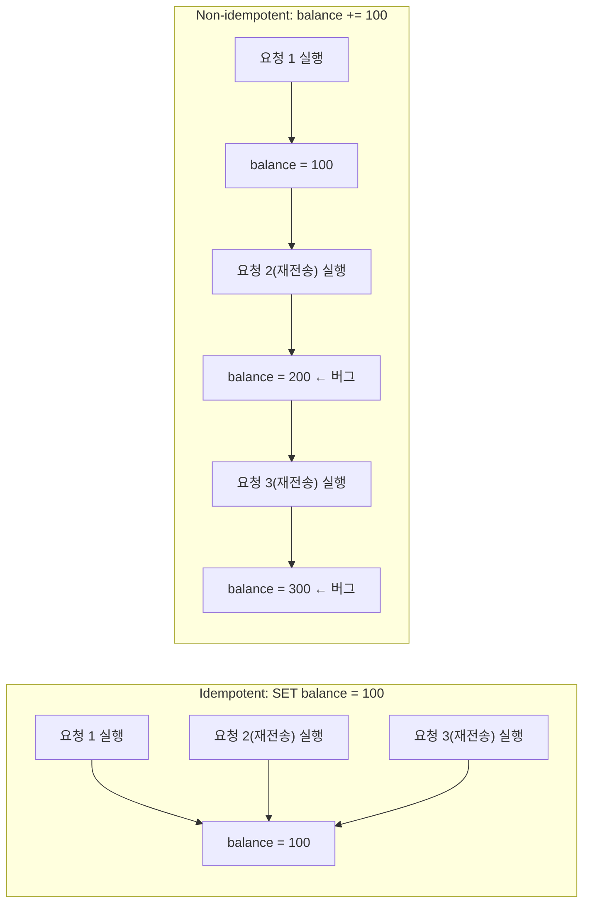

## Idempotency(멱등성)란 무엇인가

**Idempotency(멱등성)** 는 "같은 연산을 한 번 실행하는 것과 여러 번(N 번) 실행하는 것이 결과 상태 면에서 동일하다"는 성질이다. 수학에서 온 개념이다 — 함수 `f` 가 `f(f(x)) = f(x)` 를 만족하면 idempotent 하다(예: 절댓값 함수 `abs(abs(-5)) = abs(-5) = 5`). 소프트웨어에서는 이걸 "부수 효과(side effect)를 만드는 연산"에 적용한다: 같은 요청이 한 번 도착하든 세 번 중복 도착하든, 시스템의 최종 상태는 한 번 처리했을 때와 같아야 한다는 뜻이다.

중요한 것은 **idempotent 하다고 해서 "아무 일도 안 일어난다"는 뜻이 아니라는 점**이다. 매번 실제로 실행되지만(로그가 세 번 남을 수도 있다), 그 실행이 만드는 **최종 상태**가 같다는 것이다.



## 왜 필요했나

분산 시스템과 네트워크 통신에는 근본적인 문제가 하나 있다: **요청을 보낸 쪽은 응답이 안 오면 "요청이 실패했는지" "요청은 성공했는데 응답만 유실됐는지" 구분할 수 없다.** 이걸 흔히 "at-least-once delivery 문제"라 부른다.

이 문제에 대한 유일하게 안전한 대응은 "확실하지 않으면 재시도한다"이다 — 그런데 재시도가 안전하려면, 서버가 같은 요청을 여러 번 받아도 결과가 달라지지 않아야 한다. 즉 **재시도(retry)는 멱등성을 전제로 해야만 안전하다.** 멱등성이 없는 연산(예: "포인트 100 적립")을 재시도 정책이 있는 경로에 그대로 얹으면, 네트워크가 불안정할수록 오히려 중복 실행 버그가 늘어난다.

## 멱등성을 만드는 방법

1. **자연히 멱등한 연산을 쓴다**: `SET x = 5` 는 몇 번을 실행해도 결과가 같다. 반면 `x += 1` 은 실행 횟수만큼 결과가 달라진다. 가능하면 "증가/감소" 대신 "절대값 지정"으로 설계한다.
2. **Idempotency Key(멱등성 키)**: 클라이언트가 요청마다 고유 ID(UUID 등)를 함께 보내고, 서버는 "이미 처리한 ID 목록"을 저장해뒀다가 같은 ID 가 다시 오면 실제 로직을 건너뛰고 이전 결과를 그대로 반환한다. 결제 API(Stripe 등)가 표준적으로 쓰는 방식이다.
3. **조건부 쓰기(Conditional Write)**: "현재 상태가 X 일 때만 Y 로 바꿔라" 처럼 사전 조건을 거는 방식(DB 의 `UPDATE … WHERE version = 3`, 낙관적 잠금). 같은 요청이 중복 도착해도 두 번째 시도는 조건이 이미 깨져 있어 아무 효과가 없다.

```python
processed_ids: set[str] = set()

def charge_payment(idempotency_key: str, amount: int) -> str:
    if idempotency_key in processed_ids:
        return "already_processed"  # 실제 청구를 다시 실행하지 않음
    processed_ids.add(idempotency_key)
    _actually_charge(amount)
    return "charged"
```

## 순수 함수(Pure Function)와의 차이

멱등성은 순수성(purity)과 자주 혼동되지만 다른 축이다.

| | 정의 | 예시 |
| --- | --- | --- |
| **순수 함수** | 같은 입력이면 항상 같은 출력을 내고, 외부 상태를 변경하지 않는다 | `fun add(a: Int, b: Int) = a + b` |
| **멱등 연산** | N 번 실행한 결과 상태가 1 번 실행한 결과 상태와 같다(부수 효과가 있어도 됨) | `DELETE FROM users WHERE id = 5`(이미 지워졌어도 재실행 결과는 "없음"으로 동일) |

`DELETE` 는 부수 효과(row 삭제)가 있으므로 순수 함수는 아니지만, 몇 번을 실행해도 최종 상태("그 row 는 없다")가 같으므로 멱등하다. 반대로 순수 함수라도 결과를 어딘가에 누적 기록하는 호출부와 엮이면 그 호출 자체는 멱등하지 않을 수 있다 — 두 성질은 독립적으로 판단해야 한다.

## 실제 사용처

- **HTTP 메서드 규약**: `GET`/`PUT`/`DELETE`/`HEAD` 는 스펙상 멱등해야 하고(같은 `PUT` 을 여러 번 보내도 결과는 동일), `POST`/`PATCH` 는 일반적으로 멱등하지 않다(같은 `POST` 를 두 번 보내면 리소스가 두 개 생길 수 있다). 이 구분이 HTTP 캐시·재시도·프록시 설계의 기본 전제다.
- **분산 메시지 큐(Kafka, SQS 등)**: 대부분 "at-least-once delivery" 를 보장하므로(정확히 한 번 전달은 비용이 훨씬 크다) consumer 쪽 처리 로직이 멱등하지 않으면 메시지 중복 처리가 반드시 발생한다.
- **작업 재시도 프레임워크(Android WorkManager, `Result.retry()`)**: 실패한 작업은 다시 실행될 수 있다는 전제이므로, `Worker.doWork()` 내부 로직이 멱등하지 않으면 재시도가 데이터를 중복시킨다.
- **분산 클라이언트 - 서버 IPC(Android Binder 의 `oneway` 호출)**: 응답을 기다리지 않는 호출은 실패 여부를 호출자가 알 수 없어 재시도 판단 자체가 어렵다. 재시도 가능한 API 로 설계하려면 그 호출이 멱등해야 한다.
- **Kubernetes/Terraform 같은 선언적(declarative) 시스템**: "원하는 최종 상태"를 선언하고 시스템이 현재 상태와 비교해 필요한 만큼만 조정하는 구조 자체가 멱등성을 기본 설계 원칙으로 삼는다(같은 매니페스트를 몇 번 적용해도 결과는 같다).

## 연결 문서

- [[merkle-tree]] - 무결성 검증과는 다른 축이지만, 둘 다 "같은 연산의 반복 안전성"을 다루는 분산 시스템 설계 원칙이라는 점에서 함께 참고할 수 있다
