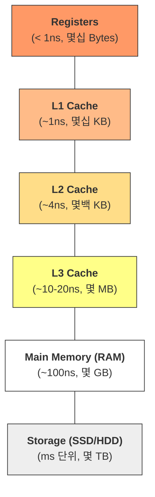
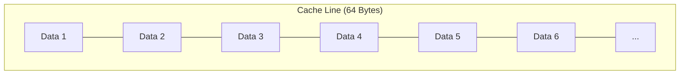
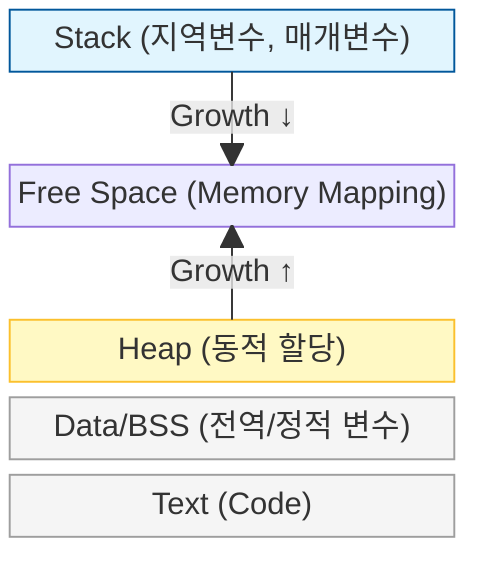

# Memory Layout & Cache Fundamentals

소프트웨어 성능의 상한선은 결국 하드웨어가 결정합니다. 알고리즘의 시간 복잡도($O$)가 실제 실행 속도로 변환되는 과정에서 가장 결정적인 역할을 하는 하드웨어 요소인 **메모리 계층 구조**와 **캐시 지역성**을 정리합니다.

---

## 🏗️ 메모리 계층 구조 (Memory Hierarchy)

현대 컴퓨터는 '속도, 용량, 가격' 사이의 효율적인 균형을 위해 피라미드 형태의 계층 구조를 가집니다.



- **상위 계층**: CPU 코어 가깝고 매우 빠름 (Volatile, 고가).
- **하위 계층**: 용량이 크고 저렴함 (Non-volatile, 저속).
- **성능 병목**: CPU 연산 속도에 비해 RAM 접근 속도가 현저히 느려지는 현상을 **Memory Wall**이라 부르며, 이를 극복하기 위해 캐시(Cache)가 존재합니다.

---

## 🎯 캐시 지역성 (Cache Locality)

캐시는 CPU 가 다음에 필요로 할 데이터를 예측하여 RAM 에서 미리 가져오는 장치입니다. 이 예측의 근거가 바로 **지역성(Locality)** 원리입니다.

### 1. 시간 지역성 (Temporal Locality)
최근에 접근한 데이터에 다시 접근할 확률이 높다는 원리입니다.
- **예시**: 루프문의 카운터 변수(`i`), 자주 호출되는 함수.

### 2. 공간 지역성 (Spatial Locality)
방금 접근한 데이터의 인접한 데이터에 접근할 확률이 높다는 원리입니다.
- **예시**: 배열 순회. CPU 는 한 바이트를 읽을 때 인접한 데이터를 포함한 **Cache Line (보통 64바이트)** 단위로 뭉텅이로 가져옵니다.


^ (CPU가 Data 1을 요청하면, 인접한 데이터들이 캐시 라인 단위로 함께 적재됨)

> [!TIP] **False Sharing (거짓 공유)**
> 멀티코어 환경에서 서로 다른 코어가 같은 캐시 라인 내의 서로 다른 변수를 수정하려고 할 때, 캐시 일관성(Coherency)을 유지하기 위해 불필요하게 캐시를 비우고 다시 채우는 오버헤드가 발생하는 현상입니다.

---

## 🧠 프로세스 메모리 레이아웃 (Process Memory Layout)

프로그램이 실행될 때 운영체제로부터 할당받는 가상 메모리 공간의 구조입니다.



| 영역 | 설명 | 관리 주체 |
| :--- | :--- | :--- |
| **Stack** | 함수 호출 시 생성되는 지역 변수, 복귀 주소 저장. LIFO 구조. | 컴파일러/런타임 자동 관리 |
| **Heap** | 런타임에 크기가 결정되는 동적 데이터 저장. | 개발자 (또는 Garbage Collector) |
| **Data/BSS** | 프로그램 실행 시 할당되어 종료 시까지 유지되는 전역/정적 변수. | 시스템 |
| **Text** | 컴파일된 기계어 코드가 저장되는 읽기 전용 영역. | 시스템 |

---

## 🚨 소프트웨어 설계 시 고려사항

### 1. Array vs Linked List
- **Array**: 물리적으로 연속되어 있어 **공간 지역성**이 극대화됩니다. 현대 CPU 에서 압도적으로 유리합니다.
- **Linked List**: 노드가 메모리 여기저기 흩어져 있어 접근할 때마다 **Cache Miss**가 발생할 확률이 높습니다.

### 2. 다차원 배열 접근 (Row Major vs Column Major)
고차원 배열은 메모리에 일렬로 펼쳐집니다. C-family 언어는 행 중심(Row Major)이므로 안쪽 루프가 행의 인덱스를 바꿔야 성능이 좋습니다.

```python
# GOOD: 공간 지역성 활용 (Row-wise)
for i in range(rows):
    for j in range(cols):
        sum += matrix[i][j] # matrix[i][j]와 matrix[i][j+1]은 인접함

# BAD: 매번 캐시 라인을 새로 가져와야 함 (Column-wise)
for j in range(cols):
    for i in range(rows):
        sum += matrix[i][j] # matrix[i][j]와 matrix[i+1][j]는 매우 멀리 떨어져 있음
```

---

## 📚 관련 문서

- [복잡도 분석](../../01_inbox/algorithm/00_fundamentals/complexity-and-big-o.md): 캐시 효율이 Big-O 성능의 상수를 결정하는 원리
- [재귀와 호출 스택](../../01_inbox/algorithm/00_fundamentals/recursion-and-stack.md): Stack 영역의 동작 원리와 오버플로우
- [Random Access](random-access.md): 하드웨어적 관점에서의 주소 기반 무작위 접근
- [선형 자료구조](../../01_inbox/algorithm/01_data-structures/linear.md): Array와 Linked List의 캐시 효율성 비교
