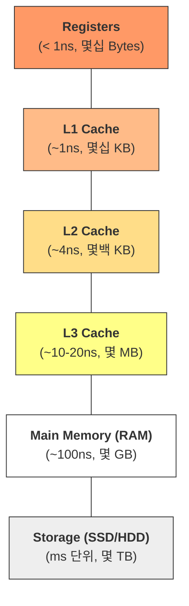

## Memory Layout & Cache Fundamentals

소프트웨어 성능의 상한선은 결국 하드웨어가 결정합니다. "왜 내 컴퓨터는 용량도 크면서 동시에 빠를 수 없는가"에 대한 해답과, "어떻게 코드를 작성해야 캐시 미스를 줄일 수 있는가"에 대한 근본적인 원리를 정리합니다.

---

### 🏗️ 메모리 계층 구조 (Memory Hierarchy)

컴퓨터 설계의 영원한 난제는 **"빠르고, 무한한 용량을 가지며, 저렴한"** 저장 장치가 존재하지 않는다는 것입니다. 이를 해결하기 위해 서로 다른 성능과 용량을 가진 장치들을 계층적으로 배치합니다.

#### 💡 계층 구조의 대전제

1. **CPU 와 가까울수록**: 속도가 빠르고, 용량이 작으며, 가격이 비쌉니다.
2. **CPU 와 멀수록**: 속도가 느리고, 용량이 크며, 가격이 저렴합니다.



---

### 1. 레지스터 (Registers): CPU 의 손과 발

- **위치**: CPU 내부 (Core 당 수십 개)
- **속도**: 가장 빠름 (CPU 사이클과 동기화)
- **역할**: 연산을 수행하기 위해 데이터를 아주 잠시 보관하는 공간입니다. 컴파일러와 CPU 는 가급적 모든 핵심 변수를 레지스터에 할당하여 처리 효율을 극대화하려 노력합니다.

---

### 2. 캐시 메모리 (SRAM): 속도 차이의 완충지대

CPU 연산 속도는 비약적으로 발전했지만, RAM 의 속도는 그에 미치지 못했습니다. 이 **Memory Wall**을 극복하기 위해 SRAM(Static RAM) 기반의 캐시가 도입되었습니다.

#### 💡 SRAM (Static RAM)의 특징

- **원리**: 전원이 공급되는 한 데이터를 유지하며(Static), 재충전(Refresh)이 필요 없어 매우 빠릅니다.
- **단점**: 집적도가 낮아 대용량 제작이 어렵고 가격이 매우 비쌉니다.

#### 🚀 캐시 계층별 특징 (L1 ~ L4)

| 계층 | 위치 | 지연 시간 (Latency) | 특징 |
| :--- | :--- | :--- | :--- |
| **L1** | 코어 내부 | ~1ns (4 Cycles) | 가장 빠름. I-Cache(명령어)와 D-Cache(데이터)로 분산 |
| **L2** | 코어 내부 | ~7ns (10 Cycles) | L1 의 미스를 보완. 코어 전용 공간 |
| **L3** | 코어 외부 | ~20ns (50 Cycles) | 가장 크며, 여러 코어가 공유하여 데이터 교환 및 일관성 유지 |
| **L4** | 패키지/eDRAM | - | 일부 고성능 아키텍처에서 RAM 접근 전 최종 버퍼로 활용 |

#### 🔄 캐시 갱신 정책 (Sync Policy)

CPU 가 캐시에 데이터를 쓸 때 메모리와의 데이터 일관성을 유지하는 방식입니다.

- **연속 기입 (Write-through)**: 캐시와 메모리에 **동시에** 기록합니다. 구조가 단순하지만 메모리 쓰기 속도 때문에 성능이 떨어집니다.
- **후기입 (Write-back)**: 일단 **캐시에만** 쓰고 작업을 계속합니다. 실제 메모리에는 캐시 라인이 교체될 때 반영되어 **성능이 우수**합니다.

#### 🚨 심화: 캐시 일관성과 거짓 공유 (MESI Protocol)

- **캐시 일관성**: 멀티코어 환경에서 갱신된 데이터를 다른 코어가 즉시 인지하도록 **MESI 프로토콜**을 통해 다른 캐시의 데이터를 무효화(Invalidate)합니다.
- **거짓 공유(False Sharing)**: 서로 다른 변수가 같은 **Cache Line (64 Bytes)** 에 묶여 있으면, 한 변수의 수정이 전체 라인을 무효화시켜 성능을 떨어뜨립니다. **Padding**을 통한 데이터 격리가 필요합니다.

---

### 3. 주기억장치 (DRAM): 실행의 중심 (책상)

실행 중인 프로그램과 데이터가 머무는 **DRAM(Dynamic RAM)** 입니다. CPU 가 프로그램을 실행하기 위해 명령어와 데이터가 반드시 머물러야 하는 공간입니다.

- **비유**: RAM 은 작업자가 일하는 **'책상'** 과 같습니다. 책상이 넓으면 여러 프로그램을 동시에 쾌적하게 돌릴 수 있습니다.
- **DRAM (Dynamic RAM) 특징**:
    - '동적(Dynamic)'이라는 이름처럼 시간이 지나면 전하가 방전되어 데이터가 사라집니다. 이를 막기 위해 주기적으로 데이터를 다시 저장하는 **재충전(Refresh)** 작업이 필수적입니다.
    - SRAM 보다 저렴하고 집적도가 높아 대용량(8GB~수십 GB)으로 구성하기에 최적입니다.
- **가상 메모리(Virtual Memory)**: 실제 물리 RAM 용량보다 큰 프로세스 공간을 제공하기 위한 기술입니다. ([상세 내용](../operating-systems/virtual-memory.md) 참조)

---

### 4. 보조기억장치 (SSD / HDD): 보관의 중심 (창고)

CPU 가 직접 접근할 수 없으며, 실행 전 반드시 RAM 으로 복사(Load)되어야 하는 비휘발성 저장소입니다.

- **비유**: 보조기억장치는 물건을 영구히 보관하는 **'창고'** 입니다. 실행하고 싶은 프로그램이 있다면 창고에서 꺼내 책상(RAM)으로 옮겨야 합니다.
- **HDD (Hard Disk Drive)**: 물리적인 원판(Platter)을 회전시키는 구조로, 탐색 시간(Seek Time) 때문에 메모리에 비해 수십만 배 느립니다.
- **SSD (Solid State Drive)**: 반도체(NAND Flash) 기반입니다.
    - **속도 한계**: 아무리 빨라도 메모리 대역폭(RAM)과는 자릿수 단위의 속도 차이가 납니다.
    - **수명 한계**: 덮어쓰기가 불가능해 지우고 다시 써야 하는 특성상, 쓰기 수명(**TBW**) 제한이 있어 빈번한 읽기/쓰기 용도로는 적합하지 않습니다.

---

### 🎯 참조 지역성 (Locality of Reference)

캐싱의 효율을 결정짓는 핵심 원리입니다.

- **시간 지역성 (Temporal Locality)**: 최근에 접근한 데이터에 다시 접근할 확률이 높음 (예: 반복문의 `i`).
- **공간 지역성 (Spatial Locality)**: 접근한 데이터의 인접 데이터에 접근할 확률이 높음 (예: 배열 순회).

#### 💻 실무 인사이트: 행 우선(Row Major) vs 열 우선(Column Major)

C-family 언어는 행 중심 저장을 사용하므로, 안쪽 루프가 행의 인덱스를 바꿔야 성능이 비약적으로 향상됩니다.

```python
# GOOD: 공간 지역성 극대화 (Row-wise)
for i in range(rows):
    for j in range(cols):
        sum += matrix[i][j] # matrix[i][j]와 matrix[i][j+1]은 메모리상 인접

# BAD: 매번 캐시 미스 발생 (Column-wise)
for j in range(cols):
    for i in range(rows):
        sum += matrix[i][j] # matrix[i][j]와 matrix[i+1][j]는 매우 멀리 떨어져 있음
```

---

### 🔄 데이터의 여정 (Data Journey Summary)

1. **Load**: SSD(창고)에 저장된 파일이 **RAM(책상)** 으로 로드됩니다.
2. **Fetch**: CPU 가 데이터를 처리하기 위해 RAM 데이터를 **캐시**로 가져옵니다. 이때 지역성에 기반해 주변 데이터도 함께 가져옵니다.
3. **Execute**: 데이터가 **레지스터**에 도달하면 연산(ALU)이 수행됩니다.
4. **Store**: 결과는 **Write-back** 정책에 따라 캐시에 먼저 저장되고, 나중에 RAM 에 반영됩니다.

>[!IMPORTANT] **Engineering Insight**
>"자주 쓰는 데이터는 더 빠르고 가까운 곳에 둔다"는 **참조 지역성(Locality)** 원칙이 컴퓨터 전체의 성능을 지탱합니다. 개발자는 이 계층 구조를 이해함으로써 '하드웨어 친화적인 코드'를 작성할 수 있습니다.

---

### 📚 관련 문서

- [복잡도 분석](../../01_inbox/algorithm/00_fundamentals/complexity-and-big-o.md): 레이턴시 수치와 Big-O 상수의 관계
- [재귀와 호출 스택](../../01_inbox/algorithm/00_fundamentals/recursion-and-stack.md): Stack 영역의 물리적 관리
- [선형 자료구조](../../01_inbox/algorithm/01_data-structures/linear.md): Array vs Linked List 의 캐시 적중률 차이
- [Random Access](random-access.md): 주소 기반 무작위 접근의 하드웨어적 실체
