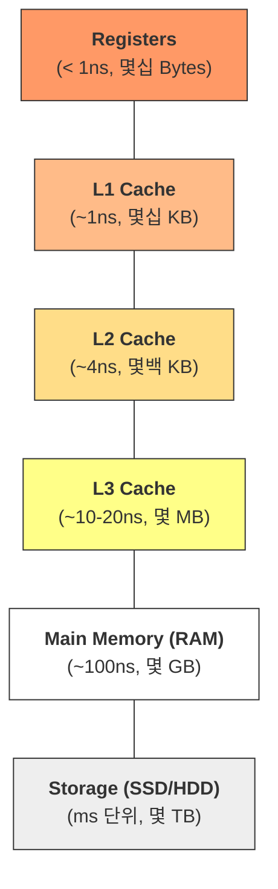

## Memory Layout & Cache Fundamentals

소프트웨어 성능의 상한선은 결국 하드웨어가 결정합니다. "왜 내 컴퓨터는 용량도 크면서 동시에 빠를 수 없는가"에 대한 해답과, "어떻게 코드를 작성해야 캐시 미스를 줄일 수 있는가"에 대한 근본적인 원리를 정리합니다.

---

### 🏗️ 메모리 계층 구조 (Memory Hierarchy)

컴퓨터 설계의 영원한 난제는 **"빠르고, 무한한 용량을 가지며, 저렴한"** 저장 장치가 존재하지 않는다는 것입니다. 이를 해결하기 위해 서로 다른 성능과 용량을 가진 장치들을 계층적으로 배치합니다.

#### 💡 계층 구조의 대전제

1. **CPU와 가까울수록**: 속도가 빠르고, 용량이 작으며, 가격이 비쌉니다.
2. **CPU와 멀수록**: 속도가 느리고, 용량이 크며, 가격이 저렴합니다.

---

### 1. 레지스터 (Registers): CPU의 손과 발
- **위치**: CPU 내부 (Core 당 수십 개)
- **속도**: 가장 빠름 (CPU 사이클과 동기화)
- **역할**: 연산을 수행하기 위해 데이터를 아주 잠시 보관하는 공간입니다. 컴파일러와 CPU는 가급적 모든 핵심 변수를 레지스터에 할당하여 처리 효율을 극대화하려 노력합니다.

### 2. 캐시 메모리 (L1 ~ L4 Cache): 속도 차이의 완충지대
CPU 연산 속도는 비약적으로 발전했지만, RAM의 속도는 그에 미치지 못했습니다. 이 **Memory Wall**을 극복하기 위해 SRAM(Static RAM) 기반의 캐시가 도입되었습니다.

#### 캐시 계층별 특징
| 계층 | 위치 | 지연 시간 (Latency) | 특징 |
| :--- | :--- | :--- | :--- |
| **L1** | 코어 내부 | ~1ns (4 Cycles) | 가장 빠름. I-Cache(명령어)와 D-Cache(데이터)로 분산 |
| **L2** | 코어 내부 | ~7ns (10 Cycles) | L1의 미스를 보완. 코어 전용 공간 |
| **L3** | 코어 외부 | ~20ns (50 Cycles) | 가장 크며, 여러 코어가 공유하여 데이터 교환 및 일관성 유지 |
| **L4** | 패키지/eDRAM | - | 일부 고성능 아키텍처에서 RAM 접근 전 최종 버퍼로 활용 |

#### 🚨 코어 간 데이터 불일치와 거짓 공유 (False Sharing)
멀티 코어 환경에서는 **캐시 일관성(Cache Coherence)** 유지가 중요합니다. (예: MESI 프로토콜)
- **False Sharing**: 서로 다른 변수일지라도 같은 **Cache Line (64 Bytes)**에 묶여 있다면, 한 코어의 수정이 다른 코어의 캐시를 무효화(Invalidate)시켜 성능이 폭락합니다. 고성능 앱에서는 패딩(Padding)을 통해 데이터를 격리해야 합니다.

---

### 3. 주기억장치 (RAM): 작업의 핵심 책상
실행 중인 프로그램과 데이터가 머무는 **DRAM(Dynamic RAM)**입니다.

- **특성**: 시간이 지나면 데이터가 소멸되어 주기적인 **재충전(Refresh)**이 필요합니다.
- **가상 메모리(Virtual Memory)**: 실제 물리 RAM 용량보다 큰 프로세스 공간을 제공합니다. 운영체제는 **페이징(Paging)**을 통해 필요한 부분만 RAM에 올리고, 부족하면 보조기억장치의 **스왑(Swap)** 영역을 사용합니다.

---

### 4. 보조기억장치 (SSD / HDD): 영구 저장소
CPU가 직접 접근할 수 없으며, 실행 전 반드시 RAM으로 복사(Load)되어야 합니다.

- **HDD (Hard Disk Drive)**: 물리적인 원판(Platter)을 회전시켜 자성 헤드로 읽습니다. **탐색 시간(Seek Time)**과 **회전 지연** 때문에 메모리에 비해 수십만 배 느립니다.
- **SSD (Solid State Drive)**: 반도체(NAND Flash) 기반입니다.
    - **셀 타입**: SLC(1비트, 고수명), MLC, TLC, QLC(4비트, 저수명/저가) 순으로 나뉩니다.
    - **한계**: 덮어쓰기가 불가능해 지우고 다시 써야 하며, 수명(TBW) 제한이 있어 RAM처럼 빈번한 무작위 쓰기 용도로는 부적합합니다.

---

### 🔄 데이터의 여정 (Data Journey Summary)
1. **Load**: SSD에 저장된 실행 파일이 운영체제에 의해 **RAM**으로 로드됩니다.
2. **Fetch**: CPU가 데이터를 처리하기 위해 RAM의 데이터를 **캐시(L3 -> L2 -> L1)**로 가져옵니다.
3. **Execute**: 데이터가 **레지스터**에 도달하면 연산(ALU)이 수행됩니다.
4. **Store**: 결과는 다시 역순으로 캐시를 거쳐 RAM에 반영되고, 필요 시 영구 저장소로 기록됩니다.

> [!IMPORTANT] **Engineering Insight**
> "자주 쓰는 데이터는 더 빠르고 가까운 곳에 둔다"는 **참조 지역성(Locality)** 원칙이 컴퓨터 전체의 성능을 지탱합니다.

---

### 📚 관련 문서
- [복잡도 분석](../../01_inbox/algorithm/00_fundamentals/complexity-and-big-o.md): 레이턴시 수치와 Big-O 상수의 관계
- [재귀와 호출 스택](../../01_inbox/algorithm/00_fundamentals/recursion-and-stack.md): Stack 영역의 물리적 관리
- [선형 자료구조](../../01_inbox/algorithm/01_data-structures/linear.md): Array vs Linked List의 캐시 적중률 차이
- [Random Access](random-access.md): 주소 기반 무작위 접근의 하드웨어적 실체
