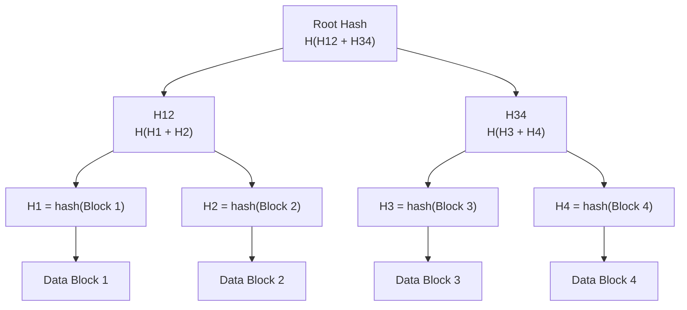
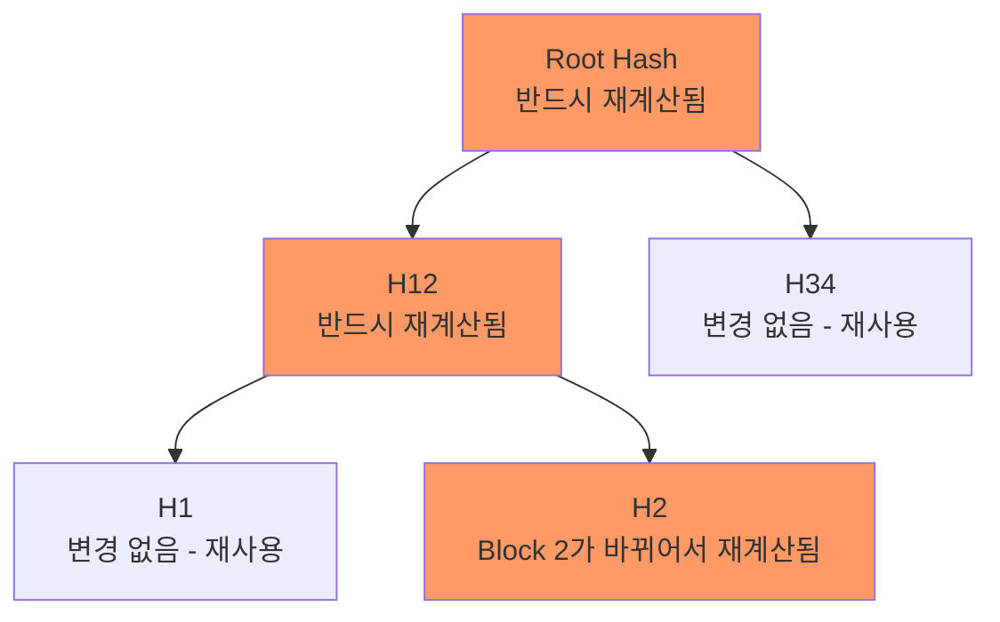
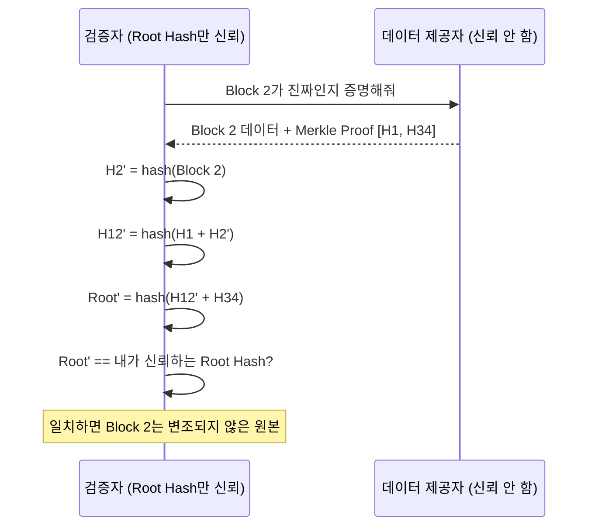

## Merkle Tree(해시 트리)란 무엇인가

**Merkle Tree(머클 트리)** 는 대량의 데이터를 블록 단위로 나누고, 각 블록의 해시값들을 이진 트리 형태로 계속 묶어 올려 **단 하나의 루트 해시(root hash)** 로 전체 데이터셋의 무결성을 표현하는 자료구조다. 1979년 Ralph Merkle 이 전자 서명 시스템을 위해 고안했다.

구조는 단순하다.

- **리프 노드(leaf node)**: 각 데이터 블록을 해시 함수(SHA-256 등)로 해싱한 값
- **내부 노드(internal node)**: 자식 노드 두 개의 해시값을 이어붙여(concatenate) 다시 해싱한 값
- **루트 노드(root hash / Merkle root)**: 트리 꼭대기의 단일 해시값. 이 값 하나가 트리 전체(즉 원본 데이터 전체)의 "지문(fingerprint)" 역할을 한다



### 왜 굳이 트리 구조로 묶는가

가장 단순한 대안은 "전체 데이터를 통째로 한 번 해싱"하는 것이다. 이것도 무결성 검증에는 쓸 수 있지만 두 가지 근본적인 한계가 있다.

1. **부분 변경 검증에 전체 재해싱이 필요하다.** 1GB 파일 중 4KB 만 바뀌어도, 단일 해시 방식은 1GB 를 처음부터 다시 읽어 해싱해야 변경 여부를 알 수 있다.
2. **부분 검증(partial verification)이 불가능하다.** "이 특정 블록이 원본의 일부가 맞다" 는 것을 증명하려면 전체 데이터를 가지고 있어야 한다. 데이터 전체를 신뢰할 수 없는 소스에서 받아오는 중이라면, 일부만 받은 시점에는 그 일부가 맞는지 확인할 방법이 없다.

Merkle Tree 는 이 두 문제를 모두 로그 시간(log time) 연산으로 해결한다.

## Merkle Tree 가 유용한 이유

### 1. 변경 감지가 O(log n) 이다

블록 하나가 바뀌면, 그 블록에서 루트까지 이어지는 경로상의 해시들만 다시 계산하면 된다. 나머지 가지(branch)는 그대로 재사용 가능하다. n 개의 리프가 있는 이진 트리의 높이는 log₂(n) 이므로, 변경 하나를 반영하는 데 필요한 재계산 비용은 O(log n) 이다.



### 2. 부분 검증(Merkle Proof)이 가능하다

전체 데이터셋을 갖고 있지 않아도, **루트 해시 하나만 신뢰할 수 있다면** 특정 블록 하나가 원본의 일부임을 증명할 수 있다. 검증자는 해당 리프부터 루트까지 경로에 필요한 형제 노드(sibling)들의 해시값만 받으면 된다 — 이를 **Merkle Proof(머클 증명)** 라 한다. 증명에 필요한 데이터 양도 O(log n) 이다.

예를 들어 위 그림에서 "Block 2 가 진짜 원본의 일부다" 를 증명하려면, 검증자는 `H1`, `H34`, 그리고 신뢰하는 `Root Hash` 만 있으면 된다: `H(H1 + hash(Block2))` 를 계산해 `H12` 를 얻고, 다시 `H(H12 + H34)` 를 계산해 나온 결과가 신뢰하는 `Root Hash` 와 일치하는지만 확인하면 된다. 4개 블록 전체를 내려받을 필요가 없다.



### 3. 전체 데이터를 신뢰하지 않고도 무결성을 계층적으로 위임할 수 있다

루트 해시 하나만 안전한 경로(예: 서명, 하드웨어에 각인된 값)로 전달되면, 그 아래 나머지 트리 전체는 신뢰할 수 없는 채널(P2P 네트워크, 일반 디스크 블록 등)로 전달되어도 무결성을 검증할 수 있다. 이 특성이 아래 실제 사용처들의 공통 전제다.

## 구현 개념 예시

```python
import hashlib

def h(data: bytes) -> bytes:
    return hashlib.sha256(data).digest()

def build_merkle_tree(blocks: list[bytes]) -> list[list[bytes]]:
    """레벨 0(리프)부터 루트까지 각 레벨의 해시 리스트를 반환"""
    level = [h(b) for b in blocks]
    tree = [level]
    while len(level) > 1:
        if len(level) % 2 == 1:
            level.append(level[-1])  # 홀수개면 마지막 노드를 복제(구현마다 규칙 다름)
        next_level = [h(level[i] + level[i + 1]) for i in range(0, len(level), 2)]
        tree.append(next_level)
        level = next_level
    return tree

blocks = [b"block1", b"block2", b"block3", b"block4"]
tree = build_merkle_tree(blocks)
root_hash = tree[-1][0]
print(root_hash.hex())
```

## 실제 사용처

- **Git**: 커밋 히스토리 자체가 Merkle DAG(트리를 일반화한 유향 비순환 그래프)다. 각 커밋 해시는 트리(디렉토리 스냅샷) 해시와 부모 커밋 해시를 포함하므로, 커밋 하나의 해시가 바뀌면 그 뒤를 잇는 모든 커밋 해시가 연쇄적으로 바뀐다 — 히스토리 변조가 즉시 드러나는 이유다.
- **BitTorrent**: 파일을 여러 조각(piece)으로 나눠 여러 피어로부터 동시에 받는데, 각 조각을 Merkle Tree(또는 단순 해시 리스트)로 검증해 특정 피어가 보낸 조각이 손상되거나 변조되지 않았는지 조각 단위로 확인한다.
- **블록체인(Bitcoin, Ethereum)**: 블록 헤더에 그 블록에 포함된 모든 트랜잭션의 Merkle root 만 저장한다. 라이트 클라이언트는 블록 전체를 내려받지 않고도 Merkle Proof 만으로 "특정 트랜잭션이 이 블록에 포함되어 있다" 를 검증할 수 있다(SPV, Simplified Payment Verification).
- **dm-verity(Linux Device Mapper)**: 읽기 전용 블록 디바이스의 각 블록을 리프로 하는 Merkle Tree 를 구성하고, 루트 해시 하나만 별도의 신뢰 경로(부트로더 서명 등)로 검증한다. 자세한 내용은 [[device-mapper-and-dm-verity]] 참고.
- **Certificate Transparency(CT)**: 발급된 모든 TLS 인증서를 append-only Merkle Tree 로그에 기록해, 특정 인증서가 로그에 포함되어 있는지(inclusion proof) 그리고 로그가 과거 상태에서 일관되게 확장되었는지(consistency proof)를 누구나 검증 가능하게 만든다.

## 연결 문서

- [[device-mapper-and-dm-verity]] - dm-verity 가 Merkle Tree 를 블록 디바이스 무결성 검증에 적용하는 구체적 사례
- [[root-of-trust-and-chain-of-trust]] - Merkle root 자체를 "신뢰의 시작점" 과 어떻게 연결하는지
