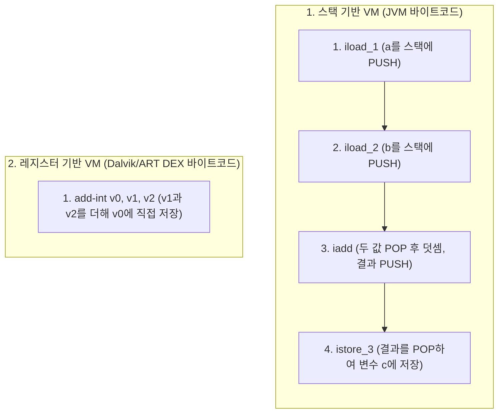
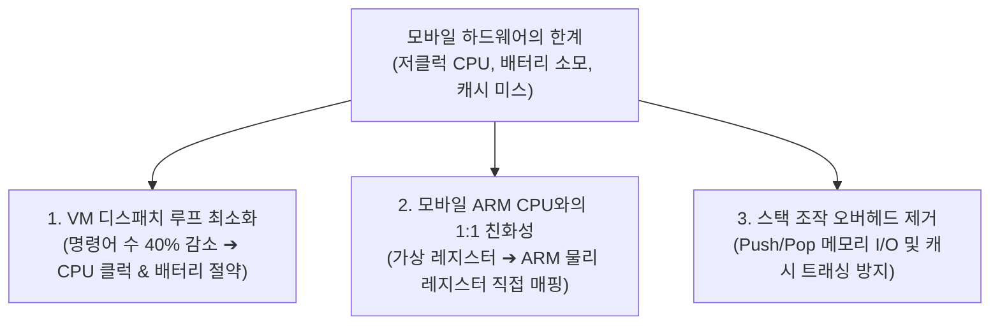

## Stack-based VM vs Register-based VM (가상 머신 실행 모델 비교)

가상 머신(Virtual Machine)이 바이트코드(Bytecode) 명령어를 해석하고 실행할 때 **연산 대상(피연산자)과 중간 결과를 어디에 두고 어떻게 처리하는가**를 결정하는 소프트웨어 아키텍처의 두 가지 핵심 패러다임이다.

Java 의 표준 **JVM(HotSpot)** 은 **스택 기반(Stack-based)** 가상 머신이고, Android 의 **Dalvik 및 ART (Android Runtime)** 는 **레지스터 기반(Register-based)** 가상 머신이다.

---

### 💡 가장 흔한 오해 바로잡기: 하드웨어 vs 가상 머신

>**오해**: "레지스터는 CPU 하드웨어의 초고속 기억장치이고, 스택은 RAM 메모리의 영역이므로, 하드웨어 장치의 차이다?"
>
>**진실**: 여기서 말하는 스택과 레지스터는 물리적인 CPU 칩셋/RAM 의 하드웨어가 아니라, **소프트웨어로 가상화된 가상 머신(VM) 내부의 논리적 실행 모델**이다.
> - **스택 기반 VM**: VM 메모리 내에 **가상의 피연산자 스택(Operand Stack)** 을 만들어 두고 값을 Push / Pop 하며 계산한다.
> - **레지스터 기반 VM**: VM 메모리 내에 **가상의 레지스터 배열(`v0`, `v1`, `v2`…)** 을 만들어 두고 레지스터 간 직접 대입/연산하며 계산한다.

---

### 1. 두 가상 머신의 동작 메커니즘 비교 (`c = a + b`)

`c = a + b` (예: `int a = 10; int b = 20; int c = a + b;`) 연산을 수행할 때 두 VM 의 바이트코드 생성과 실행 차이는 다음과 같다:



#### (1) 스택 기반 VM (JVM)

```text
iload_1          // 지역 변수 1(a)을 피연산자 스택에 Push (스택: [10])
iload_2          // 지역 변수 2(b)를 피연산자 스택에 Push (스택: [10, 20])
iadd             // 스택에서 20과 10을 Pop하여 더한 뒤 결과 30을 Push (스택: [30])
istore_3         // 스택에서 30을 Pop하여 지역 변수 3(c)에 저장 (스택: [])
```
- **명령어 수**: **4 개**
- **특징 (0-Address)**: 명령어 자체에 연산 대상의 주소나 레지스터 번호를 적지 않는다. 항상 \"스택 맨 위(Top of Stack)\"를 암시적으로 가리키므로 각 명령어 바이트가 1 바이트(Opcode)로 매우 작다.

#### (2) 레지스터 기반 VM (Dalvik / ART)

```text
add-int v0, v1, v2   // 가상 레지스터 v1(a)과 v2(b)의 값을 더해 v0(c)에 바로 저장!
```
- **명령어 수**: **단 1 개**
- **특징 (3-Address)**: 목적지 레지스터(`v0`)와 소스 레지스터(`v1`, `v2`)를 명시한다. 명령어 하나의 길이는 길어지지만(보통 2~4 바이트), 연산에 필요한 총 명령어 수가 극적으로 줄어든다.

---

### 2. 스택 기반 vs 레지스터 기반 종합 비교 매트릭스

| 비교 항목 | 스택 기반 가상 머신 (JVM, WebAssembly) | 레지스터 기반 가상 머신 (Android Dalvik/ART, Lua VM) |
| :--- | :--- | :--- |
| **대표 가상 머신** | Oracle HotSpot JVM, Python CPython, WASM | **Android Dalvik / ART**, Lua VM, LLVM IR |
| **연산 데이터 위치** | 피연산자 스택 (Operand Stack) | 가상 레지스터 세트 (`v0`, `v1`, `v2`…) |
| **명령어 주소 형식** | 0- 주소 형식 (Top of Stack 암시) | 2- 주소 또는 3- 주소 형식 (명시적 레지스터 지정) |
| **명령어 개수 (Count)** | **많음** (연산당 3~4 배의 명령어 필요) | **적음 (스택 대비 30~50% 감소)** |
| **개별 명령어 크기** | 작음 (대부분 1 바이트 Opcode) | 큼 (레지스터 인덱스 포함으로 2~4 바이트) |
| **VM 디스패치 오버헤드** | **큼** (명령어마다 fetch/decode 루프 반복) | **매우 작음** (디스패치 횟수 최소화) |
| **하드웨어 CPU 매핑** | 복잡함 (물리 레지스터 할당 컴파일 비용 큼) | **매우 자연스러움 (ARM CPU 물리 레지스터와 1:1 대응)** |
| **컴파일러 구현 난이도** | 쉬움 (식 트리 순회로 바이트코드 생성 용이) | 다소 복잡 (레지스터 할당 알고리즘 필요) |

---

### 3. Android 가 레지스터 기반(Dalvik/ART)을 선택한 3 대 결정적 이유

Android OS 가 설계되던 2008 년 당시의 스마트폰 환경은 **200~400MHz 싱글코어 CPU, 64~128MB RAM, 극도로 부족한 배터리 용량**이라는 가혹한 하드웨어 제약을 가지고 있었습니다. Google 이 표준 JVM 의 스택 머신을 버리고 Dalvik 레지스터 머신을 자체 개발한 이유는 다음과 같습니다:



#### ① 명령어 수 대폭 감소 ➔ CPU 사이클 및 배터리 절약

- 가상 머신 인터프리터는 바이트코드 하나를 실행할 때마다 **[명령어 읽기(Fetch) ➔ 해석(Decode) ➔ 디스패치(Dispatch) ➔ 실행]** 의 무거운 CPU 루프를 돕니다.
- 스택 기반 VM 은 덧셈 하나에 이 루프를 4 번 돌아야 하지만, 레지스터 기반 VM 은 **단 1 번**만 돕니다.
- 전체 앱 코드에서 실행해야 하는 총 VM 명령어 수가 30~50% 줄어들기 때문에, **CPU 클럭 낭비가 억제되고 모바일 기기의 배터리 수명이 획기적으로 연장**됩니다.

#### ② 실제 모바일 하드웨어(ARM CPU)와의 완벽한 1:1 매핑

- 스마트폰에 탑재되는 **ARM CPU**는 다수의 범용 하드웨어 레지스터(ARM32: 16 개, ARM64: 31 개)를 보유한 전형적인 **레지스터 하드웨어 머신**입니다.
- JVM 의 스택 기반 바이트코드를 ARM 머신 코드로 번역하려면 피연산자 스택 구조를 분석하여 하드웨어 레지스터로 변환하는 복잡하고 무거운 컴파일러 최적화가 필요합니다.
- 반면 Dalvik/ART 의 가상 레지스터(`v0`, `v1`, `v2`)는 **ART JIT 및 AOT(`dex2oat`) 컴파일러가 ARM 물리 레지스터(`r0`, `r1`, `x0`, `x1`)로 1:1 에 가깝게 직관적으로 매핑(Linear Scan Register Allocation)** 할 수 있습니다. 이로 인해 컴파일 속도가 빠르고 생성되는 네이티브 머신 코드의 실행 효율이 극대화됩니다.

#### ③ 불필요한 스택 메모리 복사 및 캐시 트래싱(Cache Thrashing) 방지

- 스택 머신은 모든 계산 중간값을 스택 메모리에 Push/Pop 하면서 스택 포인터(SP)를 계속 수정하고 메모리 쓰기를 유발합니다.
- 레지스터 머신은 메서드 호출 시 할당된 연속된 레지스터 프레임 슬롯 안에서 값을 즉시 재활용하므로, 불필요한 메모리 복사가 없고 CPU L1/L2 데이터 캐시 적중률(Cache Locality)이 우수합니다.

---

### 4. 연관 문서 및 정본 링크

- [D8 과 R8 컴파일러 및 덱싱 메커니즘](../../01_inbox/mobile/android/03_packaging_deployment/optimization/d8-and-r8.md)
- [메모리 계층 구조 및 캐시 지역성](./memory-layout-and-cache.md)
- [Android 런타임 진화와 ART 실행 엔진](../../01_inbox/mobile/android/01_system_internals/boot-and-runtime/art-runtime-evolution.md)
