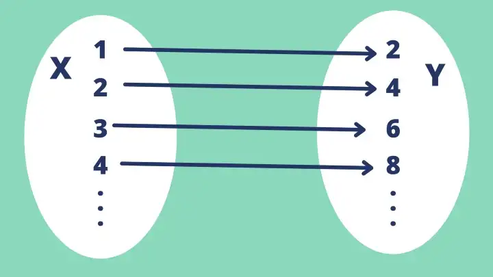
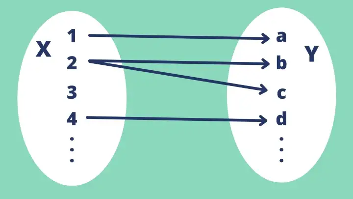

## Motive

> keep the computation and business logic pure and free from side effects.

All of the API calls, database transactions and stuff with side effects move towards the external layer of the application

## Mathematical Functions

In Mathematics, functions are mappers i.e., they map inputs to outputs

### Total Function

> A function defined for all its inputs



### Partial Function

> A function that is not defined for some of its inputs



## Pure function

> A function that is deterministic(always giving same output) and has no side effects.

### Feature 1: deterministic

giving always same output

```dart
void main() {
  final _result = doubleValue(5);
  assert(_result == 10);
}

int doubleValue(int value) => value*2;
```

### Feature 2: has no side effect

not dealing with external states

has side effect

```dart
void main() {
  greetImpure();
  name = "Bob";
  greetImpure();
}

String name = "John";

void greetImpure() => "Hello, $name";
```

has no side effect

```dart
void main() {
  greet("John");
  greet("Bob");
}

void greetImpure(String name) => "Hello, $name";
```

more example

```dart
DateTime getDateTime() => DateTime.now(); // impure

int add(int a, int b) => a+b; // pure

int getRandomNumber() => Random().nextInt(100); // impure

int? double2(int value) {
  if (value == 1) return 2;
  if (value == 2) return 4;
  if (value == 3) return 6;
} // total, pure

int counter = 0;

int increment(int delta) => (counter++) + delta; // total, impure

// total(if divider == 0, the function will return double.infinity)
num totalDivide(int dividend, int divider) => dividend / divider;

// partial(if divider == 0, the function will throw exception)
num partialDivide(int dividend, int divider) => dividend ~/ divider;
```

### Benefits

1. pure function is easy to unit-test
2. the chances of unexpected bugs reduce
3. pure function provides caching mechanisms that help in reducing heavy computation
4. pure function is easy to parallelize

### Referential transparency

> a function call can be reduced by its return value and not affect the rest of the program

another way to determine if a function is pure

## Difference between parameter and argument

### Parameter

> part of function declaration

### Argument

> values passed to function

## Arity

> the number of arguments a function takes

```dart
int increment(int number) => number+1; // arity: 1(unary)

int add(int numberOne, int numberTwo) => numberOne + numberTwo;// arity: 2(binary)

DateTime now() => DateTime.now()// arity: 0(nullary);

bool isOdd(int number) => number %2 == 1;// arity: 1(unary), predicate function(a function that returns a boolean value)
```

## Closure

> when a function is defined into another function, that inner function remembers the scope of the outer function even if the outer function is executed and no longer available

```dart
typedef IntCallback = int Function(int number);

void main() {
 final _firstFnResult = _firstFunction();
 _firstFnResult();

 final _increment = add(1);
 print(_increment(2));
}

Function _firstFunction() {
 final _someValue = 'First function scope';

 void _secondFunction() {
  print(_someValue);
 }

 return _secondFunction;
}

IntCallback add(int a) {
 return (int b) {
  return a+b;
 }
}
```

## Partial Application

> a function applied to some of its inputs

closure helps us to achieve partial application

idea: lock in some of the parameters, so we don't have to pass them repeatedly

The `add` function above needs two arguments in series to return the result, but we have passed a single argument and assigned it to the `_increment` variable. We have not given all the arguments; we have partially applied the function.

## Point-free style

> a function without needing to pass in the arguments explicitly

```dart
void main() {
 const _numbers = [1,2,3,4,5];
 // not point free
 final result1 = _numbers.map((e)=>increment(e)).toList();
 // point free
 final results = _numbers.map(increment).toList();
}

int increment(int number) => number+1;
```

## Currying

> Breaking down a multi-argument function into a series of single-argument functions

```dart
void main(List‹String> args) {
 // Non curried
 print(greet('Hello', 'Noah')); // Hello Noah
 // Curried
 print(curriedGreet('Hello')('Noah')); // Hello Noah
}

String greet(String salutation, String name) = '$salutation $name*';

typedef StringCallback = String Function(String name);

// to nested? consider packages like dartz, fpdart
StringCallback curriedGreet(String salutation) {
 return (String name) {
  return '$salutation $name';
 }
}
```

## Currying vs Partial Application

> The partial application can take more than one argument at a time,
> whereas the curried function always has to return a unary function

Curried functions are used to create partial applications, but all partial applications are not curried functions.

## Composition

> a pipeline through which the data flows

In FP, small general-purpose functions are defined and they can be combined to make complex functions. The output of one function becomes the input of another function, and so on. The input gets passed from function to function and finally returns the result.

The matematical notation: `f.g`

Programming notation: `f(g(x))`

```dart
Function compose(Function f, Function g) => (x) => f(g(x));
```

the order of execution for compositions is right to left(g => f)

```dart
import 'package:dartz/dartz.dart';

void main(List<String> args) {
 final _shout = compose(exclaim,toUpper);
 print(_shout('Ouch! that hurts')); // "OUCH! THAT HURTS!"
 // Dartz
 final _shout2 = composeF<String, String, String>(exclaim, toUpper);
 print(_shout2( 'Ouch! that hurts')); // "OUCH! THAT HURTS!"
}

String topper(String value) = value.toUpperCase();
String exclaim(String value) = '$value!';

Function compose(Function f, Function g) => (x) => f(g(x));
```

Flutter framework is one of the best example that demonstrate the power of composition.

```dart
// if you want to add some decoration, combine the widget with a [DecoratedBox]

...
DecoratedBox(
 decoration:BoxDecoration(...),
 child: someWidget,
),
...
```

## Compose vs Pipe

FP has similar an utility called pipe like composition. The only difference is that compose performs a right to left execution, and a pipe performs a left to right execution order.

```dart
void main(List<String> args) {
 final _compose = compose(doubler, increment);
 final _pipe = pipe(doubler, increment);
 print(_compose (10)); // 22
 print(_pipe(10)); // 21
}

int increment(int value) = value + 1;
int doubler(int value) = value * 2;

// Order of composition is from right to left.
Function compose(Function f, Function g) =>(x) => f(g(x));
// Order of composition is from left to right.
Function pipe(Function f, Function g) => (x) => g(f(x));
```

## Immutability

> something that cannot be changed

<-> mutability

(Since it does not sound much sense,) what is the use of an application that does not change its state?

## final vs const

Both value cannot be modified after being set

### final

> `final` variable is evaluated at runtime

### const

> `const` variable is compile-time constant and is implicitly final

## Why prefer immutability

- Fewer bugs: Immutability helps to avoid accidental reassignments.
- Code becomes predictable and easier to read
- As `const` evaluates at compile-time, the compiler knows the value in advance and stores it in the memory. The exact value is referred to throughout the application instead of creating new objects every time. So this helps to save some memory and has small performance benefits.

## How to update immutable states

> Instead of changing values, create of a copy of the instance we need to access and use it

eg. copyWith()

```dart
void main(List<String> args) {
 final user = User(name: 'John', age: 18);
 print(_user); // User(name; 'John', age: 18)
 final _newUser = _user. copyWith(age: 20);
 print(_newUser); // User(name: 'John', age: 20)
}

class User {
 final String name;
 final int age;

 const User({required this.name, required this.age});

 User copyWith({
  String? name,
  int? age,
 }) =>
  User(
   name: name ?? this. name,
   age: age ?? this.age,
  );

 @override
 String toString() = 'User(name: $name, age: $age)';
}
```

### Immutable lists, Maps

```dart
void main() {
  final _finalList = [1, 2, 3];
  const _constList = [1, 2, 3];

  final _list = List<int>.unmodifiable([]);

  final _map = Map<String, int>.unmodifiable(
    <String, int>{
      "a": 1,
      "b": 2,
      "c": 3,
    },
  );

  _finalList.add(5);
  // _constList.add(5); // Unsupported operation: Cannot add to an unmodifiable list

  // _list.add(5); // Unsupported operation: Cannot add to an unmodifiable list
  // _map["d"] = 4; // Unsupported operation: Cannot add to an unmodifiable map
}

```

`const` list throws exception at runtime. if you want to check this at compile time, recommend something like `IList` in `dartz`

## Equality

> check if two objects are equal by using the `==` operator

- Referential equality: two objects refer to the same object
- Value equality: both two objects have the same value

## Recursion

> when a function calls itself again and again until a specific condition is met

- Base Condition: acts as an exit point for the recursive function. it is used to stop the recursive function calls.
- Recursive Condition: the place where the function keeps calling itself again and again

```dart
void main(List<String> args) {
 final _recursiveSumResult = _recursiveSum(5);
 print(_recursiveSumResult); // 15
}

// recursion is declarative then iteration
int _recursiveSum(int number) {
 if (number = 0) return 0;
 return number + _recursiveSum(number - 1);
}
```

## Iteration vs Recursion

> Iteration is imperative, and recursion is declarative

Iteration has to mange state, so it's stateful.

Recursion is self-referencing and stateless, which makes debugging easier. It is subjective, but recursion makes the code look more clean and elegant.

Reading and making sense of a code is easier when it is declarative. Whereas in imperative, one can not just look at the code and tell what exactly it is doing; one has to execute it at least mentally and then understand what the code does.

### Performance

> Recursive functions are not as efficient as iterative ones

How to make recursive functions scalable and performant? -> Memoization

## Higher-Order Function(HOF)

> A function that takes a function as an argument or returns a function.

It is possible when functions are treated as first-class citizens.

### higher order functions: filter

> The filter takes a predicate function and an array and returns a new list with only those values for which the predicate function returns true.

```dart
const _arr = [1, 2, 3, 4, 5, 6, 7, 8, 9, 10];
void main(List<String> args) {
 // Imperative approach
 final _result = <int>[];
 for (final element in _arr) {
  if (element.¡sEven) {
   _result.add(element) ;
  }
 }

 print (_result); // [2, 4, 6, 8, 10]
 // Declarative approach; where in Dart lists
 final _result2 = _arr.where((element) => element.isEven).toList() ;
 print(_result2); // [2, 4, 6, 8, 10]
 // Declarative approach: Functional API
 final _evens = filter<int>(isEven, _arr);
 print(_evens); // [2, 4, 6, 8, 10]
 final _odds = filter<int>(isOdd, _arr);
 print(_odds); // [1, 3, 5, 7, 9]
}
bool isEven(int number) = number % 2 = 0;
bool isOdd(int number) = !isEven(number);
```

### higher order functions: map

> The map works the same way as a filter, except that instead of taking a predicate function, it takes a mapper function, applies it to each element from the list, and returns a new list.

```dart
import '../utilities/utilities.dart';

const _arr = [1, 2, 3, 4, 5, 6, 7, 8, 9, 10];

 void main(List<String> args) {
 
 // Imperative approach
 
 final _result = <int>[];
 
 for (final element in _arr) {
 
  _result.add(element * 2);
 
 }
 
 print(_result); // [2, 4, 6, 8, 10, 12, 14, 16, 18, 20]
 
 // Declarative approach: map method in Dart lists
 
 final _result2 = _arr.map((element) => element * 2).toList();
 
 print(_result2); // [2, 4, 6, 8, 10, 12, 14, 16, 18, 20]
 
 // Declarative approach: Functional API
 
 final _doubles = map<int>(doubleIt, _arr);
 
 print(_doubles); // [2, 4, 6, 8, 10, 12, 14, 16, 18, 20]

}

int doubleIt(int number) => number * 2;
```

### higher order functions: flatMap

> The **flatMap** takes a function and applies it to every element in the collection, and its sub-collection. After mapping, it flattens the list.

```dart
import 'package:dartz/dartz.dart';

// Flatten: Returns a new collection by taking every element in the collection, and it's subcollection and putting everything into a new collection with single depth.

// Example: [1, 2, [3, 4], 5, [6, 7, [8, 9]]] => [1, 2, 3, 4, 5, 6, 7, 8, 9]

// flatMap: is a combination of map and flatten. It takes a function and applies it to every element in the collection, and it's subcollection. After mapping, it flattens the result.

final _arr = IList.from([

1,

2,

IList.from([3, 4]),

5,

IList.from([6, 7, 8]),

9

]);

const _normalArr = [

1,

2,

[3, 4],

5,

[6, 7, 8],

9

];

/// [_arr] is a nested list and lets assume we get such a list from an API \

/// But, we want to flatten it to a single list of integers. \

void main(List<String> args) {

// IList from the dartz package

final _result = _arr.flatMap<int>(

(a) {

if (a is IList<int>) return a;

if (a is int) return IList.from([a]);

return IList.from([]);

},

);

print(_result);

// Dart List

final _result2 = _normalArr.expand<int>((a) {

if (a is List<int>) return a;

if (a is int) return [a];

return [];

}).toList();

print(_result2);

}
```

### higher order functions: reduce

> It reduces a collection into a single value by combining all the elements using the passed-in function.

```dart
// Sum all the numbers in the list

import '../utilities/utilities.dart';

const _arr = [1, 2, 3, 4, 5, 6, 7, 8, 9, 10];

void main(List<String> args) {

final _imperativeResult = _sumAllImperative(_arr);

print(_imperativeResult); // 55

final _sumAllReduceResult = _sumAllReduce(_arr);

print(_sumAllReduceResult); // 55

final _sumAllFoldResult = _sumAllFold(_arr);

print(_sumAllFoldResult); // 55

// Functional API

final _result = reduce<int>(

(accumulator, element) => accumulator + element,

_arr,

0,

);

print(_result); // 55

}

// Imperative approach

int _sumAllImperative(List<int> arr) {

int _sum = 0;

for (final item in arr) {

_sum += item;

}

return _sum;

}

// Declarative approach

/// Reduce Implementation \

/// Reduces the [Iterable] to a single value. \

/// In step 1, accumulator is set to the first element of the [Iterable]. \

/// For every other steps, Accumulator is the result of the previous reduction. \

/// Input: [0, 1, 2, 3, 4, 5] \

/// Step 1: Accumulator = 0 & element = 1 | accumulator + element = 1 \

/// Step 2: Accumulator = 1 & element = 2 | accumulator + element = 3 \

/// Step 3: Accumulator = 3 & element = 3 | accumulator + element = 6 \

/// Step 4: Accumulator = 6 & element = 4 | accumulator + element = 10 \

/// Step 5: Accumulator = 10 & element = 5 | accumulator + element = 15 \

int _sumAllReduce(List<int> arr) => arr.reduce(

(accumulator, element) => accumulator + element,

);

/// Fold Implementation \

/// Fold is similar to reduce, but we can pass in the initial value of the accumulator. \

int _sumAllFold(List<int> arr) => arr.fold(

0,

(accumulator, element) => accumulator + element,

);
```
