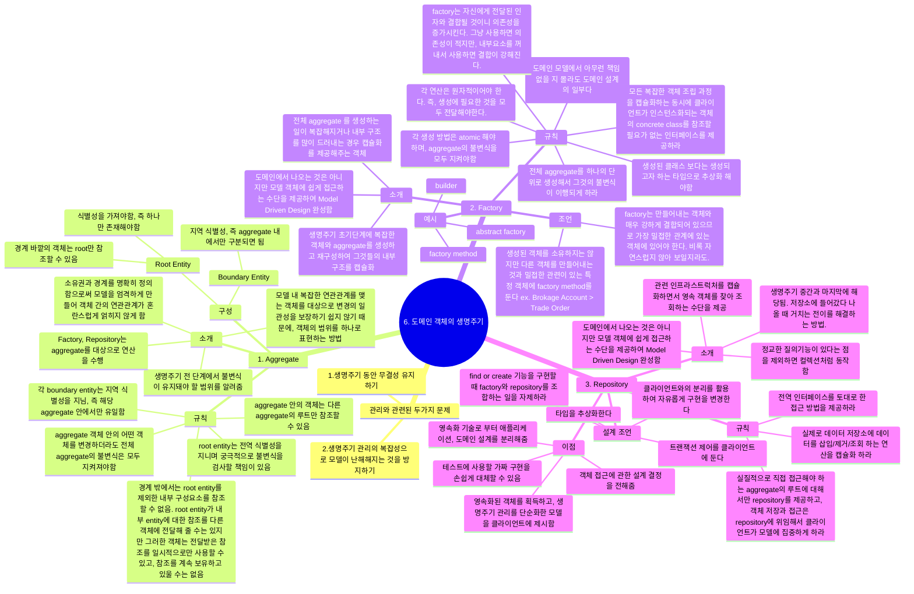

```mermaid
mindmap
  root((6\. 도메인 객체의 생명주기))
    관리와 관련된 두가지 문제
      1\.생명주기 동안 무결성 유지하기
      2\.생명주기 관리의 복잡성으로 모델이 난해해지는 것을 방지하기
    1\. Aggregate
      소개
        생명주기 전 단계에서 불변식이 유지돼야 할 범위를 알려줌
        소유권과 경계를 명확히 정의함으로써 모델을 엄격하게 만들어 객체 간의 연관관계가 혼란스럽게 얽히지 않게 함
        모델 내 복잡한 연관관계를 맺는 객체를 대상으로 변경의 일관성을 보장하기 쉽지 않기 때문에, 객체의 범위를 하나로 표현하는 방법
        Factory, Repository는 aggregate를 대상으로 연산을 수행 
      구성
        Root Entity
          식별성을 가져야함, 즉 하나만 존재해야함
          경계 바깥의 객체는 root만 참조할 수 있음
        Boundary Entity
          지역 식별성, 즉 aggregate 내에서만 구분되면 됨
      규칙
        root entity는 전역 식별성을 지니며 궁극적으로 불변식을 검사할 책임이 있음
        각 boundary entity는 지역 식별성을 지님, 즉 해당 aggregate 안에서만 유일함
        경계 밖에서는 root entity를 제외한 내부 구성요소를 참조할 수 없음. root entity가 내부 entity에 대한 참조를 다른 객체에 전달해 줄 수는 있지만 그러한 객체는 전달받은 참조를 일시적으로만 사용할 수 있고, 참조를 계속 보유하고 있울 수는 없음
        aggregate 객체 안의 어떤 객체를 변경하더라도 전체 aggregate의 불변식은 모두 지켜져야함
        aggregate 안의 객체는 다른 aggregate의 루트만 참조할 수 있음
    2\. Factory
      소개
        전체 aggregate 를 생성하는 일이 복잡해지거나 내부 구조를 많이 드러내는 경우 캡슐화를 제공해주는 객체
        생명주기 초기단계에 복잡한 객체와 aggregate를 생성하고 재구성하여 그것들의 내부 구조를 캡슐화
        도메인에서 나오는 것은 아니지만 모델 객체에 쉽게 접근하는 수단을 제공하여 Model Driven Design 완성함
      규칙
        복잡한 객체와 aggregate의 인스턴스를 생성하는 책임을 별도의 객체로 옮겨라 (도메인 모델에서 아무런 책임 없을 지 몰라도 도메인 설계의 일부다)
        모든 복잡한 객체 조립 과정을 캡슐화하는 동시에 클라이언트가 인스턴스화되는 객체의 concrete class를 참조할 필요가 없는 인터페이스를 제공하라
        전체 aggregate를 하나의 단위로 생성해서 그것의 불변식이 이행되게 하라
        각 생성 방법은 atomic 해야 하며, aggregate의 불변식을 모두 지켜야함
        생성된 클래스 보다는 생성되고자 하는 타입으로 추상화 해야함
        각 연산은 원자적이어야 한다. 즉, 생성에 필요한 것을 모두 전달해야한다.
        factory는 자신에게 전달된 인자와 결합될 것이니 의존성을 증가시킨다. 그냥 사용하면 의존성이 적지만, 내부요소를 꺼내서 사용하면 결합이 강해진다.
      조언
        생성된 객체를 소유하지는 않지만 다른 객체를 만들어내는 것과 밀접한 관련이 있는 특정 객체에 factory method를 둔다 ex. Brokage Account > Trade Order
        factory는 만들어내는 객체와 매우 강하게 결합되어 있으므로 가장 밀접한 관계에 있는 객체에 있어야 한다. 비록 자연스럽지 않아 보일지라도.
      예시
        abstract factory
        factory method
        builder
    3\. Repository
      소개
        생명주기 중간과 마지막에 해당됨. 저장소에 들어갔다 나올 때 거치는 전이를 해결하는 방법.
        관련 인프라스트럭처를 캡슐화하면서 영속 객체를 찾아 조회하는 수단을 제공
        도메인에서 나오는 것은 아니지만 모델 객체에 쉽게 접근하는 수단을 제공하여 Model Driven Design 완성함
        정교한 질의기능이 있다는 점을 제외하면 컬렉션처럼 동작함
      규칙
        전역 인터페이스를 토대로 한 접근 방법을 제공하라
        실제로 데이터 저장소에 데이터를 삽입/제거/조회 하는 연산을 캡슐화 하라
        실질적으로 직접 접근해야 하는 aggregate의 루트에 대해서만 repository를 제공하고, 객체 저장과 접근은 repository에 위임해서 클라이언트가 모델에 집중하게 하라
      이점
        영속화된 객체를 획득하고, 생명주기 관리를 단순화한 모델을 클라이언트에 제시함
        영속화 기술로 부터 애플리케이션, 도메인 설계를 분리해줌
        객체 접근에 관한 설계 결정을 전해줌
        테스트에 사용할 가짜 구현을 손쉽게 대체할 수 있음
      설계 조언
        타입을 추상화한다
        클라이언트와의 분리를 활용하여 자유롭게 구현을 변경한다
        트랜잭션 제어를 클라이언트에 둔다
        find or create 기능을 구현할 때 factory와 repository를 조합하는 일을 자제하라
```