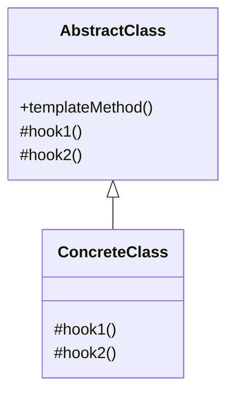

```mermaid
classDiagram
    AbstractClass <|--ConcreteClass
    class AbstractClass {
        +templateMethod()
        #hook1()
        #hook2()
    }
    
    class ConcreteClass {
        #hook1()
        #hook2()
    }
```