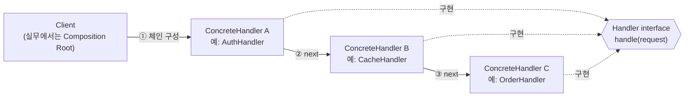
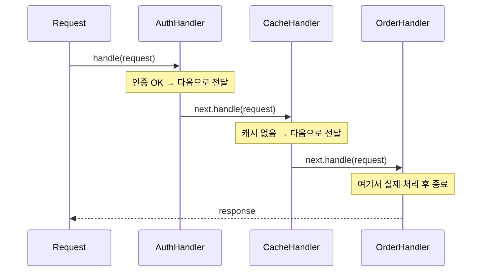
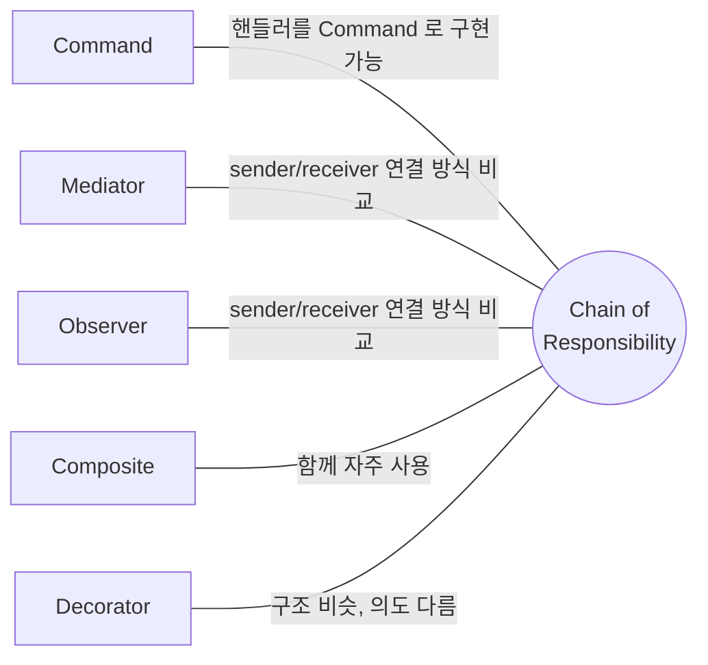

## Description

주문 API 하나를 만든다고 해보자. 처음엔 주문 저장 로직만 있으면 됐는데, 인증 체크, 관리자 권한 체크, brute-force 방지, 요청 검증(validation), 캐시 조회가 하나씩 추가되면서 `OrderController` 하나가 이 모든 관심사를 떠안게 됨. 기능 하나를 고치면 다른 기능에 영향을 주고, 순서를 바꾸고 싶어도 거대한 메소드 하나를 통째로 헤집어야 하는 게 문제.

**Chain of Responsibility Pattern** 은 요청을 처리할 수 있는 핸들러들을 사슬(Chain)처럼 연결해두고, 요청이 이 사슬을 따라 흐르게 만드는 행위 패턴. 각 핸들러는 요청을 직접 처리할지, 처리하지 않고 다음 핸들러로 넘길지를 스스로 결정함. 위 예시라면 `AuthHandler → CacheHandler → ValidationHandler → OrderHandler` 순으로 체인을 구성하고, 각 핸들러는 자기 몫만 처리한 뒤 다음으로 넘기면 됨.

- **핵심**: 요청을 처리할 수 있는 핸들러들을 체인으로 연결하고, 요청이 순서대로 핸들러를 거치며 처리되게 함.
- **목적**:
  1. 요청을 보내는 쪽(Sender)과 처리하는 쪽(Receiver)의 결합을 느슨하게 함.
  2. 핸들러의 추가/제거/순서 변경을 기존 코드 수정 없이 가능하게 함 ⇒ [OCP(Open Closed Principle)](../../solid/OCP(Open%20Closed%20Principle).md).
  3. 정확히 어떤 핸들러가 요청을 처리할지 컴파일 타임에 정해지지 않아도 되는 구조를 만듦.

## Examples

주문 API 예시를 조금 더 구체화하면 이렇게 됨. (아래 Structure 부터는 이 예시를 계속 이어서 씀.)

- **인증 미들웨어 없이 API 컨트롤러 여러 개에 인증 로직을 복붙**했다면, 인증 정책이 바뀔 때마다 모든 컨트롤러를 찾아 고쳐야 함. `AuthHandler` 하나를 체인 앞단에 두면 컨트롤러는 인증을 신경 쓸 필요가 없어짐.
- **캐시 조회**: `CacheHandler` 가 캐시에 값이 있으면 그대로 응답하고 체인을 끝냄. 없으면 다음 `ValidationHandler` 로 넘어감. 캐시 유무를 판단하는 조건문이 비즈니스 로직 안에 섞이지 않음.

다른 도메인에도 같은 구조가 쓰임 — **고객센터 티켓 라우팅**: 상담원 레벨 1 이 처리 못하면 레벨 2, 레벨 2 도 못하면 매니저에게 전달. 이 흐름을 조건문으로 짜면 레벨이 늘어날 때마다 분기가 늘어나지만, 체인이라면 핸들러 순서만 조정하면 됨.

## Structure



요청 하나가 체인을 타고 흐르는 흐름을 시퀀스로 그리면 아래와 같음.



```kotlin
interface Handler {
    fun handle(request: OrderRequest): OrderResponse
}

abstract class BaseHandler(private val next: Handler?) : Handler {
    override fun handle(request: OrderRequest): OrderResponse =
        next?.handle(request) ?: OrderResponse.NotHandled
}

class AuthHandler(next: Handler?, private val tokenStore: TokenStore) : BaseHandler(next) {
    override fun handle(request: OrderRequest): OrderResponse =
        if (!tokenStore.isValid(request.token)) OrderResponse.Unauthorized
        else super.handle(request) // 다음 핸들러로
}

class CacheHandler(next: Handler?, private val cache: Cache) : BaseHandler(next) {
    override fun handle(request: OrderRequest): OrderResponse =
        cache.get(request.id) ?: super.handle(request) // 캐시 없으면 다음 핸들러로
}
```

- **Handler**: 요청 처리를 위한 공통 인터페이스. 모든 핸들러가 `BaseHandler` 를 상속받는 구조라면 별도로 없어도 됨.
- **BaseHandler**: 다음 핸들러에 대한 참조를 갖고, `setNext`/기본 위임 동작 등 공통 보일러플레이트를 담당.
- **ConcreteHandler**: 요청을 실제로 처리하거나, 다음 핸들러로 넘기는 판단을 하는 클래스 (`AuthHandler`, `CacheHandler` 등). 초기화 이후에는 불변으로 유지하는 것이 보통.
- **Client**: 필요한 핸들러들을 원하는 순서로 엮어 체인을 구성하고 요청을 흘려보내는 쪽. 실무에서는 이 역할을 [Composition Root](../general/patterns/Composition%20Root.md) 가 담당하는 경우가 많음 — 아래 [Modern Applicability](#modern-applicability-di-composition-root) 참고.

## Adaptability

다음 상황에서 특히 유용함.

- 프로그램이 다양한 방식으로 다양한 종류의 요청을 처리해야 하지만, 정확한 요청 유형과 처리 순서를 미리 알 수 없는 경우.
- 여러 핸들러를 특정 순서로 실행해야 하는 경우.
- 핸들러 구성과 순서가 런타임에 바뀔 수 있어야 하는 경우.

## Pros

- **요청 처리 순서를 자유롭게 제어**할 수 있음: 핸들러를 엮는 순서만 바꾸면 되고, 각 핸들러 내부 로직은 건드릴 필요 없음.
- **호출하는 클래스와 실제 작업을 수행하는 클래스가 분리**됨 ⇒ [SRP(Single Responsibility Principle)](../../solid/SRP(Single%20Responsibility%20Principle).md). `OrderController` 는 더 이상 인증/캐시/검증을 직접 알 필요가 없음.
- **기존 코드를 건드리지 않고 새 핸들러를 추가**할 수 있음 ⇒ [OCP(Open Closed Principle)](../../solid/OCP(Open%20Closed%20Principle).md). Rate-limit 핸들러를 새로 추가해도 기존 `AuthHandler`, `CacheHandler` 는 수정하지 않음.

## Cons

- **요청이 처리된다는 보장이 없음**: 체인 끝까지 갔는데 아무도 처리하지 않으면 요청이 조용히 버려질 수 있음. 마지막에 기본 처리(default handler)를 두거나 명시적으로 예외를 던지는 안전장치가 필요함.
- **디버깅이 어려워질 수 있음**: 실제로 어떤 핸들러가 요청을 처리했는지 추적하려면 체인 전체를 따라가 봐야 함.

## Relationship with other patterns



| 비교 대상 | 공통점 | CoR 와의 차이 |
| :--- | :--- | :--- |
| [Command](Command%20Pattern.md), [Mediator](Mediator%20Pattern.md), [Observer](Observer%20Pattern.md) | 넷 다 요청의 발신자와 수신자를 연결하는 방식을 다룸 | CoR 은 잠재적 수신자들의 사슬을 따라 **순차적으로** 전달하다 하나가 처리하면 멈춤. Command 는 발신자·수신자 간 **단방향** 연결만 만듦. Mediator 는 발신자·수신자의 직접 연결을 없애고 **중재자를 거쳐** 통신하게 함. Observer 는 수신자가 **구독/구독 취소**를 동적으로 할 수 있게 함. |
| [Composite](../structural/Composite%20Pattern.md) | 트리 구조와 자주 함께 쓰임 | CoR 이 Composite 와 결합되면, leaf 컴포넌트가 받은 요청을 부모 체인을 따라 트리 루트까지 전달하는 식으로 쓰임. Composite 자체는 트리 구조를 정의하는 패턴이고, CoR 은 그 트리를 따라 요청을 흘려보내는 패턴. |
| [Decorator](../structural/Decorator%20Pattern.md) | 재귀적으로 객체를 연쇄시키는 구조가 비슷함 | CoR 의 핸들러들은 서로 독립적으로 임의의 작업을 수행하고, 아무 때나 요청을 다음으로 넘기지 않고 끝낼 수 있음. Decorator 는 기존 인터페이스를 유지하며 동작을 계속 덧붙이는 것이 목적이라, 중간에 처리를 끝내버리는 건 Decorator 의 의도가 아님. |

### CoR × Command 조합

Handler 자체를 [Command Pattern](Command%20Pattern.md) 으로 구현할 수도 있음. 무엇을 Command 로 만드느냐에 따라 정반대 효과가 남 — 이번에도 같은 주문 API 예시로 설명함.

- **핸들러를 Command 로 구현**: 같은 요청(주문 컨텍스트)이 체인을 따라가며 `AuthCommand → CacheCommand → ValidationCommand` 순서로 서로 다른 연산을 순서대로 적용받음 — 지금까지 본 CoR 구조 그대로. 다만 각 핸들러가 Command 이기 때문에, 실행 이력을 스택에 쌓아 특정 단계만 재시도하거나 로그를 남기는 것도 자연스럽게 가능해짐(순수 CoR 만으로는 추가 배관이 필요한 부분) — **"같은 대상에 여러 다른 작업을 순서대로"**.
- **요청 자체를 Command 로 구현**: 반대로 "이 주문을 결제해줘" 라는 `ProcessPaymentCommand` 객체 하나가 `PrimaryGatewayHandler → BackupGatewayHandler → ManualReviewHandler` 체인을 따라 흘러가며, 각기 다른 컨텍스트(결제 게이트웨이)에서 같은 커맨드 실행을 시도함. 주 결제 게이트웨이가 실패하면 백업 게이트웨이로, 그것도 실패하면 수동 검토로 자동 대체됨 — **"같은 작업을 여러 다른 대상에 순서대로 시도"**.

## Modern Applicability (DI/Composition Root)

[Composition Root](../general/patterns/Composition%20Root.md) 관점에서 CoR 은 **3 그룹: 여전히 설계의 핵심** 에 속함. 실무에서는 이 패턴이 사라지기는커녕, **HTTP 클라이언트의 Interceptor 체인**이라는 이름으로 거의 모든 네트워킹 라이브러리에 내장되어 있음.

**"그래도 결국 누군가는 concrete 를 알아야 하지 않나?"** 맞음. 다만 그 "누군가" 는 각 핸들러를 사용하는 코드가 아니라, 체인을 조립하는 지점 하나로 좁혀짐.

**Android 예시 (OkHttp + Metro)** — 인증 헤더 추가, 캐시, 로깅을 각각 Interceptor(=Handler) 로 분리하고, 어떤 Interceptor 를 어떤 순서로 묶을지는 Composition Root 가 결정.

```kotlin
interface Interceptor // OkHttp 의 Interceptor 도 사실상 CoR 의 Handler

@Inject class AuthInterceptor(private val tokenStore: TokenStore) : Interceptor
@Inject class CacheInterceptor(private val cache: Cache) : Interceptor
@Inject class LoggingInterceptor : Interceptor

@DependencyGraph(AppScope::class)
interface AppGraph {
    @Provides
    fun provideOkHttpClient(
        auth: AuthInterceptor,
        cache: CacheInterceptor,
        logging: LoggingInterceptor,
    ): OkHttpClient =
        OkHttpClient.Builder()
            .addInterceptor(auth)
            .addInterceptor(cache)
            .addInterceptor(logging)
            .build()
}
```

`ApiService` 를 사용하는 어떤 코드도 `AuthInterceptor` 나 `CacheInterceptor` 라는 이름을 알 필요가 없음. 체인의 구성 순서를 아는 곳은 `AppGraph` 하나뿐 — CoR 이 없어진 게 아니라, "체인을 조립하는 위치" 가 명시적인 한 곳으로 모인 것.
