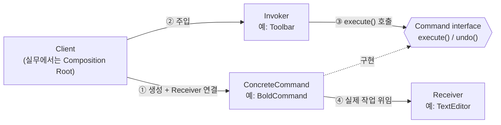
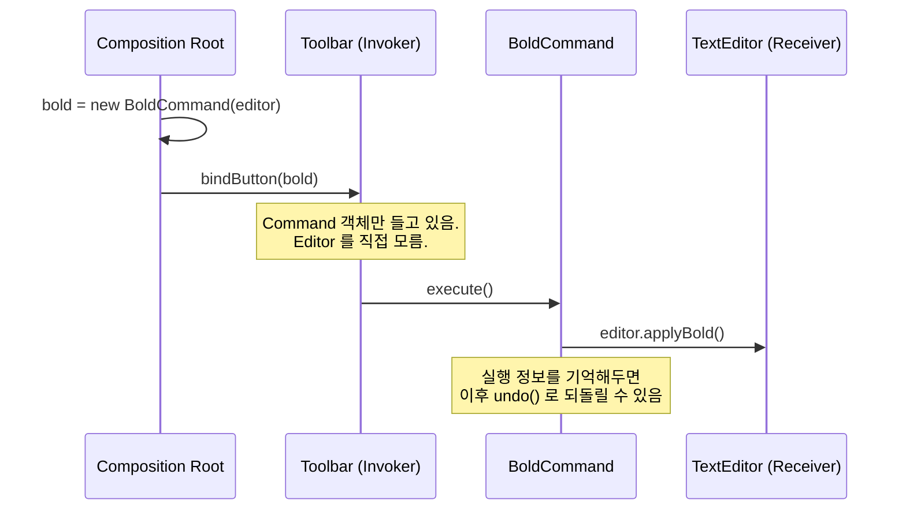
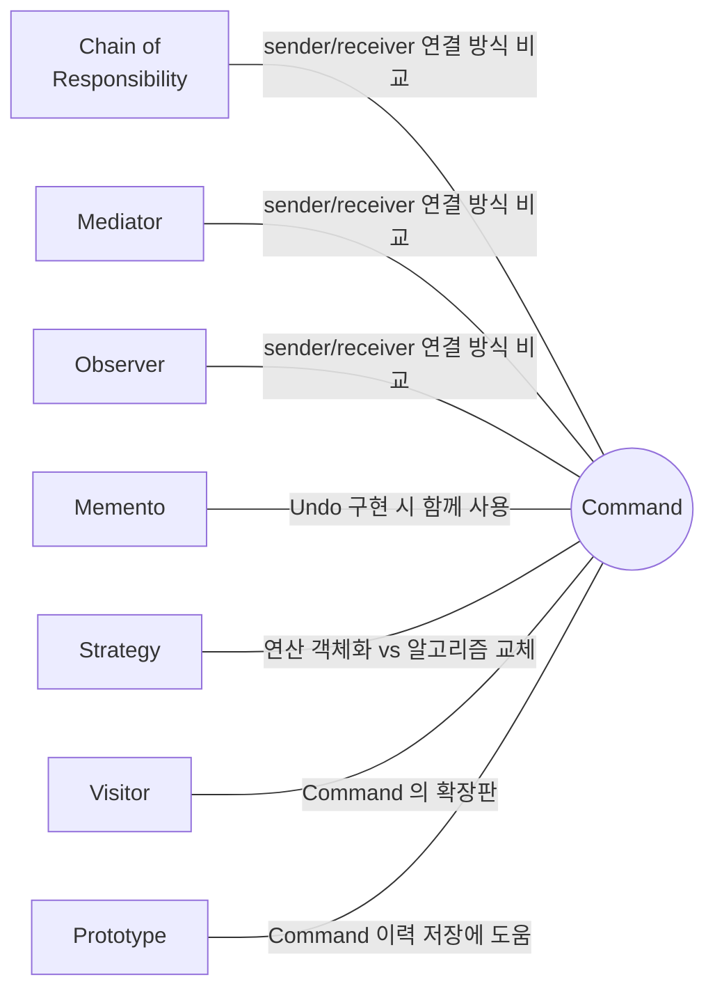

## Description

텍스트 에디터에 실행 취소(Undo) 기능을 만든다고 해보자. `Toolbar` 가 `Editor.bold()`, `Editor.deleteLine()` 같은 메소드를 직접 호출하는 구조라면, "방금 한 작업을 취소해줘" 라는 요청을 처리할 방법이 없음 — 이미 호출은 끝났고, 무엇을 어떻게 되돌려야 하는지에 대한 정보가 남아있지 않기 때문. 버튼과 메뉴, 단축키가 같은 동작을 여러 경로로 호출하게 되면 중복 호출 코드도 계속 늘어남.

**Command Pattern** 은 "실행하고 싶은 요청(작업)" 자체를 하나의 객체로 캡슐화하는 행위 패턴. 요청을 객체로 만들어두면 그 요청을 매개변수로 넘기거나, 큐에 저장하거나, 로그로 남기거나, 나중에 취소하는 것이 모두 가능해짐. 위 예시라면 `BoldCommand`, `DeleteLineCommand` 를 각각 객체로 만들고 `Toolbar` 는 `Command` 인터페이스의 `execute()` 만 호출하면 됨 — 실제로 무엇을 어떻게 수행하는지는 `Command` 가 알아서 함.

- **핵심**: "실행하고 싶은 동작" 을 객체(Command)로 감싸서, 동작을 요청하는 쪽(Invoker)과 실제로 동작을 수행하는 쪽(Receiver)을 분리함.
- **목적**:
  1. 요청을 매개변수화하고, 큐에 저장하거나 지연 실행하거나 원격으로 전송할 수 있게 함.
  2. 실행된 작업의 실행 취소(Undo)/다시 실행(Redo) 을 구현할 수 있게 함.
  3. 새로운 Command 를 추가해도 `Invoker` 코드를 건드리지 않도록 하여 [OCP(Open Closed Principle)](../../solid/OCP(Open%20Closed%20Principle).md) 를 준수.

## Examples

- **Undo/Redo 가 없는 에디터**: `Toolbar` 가 `Editor.bold()` 를 직접 호출하면 취소 기능을 넣을 방법이 없음. `BoldCommand` 로 감싸고 실행 이력을 스택에 쌓으면, 스택에서 꺼내 `undo()` 만 호출하는 것으로 되돌리기가 가능해짐.
- **UI 버튼과 메뉴, 단축키가 같은 동작을 호출**하는 경우, 각 진입점마다 로직을 복붙하는 대신 동일한 `Command` 객체 하나를 공유해서 실행하면 중복이 사라짐.
- **작업 큐/재시도**: "파일 업로드" 요청을 즉시 실행하는 대신 `UploadCommand` 객체로 만들어 큐에 쌓아두면, 네트워크가 끊겨도 나중에 큐에서 꺼내 재시도할 수 있음. 즉시 실행하는 구조라면 재시도를 위해 원래 호출 맥락을 다시 만들어야 함.

## Structure



버튼 클릭 한 번이 실제로 처리되는 흐름을 시퀀스로 그리면 아래와 같음.



- **Command**: 작업을 실행하기 위한 인터페이스 (보통 `execute()`, 필요하면 `undo()`).
- **ConcreteCommand**: `Receiver` 에 해당하는 작업을 실제로 호출하는 요청을 구현 (`BoldCommand` 등). 실행에 필요한 파라미터와 Receiver 참조를 갖고 있음.
- **Invoker(Sender)**: 요청을 Receiver 에게 직접 보내는 대신 Command 를 실행시킴. 명령 이력을 저장해두면 순차 실행이나 undo 를 관리할 수 있음.
- **Receiver**: 요청을 실제로 어떻게 수행하는지 아는 클래스. 어떤 클래스든 Receiver 가 될 수 있음.
- **Client**: ConcreteCommand 객체를 만들고 Receiver 와 엮어주는 쪽. 실무에서는 이 역할을 [Composition Root](../general/patterns/Composition%20Root.md) 가 담당하는 경우가 많음 — 아래 [Modern Applicability](#modern-applicability-di-composition-root) 참고.

## Adaptability

다음 상황에서 특히 유용함.

- 작업을 객체로 매개변수화하고 싶은 경우.
- 작업을 큐에 넣거나, 실행을 예약하거나, 원격으로 실행하고 싶은 경우.
- 되돌릴 수도 있는 작업을 구현하고 싶은 경우 ⇒ [Memento Pattern](Memento%20Pattern.md) 과 함께 사용됨.

## Pros

- **요청을 유발하는 클래스와 요청을 수행하는 클래스가 분리**됨 ⇒ [SRP(Single Responsibility Principle)](../../solid/SRP(Single%20Responsibility%20Principle).md). `Toolbar` 는 편집 로직을 전혀 몰라도 됨.
- **새 Command 를 기존 코드 수정 없이 추가**할 수 있음 ⇒ [OCP(Open Closed Principle)](../../solid/OCP(Open%20Closed%20Principle).md).
- **Undo/Redo 기능을 자연스럽게 구현**할 수 있음: Command 가 실행 정보를 스스로 들고 있으므로, 실행 이력 스택만 있으면 됨.
- **지연 실행/큐잉이 쉬워짐**: Command 를 객체로 만들어뒀기 때문에 지금 당장 실행하지 않고 나중에 실행할 수 있음.
- **여러 개의 간단한 Command 를 조합해서 복합 Command(매크로)** 를 만들 수 있음.

## Cons

- **Sender 와 Receiver 사이에 새 레이어(Command, Invoker)가 추가**되므로 아주 단순한 상황에서는 코드가 오히려 장황해질 수 있음. 클릭 한 번에 메소드 한 줄만 호출하면 되는 경우까지 Command 클래스로 감쌀 필요는 없음.

## Relationship with other patterns



| 비교 대상 | 공통점 | Command 와의 차이 |
| :--- | :--- | :--- |
| [Chain of Responsibility](Chain%20of%20Responsibility%20Pattern.md), [Mediator](Mediator%20Pattern.md), [Observer](Observer%20Pattern.md) | 넷 다 요청의 발신자와 수신자를 연결하는 방식을 다룸 | Command 는 발신자·수신자 간 **단방향** 연결만 만듦. CoR 은 수신자 사슬을 따라 순차 전달, Mediator 는 중재자를 거쳐 통신, Observer 는 수신자가 동적으로 구독/구독 취소. |
| [Strategy](Strategy%20Pattern.md) | 둘 다 객체를 필드/파라미터로 들고 있어서 구조가 비슷해 보임 | Command 는 **연산 자체**를 객체로 바꿔서 지연 실행·큐잉·기록·원격 전송을 가능하게 함. Strategy 는 **같은 목적의 알고리즘 여러 개**를 자유롭게 교체하는 것이 목적. |
| [Memento](Memento%20Pattern.md) | 함께 쓰여 Undo 기능을 구현 | Command 는 "무슨 연산을 수행할지" 에 집중하고, Memento 는 "연산 수행 전 객체 상태를 어떻게 저장·복구할지" 에 집중. 역할이 겹치지 않고 상호 보완적임. |
| [Visitor](Visitor%20Pattern.md) | 둘 다 "동작"을 객체로 다룸 | Command 하나(`BoldCommand`)는 보통 정해진 Receiver 타입 하나만 다룸. Visitor 는 `visit(TypeA)`, `visit(TypeB)` 처럼 타입별 메소드를 여러 개 가져서, 서로 다른 타입이 섞인 구조 전체를 한 번에 순회하며 타입마다 다른 동작을 실행할 수 있음 — 그래서 Visitor 를 "여러 타입에 대응하는, 더 강력해진 Command" 로 볼 수 있음. |
| [Prototype](../creational/Prototype%20Pattern.md) | 직접적인 구조 유사성은 없음 | Command 실행 이력을 저장할 때, 각 Command 의 복사본을 남겨야 한다면 Prototype 이 도움이 됨. |

### Command × Chain of Responsibility 조합

[Chain of Responsibility](Chain%20of%20Responsibility%20Pattern.md) 의 Handler 를 Command 로 구현하면, 같은 요청(컨텍스트 객체)이 체인을 따라가며 서로 다른 연산을 순서대로 적용받는 파이프라인이 됨. 예: 주문 요청 하나가 `AuthCommand → CacheCommand → ValidationCommand` 체인을 통과하며 인증 → 캐시 조회 → 검증을 차례로 적용받고, Command 라서 실행 이력을 남기거나 특정 단계만 재시도하기도 쉬워짐. 반대로 요청 자체를 Command 로 만드는 조합도 가능함 — 자세한 예시는 [Chain of Responsibility Pattern](Chain%20of%20Responsibility%20Pattern.md) 문서의 "CoR × Command 조합" 참고.

## Modern Applicability (DI/Composition Root)

[Composition Root](../general/patterns/Composition%20Root.md) 관점에서 Command 는 **3 그룹: 여전히 설계의 핵심** 에 속함. 언어나 프레임워크가 대신해주는 영역이 아니라, "요청을 객체로 만들어 지연 실행·취소가 가능하게 한다" 는 목적 자체가 여전히 설계자의 판단을 필요로 함.

**"그래도 결국 누군가는 concrete 를 알아야 하지 않나?"** 맞음. `Toolbar` 는 `BoldCommand` 를 몰라도 되지만, 어떤 버튼에 어떤 Command 를 연결할지 결정하는 지점은 필요함. 이 지점을 [Composition Root](../general/patterns/Composition%20Root.md) 로 명시적으로 몰아두면 됨.

**Android 예시 (Metro)** — Undo/Redo 가 가능한 에디터 액션.

```kotlin
interface EditorCommand {
    fun execute()
    fun undo()
}

@Inject
class BoldCommand(private val editor: TextEditor) : EditorCommand {
    override fun execute() = editor.applyBold()
    override fun undo() = editor.removeBold()
}

@Inject
class CommandHistory {
    private val stack = ArrayDeque<EditorCommand>()
    fun execute(command: EditorCommand) {
        command.execute()
        stack.addLast(command)
    }
    fun undo() = stack.removeLastOrNull()?.undo()
}

@Inject
class EditorViewModel(
    private val history: CommandHistory,
    private val boldCommand: EditorCommand,
) {
    fun onBoldClicked() = history.execute(boldCommand)
    fun onUndoClicked() = history.undo()
}

@DependencyGraph(AppScope::class)
interface AppGraph {
    val editorViewModel: EditorViewModel
}
```

`EditorViewModel` 은 `BoldCommand` 가 내부에서 `TextEditor` 를 어떻게 다루는지 모름. 새 액션(`ItalicCommand` 등)이 추가돼도 `CommandHistory` 는 한 글자도 안 바뀜 ⇒ [OCP(Open Closed Principle)](../../solid/OCP(Open%20Closed%20Principle).md) 유지. `AppGraph` 가 어떤 Command 를 어떤 뷰모델에 연결할지 아는 유일한 지점.
