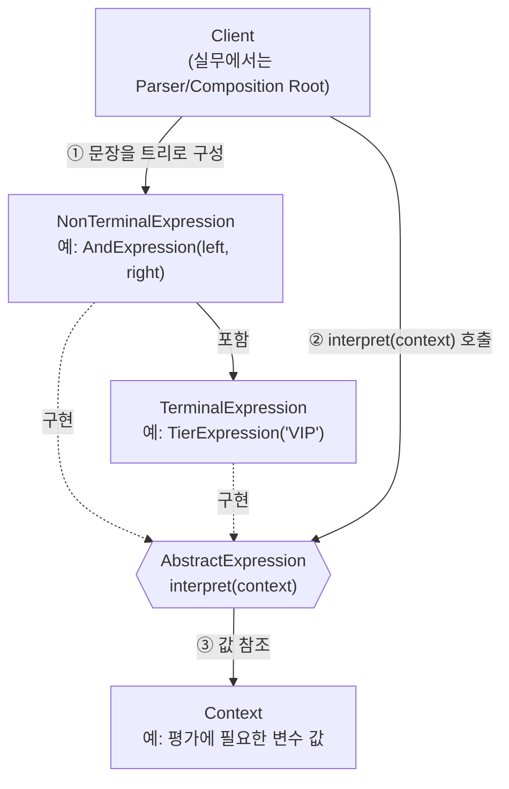
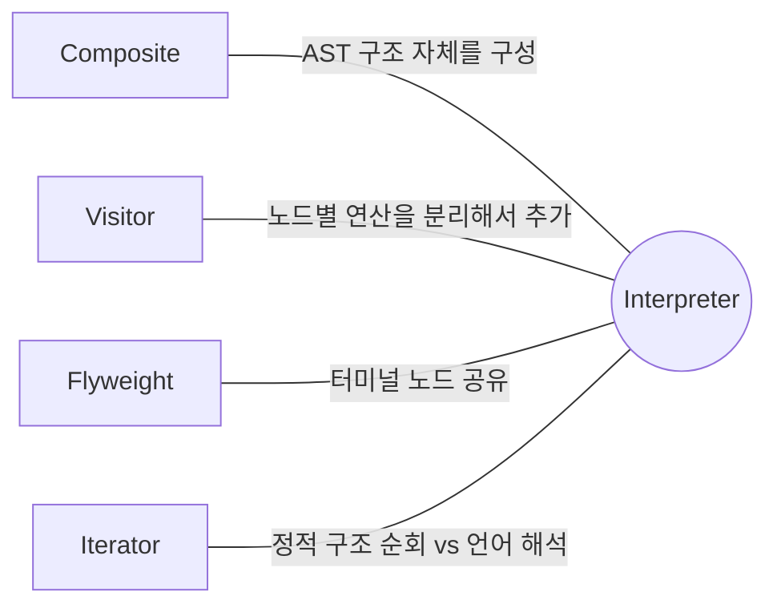

## Description

할인 정책을 문자열 규칙으로 관리한다고 해보자. "VIP 등급이고 쿠폰이 있으면 20% 할인" 같은 규칙이 하나둘 늘어나면, `if (tier == "VIP" && hasCoupon) …` 같은 분기가 코드 곳곳에 하드코딩됨. 규칙을 운영자가 바꾸고 싶어도 앱을 다시 배포해야 하는 게 문제.

**Interpreter Pattern** 은 간단한 언어의 문법을 클래스 계층으로 표현하고, 그 문법에 맞는 문장(규칙)을 해석하는 번역기를 함께 정의하는 행위 패턴. 문법의 각 규칙을 클래스 하나씩으로 모델화해두면, "VIP AND hasCoupon" 같은 문장을 그 클래스들의 인스턴스 조합(트리)으로 표현하고 `interpret()` 을 호출해서 해석할 수 있음.

- **핵심**: 문법의 각 규칙을 별도의 클래스로 표현하고, 문장을 이 클래스들의 인스턴스 트리로 구성해 해석함.
- **목적**:
  1. 규칙(문법)이 자주 바뀌거나 런타임에 정의되어야 하는 경우, 이를 재컴파일 없이 다룰 수 있게 함.
  2. 문법 규칙 하나하나가 클래스이므로, 상속으로 문법을 쉽게 확장할 수 있게 함.

## Examples

- **하드코딩된 할인 조건**: `if (tier == "VIP" && hasCoupon)` 을 규칙이 늘어날 때마다 계속 고쳐야 했다면, `AndExpression(TierExpression("VIP"), HasCouponExpression())` 같은 트리 조합으로 표현해 규칙 변경이 앱 배포 없이도 가능해짐(규칙을 서버에서 내려받는 구조라면 특히).

다른 도메인에도 같은 구조가 쓰임. (아래 Structure 부터는 다시 할인 정책 예시로 돌아감.)

- **검색 필터 문법**: 사용자가 `"tag:sale AND price<10000"` 같은 검색식을 입력하면, 이를 직접 파싱해 조건 검사 코드를 매번 새로 짜는 대신 `AndExpression`, `TagExpression`, `PriceExpression` 조합으로 해석하면 새 필터 종류가 추가돼도 기존 파서 로직은 그대로 둘 수 있음.
- **정규식/사칙연산처럼 아주 단순한 언어**: `"3 + 5 * 2"` 를 직접 문자열 파싱해서 계산하는 코드를 짤 수도 있지만, `NumberExpression`, `AddExpression`, `MultiplyExpression` 으로 문법을 모델화하면 연산자가 추가돼도 기존 클래스를 건드리지 않음.

## Structure



`"VIP AND hasCoupon"` 을 해석하는 흐름을 시퀀스로 보면 아래와 같음.

```mermaid
sequenceDiagram
    participant Client
    participant And as AndExpression
    participant Tier as TierExpression
    participant Coupon as HasCouponExpression

    Client->>And: interpret(context)
    And->>Tier: interpret(context)
    Tier-->>And: true
    And->>Coupon: interpret(context)
    Coupon-->>And: true
    And-->>Client: true (둘 다 true 라 AND 결과 true)
```

```kotlin
interface Expression {
    fun interpret(context: PromotionContext): Boolean
}

class TierExpression(private val tier: String) : Expression {
    override fun interpret(context: PromotionContext) = context.userTier == tier
}

class HasCouponExpression : Expression {
    override fun interpret(context: PromotionContext) = context.hasCoupon
}

class AndExpression(
    private val left: Expression,
    private val right: Expression,
) : Expression {
    override fun interpret(context: PromotionContext) =
        left.interpret(context) && right.interpret(context)
}
```

- **AbstractExpression**: 트리에 속한 모든 노드가 공통으로 구현해야 하는 `interpret()` 을 선언하는 인터페이스.
- **TerminalExpression**: 문법의 터미널 기호에 해당하는 해석을 구현. 사칙연산이라면 숫자, 규칙 엔진이라면 `TierExpression` 처럼 더 쪼갤 수 없는 조건 하나.
- **NonTerminalExpression**: 터미널이 아닌 기호(연산자)에 대한 해석을 구현. 사칙연산의 `+`, `*`, 규칙 엔진의 `AND`, `OR` 이 여기 해당하며, 보통 다른 Expression 을 자식으로 갖는 [Composite](../structural/Composite%20Pattern.md) 구조.
- **Context**: 여러 Expression 인스턴스가 공유하는 값(변수 등)을 담음.
- **Client**: 문장을 나타내는 추상 구문 트리(AST)를 조립하고 `interpret()` 을 호출함.

## Adaptability

다음 상황에서 특히 유용함.

- 비교적 간단한 언어(정규식, 바코드, 사칙연산, 간단한 조건식 등)를 해석해야 하는 경우.
- 성능이 최우선 고려사항이 아닌 경우.
- 언어의 문법을 10 개 이하의 클래스로 구현할 수 있는 경우 — 대표적으로 검색 조건식을 통해 객체나 DB 를 검색하는 상황.

## Pros

- **문법을 클래스로 표현했기 때문에 상속으로 쉽게 확장/변경**할 수 있음: 새 연산자를 추가하려면 `NonTerminalExpression` 을 구현한 클래스 하나만 더 만들면 됨.
- **AST 형태로 구조를 갖고 있어서, 해석 로직 외의 다른 연산도 붙이기 쉬움**: [Visitor Pattern](Visitor%20Pattern.md) 을 함께 쓰면 `interpret()` 뿐 아니라 "트리를 문자열로 출력", "트리 최적화" 같은 연산도 각 노드 클래스를 건드리지 않고 추가할 수 있음.

## Cons

- **문법이 복잡해지면 클래스 수가 폭발적으로 늘어남**: 규칙이 10 개를 넘어가기 시작하면 관리가 급격히 어려워짐 — 이 시점부터는 직접 파서/인터프리터를 만들거나 파서 생성기(ANTLR 등)를 쓰는 게 나음.
- **재귀 기반 해석이라 성능이 느릴 수 있음**: 트리 노드마다 가상 함수 호출이 발생하므로, 손으로 최적화한 파서보다 느림.

## Relationship with other patterns



| 비교 대상 | 공통점 | Interpreter 와의 차이 |
| :--- | :--- | :--- |
| [Composite](../structural/Composite%20Pattern.md) | Interpreter 는 문장을 표현할 때 Composite 를 그대로 사용함 | Composite 는 정적인 구조(트리)를 표현하는 것이 목적. Interpreter 는 그 트리가 "언어를 나타내고, 각 노드가 해석 방법을 아는 것" 까지 포함함. |
| [Visitor](Visitor%20Pattern.md) | 둘 다 트리 구조를 순회하며 연산을 수행 | Interpreter 는 각 노드 클래스에 `interpret()` 을 직접 구현하는 방식. 노드 종류가 늘어나는 대신 연산 종류가 자주 늘어난다면, 연산을 Visitor 로 분리해서 노드 클래스를 건드리지 않고 새 연산을 추가하는 것이 더 유리함. |
| [Flyweight](../structural/Flyweight%20Pattern.md) | 둘 다 구조 내 객체 수를 다룸 | 문법의 터미널 기호(예: 특정 숫자, 특정 키워드)가 반복적으로 등장한다면 Flyweight 로 공유해서 메모리를 아낄 수 있음. |
| [Iterator](Iterator%20Pattern.md) | 둘 다 구조를 순회함 | Iterator 는 이미 존재하는 컬렉션을 순서대로 훑는 것이 목적. Interpreter 는 순회 자체보다 "그 구조가 곧 하나의 문장이고, 이를 해석해서 값을 만들어내는 것" 이 목적. |

## Modern Applicability (DI/Composition Root)

[Composition Root](../general/patterns/Composition%20Root.md) 관점에서 Interpreter 는 **3 그룹: 여전히 설계의 핵심** 에 속함. 조건식/규칙 엔진처럼 도메인에 특화된 작은 언어를 다뤄야 하는 상황은 언어나 프레임워크가 대신해줄 수 있는 영역이 아님.

**"그래도 결국 누군가는 concrete 를 알아야 하지 않나?"** 여기서는 그 역할이 조금 다름 — Composition Root 가 아니라 **문장을 트리로 조립하는 Parser** 가 `TierExpression`, `AndExpression` 같은 concrete 클래스를 앎. Parser 를 사용하는 ViewModel 은 완성된 `Expression` 트리의 `interpret()` 만 호출하면 됨.

**Android 예시 (Metro)** — 서버에서 내려주는 프로모션 규칙 문자열을 해석하는 경우.

```kotlin
interface Expression {
    fun interpret(context: PromotionContext): Boolean
}

class TierExpression(private val tier: String) : Expression {
    override fun interpret(context: PromotionContext) = context.userTier == tier
}

class AndExpression(private val left: Expression, private val right: Expression) : Expression {
    override fun interpret(context: PromotionContext) =
        left.interpret(context) && right.interpret(context)
}

@Inject
class PromotionRuleParser {
    // 원격 설정 문자열("VIP AND hasCoupon")을 Expression 트리로 변환.
    // TierExpression, AndExpression 등 concrete 클래스를 아는 유일한 지점.
    fun parse(rule: String): Expression = /* ... */ TODO()
}

@Inject
class PromotionViewModel(private val parser: PromotionRuleParser) {
    fun isEligible(rule: String, context: PromotionContext): Boolean =
        parser.parse(rule).interpret(context) // Expression 이 뭐로 구성됐는지 모름
}

@DependencyGraph(AppScope::class)
interface AppGraph {
    val promotionViewModel: PromotionViewModel
}
```

새로운 연산자(`OrExpression`, `NotExpression`)가 추가돼도 `PromotionViewModel` 은 수정하지 않음 ⇒ [OCP(Open Closed Principle)](../../solid/OCP(Open%20Closed%20Principle).md) 유지. `PromotionRuleParser` 가 규칙 문자열과 concrete Expression 클래스 사이의 유일한 연결 지점.
