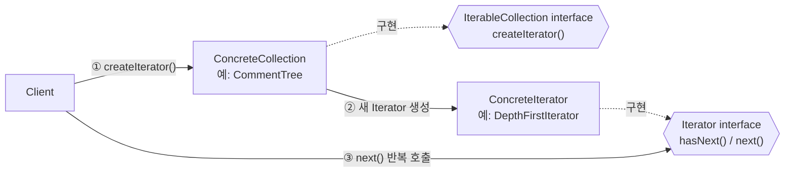
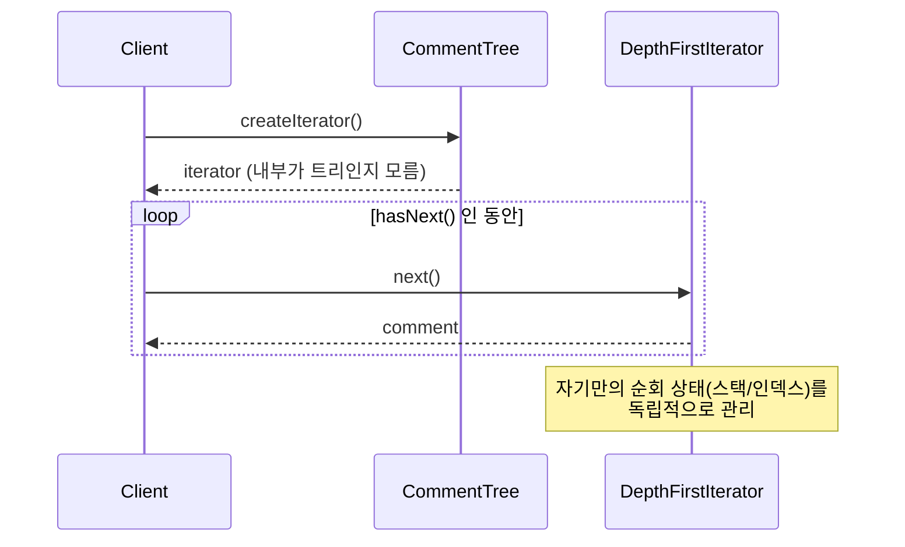
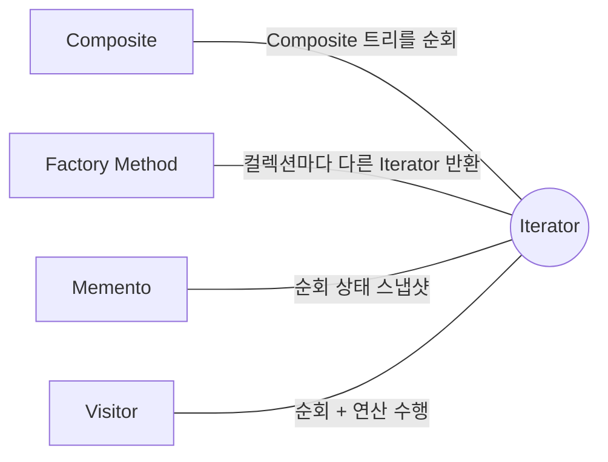

## Description

트리 구조로 된 댓글 목록을 순회한다고 해보자. 대댓글까지 깊이 우선으로 훑어야 할 때도 있고, 최신순으로만 훑어야 할 때도 있음. 이 순회 로직을 컬렉션 클래스 안에 전부 집어넣으면, 순회 방식이 하나 늘어날 때마다 컬렉션 클래스 자체가 점점 비대해지고, 컬렉션이 내부적으로 배열인지 트리인지 클라이언트가 알아야 순회 코드를 짤 수 있게 됨.

**Iterator Pattern** 은 컬렉션의 내부 구현(배열인지 연결 리스트인지 트리인지)을 노출시키지 않으면서도, 그 안에 담긴 항목들을 순서대로 순회할 수 있게 해주는 행위 패턴. 순회 로직을 컬렉션 자신이 아니라 별도의 Iterator 객체로 떼어내면, 컬렉션은 담고 있는 데이터에만 집중하고 순회 방식은 필요할 때마다 새로운 Iterator 를 만들어 추가하면 됨.


>며칠간 로마를 여행한다고 하면, (1) 무계획으로 즉흥적으로 걷거나, (2) 스마트폰 내비게이션 앱을 쓰거나, (3) 현지 가이드를 고용할 수 있음 — 방법(전략)마다 비용과 경험은 다르지만, 셋 다 "로마의 명소들을 순서대로 둘러본다" 는 같은 목적을 수행하는 방법이라는 점은 같음. 컬렉션을 순회하는 방법이 여러 개 있을 수 있다는 것이 Iterator Pattern 의 핵심 아이디어.

- **핵심**: 컬렉션을 순회하는 로직을 별도의 Iterator 객체로 분리하고, 컬렉션은 내부 구현을 노출하지 않고도 순회를 지원하게 함.
- **목적**:
  1. 컬렉션의 내부 구조를 몰라도 항목들을 순회할 수 있게 함.
  2. 같은 컬렉션을 서로 다른 방식으로 순회해야 할 때, 컬렉션 인터페이스를 부풀리지 않고 Iterator 클래스만 추가하면 되게 함.
  3. 여러 Iterator 가 서로 독립적인 순회 상태를 가지므로, 같은 컬렉션을 동시에 여러 번 순회할 수 있게 함.

## Examples

- **순회 로직이 컬렉션 클래스 안에 있다면**, "최신순", "깊이 우선", "너비 우선" 순회가 필요할 때마다 컬렉션 클래스에 메소드를 계속 추가해야 함. Iterator 로 분리하면 `LatestFirstIterator`, `DepthFirstIterator` 를 각각 클래스로 추가하기만 하면 됨.
- **컬렉션 내부 구현을 감추고 싶은 경우**: 트리로 구현된 댓글 목록을 배열로 바꾸더라도, `Iterator` 인터페이스(`hasNext()`, `next()`)만 유지하면 이를 사용하는 클라이언트 코드는 전혀 수정할 필요가 없음.
- **같은 컬렉션을 동시에 여러 번 순회**: 화면에 리스트를 그리는 순회와, 백그라운드에서 검증하는 순회가 동시에 필요할 때, Iterator 마다 자기 상태(현재 위치)를 독립적으로 갖고 있으므로 서로 간섭하지 않음.

## Structure



댓글 트리를 순회하는 흐름을 시퀀스로 보면 아래와 같음.



- **IterableCollection**: 컬렉션과 호환되는 Iterator 를 만들기 위한 인터페이스. 반환 타입을 `Iterator` 로 선언해서, 구현체가 다양한 종류의 Iterator 를 돌려줄 수 있게 함.
- **ConcreteCollection**: 요청이 올 때마다 자신에게 맞는 ConcreteIterator 의 새 인스턴스를 반환.
- **Iterator**: 컬렉션을 순차 접근하기 위한 인터페이스 (`next()`, `hasNext()`, 필요하면 현재 위치 조회/리셋 등).
- **ConcreteIterator**: 특정 순회 알고리즘을 구현. 순회 진행 상태를 자체적으로 추적하므로, 여러 Iterator 가 같은 컬렉션을 독립적으로 순회할 수 있음.

## Adaptability

다음 상황에서 특히 유용함.

- 컬렉션의 내부 구현이 복잡하고, 그 복잡성을 클라이언트에 감추고 싶은 경우.
- 순회 코드의 중복을 줄이고 싶은 경우.
- 구조의 타입을 미리 알 수 없거나, 서로 다른 자료구조를 동일한 방식으로 순회하고 싶은 경우.

## Pros

- **장황한 순회 알고리즘을 별도 클래스로 추출**해서 클라이언트 코드와 컬렉션을 정리할 수 있음 ⇒ [SRP(Single Responsibility Principle)](../../solid/SRP(Single%20Responsibility%20Principle).md).
- **기존 코드 수정 없이 새로운 컬렉션/순회 방식을 추가**할 수 있음 ⇒ [OCP(Open Closed Principle)](../../solid/OCP(Open%20Closed%20Principle).md).
- **각 Iterator 가 고유한 순회 상태를 가지므로, 같은 컬렉션을 병렬로 순회**할 수 있음.
- **순회를 원할 때 중단하고 나중에 재개**할 수 있음 (`next()` 를 호출하지 않고 있다가 이어서 호출하면 됨).

## Cons

- **컬렉션이 아주 단순하다면 과한 패턴**: 배열 하나 순회하는 데 Iterator 인터페이스까지 만드는 건 대부분 언어에서 불필요함 — 이미 언어가 흡수한 영역이기 때문 (아래 [Modern Applicability](#modern-applicability-di-composition-root) 참고).
- **일부 특수 컬렉션은 Iterator 를 거치는 것보다 직접 접근하는 게 더 효율적**일 수 있음 (예: 인덱스 기반 랜덤 접근이 잦은 경우).

## Relationship with other patterns



| 비교 대상 | 공통점 | Iterator 와의 관계 |
| :--- | :--- | :--- |
| [Composite](../structural/Composite%20Pattern.md) | 트리 구조를 다룰 때 자주 함께 쓰임 | Composite 로 구성된 트리를 Iterator 로 순회하게 만들 수 있음. |
| [Factory Method](../creational/Factory%20Method%20Pattern.md) | 생성 책임을 서브클래스에 위임 | 컬렉션의 서브클래스가 자신과 호환되는 서로 다른 종류의 Iterator 를 반환하도록 Factory Method 를 함께 사용할 수 있음. |
| [Memento](Memento%20Pattern.md) | 상태를 저장했다가 복원 | 현재 순회 위치를 Memento 로 저장해두면, 필요할 때 그 지점으로 되돌아갈 수 있음. |
| [Visitor](Visitor%20Pattern.md) | 둘 다 구조를 훑으며 무언가 수행 | 복잡한 자료구조를 Iterator 로 순회하면서, 각 요소에 대한 연산은 Visitor 에 맡기는 조합이 가능함. |

## Modern Applicability (DI/Composition Root)

[Composition Root](../general/patterns/Composition%20Root.md) 관점에서 Iterator 는 **1 그룹: 언어가 흡수** 에 속함. Kotlin(을 비롯한 대부분의 현대 언어)의 `for-in` 구문과 `Iterable`/`Iterator` 인터페이스가 이미 이 패턴 그대로임 — `Iterable` 이 GoF 의 `IterableCollection`, `Iterator` 가 GoF 의 `Iterator` 에 그대로 대응됨. DI 나 Composition Root 와는 관계가 없는 영역이라, "결국 누군가는 concrete 를 알아야 하지 않나" 라는 질문 자체가 여기서는 성립하지 않음.

**Kotlin 언어 기능으로 이미 구현되어 있는 Iterator 패턴**

```kotlin
// Iterator 인터페이스 자체가 언어 표준 라이브러리에 있음
interface Iterator<out T> {
    operator fun next(): T
    operator fun hasNext(): Boolean
}

// ConcreteCollection 역할: Iterable 을 구현하면 자동으로 for-in 을 지원
class CommentTree(private val root: Comment) : Iterable<Comment> {
    override fun iterator(): Iterator<Comment> = DepthFirstIterator(root) // ConcreteIterator
}

// Client 는 트리인지 배열인지 몰라도 순회 가능
for (comment in CommentTree(root)) {
    println(comment.text)
}

// 지연 평가가 필요하면 Sequence 로 순회를 중단/재개
val firstFivePopular = comments.asSequence()
    .filter { it.likes > 100 }
    .take(5)
    .toList()
```

컴파일러가 `for (x in collection)` 을 `collection.iterator()` 호출 + `while (it.hasNext())` 루프로 변환해줌. `Sequence` 는 지연 평가를 통해 "순회를 중단했다가 필요할 때 이어가는" Iterator 의 장점을 그대로 제공함. 결국 클래스 이름만 사라졌을 뿐, GoF 가 설명한 구조와 목적은 언어 차원에 그대로 남아있음.
