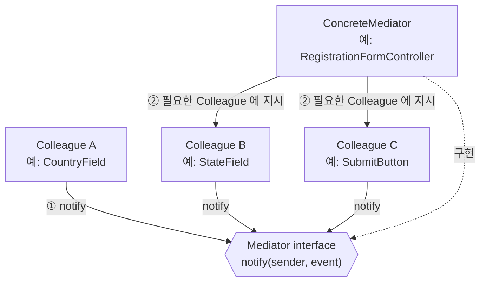
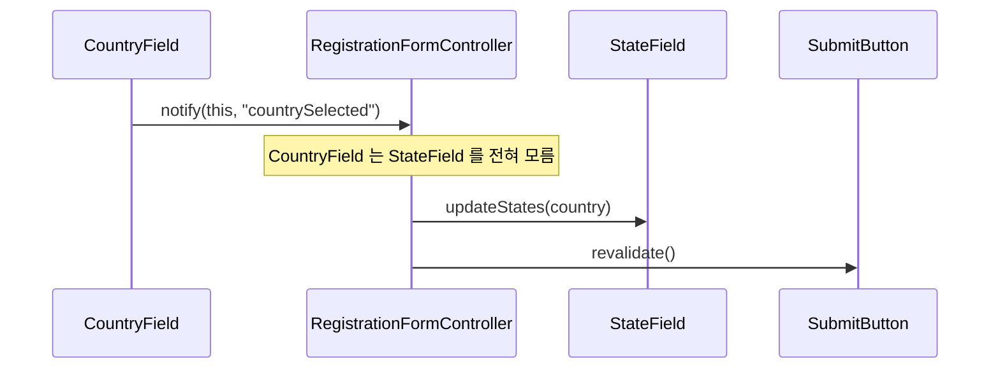
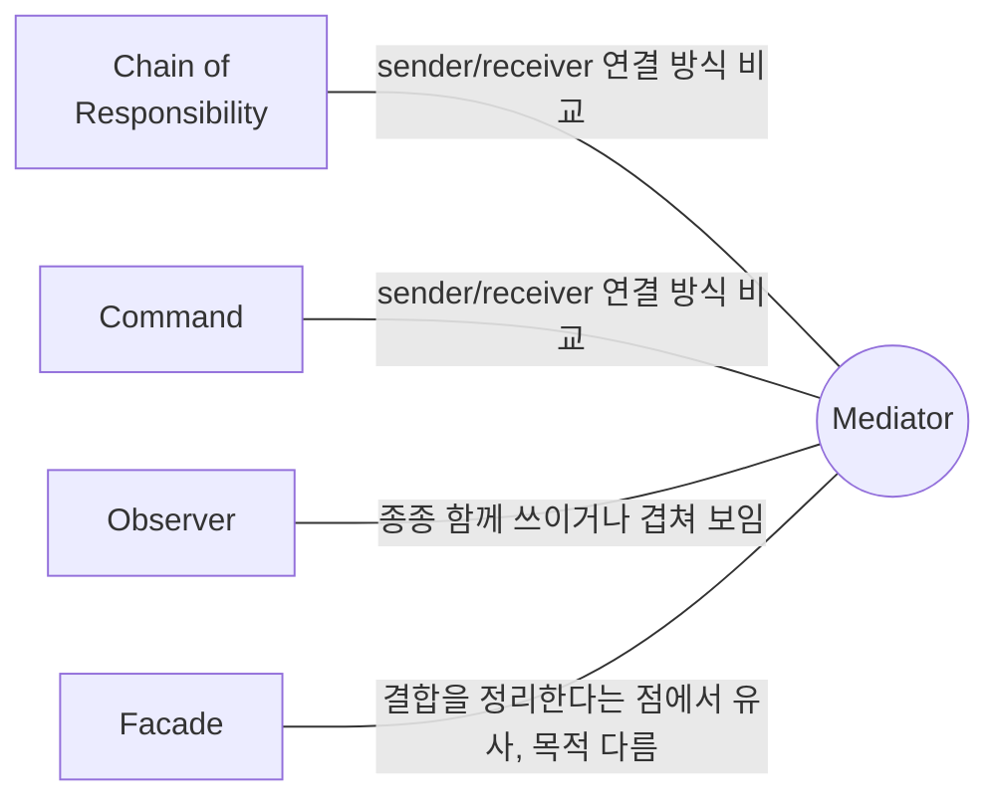

## Description

회원가입 화면을 만든다고 해보자. "국가" 선택 값이 바뀌면 "주/도" 목록이 바뀌어야 하고, "우편번호" 를 입력하면 "주소" 가 자동완성돼야 하고, 필수 항목이 다 채워져야 "가입" 버튼이 활성화돼야 함. 이 상호작용들을 각 필드의 상태 홀더가 서로 직접 참조해서 처리하면 (`countryField.onSelected = { stateField.update(…); zipField.validate(…); submitState.enabled = … }`), 필드가 하나 늘어날 때마다 서로를 참조하는 연결이 N:M 으로 불어남.

**Mediator Pattern** 은 객체들이 서로 직접 참조하는 대신, 중재자(Mediator) 라는 객체 하나를 통해서만 소통하게 만드는 행위 패턴. 위 예시라면 각 필드(Colleague)는 Mediator 인 `RegistrationFormController` 하나만 알면 되고, 다른 필드는 전혀 몰라도 됨 — N:M 으로 얽혀있던 관계가 Mediator 를 중심으로 1:N 으로 단순해짐.

- **핵심**: 객체 묶음이 서로 직접 참조하는 대신, 상호작용 로직을 Mediator 라는 별도 객체로 옮겨서 결합을 느슨하게 함.
- **목적**:
  1. 컴포넌트들 사이의 N:M 관계를, Mediator 를 통한 1:N 관계로 단순화함.
  2. 각 컴포넌트를 다른 컴포넌트로부터 독립시켜서 재사용 가능하게 함.
  3. 상호작용 로직이 흩어져 있지 않고 한 곳(Mediator)에 모여있어 이해·유지보수가 쉬워지게 함.

## Examples

- **필드/컴포저블이 서로를 직접 참조**하는 폼 화면은, 필드 하나를 재사용하려고 다른 화면에 갖다 놓으면 참조하던 다른 필드가 없어서 깨짐. Mediator 를 두면 각 필드는 Mediator 하고만 소통하므로, 다른 화면에서도 그대로 재사용할 수 있음.
- **채팅방의 참가자들**이 서로에게 직접 메시지를 보낸다면 참가자가 늘어날수록 연결(그리고 예외 처리)이 기하급수적으로 늘어남. `ChatRoom` 이라는 Mediator 를 통해서만 메시지를 주고받으면, 참가자는 방(Mediator)에만 접속하면 됨.
- **여러 다이얼로그/위젯이 서로의 상태를 알아야 하는 설정 화면**(예: "자동 백업" 체크박스를 끄면 "백업 주기" 드롭다운이 비활성화)에서, 위젯끼리 직접 참조하는 대신 Mediator 가 상태 변화를 감지해서 관련 위젯들에 지시하면 위젯 각각은 다른 위젯의 존재를 몰라도 됨.

## Structure



국가를 선택했을 때의 흐름을 시퀀스로 보면 아래와 같음.



- **Mediator**: 컴포넌트들과 상호작용하기 위한 인터페이스 (`notify(sender, event)` 등).
- **ConcreteMediator**: 실제 컴포넌트들을 참조하고, 어떤 이벤트가 오면 어떤 컴포넌트에 어떻게 지시할지 구현.
- **Colleague(Component)**: Mediator 와만 소통하는 요소들. 서로를 직접 알아서는 안 되고, 반드시 Mediator 를 거쳐야 함.
- **Client**: ConcreteMediator 를 만들고 Colleague 들을 여기에 등록하는 쪽. 실무에서는 이 역할을 [Composition Root](../general/patterns/Composition%20Root.md) 가 담당하는 경우가 많음 — 아래 [Modern Applicability](#modern-applicability-di-composition-root) 참고.

## Adaptability

다음 상황에서 특히 유용함.

- 다른 클래스와 밀접하게 결합되어 있어서 일부 클래스만 따로 바꾸기 어려운 경우.
- 컴포넌트가 다른 컴포넌트에 너무 의존적이라 다른 화면/프로그램에서 재사용할 수 없는 경우.
- 여러 컨텍스트에서 재사용하려고 기본 동작이 조금씩 다른 하위 클래스를 잔뜩 만들어야 하는 상황을 피하고 싶은 경우.
- 실행 중에 컴포넌트를 추가/교체할 필요가 있는 경우.

Mediator 가 통신 조율 외의 연산·데이터 변환 로직까지 떠안기 시작하면 God Object 가 될 위험이 있으므로, 책임을 "통신 조율" 로만 한정해서 설계해야 함.

## Pros

- **여러 컴포넌트 간 상호작용 로직을 한 곳으로 모을 수 있음** ⇒ [SRP(Single Responsibility Principle)](../../solid/SRP(Single%20Responsibility%20Principle).md). 상호작용 규칙이 바뀌어도 `RegistrationFormController` 하나만 고치면 됨.
- **기존 코드 수정 없이 새로운 Mediator 로 교체**할 수 있음 ⇒ [OCP(Open Closed Principle)](../../solid/OCP(Open%20Closed%20Principle).md).
- **각 컴포넌트가 다른 컴포넌트를 몰라도 되므로 재사용이 쉬워짐**: `StateField` 를 다른 화면에 그대로 갖다 써도 깨지지 않음.

## Cons

- **Mediator 자체가 God Object 가 될 수 있음**: 컴포넌트가 늘어날수록 Mediator 가 알아야 할 상호작용 규칙도 함께 늘어나서, 결국 Mediator 하나가 시스템의 모든 로직을 떠안게 될 위험이 있음.

## Relationship with other patterns



| 비교 대상                                                                                                | 공통점                                               | Mediator 와의 차이                                                                                                                                                                                                                                      |
| :--------------------------------------------------------------------------------------------------- | :------------------------------------------------ | :-------------------------------------------------------------------------------------------------------------------------------------------------------------------------------------------------------------------------------------------------- |
| [Chain of Responsibility](Chain%20of%20Responsibility%20Pattern.md), [Command](Command%20Pattern.md) | 셋 다 요청의 발신자와 수신자를 연결하는 방식을 다룸                     | CoR 은 수신자 사슬을 순차적으로 따라감. Command 는 발신자·수신자 간 단방향 연결. Mediator 는 발신자·수신자의 직접 연결을 아예 없애고, 중재자를 거쳐서만 통신하게 함.                                                                                                                                           |
| [Observer](Observer%20Pattern.md)                                                                    | 둘 다 컴포넌트 간 결합을 낮추는 목적, 실제로 함께 구현되는 경우가 많아 경계가 흐릿함 | Mediator 의 목표는 컴포넌트 집합 간의 **상호 종속성 자체를 제거**하는 것 — 대신 컴포넌트들은 단일 Mediator 객체에만 종속됨. Observer 의 목표는 한 객체가 다른 객체에 대해 **동적인 단방향 구독 관계**를 맺는 것. Mediator 를 Publisher 로, Colleague 를 그 이벤트를 구독하는 Subscriber 로 구현하면 두 패턴을 조합한 형태가 되는데, 이 경우 매우 비슷해 보일 수 있음. |
| [Facade](../structural/Facade%20Pattern.md)                                                          | 밀접하게 결합된 클래스들 사이의 상호작용을 정리해준다는 점이 비슷함             | Facade 는 서브시스템에 대한 **단순화된 진입점**을 제공할 뿐, 서브시스템 내부 객체들끼리는 여전히 서로 직접 소통함(Facade 는 서브시스템을 모름 → 단방향). Mediator 는 컴포넌트 간의 상호작용 **자체를 중재**함 — 각 컴포넌트는 Mediator 만 알고 다른 컴포넌트는 아예 모름(양방향, 컴포넌트도 Mediator 를 앎).                                               |

## Modern Applicability (DI/Composition Root)

[Composition Root](../general/patterns/Composition%20Root.md) 관점에서 Mediator 는 **3 그룹: 여전히 설계의 핵심** 에 속함. 여러 화면 컴포넌트 간의 상호작용 조율은 프레임워크가 대신해줄 수 없는, 화면마다 다른 도메인 로직이기 때문.

**"그래도 결국 누군가는 concrete 를 알아야 하지 않나?"** 맞음. `RegistrationFormController` 는 각 필드를 구체적으로 알아야 함 — 다만 그 지식이 필드들 사이에 N:M 으로 흩어지지 않고 Mediator 하나에만 모여있다는 점이 핵심.

**Android 예시 (Metro)** — 여러 필드(Composable state holder) 간 상호작용을 조율하는 화면 Mediator.

```kotlin
interface FormMediator {
    fun onCountrySelected(country: String)
}

@Inject
class RegistrationFormMediator(
    private val stateField: StateFieldController,
    private val submitButton: SubmitButtonController,
) : FormMediator {
    override fun onCountrySelected(country: String) {
        stateField.updateStates(country) // Colleague 들은 서로를 모름
        submitButton.revalidate()
    }
}

@Inject
class RegistrationViewModel(private val mediator: FormMediator)

@DependencyGraph(AppScope::class)
interface AppGraph {
    val registrationViewModel: RegistrationViewModel
}
```

`StateFieldController` 와 `SubmitButtonController` 는 서로의 존재를 모름. 상호작용 규칙이 바뀌어도 `RegistrationFormMediator` 하나만 고치면 되고, `AppGraph` 가 어떤 Colleague 들을 Mediator 에 엮을지 아는 유일한 지점.
