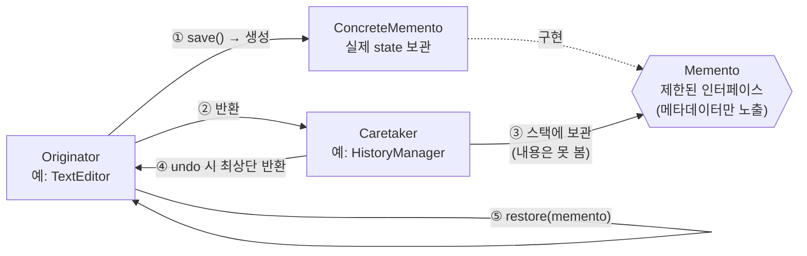
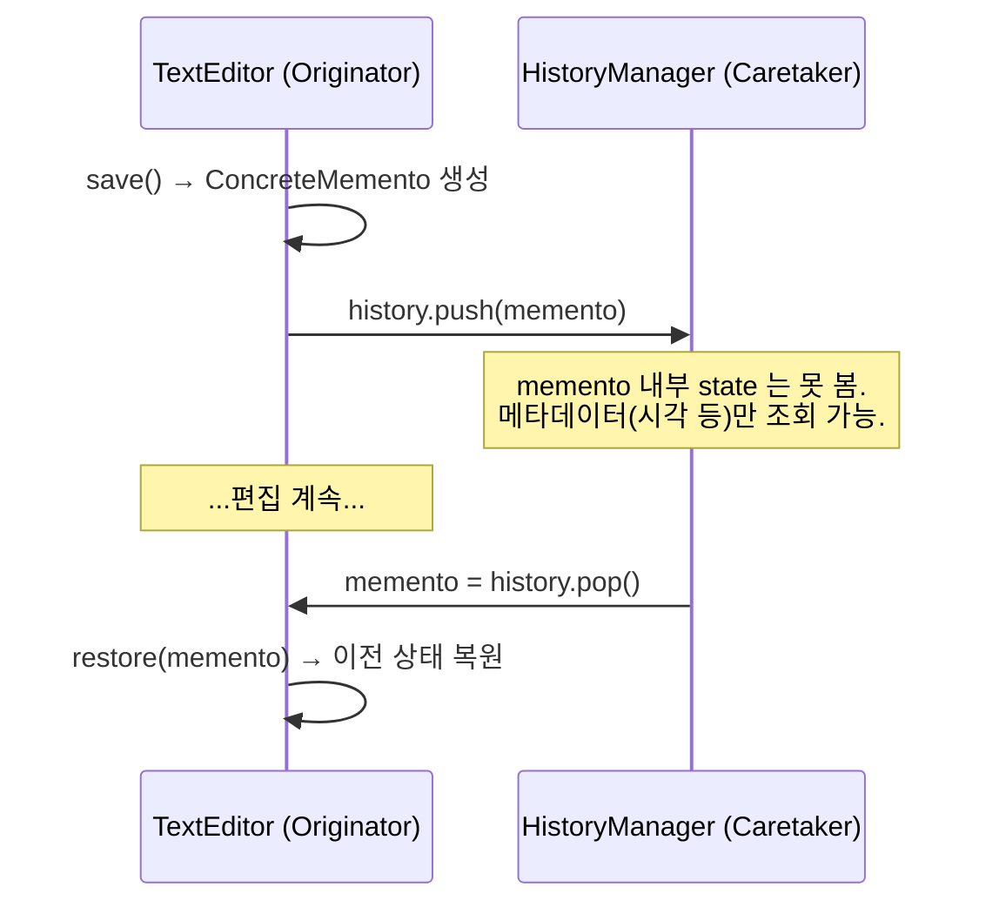
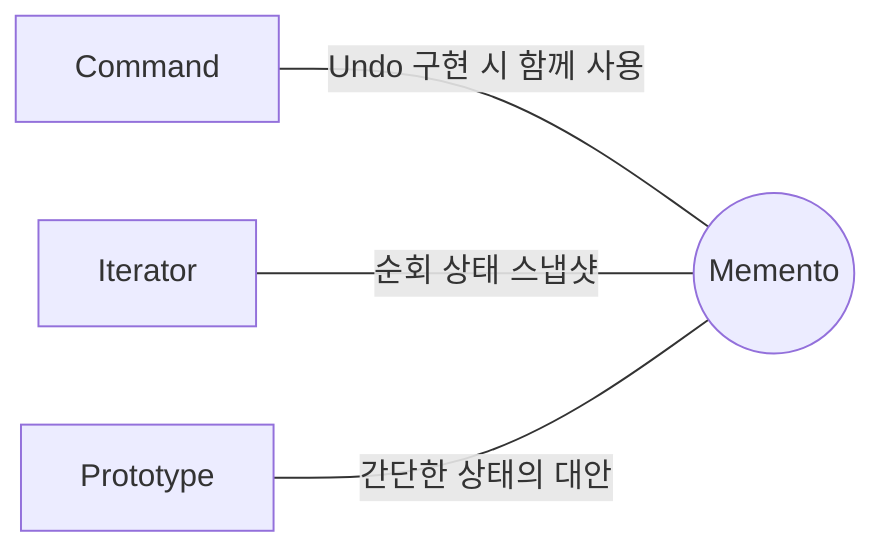

## Description

텍스트 에디터에 실행 취소(Undo) 기능을 만든다고 해보자. 가장 직관적인 방법은 행위를 수행하기 전에 에디터의 모든 필드 값을 밖으로 꺼내서 저장해두는 것. 그런데 이러려면 에디터가 자신의 내부 필드를 외부에 다 열어줘야 하고(캡슐화 위반), 필드가 추가/삭제될 때마다 저장 로직도 같이 고쳐야 하고, 필드 전체를 매번 복사하다 보니 스냅샷 용량도 커짐.

**Memento Pattern** 은 캡슐화를 깨지 않으면서 객체의 상태를 외부에 스냅샷으로 저장하고, 필요할 때 원하는 시점의 상태로 복원할 수 있게 해주는 행위 패턴. 스냅샷을 만드는 일 자체를 상태의 실제 주인인 객체(Originator)에게 맡기면, 외부 객체가 내부 필드를 직접 들여다볼 필요 없이 Originator 스스로 자신을 캡슐화된 스냅샷(Memento)으로 만들어낼 수 있음.

- **핵심**: 상태를 가진 객체(Originator)가 스스로 자신의 스냅샷(Memento)을 만들고, 다른 객체(Caretaker)는 그 스냅샷을 보관만 할 뿐 내용을 들여다보거나 건드리지 않음.
- **목적**:
  1. 객체의 필드/getter/setter 를 외부에 노출하지 않고도 상태 스냅샷을 만들 수 있게 함.
  2. Undo, 히스토리 추적처럼 "이전 상태로 되돌리는" 기능을 캡슐화를 지키면서 구현할 수 있게 함.

## Examples

- **모든 필드를 외부에서 복사해서 저장**하는 방식은 에디터 내부 구조가 바뀔 때마다 저장 로직도 함께 고쳐야 하지만, `editor.save()` 가 스스로 `Memento` 를 만들어 반환하면 에디터 내부가 어떻게 바뀌든 호출부는 영향받지 않음.

다른 도메인에도 같은 구조가 쓰임. (아래 Structure 부터는 다시 에디터 예시로 돌아감.)

- **여러 단계의 폼 입력을 되돌리는 마법사(Wizard) UI**: 단계마다 상태를 통째로 복사해 배열에 저장하면 캡슐화가 깨지지만, 각 단계가 스스로 Memento 를 만들게 하면 "이전 단계로" 버튼은 Memento 를 꺼내 복원 메소드를 호출하기만 하면 됨.
- **게임의 세이브 포인트**: 캐릭터 객체가 `createMemento()` 로 자기 상태를 캡슐화해서 저장소(Caretaker)에 넘기면, 저장소는 이 스냅샷의 내용을 몰라도 여러 개를 순서대로 보관했다가 필요할 때 캐릭터에게 다시 돌려주는 것만으로 로드가 가능함.

## Structure



저장과 복원 흐름을 시퀀스로 보면 아래와 같음.



```kotlin
interface Memento // 제한된 인터페이스. Caretaker 는 이 타입으로만 다룸(내용은 못 봄).

class TextEditor(private var content: String) {
    fun save(): Memento = ConcreteMemento(content) // Originator 가 스스로 스냅샷 생성

    fun restore(memento: Memento) {
        content = (memento as ConcreteMemento).state
    }

    private class ConcreteMemento(val state: String) : Memento
}

class HistoryManager {
    private val history = ArrayDeque<Memento>()
    fun push(memento: Memento) = history.addLast(memento)
    fun pop(): Memento? = history.removeLastOrNull() // 내용은 못 보고 보관만 함
}
```

- **Memento**: `ConcreteMemento` 의 필드 접근을 제한하는 인터페이스. `Caretaker` 가 다룰 수 있는 메타데이터(생성 시각, 수행된 행위명 등)만 노출함.
- **ConcreteMemento**: Originator 의 내부 상태 스냅샷 역할을 하는 값 객체. 이 스냅샷을 생성한 Originator 외에는 접근할 수 없음.
- **Caretaker**: Memento 보관을 책임짐. Memento 의 내용을 검토하거나 건드리지 않고, 스택 등으로 히스토리를 추적함.
- **Originator**: 상태를 실제로 소유한 객체. 필요할 때 자기 상태의 스냅샷을 만들고, 스냅샷으로부터 상태를 복원함.

Client 사용 예는 아래처럼 `HistoryManager` 가 Memento 를 보관하고, 복원은 `TextEditor` 에게 다시 맡김.

```kotlin
val editor = TextEditor("draft")
val history = HistoryManager()

history.push(editor.save())
history.pop()?.let { editor.restore(it) }
```

## Adaptability

다음 상황에서 특히 유용함.

- 객체 상태의 스냅샷을 만들어 이전 상태로 복원할 수 있게 하고 싶은 경우.
- 객체의 field/getter/setter 에 대한 직접 접근이 캡슐화를 위반하게 되는 경우.

## Pros

- **캡슐화를 위반하지 않고 객체 상태의 스냅샷을 만들 수 있음**: 스냅샷 생성 책임이 Originator 자신에게 있으므로, 외부에서 내부 필드를 노출할 필요가 없음.
- **Caretaker 가 히스토리를 관리해주므로 호출부 코드가 단순해짐**: Undo 버튼을 누르는 쪽은 "스택에서 꺼내서 복원해라" 만 알면 됨.

## Cons

- **Memento 를 자주 만들면 메모리 사용량이 늘어남**: 상태 전체를 스냅샷으로 복사하는 방식이라, 상태가 크거나 스냅샷 빈도가 높으면 메모리 부담이 커짐.
- **Caretaker 가 Originator 의 생명주기를 추적해서 오래된 Memento 를 직접 정리해줘야 함**: 자동으로 오래된 스냅샷이 사라지지 않으므로, 관리하지 않으면 메모리 누수로 이어질 수 있음.
- **동적 타입 언어에서는 Memento 내부 상태의 불변성을 언어 차원에서 보장하기 어려움**: PHP, Python, JavaScript 처럼 private 접근 제어가 느슨한 언어는 Caretaker 가 마음만 먹으면 Memento 내부를 건드릴 수 있어, 캡슐화가 관례에 의존하게 됨.
- **직렬화 없이 상태를 그대로 들고 있으면 복원 비용이 커질 수 있음**: 큰 객체 그래프라면 직렬화해서 저장하는 편이 유리함.

## Relationship with other patterns



| 비교 대상 | 공통점 | Memento 와의 차이 |
| :--- | :--- | :--- |
| [Command](Command%20Pattern.md) | 함께 쓰여 Undo 기능을 구현 | Command 는 "어떤 연산을 수행할지" 를 캡슐화하는 것에 집중하고, Memento 는 "연산 수행 전 상태를 어떻게 저장·복원할지" 에 집중함. Command 가 실행되기 전 Memento 로 상태를 찍어두면, Undo 는 Command 실행을 취소하는 대신 저장해둔 Memento 로 되돌리는 방식으로 구현할 수 있음. |
| [Iterator](Iterator%20Pattern.md) | 상태를 저장했다가 복원한다는 점이 비슷함 | 현재 순회 위치(Iterator 의 내부 상태)를 Memento 로 캡처해두면, 필요할 때 그 지점으로 롤백할 수 있음. |
| [Prototype](../creational/Prototype%20Pattern.md) | 둘 다 객체의 특정 시점 사본을 남김 | 히스토리에 저장할 객체가 단순하고 외부 리소스에 대한 참조가 없거나 참조를 쉽게 재설정할 수 있다면, Memento 대신 Prototype 으로 객체를 통째로 복제해서 저장하는 게 더 간단한 대안이 될 수 있음. |

## Modern Applicability (DI/Composition Root)

[Composition Root](../general/patterns/Composition%20Root.md) 관점에서 Memento 는 **3 그룹: 여전히 설계의 핵심** 에 속함. 다만 Android 에서는 이 패턴의 전형적인 형태를 `SavedStateHandle` 이라는 이름으로 플랫폼이 이미 제공하고 있음.

**"그래도 결국 누군가는 concrete 를 알아야 하지 않나?"** `ViewModel`(Originator)은 자기 상태를 스스로 `SavedStateHandle`(Memento 를 감싼 저장소)에 담고 꺼내오며, 실제로 언제 스냅샷을 만들고 복원할지는 시스템(Caretaker)이 프로세스 종료/재생성 시점에 결정함 — `ViewModel` 을 사용하는 화면 쪽은 이 과정을 전혀 몰라도 됨.

**Android 예시 (Metro)** — 에디터 화면에서 `SavedStateHandle` 을 이용한 상태 복원. Structure 절의 `TextEditor`(Originator)가 하던 역할을, Android 에서는 `ViewModel` 이 이어받음.

```kotlin
@Inject
class TextEditorViewModel(
    private val savedStateHandle: SavedStateHandle, // Caretaker 가 시스템 차원에서 주입
) {
    // originator 의 상태. 프로세스가 죽었다 살아나도 시스템이 복원해줌.
    var draftText: String
        get() = savedStateHandle["draftText"] ?: ""
        set(value) { savedStateHandle["draftText"] = value }
}

@DependencyGraph(AppScope::class)
interface AppGraph {
    val textEditorViewModel: TextEditorViewModel
}
```

`TextEditorViewModel` 을 사용하는 Composable 화면은 프로세스가 죽었다 살아났는지, 상태가 어떻게 저장되고 복원됐는지 전혀 알 필요가 없음. `savedStateHandle["draftText"]` 라는 제한된 인터페이스로만 접근하기 때문에, 내부적으로 어떤 형태(Bundle)로 저장되는지도 캡슐화되어 있음 — GoF 가 설명한 Memento 의 "제한된 인터페이스" 원칙 그대로.
