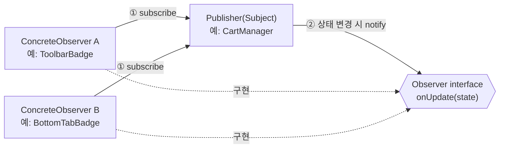
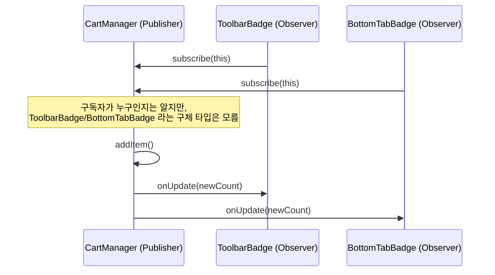
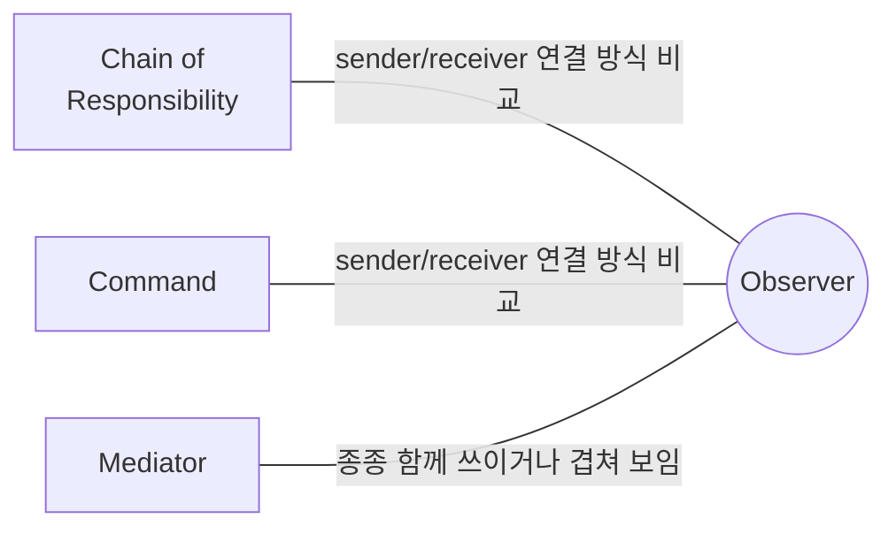

## Description

장바구니 개수를 화면 여러 곳(툴바 아이콘, 배지, 하단 탭)에 동시에 보여준다고 해보자. `CartManager` 가 아이템이 추가될 때마다 `toolbarIcon.update()`, `badge.update()`, `bottomTab.update()` 를 일일이 직접 호출하게 만들면, 화면이 하나 늘어날 때마다 `CartManager` 코드를 매번 열어서 호출을 추가해야 함. `CartManager` 는 자신의 상태 변화에만 집중하고 싶은데, 정작 "누구에게 알려야 하는지" 까지 알아야 하는 게 문제.

**Observer Pattern** 은 한 객체(Subject/Publisher)의 상태가 바뀌었을 때, 구독 중인 여러 객체(Observer/Subscriber)들에게 자동으로 알림이 가도록 1:N 의존관계를 정의하는 행위 패턴. `CartManager` 는 "구독 중인 대상 전체에게 알려라" 라는 한 가지만 알면 되고, 실제로 누가 구독했는지는 구독/구독 취소 메커니즘이 알아서 관리함 — `CartManager` 는 `toolbarIcon` 이나 `badge` 라는 구체적인 이름을 몰라도 됨.

- **핵심**: Subject 의 상태 변화를 구독 중인 Observer 들에게 자동으로 통지하는 1:N 관계를 만들되, Subject 는 Observer 가 누구인지 몰라도 되게 함.
- **목적**:
  1. 한 객체의 변화가 다른 여러 객체의 변화를 유발해야 하는 상황을, 서로를 직접 참조하지 않고도 구현하게 함.
  2. 구독자를 실행 중에 자유롭게 추가/제거할 수 있게 함.

## Examples

- **`CartManager` 가 화면들을 직접 호출**하는 구조에서 새 화면(예: 위젯)이 추가되면 `CartManager` 코드를 또 고쳐야 하지만, Observer 로 만들면 위젯이 스스로 구독만 하면 되고 `CartManager` 는 손댈 필요가 없음.
- **다운로드 진행률**을 여러 UI 요소(프로그레스바, 알림, 로그)에 동시에 반영해야 할 때, 다운로드 로직 안에 각 UI 업데이트 코드를 직접 넣는 대신 진행률이 바뀔 때마다 구독자들에게 알리기만 하면 다운로드 로직과 UI 갱신 로직이 분리됨.
- **설정 값 변경 감지**: "다크 모드" 설정이 바뀌면 여러 화면의 테마가 동시에 바뀌어야 함. 설정 저장소가 Subject 가 되고, 화면들이 Observer 로 구독하면 설정 저장소는 몇 개의 화면이 떠 있는지 신경 쓸 필요가 없음.

## Structure



아이템 추가 이벤트가 전파되는 흐름을 시퀀스로 보면 아래와 같음.



- **Publisher(Subject)**: Observer 를 구독/구독 취소하는 인터페이스를 제공하고, 구독자 목록을 보관함. 관심 상태가 바뀌면 알림을 전송함.
- **Subscriber(Observer)**: 알림을 받기 위한 인터페이스(`onUpdate` 등)를 선언함.
- **ConcreteSubscriber**: 알림 인터페이스를 구현해서, Subject 의 상태와 자신을 일관되게 맞추는 처리를 함.

## Adaptability

다음 상황에서 특히 유용함.

- 한 객체의 상태 변화가 다른 여러 객체의 변화를 유발해야 하고, 그 대상 목록이 고정되어 있지 않은 경우.
- 정해진 기간 동안만 특정 객체의 변화를 관찰하면 되는 경우 (구독 후 필요 없어지면 구독 취소).

## Pros

- **기존 코드 변경 없이 새로운 Subscriber 를 추가**할 수 있음 ⇒ [OCP(Open Closed Principle)](../../solid/OCP(Open%20Closed%20Principle).md). 새 화면이 장바구니 개수를 보여줘야 해도 `CartManager` 는 그대로 둠.
- **객체 간의 관계를 런타임에 동적으로 맺고 끊을 수 있음**: 화면이 보이는 동안만 구독하고, 화면이 사라지면 구독을 취소하는 식으로 생명주기에 맞춰 관계를 조정할 수 있음.

## Cons

- **구독자가 알림을 받는 순서가 보장되지 않는 경우가 많음**: 표준적인 구현에서는 구독자 목록을 순회하며 알리는 순서가 등록 순서 정도로만 정해질 뿐, 특정 순서를 보장하려면 별도 로직이 필요함.
- **구독 취소를 깜빡하면 메모리 누수로 이어질 수 있음**: Subject 가 Observer 에 대한 참조를 계속 들고 있으면, Observer(예: 화면이 이미 사라진 View)가 가비지 컬렉션되지 않고 계속 살아있게 됨. Android 에서 `Activity`/`Fragment` 를 구독자로 등록하고 해제를 잊는 것이 대표적인 누수 원인 — 아래 [Modern Applicability](#modern-applicability-di-composition-root) 처럼 생명주기를 아는 스트림(`Flow`)을 쓰면 이 문제가 상당 부분 해소됨.

## Relationship with other patterns



| 비교 대상 | 공통점 | Observer 와의 차이 |
| :--- | :--- | :--- |
| [Chain of Responsibility](Chain%20of%20Responsibility%20Pattern.md), [Command](Command%20Pattern.md) | 셋 다 요청의 발신자와 수신자를 연결하는 방식을 다룸 | CoR 은 수신자 사슬을 순차적으로 따라감. Command 는 발신자·수신자 간 단방향 연결. Observer 는 수신자(구독자)가 알림을 **동적으로 구독/구독 취소**할 수 있게 함. |
| [Mediator](Mediator%20Pattern.md) | 둘 다 컴포넌트 간 결합을 낮춤. 실제 구현에서 경계가 흐릿해질 수 있음 | Mediator 의 목표는 컴포넌트 집합 간의 **상호 종속성 자체를 제거**하는 것 — 컴포넌트들은 단일 Mediator 에만 종속됨. Observer 의 목표는 한 객체가 다른 객체에 대해 **동적인 단방향 구독 관계**를 맺는 것. Mediator 를 Publisher 로 구현하고 Colleague 를 그 이벤트의 Subscriber 로 만들면 두 패턴이 조합된 형태가 되어 매우 비슷해 보일 수 있음. |

## Modern Applicability (DI/Composition Root)

[Composition Root](../general/patterns/Composition%20Root.md) 관점에서 Observer 는 **2 그룹: DI Container/Framework 가 흡수** 에 속함. 패턴이 사라진 게 아니라, Kotlin 의 `Flow`/`StateFlow`/`SharedFlow` 가 구독·해제·생명주기 관리까지 이 패턴을 프레임워크 차원에서 구현해줌.

**"그래도 결국 어딘가에서 스트림을 만드는 사람이 있어야 하지 않나?"** 맞음 — `StateFlow` 를 만들고 값을 갱신하는 쪽(Publisher, 보통 `ViewModel`)은 있어야 함. 다만 그 스트림을 구독(`collect`)하는 쪽은 내부에서 값이 어떻게 만들어지는지 전혀 몰라도 되고, 구독 취소도 `lifecycleScope`/`viewModelScope` 가 화면 생명주기에 맞춰 자동으로 처리해줌 — GoF 시절 가장 큰 골칫거리였던 "구독 해제를 깜빡해서 생기는 누수" 가 프레임워크 차원에서 해결됨.

**Android 예시 (StateFlow)**

```kotlin
@Inject
class CartViewModel(private val cartRepository: CartRepository) {
    // Publisher 역할. 내부 상태를 캡슐화해서 읽기 전용으로 노출.
    private val _itemCount = MutableStateFlow(0)
    val itemCount: StateFlow<Int> = _itemCount.asStateFlow()

    fun addItem() {
        _itemCount.value += 1 // 구독자들에게 자동으로 통지됨
    }
}

// Subscriber 역할. ToolbarBadge, BottomTabBadge 모두 같은 방식으로 구독.
class ToolbarBadge(viewModel: CartViewModel, lifecycleOwner: LifecycleOwner) {
    init {
        lifecycleOwner.lifecycleScope.launch {
            lifecycleOwner.repeatOnLifecycle(Lifecycle.State.STARTED) {
                viewModel.itemCount.collect { count -> updateBadge(count) }
            }
        }
    }
}
```

`CartViewModel` 은 `ToolbarBadge` 나 `BottomTabBadge` 라는 이름을 전혀 모름 — `StateFlow` 를 노출할 뿐이고, 누가 구독하고 언제 구독을 끊는지는 `repeatOnLifecycle` 이 알아서 처리함. `AppGraph`(Metro)는 `CartViewModel` 자체를 어떻게 만들지 배선할 뿐, Observer 관계 자체는 `Flow` 가 이미 구현하고 있는 영역이라 별도의 Observer 인터페이스를 직접 설계할 필요가 없음.
