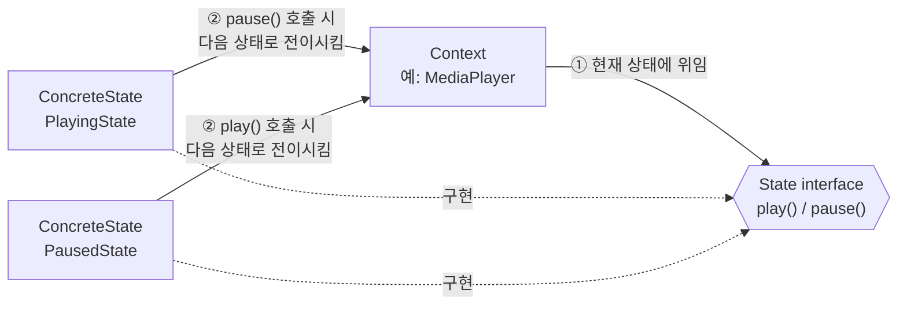
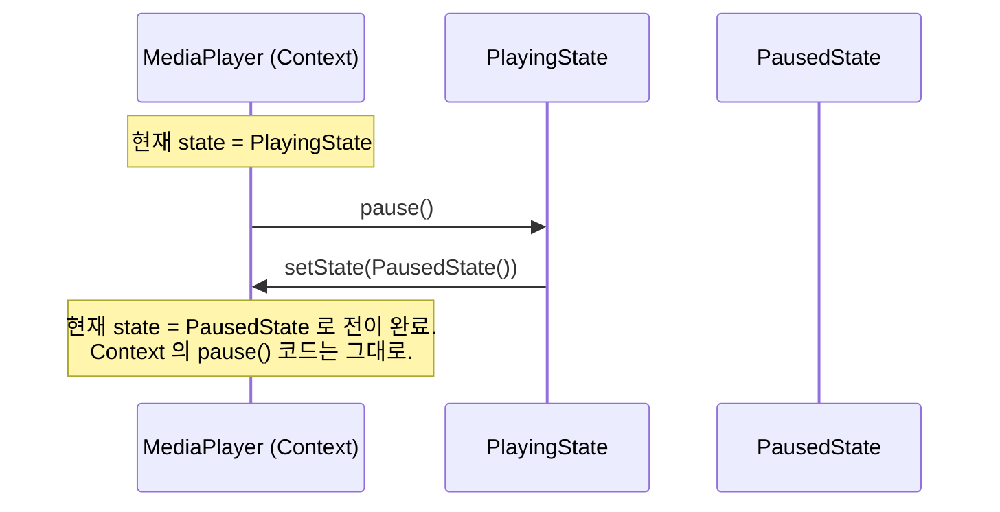
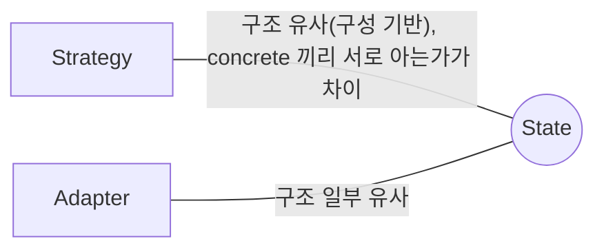

## Description

미디어 플레이어를 만든다고 해보자. `play()` 버튼 하나만 봐도 동작이 상태에 따라 완전히 달라짐 — 정지 상태면 재생을 시작하고, 재생 중이면 일시정지하고, 버퍼링 중이면 무시해야 함. 이걸 `if (state == PLAYING) { … } else if (state == PAUSED) { … } else if (state == BUFFERING) { … }` 로 짜면, 버튼 하나마다 이 조건문을 반복해야 하고 상태가 하나 늘어날 때마다 모든 조건문을 찾아다니며 분기를 추가해야 함.

**State Pattern** 은 객체의 내부 상태가 바뀌면 그에 따라 행동도 함께 바뀌게 해주는 행위 패턴. 각 상태를 별도의 클래스로 만들고, `Context`(플레이어)는 현재 상태 객체에게 동작을 위임하기만 하면 됨. 위 예시라면 `PlayingState`, `PausedState`, `BufferingState` 를 각각 클래스로 만들고, `MediaPlayer` 는 지금 어떤 상태 객체를 들고 있는지에 따라 자연스럽게 다르게 동작하게 됨 — 조건문이 사라지고, 상태 전이는 각 State 클래스가 스스로 책임짐.

- **핵심**: 상태마다 다르게 동작해야 하는 로직을 각각의 State 클래스로 캡슐화하고, Context 는 현재 State 객체에게 동작을 위임함.
- **목적**:
  1. 상태 전이를 위한 조건 로직이 복잡해지는 것을 클래스 분리로 해소함.
  2. 새로운 상태를 추가해도 기존 Context/State 코드를 건드리지 않게 함 ⇒ [OCP(Open Closed Principle)](../../solid/OCP(Open%20Closed%20Principle).md).

## Examples

- **미디어 플레이어의 재생 상태**: 조건문으로 구현하면 버튼 이벤트마다 `if (state == PLAYING)` 분기가 반복되지만, `PlayingState.pause()`, `PausedState.play()` 처럼 상태별 클래스로 나누면 각 상태에서 허용되는 동작만 자연스럽게 구현됨.
- **이슈 트래커(Jira)의 티켓 상태**: `OPEN → IN PROGRESS → RESOLVED → CLOSED` 처럼 상태마다 허용되는 다음 상태가 다름. 조건문으로 짜면 "이 상태에서 저 상태로 갈 수 있는지" 검증 로직이 여기저기 흩어지지만, State 클래스마다 자신이 전이 가능한 다음 상태를 알고 있게 하면 전이 규칙이 한 곳(해당 State 클래스)에 모임.

  

  >Jira 티켓은 유한한 개수의 상태를 가지고, 각 상태는 고유하게 동작하며, 정해진 상태로만 전이할 수 있음 — State Pattern 이 다루는 전형적인 유한 상태 기계(Finite-State Machine)의 예.

- **신호등**: 현재 색(빨강/노랑/초록)에 따라 "다음 색으로 바뀌는 시점" 과 "허용되는 동작" 이 다름. 색깔별 조건문 대신 `RedState`, `GreenState` 클래스로 나누면 각 색이 다음에 어떤 색으로 바뀌는지를 스스로 결정하게 만들 수 있음.

## Structure



일시정지 버튼을 눌렀을 때의 흐름을 시퀀스로 보면 아래와 같음.



- **Context**: 현재 상태를 가리키는 ConcreteState 인스턴스를 필드로 보관함. ConcreteState 의 구체적인 구현은 모르고 `State` 인터페이스로만 다룸. 상태를 바꾸는 setter 를 가짐.
- **State**: 특정 상태의 행동을 캡슐화하기 위한 인터페이스.
- **ConcreteState**: Context 와 관련된 상태별 행동을 구현함. 다음 상태로의 전이가 필요하면, Context 를 참조해서 스스로 상태를 바꿈.
- **Client**: Context 를 사용해 현재 상태를 확인하거나 상태 변화를 유발하는 명령을 내림. Context 의 초기 상태를 정의하는 쪽이기도 함.

## Adaptability

다음 상황에서 특히 유용함.

- 상태가 많고 자주 바뀌며, 상태에 따라 객체의 행동이 크게 달라지는 경우.
- 비슷한 상태/전환 로직에서 중복 코드가 많이 발생하는 경우.
- 상태에 따른 조건문이 복잡해지고 있는 경우.

## Pros

- **특정 상태에 관련된 코드를 분리된 클래스로 모을 수 있음** ⇒ [SRP(Single Responsibility Principle)](../../solid/SRP(Single%20Responsibility%20Principle).md). `PlayingState` 관련 로직을 고치는데 `PausedState` 코드를 열어볼 필요가 없음.
- **새 상태를 기존 코드 수정 없이 추가**할 수 있음 ⇒ [OCP(Open Closed Principle)](../../solid/OCP(Open%20Closed%20Principle).md). `BufferingState` 를 추가해도 `PlayingState`, `PausedState` 는 그대로 둠.
- **거대한 조건문을 없애서 코드를 단순하게 만듦**: 상태별 분기 대신, "지금 상태 객체에게 위임" 하나로 정리됨.

## Cons

- **상태가 몇 개 안 되고 거의 바뀌지 않는다면 과한 설계**: 상태가 2~3 개뿐이고 앞으로도 안 늘어날 것 같다면, 클래스를 여러 개로 나누는 비용이 조건문 하나보다 클 수 있음.

## Relationship with other patterns



| 비교 대상 | 공통점 | State 와의 차이 |
| :--- | :--- | :--- |
| [Strategy](Strategy%20Pattern.md) | 둘 다 Composition 기반이고, helper 객체(State/Strategy)가 Context 의 동작을 바꿔줌. State 는 흔히 Strategy 를 확장한 패턴으로 소개됨 | 가장 정확한 차이는 **concrete 구현끼리 서로를 아는가**: Strategy 의 ConcreteStrategy 들은 서로 독립적이라 다른 전략의 존재를 모름. State 의 ConcreteState 들은 서로를 알고, 스스로 다음 State 로 전이시키기도 함 — `PlayingState` 가 `pause()` 호출 시 직접 `PausedState` 를 만들어 Context 에 설정하는 것이 그 예. ("Strategy=상속 대체, State=조건문 대체" 라는 설명도 흔하지만 이건 대략적인 감일 뿐, concrete 간 상호 인지 여부가 더 정확한 기준. [Strategy Pattern](Strategy%20Pattern.md) 문서 참고.) |
| [Adapter](../structural/Adapter%20Pattern.md) | 다른 객체에 실제 작업을 위임하는 구조가 일부 비슷해 보일 수 있음 | Adapter 는 서로 다른 인터페이스를 맞추는 것이 목적이라, State 가 다루는 "상태에 따른 행동 전환" 과는 풀려는 문제 자체가 다름. |

## Modern Applicability (DI/Composition Root)

[Composition Root](../general/patterns/Composition%20Root.md) 관점에서 State 는 **3 그룹: 여전히 설계의 핵심** 에 속함. 상태 전이 규칙은 도메인마다 다른 로직이라 언어나 프레임워크가 대신 정의해줄 수 없음.

**"그래도 결국 누군가는 concrete 를 알아야 하지 않나?"** 맞고, State 패턴에서는 오히려 이게 자연스러움 — ConcreteState 들끼리 서로를 알고 다음 상태로 전이시키는 것 자체가 패턴의 일부이기 때문(Strategy 와의 핵심 차이). Composition Root 가 담당하는 건 "초기 상태와, 상태들이 의존하는 공통 자원(예: `AudioManager`)을 배선하는 것" 임.

**Android 예시 (Metro)** — 재생 상태(Playing/Paused/Stopped) 관리.

```kotlin
sealed interface PlayerState {
    fun play(context: MediaPlayerContext): PlayerState
    fun pause(context: MediaPlayerContext): PlayerState
}

class PlayingState(private val audioManager: AudioManager) : PlayerState {
    override fun play(context: MediaPlayerContext) = this
    override fun pause(context: MediaPlayerContext): PlayerState {
        audioManager.pause()
        return PausedState(audioManager) // 다음 State 를 직접 앎
    }
}

class PausedState(private val audioManager: AudioManager) : PlayerState {
    override fun play(context: MediaPlayerContext): PlayerState {
        audioManager.resume()
        return PlayingState(audioManager)
    }
    override fun pause(context: MediaPlayerContext) = this
}

@Inject
class MediaPlayerContext(private val audioManager: AudioManager) {
    private var state: PlayerState = PausedState(audioManager)
    fun onPlayClicked() { state = state.play(this) }
    fun onPauseClicked() { state = state.pause(this) }
}

@DependencyGraph(AppScope::class)
interface AppGraph {
    val mediaPlayerContext: MediaPlayerContext

    @Provides
    fun provideAudioManager(): AudioManager = AudioManagerImpl()
}
```

`AppGraph` 는 `MediaPlayerContext` 가 어떤 `AudioManager` 로 시작할지만 배선함. 상태들이 서로를 알고 전이하는 로직 자체는 `AppGraph` 가 아니라 State 클래스들 내부에 있음 — Strategy 였다면 어떤 전략을 쓸지 Composition Root 가 정했겠지만, State 는 "다음 상태가 무엇인지" 를 State 스스로 결정한다는 점이 다름.
