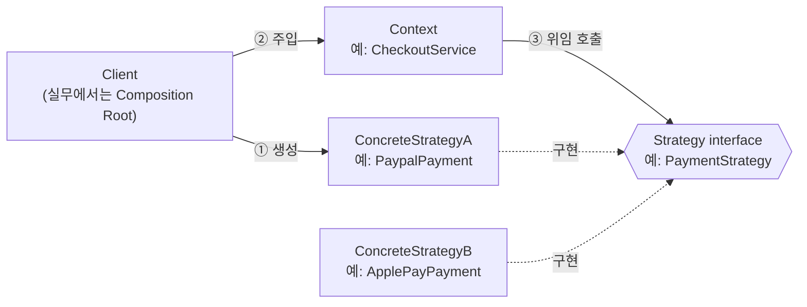
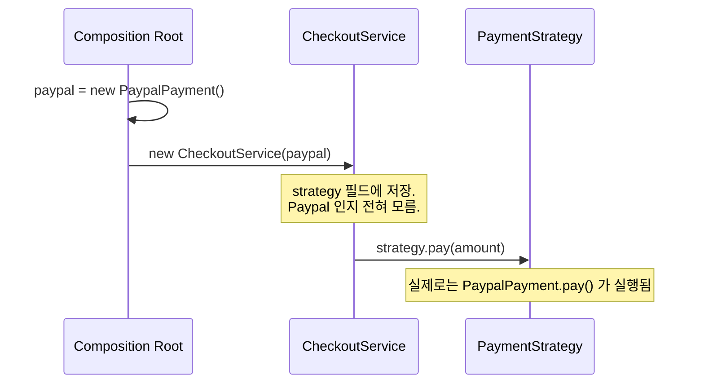
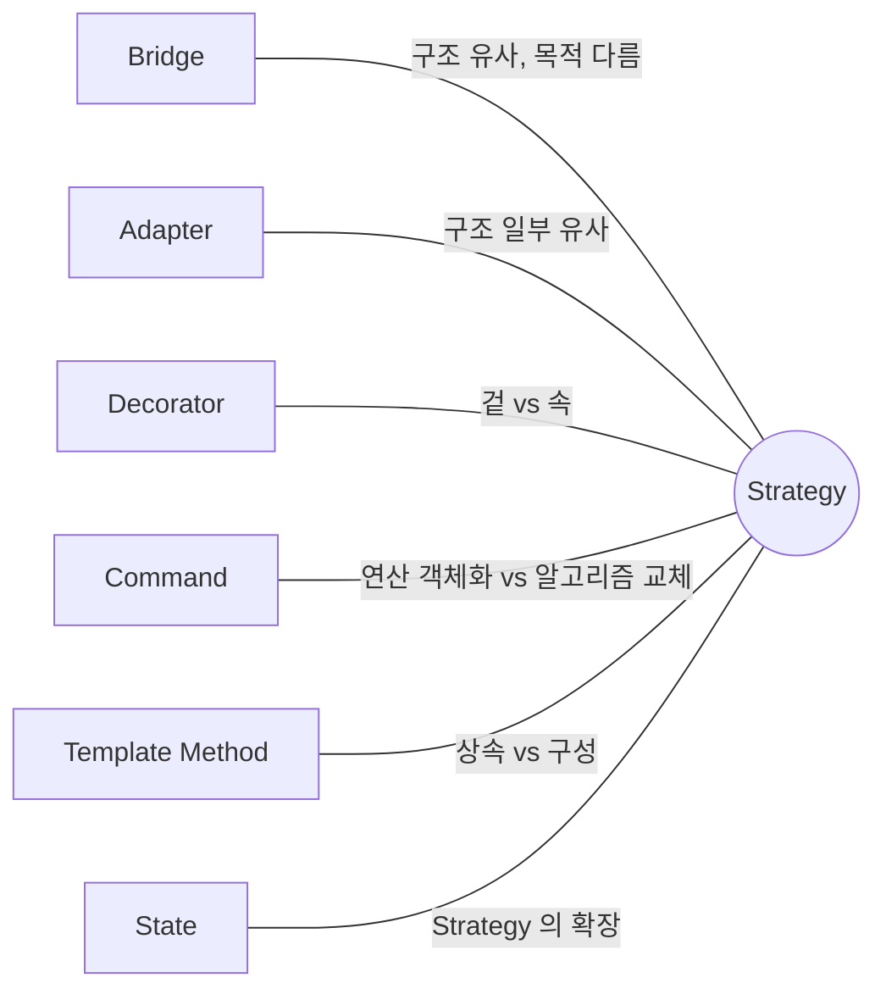

## Description

결제 로직을 만든다고 해보자. 처음엔 신용카드만 지원하면 됐는데, PayPal, ApplePay 가 하나씩 추가되면서 `CheckoutService` 안에 `if (type == "card") … else if (type == "paypal") …` 같은 분기가 계속 늘어남. 결제 수단이 하나 더 생길 때마다 이미 잘 동작하던 `CheckoutService` 코드를 매번 다시 열어서 고쳐야 하는 게 문제.

**Strategy Pattern** 은 이렇게 "같은 목적을 이루는 여러 방법(알고리즘)" 을 각각 독립된 클래스로 떼어내고, 공통 인터페이스로 묶어서 실행 중에(Runtime) 서로 교체할 수 있게 만드는 행위(Behavioral) 패턴. 위 예시라면 `CreditCardPayment`, `PaypalPayment`, `ApplePayPayment` 를 각각 클래스로 만들고 `PaymentStrategy` 인터페이스로 묶으면, `CheckoutService` 는 셋 중 무엇이 오는지 몰라도 결제를 처리할 수 있음.


>지도 앱에서 공항까지 가는 방법을 생각해보면 쉬움. 비행기(빠르지만 비쌈), 자전거(무료), 버스($), 택시($$) 처럼 목적은 같지만 방법(전략)이 여러 개이고, 상황에 따라 고르는 방법만 바뀜 — 지도 앱 로직 자체를 바꿀 필요는 없음. 이게 Strategy Pattern 의 대표적인 비유.

- **핵심**: 여러 알고리즘(전략)을 각각 별도의 클래스로 캡슐화하고, 공통 인터페이스로 교체 가능하게 만듦.
- **목적**:
  1. 알고리즘을 사용하는 코드와 알고리즘의 실제 구현을 분리.
  2. 런타임에 로직을 바꾸거나, if-else 분기가 계속 늘어나는 걸 막고 싶을 때 사용.
  3. 새로운 전략을 추가해도 기존 코드는 건드리지 않도록 하여 **[OCP(Open Closed Principle)](../../solid/OCP(Open%20Closed%20Principle).md)** 를 준수.

## Examples

- **정렬(Sorting)**: 데이터가 적을 땐 `BubbleSort`, 많을 땐 `QuickSort` 를 쓰고 싶다면, 정렬기 코드를 고치는 대신 상황에 맞는 Strategy 를 골라서 넣어주기만 하면 됨.
- **결제(Payment)**: `CreditCard`, `PayPal`, `ApplePay` 를 Strategy 로 만들면, 사용자가 고른 수단에 따라 `CheckoutService` 코드 수정 없이 결제 로직만 교체됨.
- **게임(RPG)**: 무기를 바꾸면 공격 방식도 바뀌어야 함. `SwordAttack`, `BowAttack` 을 Strategy 로 구현하면 캐릭터 클래스를 건드리지 않고도 무기 교체만으로 공격 로직이 즉시 바뀜.

## Structure



위 다이어그램을 결제 예시에 대입하면 아래 흐름이 됨.



(`Service` 는 GoF 의 Context, `Strategy` 는 Strategy 인터페이스에 대응됨.)

- **Strategy**: Concrete Strategy 들이 공통으로 구현하는 interface. `Context` 는 이 인터페이스만 앎.
- **Concrete Strategy**: Strategy 인터페이스에 맞춰 실제 알고리즘을 구현한 클래스들 (`PaypalPayment`, `ApplePayPayment` 등).
- **Context**: Strategy 객체를 필드로 들고 있고, 실제 실행은 Strategy 에 위임함. 어떤 알고리즘이 들어올지는 신경 쓰지 않기 때문에 런타임에 자유롭게 교체 가능.
- **Client**: 상황에 맞는 Concrete Strategy 를 골라서 Context 에 주입하는 쪽. 실무에서는 이 역할을 애플리케이션의 조립 지점([Composition Root](../general/patterns/Composition%20Root.md))이 담당하는 경우가 많음 — 자세한 내용은 아래 [Modern Applicability](#modern-applicability-di-composition-root) 참고.

## Adaptability

다음 상황에서 특히 유용함.

- 같은 일을 하는 방식이 여러 개 있고, 런타임 중에 방식을 전환하고 싶은 경우.
- 동작 하나만 다르고 나머지는 비슷한 클래스가 여러 개 생기고 있는 경우.
- 알고리즘의 구현 세부사항을 클래스의 핵심 로직에서 분리하고 싶은 경우.
- 알고리즘을 고르는 조건문(if-else, switch) 이 점점 커지고 있는 경우.

## Pros

- **새 알고리즘 추가가 기존 코드에 영향을 주지 않음**: `HuaweiPayment` 를 새로 추가해도 `CheckoutService` 는 한 글자도 안 바뀜 ⇒ [OCP(Open Closed Principle)](../../solid/OCP(Open%20Closed%20Principle).md).
- **런타임에 전략을 자유롭게 교체 가능**: 사용자가 결제 수단을 바꾸면 `Context` 에 들어가는 Strategy 객체만 갈아 끼우면 됨. (반대로 Template Method 는 상속 기반이라 컴파일 타임에 클래스가 정해짐 — 아래 Relationship 참고.)
- **테스트가 쉬워짐**: `if-else` 뭉치 하나를 통째로 테스트하는 대신, `PaypalPayment.pay()` 하나만 독립적으로 단위 테스트할 수 있음.
- **각 알고리즘의 의존성이 서로 격리됨**: `PaypalPayment` 가 Paypal SDK 를 의존해도 `ApplePayPayment` 나 `CheckoutService` 에는 영향이 없음.

## Cons

- **선택하는 쪽은 결국 차이를 알아야 함**: `Context` 에 어떤 Strategy 를 넣을지 결정하는 코드(Client 또는 [Composition Root](../general/patterns/Composition%20Root.md))는 `PaypalPayment` 와 `ApplePayPayment` 의 차이를 알아야 함. Strategy 패턴은 이 "아는 코드" 를 없애는 게 아니라 한 곳으로 모으는 것 — 자세한 내용은 아래 Modern Applicability 참고.
- **알고리즘이 거의 안 바뀐다면 과한 설계**: 결제 수단이 앞으로도 하나뿐이라면, 인터페이스 + 클래스 여러 개로 나누는 비용이 이득보다 클 수 있음.
- **작고 순수한 전략은 클래스 대신 함수로 충분한 경우가 많음**: 대부분의 언어가 함수를 값처럼 다룰 수 있기 때문(함수 타입, 람다).

  ```kotlin
  // 클래스 3개짜리 Strategy 대신, 순수 계산이라면 함수 하나로 충분
  val discountStrategies: Map<String, (Int) -> Int> = mapOf(
      "vip" to { price -> price * 8 / 10 },
      "student" to { price -> price * 9 / 10 },
  )
  ```

단, Payment 처럼 DI·트랜잭션·로깅이 얽히는 "서비스형" 전략이라면 이 이야기가 그대로 적용되지 않음 (아래 Modern Applicability 참고).

## Relationship with other patterns



패턴은 "이렇게 코드를 짜라" 는 레시피가 아니라 "어떤 문제를 풀고 있는지" 를 동료에게 전달하는 언어에 가까움. 그래서 구조가 비슷해도 의도가 다르면 다른 패턴으로 부름.

| 비교 대상 | 공통점 | Strategy 와의 차이 |
| :--- | :--- | :--- |
| [Bridge](../structural/Bridge%20Pattern.md), [Adapter](../structural/Adapter%20Pattern.md) | 셋 다 실제 작업을 다른 객체에 위임(Composition)하는 구조 | Bridge 는 추상화와 구현을 분리하는 게 목적, Adapter 는 서로 다른 인터페이스를 맞추는 게 목적 — Strategy 처럼 "같은 인터페이스의 알고리즘을 교체" 하려는 목적이 아님. 구조가 비슷할 뿐 풀려는 문제가 다름. |
| [Decorator](../structural/Decorator%20Pattern.md) | 둘 다 Composition 기반 | Decorator 는 객체의 **겉**(기존 인터페이스는 유지한 채 책임을 덧붙임), Strategy 는 객체의 **속**(특정 동작의 알고리즘 자체를 교체)을 바꿈. |
| [Command](Command%20Pattern.md) | 둘 다 객체를 필드/파라미터로 들고 있어서 비슷해 보임 | Command 는 **연산 자체**를 객체로 바꿔서 지연 실행·큐잉·기록·원격 전송을 가능하게 함. Strategy 는 **같은 목적의 알고리즘 여러 개**를 자유롭게 교체하는 것. |
| [Template Method](Template%20Method%20Pattern.md) | 둘 다 알고리즘의 일부를 바꿔 끼우는 용도 | Template Method 는 **상속** 기반이라 어떤 동작이 실행될지가 "어떤 서브클래스인지"(=객체 생성 시점, class level)로 고정됨. Strategy 는 **구성** 기반이라 Context 에 어떤 Strategy 객체가 들어있는지(=object level)로 정해져서 런타임에 바뀔 수 있음. |
| [State](State%20Pattern.md) | 둘 다 Composition 기반, helper 객체가 Context 의 동작을 바꿔줌. State 는 Strategy 를 확장한 패턴으로 봄 | 가장 정확한 차이는 **concrete 구현끼리 서로를 아는가**: Strategy 의 ConcreteStrategy 들은 서로 독립적이라 다른 전략의 존재를 모름. State 의 ConcreteState 들은 서로를 알고, 스스로 다음 State 로 전이(transition)시키기도 함. ("Strategy=상속 대체, State=조건문 대체" 라는 설명도 흔하지만 이건 대략적인 감일 뿐, 위 차이가 더 정확함.) |

## Modern Applicability (DI/Composition Root)

[Composition Root](../general/patterns/Composition%20Root.md) 관점에서 보면 Strategy 는 **3 그룹: 여전히 설계의 핵심** 에 속함. 단, 크기에 따라 갈림.

- 정렬 알고리즘처럼 순수한 전략 → 함수/람다로 충분.
- Payment, Auth, Retry 처럼 로깅·DI·생명주기가 얽힌 전략 → "알고리즘" 이 아니라 사실상 **서비스** 라 `interface` + 클래스가 자연스러움.

**"그래도 결국 누군가는 concrete 를 알아야 하지 않나?"** GoF 다이어그램은 여기서 멈춰서 오해를 줌. Strategy 가 없애는 건 "아는 사람" 이 아니라 **"아는 위치의 개수"**. `CheckoutViewModel` 은 Paypal 인지 모르고, [Composition Root](../general/patterns/Composition%20Root.md) 한 곳만 알면 됨.

**Android 예시 (Metro)** — 스토어별로 결제 전략이 갈리는 경우.

```kotlin
interface PaymentStrategy {
    fun pay(amount: Int)
}

@Inject class SamsungBillingStrategy : PaymentStrategy { /* ... */ }
@Inject class GoogleBillingStrategy : PaymentStrategy { /* ... */ }

@Inject
class CheckoutViewModel(private val strategy: PaymentStrategy) // 구체 구현을 모름

@DependencyGraph(AppScope::class)
interface AppGraph {
    val checkoutViewModel: CheckoutViewModel

    @Provides
    fun providePaymentStrategy(
        samsung: SamsungBillingStrategy,
        google: GoogleBillingStrategy,
    ): PaymentStrategy =
        if (Build.MANUFACTURER == "Samsung") samsung else google
}
```

`AppGraph` 가 Composition Root. 스토어가 늘어나도(Huawei 등) `CheckoutViewModel` 은 수정하지 않음 ⇒ [OCP(Open Closed Principle)](../../solid/OCP(Open%20Closed%20Principle).md) 유지. Strategy 가 사라진 게 아니라 "누가 결정하는가" 가 `AppGraph` 라는 명시적 지점으로 이동했을 뿐.
