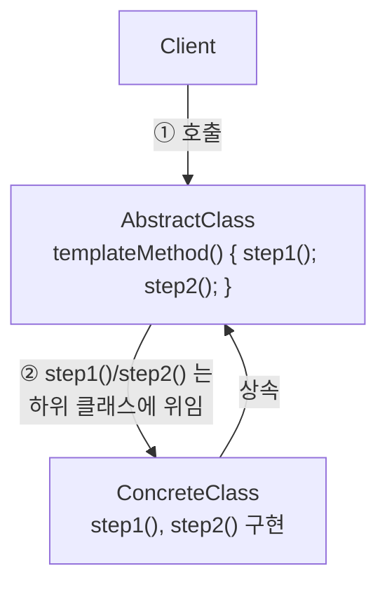
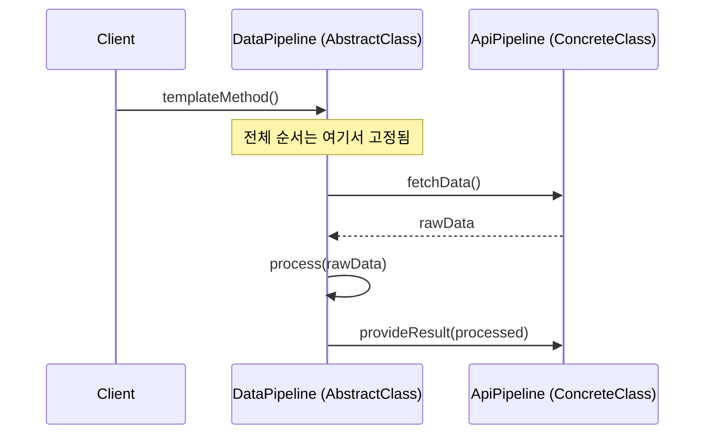
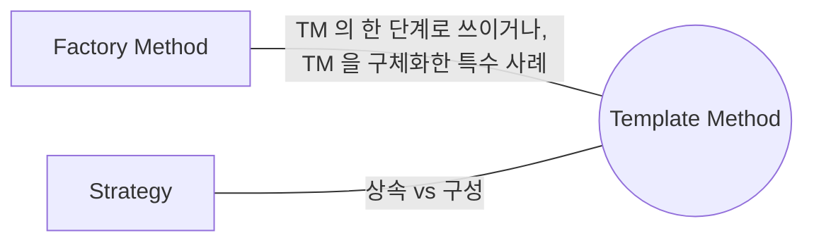

## Description

데이터 처리 파이프라인을 여러 개 만든다고 해보자. "3rd-party API 로 데이터 가져오기 → 처리 → 콘솔에 출력" 과 "내장 파일에서 데이터 가져오기 → 처리 → 이메일로 전송" 은 세부 단계는 다르지만 "가져오기 → 처리 → 제공" 이라는 전체 구조는 똑같음. 이 구조를 매번 복붙해서 구현하면, 전체 흐름이 바뀔 때(예: 로깅 단계 추가) 모든 구현체를 찾아다니며 똑같이 고쳐야 함.

**Template Method Pattern** 은 알고리즘의 전체 구조(뼈대)는 상위 클래스에 고정해두고, 그중 일부 단계만 하위 클래스가 재정의하게 하는 행위 패턴. 위 예시라면 `DataPipeline` 추상 클래스가 "가져오기 → 처리 → 제공" 순서를 `templateMethod()` 로 고정하고, `fetchData()`/`provideResult()` 만 하위 클래스(`ApiPipeline`, `FilePipeline`)가 구현하면 됨 — 전체 흐름을 바꾸고 싶으면 상위 클래스 하나만 고치면 모든 하위 클래스에 반영됨.

- **핵심**: 알고리즘의 뼈대를 상위 클래스(AbstractClass)에 고정하고, 세부 단계만 하위 클래스(ConcreteClass)가 오버라이드하게 함.
- **목적**:
  1. 여러 클래스에 반복되는 알고리즘 구조를 한 곳에 모아 중복을 없앰 ⇒ **DRY(Don't Repeat Yourself)**.
  2. 전체 구조는 지키면서 세부 단계만 다르게 만들고 싶을 때 사용.
  3. 하위 클래스가 알고리즘의 특정 부분만 재정의하도록 강제해서, 다른 부분의 변경 영향을 덜 받게 함.

## Examples

데이터 파이프라인 외에 다른 도메인에서도 같은 구조가 쓰인다는 걸 보여주는 예시들. (아래 Structure 부터는 다시 파이프라인 예시로 돌아감.)

- **결제 처리 흐름**: "검증 → 결제 → 영수증 발급" 이라는 순서를 각 결제 수단(카드/포인트)마다 복붙하면, 검증 로직에 로깅을 추가해야 할 때 모든 결제 수단 클래스를 다 고쳐야 함. `AbstractPaymentFlow` 에 순서를 고정하고 `charge()` 만 하위 클래스가 구현하면, 검증/로깅 변경은 상위 클래스 한 곳만 고치면 됨.
- **리포트 생성**: "데이터 조회 → 가공 → 포맷팅(PDF/CSV) → 저장" 구조가 리포트 종류마다 같다면, 포맷팅 단계만 하위 클래스가 다르게 구현하고 나머지는 상위 클래스가 통제함.
- **API 응답 파싱**: "네트워크 호출 → 에러 체크 → JSON 파싱 → 캐시 저장" 순서가 API 마다 같다면, 에러 체크나 캐시 저장 로직이 하나 바뀔 때 API 클래스 개수만큼 고치는 대신 템플릿 하나만 고치면 됨.

## Structure



파이프라인 실행 흐름을 시퀀스로 보면 아래와 같음.



```kotlin
abstract class DataPipeline {
    // templateMethod. final 로 선언해 하위 클래스가 순서 자체는 못 바꾸게 함.
    fun templateMethod() {
        val raw = fetchData()          // primitive operation, 하위 클래스가 구현
        val processed = process(raw)   // 공통 로직, 모든 하위 클래스가 그대로 공유
        provideResult(processed)       // primitive operation, 하위 클래스가 구현
    }

    protected abstract fun fetchData(): RawData
    private fun process(raw: RawData): RawData = raw // 공통 처리 (final operation)
    protected abstract fun provideResult(data: RawData)
}

class ApiPipeline(private val api: RemoteApi) : DataPipeline() {
    override fun fetchData() = api.fetchLatest()
    override fun provideResult(data: RawData) = println(data) // 콘솔에 출력
}

class FilePipeline(private val file: File) : DataPipeline() {
    override fun fetchData() = RawData.fromFile(file)
    override fun provideResult(data: RawData) = EmailSender.send(data) // 이메일로 전송
}
```

- **AbstractClass**: 알고리즘의 뼈대를 정의하는 `templateMethod()` 를 포함. 하위 클래스가 구현해야 할 추상 연산이나, 필요하면 재정의 가능한 기본 구현을 함께 선언함.
- **ConcreteClass**: 변하지 않는 단계는 AbstractClass 를 그대로 상속받아 쓰고, 세부 단계만 자신에 맞게 구현함.
- Template Method 안의 연산 종류
  - **primitive operations**: 하위 클래스가 반드시 구현해야 하는 추상 연산.
  - **hook operations**: 기본 동작(대개 아무것도 안 함)을 제공하고, 필요할 때만 하위 클래스가 오버라이드하는 연산.
  - **final operations**: 하위 클래스가 오버라이드할 수 없도록 고정된 연산.
  - **template method 자체**: 보통 `final` 로 선언해서 하위 클래스가 전체 순서 자체는 바꾸지 못하게 함.

여기서는 `DataPipeline` 이 `templateMethod()` 의 실행 순서와 `process()` 공통 처리를 실제로 제공하므로 abstract class 가 정당함. 공유 구현 없이 추상 단계만 나열하는 구조라면 interface 가 낫지만, Template Method 의 핵심은 바로 이 공통 알고리즘 골격을 상위 클래스가 소유한다는 점임.

`Hollywood Principle` — *"Don't call us, we will call you"* — 이 패턴을 잘 설명해줌.

## Adaptability

다음 상황에서 특히 유용함.

- 알고리즘의 특정 단계만 확장하고, 전체 구조는 확장하지 못하게 하고 싶은 경우.
- 전체적으로는 같지만 세부 단계만 조금씩 다른 알고리즘 여러 개를 다뤄야 하는 경우.

## Pros

- **중복 코드를 줄일 수 있음**(=DRY): 공통 구조를 상위 클래스 한 곳에 모음.
- **하위 클래스의 역할이 좁아져서 핵심 로직 관리가 쉬워짐**: 하위 클래스는 자신이 담당하는 단계만 신경 쓰면 됨.
- **알고리즘의 다른 부분이 바뀌어도 영향을 덜 받음**: 클라이언트가 오버라이드하는 부분이 명확히 제한되어 있기 때문.

## Cons

- **추상 메소드가 많아지면 클래스 계층 관리가 복잡해짐**: 단계가 세분화될수록 하위 클래스가 구현해야 할 메소드 수도 늘어남.
- **[LSP(Liskov substitution principle)](../../solid/LSP(Liskov%20substitution%20principle).md) 를 위반할 위험이 있음**: 하위 클래스가 기본 구현(hook)을 무시하거나 예상과 다르게 오버라이드하면, `AbstractClass` 타입으로 다뤄질 때 예상치 못하게 동작할 수 있음.
- **상속 기반이라 컴파일 타임에 알고리즘 변형이 고정됨**: 런타임에 알고리즘을 바꿔야 한다면 Template Method 가 아니라 [Strategy Pattern](Strategy%20Pattern.md) 이 더 적합함.
- **앱 코드에서는 Strategy/Composition 이 더 나은 경우가 많음**: Template Method 는 프레임워크나 라이브러리처럼 "확장 지점은 열어두되 실행 순서는 강제"해야 할 때 특히 적합함. 화면/도메인 로직에서 실행 흐름을 런타임에 바꿔 끼워야 한다면 상속보다 Strategy 나 작은 함수 조합을 우선 검토하는 편이 Kotlin 스타일에 맞음.
- **알고리즘 구조 자체가 클라이언트를 제한할 수 있음**: 상위 클래스가 정해둔 뼈대를 벗어나는 흐름은 표현하기 어려움.

## Relationship with other patterns



| 비교 대상 | 공통점 | Template Method 와의 차이 |
| :--- | :--- | :--- |
| [Factory Method](../creational/Factory%20Method%20Pattern.md) | 둘 다 하위 클래스가 특정 단계를 오버라이드하는 구조 | Factory Method 는 "객체 생성" 이라는 한 단계만 다루는, Template Method 를 특수화한 형태로 볼 수 있음. 동시에 Factory Method 자체가 더 큰 Template Method 안의 한 단계로 쓰이기도 함. |
| [Strategy](Strategy%20Pattern.md) | 둘 다 알고리즘의 일부를 바꿔 끼우는 용도 | Template Method 는 **상속** 기반이라 어떤 동작이 실행될지가 "어떤 서브클래스인지"(컴파일 타임, class level)로 고정됨. Strategy 는 **구성** 기반이라 Context 에 어떤 Strategy 객체가 들어있는지(런타임, object level)로 정해짐. 또한 Template Method 는 하위 클래스들이 상위 클래스의 공통 코드를 공유하지만, Strategy 는 각 ConcreteStrategy 구현이 서로 독립적이라 공유하는 코드가 없음. |

## Modern Applicability (DI/Composition Root)

[Composition Root](../general/patterns/Composition%20Root.md) 관점에서 Template Method 는 **3 그룹: 여전히 설계의 핵심** 에 속함. "공통 흐름은 고정하고 일부만 바꾼다" 는 상속 기반 재사용은 언어가 대신해줄 수 없는, 여전히 설계자가 직접 짜야 하는 구조임.

**"그래도 결국 누군가는 concrete 를 알아야 하지 않나?"** Template Method 는 애초에 상속 관계이므로, 어떤 ConcreteClass 를 쓸지는 **컴파일 타임에 코드 자체(어떤 클래스를 선언했는지)** 로 정해짐 — Strategy 처럼 "누가 concrete 를 배선하는가" 라는 질문보다는, "공통 의존성을 상위 클래스에 어떻게 주입하는가" 가 Composition Root 의 역할이 됨.

**Android 예시 (Metro)** — Structure 절의 `DataPipeline` 에 로깅이라는 공통 의존성을 추가한 버전. 실행 순서(가져오기 → 가공 → 로깅 → 제공)는 상위 클래스가 고정하고, `Analytics` 처럼 모든 파이프라인이 공유하는 의존성만 Composition Root 가 배선함.

```kotlin
abstract class DataPipeline(private val analytics: Analytics) {
    // templateMethod 역할. 전체 순서를 여기서 고정.
    fun run() {
        val raw = fetchData()                           // primitive operation, 하위 클래스가 구현
        val processed = process(raw)                     // 공통 로직, 모든 하위 클래스가 그대로 공유
        analytics.logPipelineRun(javaClass.simpleName)    // hook 처럼 끼워둔 공통 로직
        provideResult(processed)                          // primitive operation, 하위 클래스가 구현
    }

    protected abstract fun fetchData(): RawData
    private fun process(raw: RawData): RawData = raw
    protected abstract fun provideResult(data: RawData)
}

@Inject
class ApiPipeline(
    private val api: RemoteApi,
    analytics: Analytics,
) : DataPipeline(analytics) {
    override fun fetchData() = api.fetchLatest()
    override fun provideResult(data: RawData) = println(data) // 콘솔에 출력
}

@DependencyGraph(AppScope::class)
interface AppGraph {
    @Provides
    fun provideAnalytics(): Analytics = FirebaseAnalytics()
}
```

`analytics` 라는 공통 의존성은 `AppGraph` 가 배선하고, `DataPipeline` 은 이를 받아 모든 하위 파이프라인에 로깅 순서를 강제함. `ApiPipeline` 을 사용하는 쪽은 `fetchData()`/`provideResult()` 만 신경 쓰면 되고, 실행 순서에 로깅이 언제 끼어드는지는 몰라도 됨.
