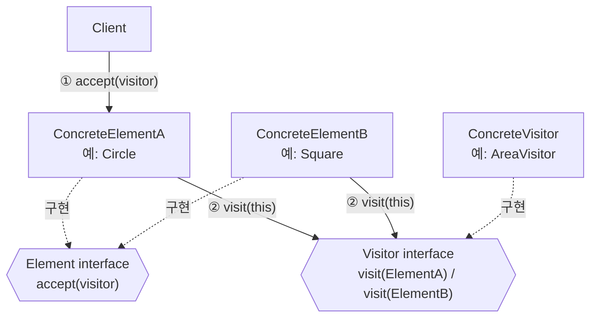
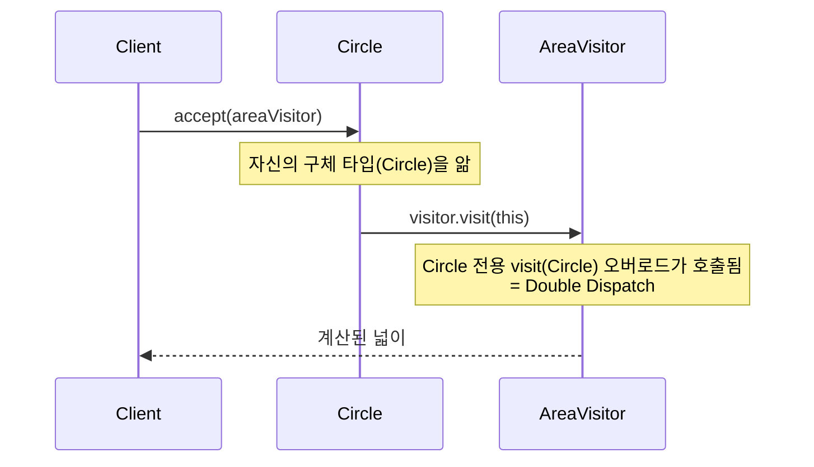
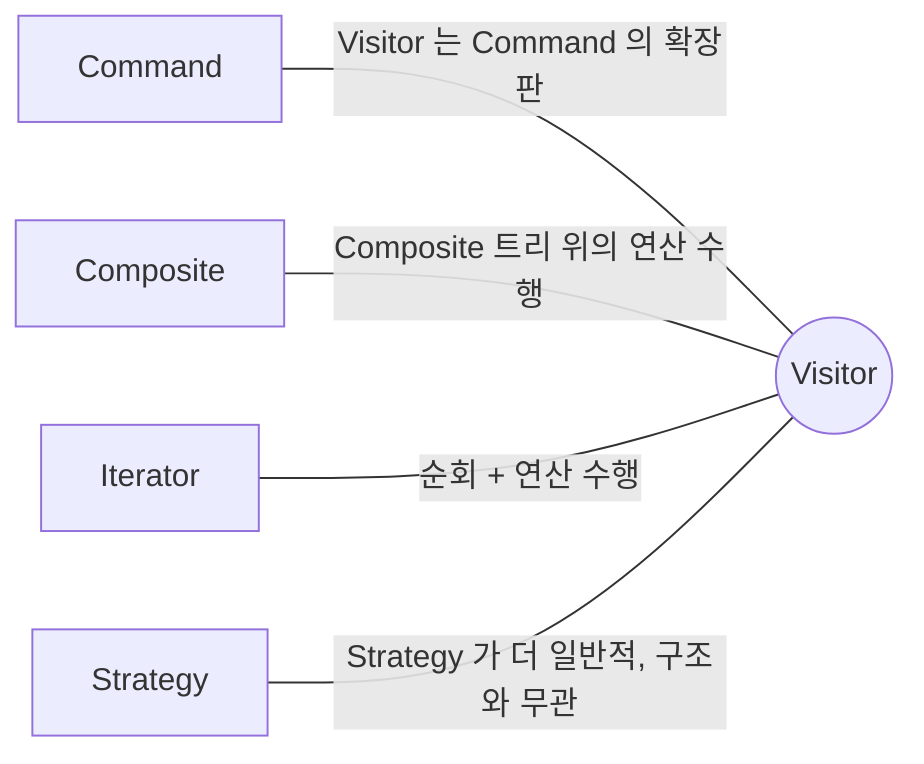

## Description

AST(추상 구문 트리)나 도형 목록처럼 여러 종류의 요소로 이루어진 자료구조가 있다고 해보자. "전체를 문자열로 출력", "전체 넓이 합산", "XML 로 직렬화" 처럼 새로운 연산이 필요할 때마다 각 요소 클래스(`Circle`, `Square`, …)에 메소드를 하나씩 추가하면, 연산이 늘어날수록 모든 요소 클래스를 계속 열어서 고쳐야 함. 자료구조 자체는 안정적인데, 그 위에서 실행할 연산만 계속 늘어나는 상황에서 이 방식은 확장성이 떨어짐.

**Visitor Pattern** 은 데이터 구조(Element)와 그 위에서 수행할 연산(Operation)을 분리하는 행위 패턴. 새로운 연산이 필요하면 Element 클래스들을 건드리는 대신, 그 연산을 구현한 새로운 `Visitor` 클래스 하나만 추가하면 됨. 각 Element 는 `accept(visitor)` 하나만 구현해두고, 실제 로직은 Visitor 가 요소 타입에 맞춰 수행함(Double Dispatch).


>노점상(Visitor)이 여러 회사(Element)를 돌아다니며 주문을 받는 상황을 생각하면 쉬움. 노점상은 회사마다 다른 응대를 하지만, 회사들 입장에서는 노점상을 자기 건물 안으로 "받아들이는" `accept()` 역할만 하면 됨 — 회사(Element)의 구조를 바꾸지 않고도 노점상(Visitor)이 새로운 메뉴(연산)를 들고 다시 방문할 수 있음.

- **핵심**: 데이터 구조 안의 요소들을 수정하지 않고도, 새로운 동작(연산)을 추가할 수 있게 함.
- **방식**: `Visitor` 객체가 각 `Element` 를 돌아다니며 작업을 수행함.
  1. Client 가 Element 에게 `accept(visitor)` 호출.
  2. Element 는 Visitor 에게 `visit(this)` 를 호출해 자기 자신을 넘겨줌.
  3. Visitor 는 전달받은 Element 의 구체 타입에 맞는 로직을 수행함(Double Dispatch).
- **목적**: 클래스 구조는 거의 바뀌지 않지만, 그 구조를 대상으로 하는 연산이 자주 추가/변경되는 경우(예: 컴파일러의 AST 순회, 리포트 생성)에 사용.

## Examples

- **도형 목록에 넓이 계산, 렌더링, 직렬화 연산을 추가**해야 할 때, 매번 `Circle`/`Square`/`Triangle` 클래스를 열어서 메소드를 추가하는 대신 `AreaVisitor`, `RenderVisitor` 를 각각 추가하면 도형 클래스는 그대로 둘 수 있음.
- **컴파일러의 AST 순회**: 타입 체크, 최적화, 코드 생성이 모두 같은 AST 노드 구조 위에서 수행되지만 서로 다른 연산임. 노드 클래스마다 이 세 가지 로직을 다 넣는 대신, `TypeCheckVisitor`, `OptimizeVisitor`, `CodeGenVisitor` 로 나누면 각 연산이 독립적으로 관리됨.
- **외부 라이브러리의 클래스 계층**: 소스를 수정할 수 없는 서드파티 클래스 계층에 새 연산을 추가하고 싶을 때, Visitor 는 요소 클래스를 건드리지 않고도 연산을 덧붙일 수 있는 몇 안 되는 방법 중 하나임.

## Structure



Double Dispatch 가 일어나는 과정을 시퀀스로 보면 아래와 같음.



- **Visitor**: `ConcreteElement` 를 파라미터로 받는 일련의 `visit()` 메소드를 선언하는 인터페이스. 오버로딩을 지원하는 언어라면 같은 이름으로 선언해도 되지만, 파라미터 Element 타입은 각기 달라야 함.
- **ConcreteVisitor**: 서로 다른 `ConcreteElement` 클래스에 맞춰 조정된, 같은 연산의 여러 버전을 구현함.
- **Element**: Visitor 를 받아들이는 `accept()` 를 선언하는 인터페이스. 파라미터는 `Visitor` 타입.
- **ConcreteElement**: `accept()` 를 구현해서, 자신에 맞는 Visitor 메소드로 호출을 리다이렉트함.
- **Client**: 복잡한 컬렉션이나 트리 구조를 다루며, 보통 추상 인터페이스를 통해서만 요소들과 상호작용하므로 구체적인 Element 클래스를 몰라도 됨.

## Adaptability

다음 상황에서 특히 유용함.

- 복잡한 객체 구조의 모든 요소에 대해 연산을 실행해야 하는데, 구체 클래스의 인터페이스는 바꾸고 싶지 않은 경우.
- 보조적인 비즈니스 로직을 요소 클래스 밖으로 정리하고 싶은 경우.
- 클래스 계층 중 일부에만 의미 있는 연산을, 계층 전체에 억지로 끼워 넣지 않고 분리하고 싶은 경우.
- 객체 구조(클래스 계층)가 거의 바뀌지 않을 것으로 예상되는 경우에만 적용을 권장함 — 아래 Cons 참고.

## Pros

- **같은 연산의 여러 버전을 하나의 Visitor 클래스로 모을 수 있음** ⇒ [SRP(Single Responsibility Principle)](../../solid/SRP(Single%20Responsibility%20Principle).md). `AreaVisitor` 하나에 도형별 넓이 계산 로직이 다 모여있음.
- **기존 코드 수정 없이 새로운 연산을 추가**할 수 있음 ⇒ [OCP(Open Closed Principle)](../../solid/OCP(Open%20Closed%20Principle).md). 새 연산이 필요하면 새 Visitor 클래스만 추가.
- **복잡한 객체 구조를 순회하며 유용한 정보를 축적**하기 좋음: 트리를 한 번 순회하면서 여러 요소로부터 값을 모으는 연산에 적합함.

## Cons

- **Element 계층에 클래스가 추가/제거될 때마다 모든 Visitor 를 업데이트해야 함**: 도형이 하나 늘어나면 `AreaVisitor`, `RenderVisitor` 등 기존 Visitor 전부에 해당 도형을 처리하는 메소드를 추가해야 함. 즉 "연산 추가는 쉽지만 요소 추가는 어려운" 반대 방향의 트레이드오프가 있음.
- **요소의 private 필드/메소드에 접근이 필요하면 캡슐화가 깨질 수 있음**: Visitor 가 요소 외부에 있는 객체이기 때문에, 계산에 필요한 정보를 얻으려면 요소 쪽에서 public 접근을 열어줘야 하는 경우가 생김.

## Relationship with other patterns



| 비교 대상 | 공통점 | Visitor 와의 차이 |
| :--- | :--- | :--- |
| [Command](Command%20Pattern.md) | 둘 다 "동작"을 객체로 다룸 | Visitor 는 Command 의 더 강력한 버전으로 볼 수 있음 — 서로 다른 클래스의 다양한 객체들에 대해 하나의 연산을 일관되게 실행할 수 있다는 점에서 확장된 형태. |
| [Composite](../structural/Composite%20Pattern.md) | 트리 구조와 자주 함께 쓰임 | Composite 는 트리 구조 자체를 정의하고, Visitor 는 그 위에서 수행할 연산을 분리해서 추가하는 역할. |
| [Iterator](Iterator%20Pattern.md) | 둘 다 구조를 훑으며 무언가 수행 | 복잡한 자료구조를 Iterator 로 순회하면서, 각 요소에 대한 연산은 Visitor 에 위임하는 조합이 가능함. |
| [Strategy](Strategy%20Pattern.md) | Visitor 를 "자료구조를 방문하는 전략" 정도로 느슨하게 볼 수 있음 | Strategy 는 자료구조와 아무 관련이 없는, 훨씬 더 일반적인 "알고리즘 교체" 패턴. Visitor 는 특정 자료구조의 각 노드를 방문하며 타입별로 다른 연산을 수행한다는 점에서 목적이 더 좁고 구체적임. |

## Modern Applicability (DI/Composition Root)

[Composition Root](../general/patterns/Composition%20Root.md) 관점에서 Visitor 는 **3 그룹: 여전히 설계의 핵심** 에 속함. 다만 Kotlin 에서는 `sealed class`/`sealed interface` + 컴파일러가 강제하는 exhaustive `when` 이 Visitor 가 풀던 문제의 상당 부분을 대체함.

**sealed class + when 이 Visitor 를 대체하는 경우** — Visitor 의 전제 조건("객체 구조가 거의 바뀌지 않음")과 sealed class 의 전제 조건("계층이 한 모듈 안에 닫혀 있음")이 정확히 일치함.

```kotlin
sealed interface Shape {
    data class Circle(val radius: Double) : Shape
    data class Square(val side: Double) : Shape
}

// 새 연산(Visitor) 추가는 함수 하나로 끝. 컴파일러가 when 의 누락 분기를 잡아줌.
fun area(shape: Shape): Double = when (shape) {
    is Shape.Circle -> Math.PI * shape.radius * shape.radius
    is Shape.Square -> shape.side * shape.side
}
```

**"그래도 결국 누군가는 concrete 를 알아야 하지 않나?"** sealed class 방식에서는 `area()` 함수 자체가 모든 concrete 타입을 앎 — Visitor 클래스 하나 없이도 되는 이유는, 애초에 계층이 닫혀 있어서 "새 Element 추가" 가 드물고 "새 연산 추가" 가 잦다는 Visitor 의 전제를 컴파일러가 직접 검증해줄 수 있기 때문. 반대로 계층이 모듈 경계를 넘어 열려 있는 경우(플러그인, 서드파티 확장 등)라면 sealed class 를 쓸 수 없으므로 Visitor 가 여전히 필요함.

**Android 예시 (Metro)** — 플러그인으로 확장 가능한 리포트 항목처럼, 계층이 닫혀 있지 않아 Visitor 가 필요한 경우.

```kotlin
interface ReportElement {
    fun accept(visitor: ReportVisitor)
}

class TextBlock(val text: String) : ReportElement {
    override fun accept(visitor: ReportVisitor) = visitor.visit(this)
}

class ChartBlock(val data: List<Float>) : ReportElement {
    override fun accept(visitor: ReportVisitor) = visitor.visit(this)
}

interface ReportVisitor {
    fun visit(block: TextBlock)
    fun visit(block: ChartBlock)
}

@Inject
class PdfExportVisitor(private val pdfWriter: PdfWriter) : ReportVisitor {
    override fun visit(block: TextBlock) = pdfWriter.writeText(block.text)
    override fun visit(block: ChartBlock) = pdfWriter.writeChart(block.data)
}

@DependencyGraph(AppScope::class)
interface AppGraph {
    val pdfExportVisitor: ReportVisitor
}
```

리포트 항목(`ReportElement`)이 서드파티 플러그인에서 새로 추가될 수 있는 구조라면, `PdfExportVisitor` 옆에 `HtmlExportVisitor` 를 새로 추가하는 것만으로 새 내보내기 형식을 지원할 수 있음 — 기존 `TextBlock`, `ChartBlock` 은 건드리지 않음.
