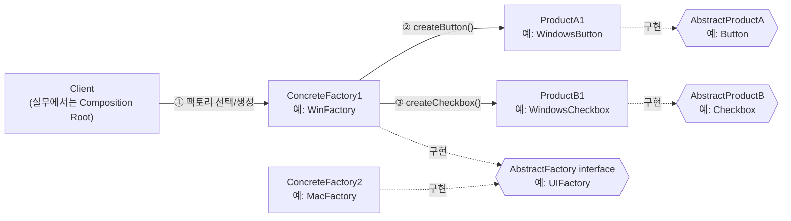
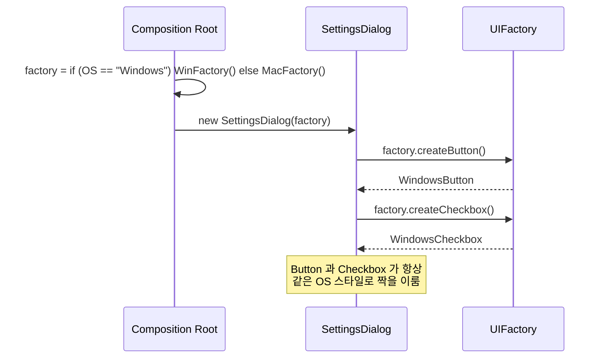
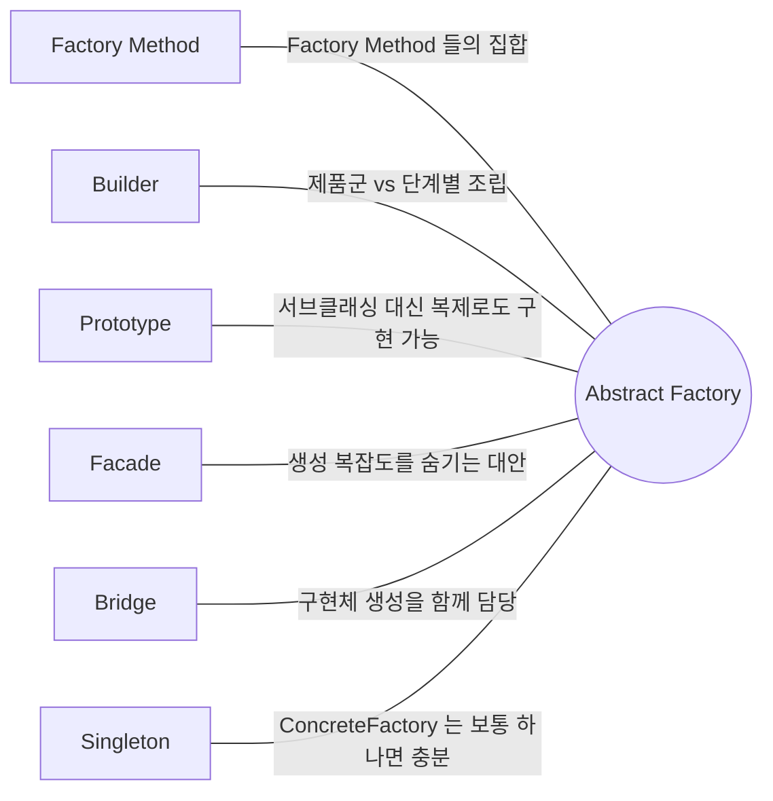

## Description

크로스플랫폼 UI 킷을 만든다고 해보자. `WindowsButton` 과 `MacButton` 을 각각 만들었는데, 실수로 `WindowsButton` 과 `MacCheckbox` 를 한 화면에 섞어서 쓰면 스타일이 어긋나 버림. 버튼, 체크박스, 텍스트박스를 따로따로 만들다 보면 "이 조합이 같은 테마인지" 를 사람이 일일이 신경 써야 하는 게 문제.

**Abstract Factory Pattern** 은 서로 관련되거나 의존적인 객체들의 "제품군(Family)" 을 구체 클래스에 의존하지 않고 생성할 수 있는 인터페이스를 제공하는 생성(Creational) 패턴. `WinFactory` 는 `WindowsButton` + `WindowsCheckbox` 세트만, `MacFactory` 는 `MacButton` + `MacCheckbox` 세트만 만들도록 강제하면, 클라이언트는 팩토리 하나만 골라 쓰는 것만으로 항상 호환되는 제품 세트를 받게 됨.

- **핵심**: 관련된 객체들의 "제품군" 을 한 번에, 서로 호환되도록 생성.
- **목적**:
  1. 클라이언트가 구체 클래스를 몰라도 제품군을 사용할 수 있게 함.
  2. 제품군 간의 일관성(compatibility) 을 강제해서 잘못된 조합을 원천 차단.
  3. 제품군 전체를 다른 제품군으로 손쉽게 교체 가능하게 함.

## Examples

크로스플랫폼 위젯 예시 외에 다른 도메인에서도 같은 구조가 쓰인다는 걸 보여주는 예시 두 개. (아래 Structure 부터는 다시 크로스플랫폼 위젯 예시로 돌아감.)

- **UI 테마**: Light/Dark 테마 전환 시 `Button`, `Checkbox`, `TextField` 가 모두 같은 테마여야 함. Abstract Factory 가 없으면 컴포넌트를 개별적으로 생성하면서 테마 일관성이 깨질 위험이 있음. 있으면 `LightThemeFactory` / `DarkThemeFactory` 중 하나만 고르면 전체 세트가 함께 바뀜.
- **DB 드라이버**: MySQL/PostgreSQL 용 `Connection`, `Command`, `Transaction` 객체는 서로 호환되어야 함. 없으면 `MySqlConnection` 에 `PostgresCommand` 를 잘못 조합하는 버그가 날 수 있음. 있으면 `MySqlFactory` 하나로 항상 맞는 세트를 받음.

## Structure



위 다이어그램을 실제 실행 흐름으로 펼치면 아래와 같음.



```kotlin
interface Button
interface Checkbox

class WindowsButton : Button
class WindowsCheckbox : Checkbox
class MacButton : Button
class MacCheckbox : Checkbox

interface UIFactory {
    fun createButton(): Button
    fun createCheckbox(): Checkbox
}

class WinFactory : UIFactory {
    override fun createButton(): Button = WindowsButton()
    override fun createCheckbox(): Checkbox = WindowsCheckbox()
}

class MacFactory : UIFactory {
    override fun createButton(): Button = MacButton()
    override fun createCheckbox(): Checkbox = MacCheckbox()
}

class SettingsDialog(factory: UIFactory) {
    private val button = factory.createButton()
    private val checkbox = factory.createCheckbox() // 항상 같은 OS 스타일 세트로 짝을 이룸
}
```

- **AbstractFactory**: 제품군을 구성하는 여러 `createXxx()` 메소드를 선언하는 인터페이스. 예: `UIFactory`.
- **ConcreteFactory**: 특정 변형(variant) 하나에 대응하는 제품군 전체를 생성. 하나의 ConcreteFactory 는 오직 하나의 variant 만 담당함 — `WinFactory` 는 항상 Windows 스타일만 만듦.
- **AbstractProduct**: 제품 하나하나에 대한 인터페이스 (`Button`, `Checkbox`).
- **ConcreteProduct**: 특정 variant 에 속한 실제 구현 (`WindowsButton`, `MacButton`).
- **Client**: `AbstractFactory` 와 `AbstractProduct` 인터페이스만 사용. 실무에서는 어떤 `ConcreteFactory` 를 쓸지 [Composition Root](../general/patterns/Composition%20Root.md) 가 결정 — 자세한 내용은 아래 [Modern Applicability](#modern-applicability-di-composition-root) 참고.

Client 사용 예는 아래처럼 `UIFactory` 하나만 주입받는 형태가 됨.

```kotlin
val factory: UIFactory = WinFactory()
val dialog = SettingsDialog(factory)
// SettingsDialog 는 Button/Checkbox 구체 타입을 모른 채 같은 제품군을 사용함
```

## Adaptability

다음 상황에서 특히 유용함.

- 코드가 관련 제품의 다양한 제품군과 함께 작동해야 하지만, 구체 클래스에는 의존하고 싶지 않을 때.
- 미리 정의되지 않았거나 향후 확장을 열어두고 싶을 때.
- 객체가 생성·구성·표현되는 방식과 무관하게 시스템을 독립적으로 유지하고 싶을 때.
- 여러 제품군 중 하나를 선택해서 시스템을 구성해야 하고, 한 번 구성한 제품군을 통째로 다른 것으로 교체할 수 있어야 할 때.
- 관련된 제품 객체들이 항상 함께 사용되도록 설계됐고, 이 제약이 외부에서도 깨지지 않게 강제하고 싶을 때.

## Pros

- **제품군 간의 일관성(호환성) 을 보장함**: `WinFactory` 를 쓰면 항상 `WindowsButton` + `WindowsCheckbox` 조합만 나오므로, 실수로 Mac 위젯과 섞일 수가 없음. 이게 Abstract Factory 가 Factory Method 와 구별되는 핵심 이점.
- **제품군 전체 교체가 한 곳만 바꾸면 됨**: 테마를 통째로 바꾸고 싶으면 `Composition Root` 에서 어떤 Factory 를 선택할지 한 줄만 바꾸면 됨. 새로운 제품군(예: `LinuxFactory`) 을 추가해도 기존 `WinFactory`/`MacFactory` 코드는 그대로 ⇒ 제품군 단위로는 **[OCP(Open Closed Principle)](../../solid/OCP(Open%20Closed%20Principle).md)** 를 만족.
- **객체 생성 책임이 한 곳(Factory) 으로 모임**: 클라이언트 코드 곳곳에 흩어져 있던 `new WindowsButton()` 류의 생성 로직이 `WinFactory` 안으로 모이므로 ⇒ **[SRP(Single Responsibility Principle)](../../solid/SRP(Single%20Responsibility%20Principle).md)**.

## Cons

- **새로운 종류의 Product(제품 "타입") 를 추가하기 어려움**: `Slider` 라는 제품 타입을 새로 추가하려면 `UIFactory` 인터페이스에 `createSlider()` 를 추가해야 하고, 그러면 `WinFactory`/`MacFactory` 를 포함한 모든 ConcreteFactory 를 다 고쳐야 함 — 이 경우엔 OCP 가 깨짐. (반대로 새로운 "제품군" 자체를 추가하는 것, 예: `LinuxFactory` 신규 추가는 기존 코드를 안 건드리므로 쉬움. 둘을 헷갈리지 않는 게 중요.)
- **클래스/인터페이스 개수가 늘어나 코드가 복잡해짐**: 제품 타입 N 개 × 제품군 M 개만큼 ConcreteProduct 클래스가 생기고, 여기에 ConcreteFactory M 개가 추가됨.

## Relationship with other patterns



| 비교 대상 | 공통점 | Abstract Factory 와의 차이 |
| :--- | :--- | :--- |
| [Factory Method](Factory%20Method%20Pattern.md) | Abstract Factory 는 보통 여러 Factory Method 의 집합으로 구현됨 | Factory Method 는 객체 **하나** 생성을 서브클래싱으로 위임. Abstract Factory 는 서로 관련된 **여러 객체(제품군)** 를 함께, 호환되도록 생성하는 인터페이스를 제공. |
| [Builder](Builder%20Pattern.md) | 둘 다 복잡한 객체 생성을 캡슐화 | Builder 는 객체 **하나**를 단계별로 조립(생성 이후 추가 구성 단계가 필요할 수 있음). Abstract Factory 는 관련된 **여러 객체**를 세트로 즉시 반환. 둘을 함께 써서 Abstract Factory 가 Builder 를 반환하게 만들기도 함. |
| [Prototype](Prototype%20Pattern.md) | 둘 다 구체 클래스에 의존하지 않고 객체를 만듦 | Abstract Factory 는 보통 ConcreteFactory 서브클래스 계층으로 제품군을 만듦. 제품마다 프로토타입 인스턴스를 등록해두고 `clone()` 으로 제품군을 구성하면 서브클래싱 없이도 Abstract Factory 를 구현할 수 있음. |
| [Facade](../structural/Facade%20Pattern.md) | 둘 다 클라이언트로부터 서브시스템 생성 복잡도를 감춤 | Facade 의 목적은 서브시스템 "사용" 자체를 단순화하는 것이고 생성은 부수적. Abstract Factory 는 "생성" 자체가 목적. 클라이언트가 서브시스템 객체의 생성 방식을 몰라야 할 때 Facade 대신 쓰기도 함. |
| [Bridge](../structural/Bridge%20Pattern.md) | 함께 쓰이는 경우가 많음 | Bridge 는 추상화와 구현을 분리하는 구조 패턴. Abstract Factory 는 Bridge 에서 정의된 특정 구현(Implementation)들을 상황에 맞게 생성해주는 역할로 자주 결합됨. |
| [Singleton](Singleton%20Pattern.md) | 함께 쓰이는 경우가 많음 | ConcreteFactory 는 보통 상태가 없고 요청마다 새로 만들 필요가 없어서 Singleton 으로 구현되는 경우가 흔함 — "제품(product)" 이 아니라 "그걸 만드는 팩토리 객체" 를 하나만 둔다는 뜻. |

## Modern Applicability (DI/Composition Root)

[Composition Root](../general/patterns/Composition%20Root.md) 관점에서 Abstract Factory 는 **2 그룹: DI Container 가 흡수** 에 속함. DI Container(Metro `AppGraph`, Dagger/Hilt 등) 자체가 거대한 Abstract Factory — 여러 관련 객체들을 그래프 하나가 일관성 있게 만들어 줌.

**"그래도 결국 누군가는 concrete 를 알아야 하지 않나?"** [Strategy Pattern](../behavioral/Strategy%20Pattern.md) 과 같은 답. Abstract Factory 가 없애는 건 "아는 사람" 이 아니라 **"아는 위치의 개수"**. `SettingsScreen` 은 Light 인지 Dark 인지 모르고, Composition Root 한 곳만 알면 됨.

**Android 예시 (Metro)** — Windows/Mac 대신, Android 에서 실제로 자주 만나는 변형인 Light/Dark 테마로 바꿔서 씀. `Button`/`Checkbox`/`UIFactory` 는 Structure 절과 동일한 인터페이스를 그대로 이어서 쓰고, `WinFactory`/`MacFactory` 자리에 `LightThemeFactory`/`DarkThemeFactory` 가 들어감(Examples 절의 "UI 테마" 예시와 동일한 이름).

```kotlin
class LightButton : Button
class LightCheckbox : Checkbox
class DarkButton : Button
class DarkCheckbox : Checkbox

@Inject class LightThemeFactory : UIFactory {
    override fun createButton(): Button = LightButton()
    override fun createCheckbox(): Checkbox = LightCheckbox()
}

@Inject class DarkThemeFactory : UIFactory {
    override fun createButton(): Button = DarkButton()
    override fun createCheckbox(): Checkbox = DarkCheckbox()
}

@Inject
class SettingsScreen(private val factory: UIFactory) // Light 인지 Dark 인지 모름

@DependencyGraph(AppScope::class)
interface AppGraph {
    val settingsScreen: SettingsScreen

    @Provides
    fun provideUIFactory(isSystemInDarkTheme: Boolean): UIFactory =
        if (isSystemInDarkTheme) DarkThemeFactory() else LightThemeFactory()
}
```

`isSystemInDarkTheme` 분기가 `AppGraph` 한 곳에만 있기 때문에 `Button` 과 `Checkbox` 는 항상 같은 테마로(둘 다 Light 이거나 둘 다 Dark) 짝을 맞춰 생성됨 — Abstract Factory 가 지키려던 "제품군 간 일관성" 이 그대로 유지됨. ConcreteFactory 라는 별도 클래스가 사라진 게 아니라, 그 역할이 `AppGraph` 의 `@Provides` 함수들로 흡수된 것.

## "Factory" 용어 정리

"Factory" 라는 단어는 문맥에 따라 다른 것을 가리켜서 혼동하기 쉬움. GoF Abstract Factory 패턴과 헷갈리지 않도록 정리.

### 1. Factory

무언가를 생성하는 함수/메소드/클래스를 두루뭉술하게 가리키는 용어. 대부분 객체를 생성하지만 파일이나 DB 레코드를 생성하는 경우도 "factory" 라고 부름.

### 2. Creation method (생성 메소드)

객체를 생성하는 메소드. Factory Method 패턴의 결과물은 모두 생성 메소드이지만, 반대로 모든 생성 메소드가 Factory Method 패턴인 건 아님. Martin Fowler 가 *Refactoring* 에서, Joshua Bloch 가 *Effective Java* 에서 각각 "factory method"/"static factory method" 라고 부르는 것도 이 넓은 의미. 실제로는 생성자 호출을 감싼 래퍼일 뿐이지만, 생성자 시그니처 변경으로부터 호출부를 보호하거나, 새로 만드는 대신 기존 객체를 반환하는 로직을 숨길 수 있음.

```java
class Number {
    private $value;

    public function __construct($value) {
        $this->value = $value;
    }

    public function next() {
        return new Number($this->value + 1);
    }
}
```

### 3. Static creation method

static 으로 선언된 생성 메소드 — 즉 생성을 위해 객체 인스턴스가 필요 없는 경우. "static factory method" 라고 부르면 Factory Method **패턴**(상속 기반이라 서브클래싱이 필요함) 과 혼동되기 쉬우니 주의. 여러 목적의 생성자가 필요하거나, 새로 만들지 않고 기존 객체를 재사용하고 싶을 때 유용함.

```java
class User {
    private $id, $name, $email, $phone;

    public function __construct($id, $name, $email, $phone) {
        $this->id = $id;
        $this->name = $name;
        $this->email = $email;
        $this->phone = $phone;
    }

    public static function load($id) {
        list($id, $name, $email, $phone) = DB::load_data('users', 'id', 'name', 'email', 'phone');
        return new User($id, $name, $email, $phone);
    }
}
```

### 4. Simple factory (pseudo-pattern)

파라미터에 따른 분기로 생성 결과를 다르게 만드는 메소드를 가진 클래스. GoF 패턴은 아니고, 흔히 Factory Method 도입 전 중간 단계로 취급됨. 분기가 너무 커지면 서브클래스로 쪼개는 리팩토링을 몇 번 거쳐 Factory Method 패턴이 됨.

```java
class UserFactory {
    public static function create($type) {
        switch ($type) {
            case 'user': return new User();
            case 'customer': return new Customer();
            case 'admin': return new Admin();
            default:
                throw new Exception('Wrong user type passed.');
        }
    }
}
```

### 5, 6. Factory Method / Abstract Factory 패턴

GoF 의 두 생성 패턴. Factory Method 는 객체 생성 인터페이스는 제공하되 어떤 클래스를 생성할지는 서브클래스가 정하게 하는 패턴, Abstract Factory 는 구체 클래스를 지정하지 않고 관련된 객체들의 제품군을 생성하는 패턴 — 이 문서와 [Factory Method Pattern](Factory%20Method%20Pattern.md) 문서에서 각각 다룸.
