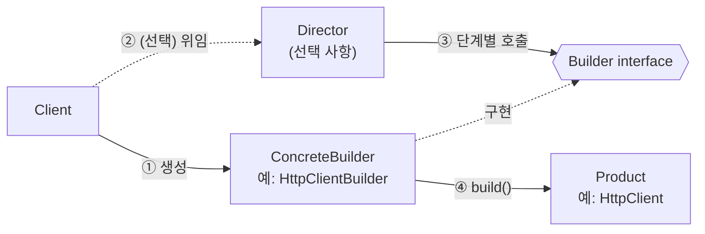
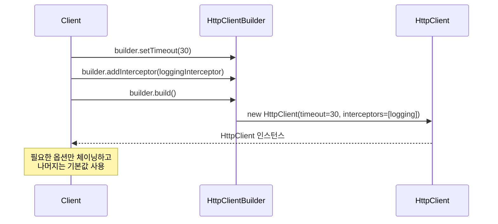
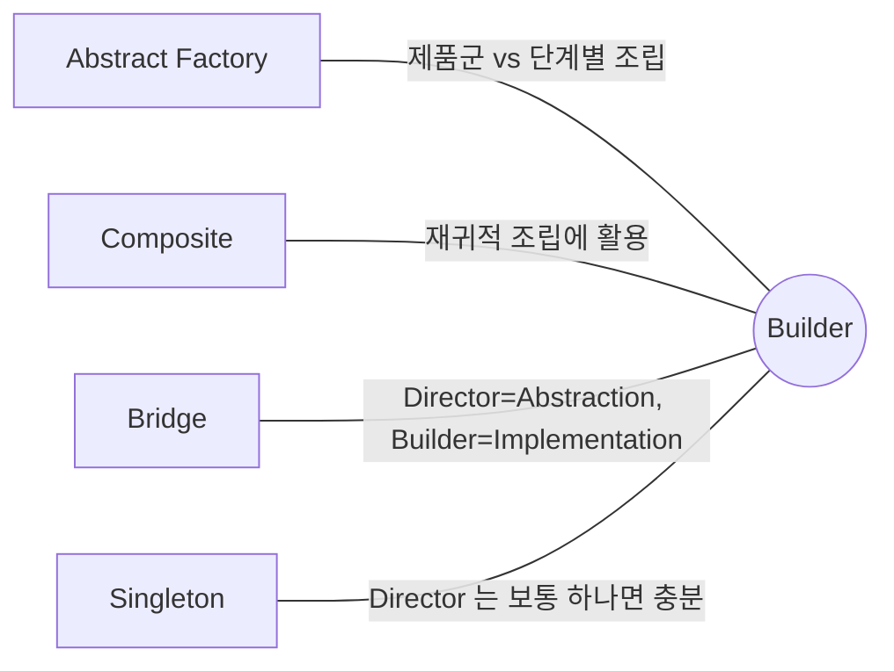

## Description

복잡한 객체를 생성자 하나로 다 처리하려다 보면 파라미터가 10 개, 20 개까지 늘어나는 "telescoping constructor" 문제가 생김. `House(walls, roof, doors, windows, hasGarage, hasSwimmingPool, hasGarden, hasStatues, ...)` 같은 생성자는 호출부만 봐서는 어떤 인자가 어떤 값인지 알기 어렵고, 대부분의 조합에서 필요 없는 파라미터까지 매번 다 채워야 함.

**Builder Pattern** 은 객체의 생성 과정(construction) 과 표현(representation) 을 분리해서, 같은 생성 과정으로 서로 다른 표현을 만들 수 있게 하는 생성(Creational) 패턴. 생성 로직을 `HouseBuilder` 같은 별도 객체로 옮기고, 필요한 부분만 단계별로 호출한 뒤 마지막에 `build()` 로 완성된 객체를 받는 방식으로 telescoping constructor 문제를 해결함.

- **핵심**: 복잡한 객체의 생성 과정을 별도의 Builder 객체로 옮기고, 필요한 단계만 호출해서 원하는 표현을 조립.
- **목적**:
  1. Telescoping constructor 문제 제거.
  2. 같은 생성 과정으로 서로 다른 표현(representation)을 만들 수 있게 함.
  3. 복잡한 객체 생성 코드(logic)를 비즈니스 로직(data)으로부터 분리 ⇒ **[SRP(Single Responsibility Principle)](../../solid/SRP(Single%20Responsibility%20Principle).md)**.

## Examples

- **HTTP 클라이언트 설정**: 타임아웃, 인터셉터, 캐시 등 선택적 설정이 많음. 생성자 하나로 다 받으면 대부분 기본값인 파라미터까지 매번 채워야 함. Builder 면 필요한 옵션만 체이닝하고 나머지는 기본값을 그대로 씀.
- **이메일/문서 생성기**: 제목, 본문, 첨부파일, 서명처럼 선택적 요소가 많은 객체. Director 를 두면 "청구서 이메일" 처럼 정해진 조합을 재사용 가능 — 매번 같은 순서로 필드를 채우는 코드를 반복하지 않아도 됨.
- **Composite 트리 조립**: HTML DOM 이나 UI 레이아웃처럼 재귀적으로 자식을 추가해야 하는 구조. 생성 단계를 Builder 로 표현하면 "트리를 조립하는 코드" 와 "실제 트리 구조" 가 분리되어 각각 독립적으로 테스트하고 재사용할 수 있음.

## Structure



Director 없이 Client 가 직접 Builder 를 호출하는 흐름은 아래와 같음.



- **Builder**: Product 를 이루는 각 부분을 만드는 단계(step) 들을 선언하는 인터페이스.
- **ConcreteBuilder**: 실제 조립 로직을 구현하고, 조립 중인 Product 의 상태를 스스로 추적함. Product 종류를 다르게 하고 싶으면 다른 ConcreteBuilder 를 만들면 됨.
- **Director**: Builder 인터페이스와 "어떤 순서로 호출해야 특정 결과가 나오는지" 를 알고, 정해진 조합을 외부에 재사용 가능한 형태로 노출. 필수 요소는 아님.
- **Product**: 복잡하게 생성되는 결과 객체.
- **Client**: 특정 ConcreteBuilder 를 골라 Director 에 연결하거나(있다면), Builder 를 직접 호출해서 Product 를 얻음.

## Adaptability

다음 상황에서 특히 유용함.

- Telescoping constructor 를 제거하고 싶을 때.
- 같은 종류의 제품이지만 표현이 여러 가지(예: 석조 주택 vs 목조 주택) 일 때.
- Composite 트리나 그 밖의 복잡한 객체를 구성할 때.
- 서로를 호출하는 생성자가 여러 개 있고, optional parameter 가 많으며, 일부만 기본값을 가진 짧은 버전의 생성자를 여러 개 두고 있을 때.
- 복잡한 객체를 생성하는 알고리즘이 객체를 이루는 각 부분과는 독립적이어야 할 때.

## Pros

- **객체를 단계별로 구성하거나, 구성 시점을 미루거나, 재귀적으로 단계를 실행할 수 있음**: 예를 들어 HTML DOM 을 조립할 때 자식 노드를 추가하는 단계를 재귀적으로 호출해서 트리 전체를 구성할 수 있음.
- **같은 구성 코드를 재사용해서 제품의 다양한 표현을 만들 수 있음**: `HttpClientBuilder` 하나로 로깅용 클라이언트, 캐시용 클라이언트 등 설정이 다른 여러 `HttpClient` 를 같은 방식으로 조립할 수 있음.
- **복잡한 객체 생성 코드를 비즈니스 로직과 분리할 수 있음** ⇒ **[SRP(Single Responsibility Principle)](../../solid/SRP(Single%20Responsibility%20Principle).md)**: `CheckoutService` 는 `HttpClient` 가 어떻게 조립되는지 몰라도 됨.

## Cons

- **여러 개의 새로운 클래스를 만들어야 해서 코드가 복잡해짐**: 옵션이 두세 개뿐인 단순한 객체에 Builder + Director + ConcreteBuilder 를 다 도입하면 오히려 코드량이 늘어날 수 있음. 이런 경우엔 아래 [Modern Applicability](#modern-applicability-di-composition-root) 에서 다루는 named argument 만으로 충분한 경우가 많음.

## Relationship with other patterns



| 비교 대상 | 공통점 | Builder 와의 차이 |
| :--- | :--- | :--- |
| [Abstract Factory](Abstract%20Factory%20Pattern.md) | 둘 다 복잡한 객체 생성을 캡슐화 | Builder 는 객체 **하나**를 단계별로 조립하는 데 집중하고, 완성 전에 추가 구성 단계를 거칠 수 있음. Abstract Factory 는 관련된 **여러 객체(제품군)** 를 즉시 세트로 반환하는 데 집중. |
| [Composite](../structural/Composite%20Pattern.md) | 함께 쓰이는 경우가 많음 | Composite 트리를 구성할 때 Builder 를 사용할 수 있음 — 생성 단계를 재귀적으로 프로그래밍할 수 있기 때문. |
| [Bridge](../structural/Bridge%20Pattern.md) | 함께 쓰이는 경우가 많음 | Director 클래스가 Bridge 의 Abstraction 역할을, 서로 다른 ConcreteBuilder 들이 Implementation 역할을 하도록 결합해서 쓸 수 있음. |
| [Singleton](Singleton%20Pattern.md) | 함께 쓰이는 경우가 많음 | Director 는 보통 상태가 없어 요청마다 새로 만들 필요가 없으므로 Singleton 으로 구현되는 경우가 흔함 — "완성된 Product" 가 아니라 "Director 객체" 를 하나만 둔다는 뜻. |

## Modern Applicability (DI/Composition Root)

[Composition Root](../general/patterns/Composition%20Root.md) 관점에서 Builder 는 **1 그룹: 언어가 흡수** 에 속함. GoF Builder 가 풀던 문제(telescoping constructor)는 대부분 Kotlin 의 named argument + default parameter 로 대체됨. DI 와는 직접적인 관련이 적음.

**Named argument + default parameter 로 충분한 경우**

```kotlin
// Java 스타일이었다면 Builder 가 필요했을 클래스
data class Pizza(
    val size: Int = 30,
    val cheese: Boolean = true,
    val pepperoni: Boolean = false,
    val mushroom: Boolean = false,
)

val myPizza = Pizza(size = 25, pepperoni = true) // 필요한 파라미터만 이름으로 지정
val vegPizza = myPizza.copy(cheese = false, mushroom = true) // 기존 값 기반으로 변형
```

**여전히 Builder(DSL) 형태가 남는 경우**: Android 플랫폼 API 중 상당수(`AlertDialog.Builder`, `NotificationCompat.Builder`) 는 Java 로 작성된 외부 API 라서 그대로 존재함. 새로 Kotlin API 를 설계한다면 체이닝 대신 람다 수신 객체(lambda with receiver) 기반 DSL 로 같은 역할을 대체하는 경우가 많음.

```kotlin
// 체이닝 대신 DSL 로 단계별 구성을 표현
myDialog {
    title = "삭제할까요?"
    message = "되돌릴 수 없습니다"
    onConfirm { viewModel.delete() }
}
```

**DI 와의 접점**: Builder 자체는 언어 기능으로 대체되지만, `build()` 로 만든 결과물이 앱 전역에서 공유되는 서비스(`OkHttpClient` 등)라면 그 생성 코드는 [Composition Root](../general/patterns/Composition%20Root.md) 안, 즉 Metro `@Provides` 함수 안에 두고 한 번만 만들어서 그래프에 공유하는 게 일반적.

```kotlin
@Provides
@SingleIn(AppScope::class)
fun provideOkHttpClient(logging: LoggingInterceptor): OkHttpClient =
    OkHttpClient.Builder()
        .addInterceptor(logging)
        .build()
```

즉 "복잡한 객체를 단계별로 만든다" 는 문제 자체는 여전히 존재하지만(Builder 개념 자체는 안 사라짐), 사용자가 직접 `Builder`/`ConcreteBuilder`/`Director` 클래스를 만들어야 했던 부분은 언어 기능이나 플랫폼 API 로 흡수됨.
