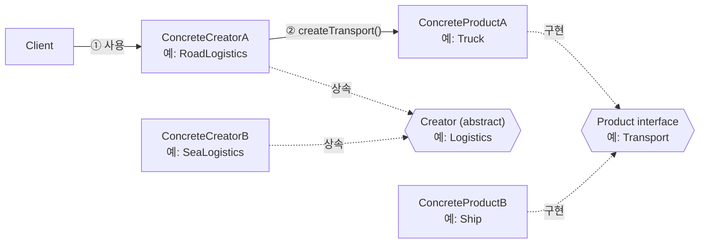
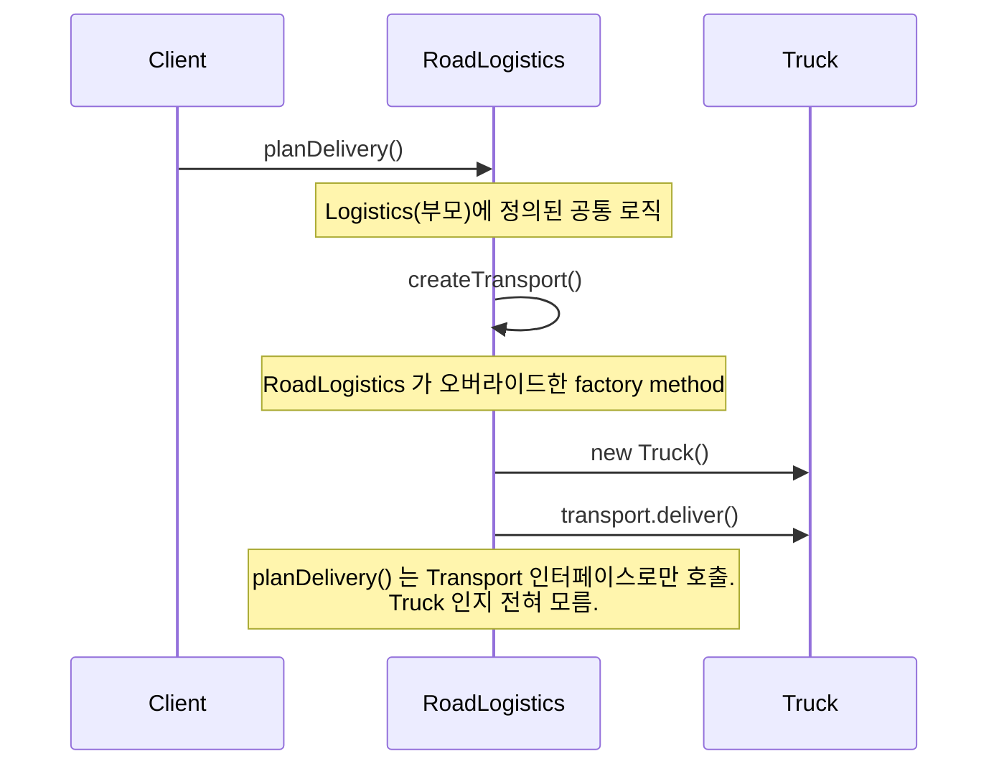
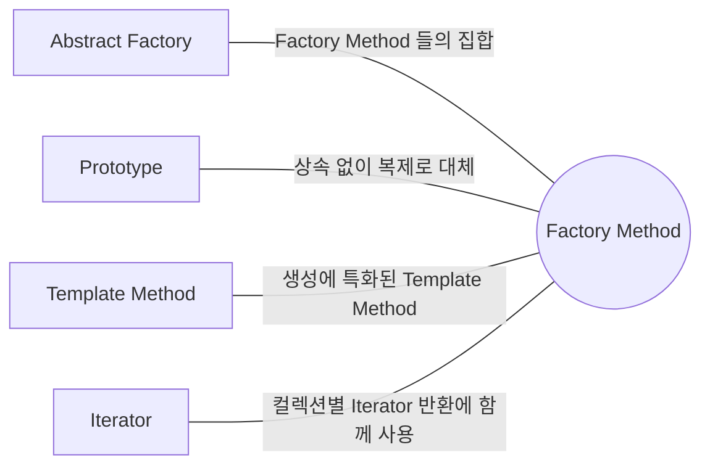

## Description

물류 앱을 만든다고 해보자. 처음엔 `Truck` 하나만 지원하면 됐고, 코드 곳곳에 `new Truck()` 을 직접 흩뿌려 놨음. 그런데 사업이 잘 돼서 `Ship` 도 지원해야 한다면, `new Truck()` 을 호출하던 모든 자리를 찾아서 고쳐야 함.

**Factory Method Pattern**(= Virtual Constructor) 은 객체를 만드는 인터페이스는 상위 클래스가 제공하되, 실제로 어떤 클래스를 만들지는 서브클래스가 정하도록 위임하는 생성(Creational) 패턴. `Logistics` 라는 상위 클래스에 `createTransport()` 라는 factory method 를 두고, `RoadLogistics` 는 `Truck` 을, `SeaLogistics` 는 `Ship` 을 반환하도록 오버라이드하면, `Logistics` 의 나머지 로직(`planDelivery()` 등)은 `Transport` 인터페이스만 알면 되고 실제로 Truck 인지 Ship 인지는 몰라도 됨.

- **핵심**: 객체 생성을 서브클래스가 결정하도록 위임.
- **목적**:
  1. Product 를 사용하는 코드와 Product 의 구체 타입을 결정/생성하는 코드를 분리.
  2. 새로운 Product 를 추가할 때 기존 Creator 코드는 건드리지 않고 새 ConcreteCreator 만 추가 ⇒ **[OCP(Open Closed Principle)](../../solid/OCP(Open%20Closed%20Principle).md)**.
  3. 상속 계층이 이미 존재하는 코드베이스에 자연스럽게 녹아듦.

## Examples

물류 예시 외에 다른 도메인에서도 같은 구조가 쓰인다는 걸 보여주는 예시 두 개. (아래 Structure 부터는 다시 물류 예시로 돌아감.)

- **문서 편집기**: `TextEditor` 가 `createDocument()` 를 factory method 로 두면, `PdfEditor`/`WordEditor` 가 각각 `PdfDocument`/`WordDocument` 를 반환. 없으면 `TextEditor` 안에 문서 타입별 분기가 계속 늘어남.
- **알림(Notification)**: `NotificationSender` 가 `createChannel()` 을 factory method 로 두면, `EmailSender`/`PushSender` 가 각자의 `Channel` 구현체를 반환. 공통 발송 로직(`send()`)은 어떤 채널인지 몰라도 그대로 재사용됨.

## Structure



`RoadLogistics` 를 예로 들면 실제 호출 흐름은 아래와 같음.



```kotlin
interface Transport {
    fun deliver()
}

class Truck : Transport {
    override fun deliver() { /* 도로로 배송 */ }
}

class Ship : Transport {
    override fun deliver() { /* 해상으로 배송 */ }
}

abstract class Logistics {
    abstract fun createTransport(): Transport // factory method

    fun planDelivery() {
        val transport = createTransport()
        transport.deliver() // Truck 인지 Ship 인지 모름
    }
}

class RoadLogistics : Logistics() {
    override fun createTransport(): Transport = Truck()
}

class SeaLogistics : Logistics() {
    override fun createTransport(): Transport = Ship()
}
```

- **Creator**: Product 를 반환하는 factory method 를 선언. 추상 메소드로 둘 수도, 기본 구현(default ConcreteProduct 반환)을 둘 수도 있음. Product 를 사용하는 공통 로직(`planDelivery()`)도 보통 여기에 있음.
- **ConcreteCreator**: factory method 를 오버라이드해서 특정 ConcreteProduct 를 반환. 매번 새 인스턴스를 만들어야 하는 건 아님 — 캐시된 인스턴스를 반환해도 됨.
- **Product**: factory method 가 생성하는 모든 객체가 따라야 할 인터페이스.
- **ConcreteProduct**: Product 인터페이스의 실제 구현. 특정 ConcreteCreator 에 의해서만 만들어짐.

## Adaptability

다음 상황에서 특히 유용함.

- Product 를 실제로 사용하는 코드와 Product 를 생성하는 코드를 분리하고 싶을 때. 단, 새 ConcreteProduct 를 추가할 때마다 이를 반환하는 새 ConcreteCreator 도 함께 추가해야 한다는 점은 감안해야 함.
- 매번 새 인스턴스를 만들 필요가 없는 경우 — factory method 안에 캐시/저장소를 두고 이미 만든 객체를 재사용하도록 구현할 수 있음.
- 나중에 어떤 타입의 객체를 다루게 될지 미리 알 수 없을 때.
- 클래스 계층 구조가 이미 존재해서, 새 인터페이스를 도입하는 대신 상속에 자연스럽게 얹고 싶을 때.

## Pros

- **Product 생성 코드와 사용 코드가 분리됨** ⇒ **[SRP(Single Responsibility Principle)](../../solid/SRP(Single%20Responsibility%20Principle).md)**.
- **새 Product 추가가 기존 Creator 코드에 영향을 주지 않음** ⇒ **[OCP(Open Closed Principle)](../../solid/OCP(Open%20Closed%20Principle).md)**: `Plane` 이 추가돼도 `RoadLogistics`/`SeaLogistics` 는 그대로.
- **이미 상속 계층이 있는 코드베이스에 자연스럽게 녹아듦**: `Logistics` 계층이 이미 존재한다면 별도의 인터페이스 설계 없이 factory method 하나만 오버라이드하면 됨. (반면 [Strategy Pattern](../behavioral/Strategy%20Pattern.md) 은 별도의 인터페이스 + 구성(Composition) 설계가 필요.)
- **인스턴스 캐싱/재사용 로직을 자연스럽게 숨길 수 있음**: 매번 새로 만드는 대신, factory method 안에서 이미 만든 객체를 반환하도록 구현할 수 있음.

## Cons

- **새 Product 하나마다 병렬로 ConcreteCreator 서브클래스가 하나씩 늘어남**: `Plane` 을 추가하려면 `AirLogistics` 도 함께 만들어야 해서 클래스 수가 제품 종류만큼 늘어남.
- **상속 기반이라 런타임에 Creator 를 교체할 수 없음**: 어떤 Product 가 나올지는 "어떤 ConcreteCreator 의 인스턴스인가" 로 객체 생성 시점에 정해짐. [Strategy Pattern](../behavioral/Strategy%20Pattern.md) 처럼 실행 중에 전략 객체만 갈아 끼우는 방식은 안 됨.

## Relationship with other patterns



| 비교 대상 | 공통점 | Factory Method 와의 차이 |
| :--- | :--- | :--- |
| [Abstract Factory](Abstract%20Factory%20Pattern.md) | Abstract Factory 는 보통 Factory Method 들의 집합으로 구현됨 | Factory Method 는 객체 하나, Abstract Factory 는 관련된 여러 객체(제품군)를 함께 생성. |
| [Prototype](Prototype%20Pattern.md) | 둘 다 구체 클래스를 몰라도 객체를 생성 가능 | Factory Method 는 상속 기반이라 서브클래싱이 필요한 대신 초기화 단계가 없어도 됨. Prototype 은 상속이 필요 없는 대신 복제 대상의 복잡한 초기화(clone 로직)를 직접 챙겨야 함. |
| [Template Method](../behavioral/Template%20Method%20Pattern.md) | 둘 다 상속으로 서브클래스가 특정 단계를 오버라이드 | Factory Method 는 오버라이드 대상이 "객체 생성" 한 단계로 한정된, Template Method 의 특수한 형태로 볼 수 있음. 반대로 Factory Method 가 더 큰 Template Method 알고리즘의 한 단계로 쓰이기도 함. |
| [Iterator](../behavioral/Iterator%20Pattern.md) | 함께 쓰이는 경우가 많음 | 컬렉션의 서브클래스가 자신과 호환되는 다양한 종류의 Iterator 를 반환하도록 factory method 를 활용. |

## Modern Applicability (DI/Composition Root)

[Composition Root](../general/patterns/Composition%20Root.md) 관점에서 Factory Method 는 **2 그룹: DI Container 가 흡수** 에 속함. AndroidX 의 `ViewModelProvider.Factory` 가 정확히 GoF Factory Method 형태 — `create()` 라는 팩토리 메소드를 오버라이드해서 어떤 `ViewModel` 을 만들지 정함. DI Container 를 쓰면 이 팩토리를 직접 작성하지 않아도 됨.

**"그래도 결국 누군가는 concrete 를 알아야 하지 않나?"** [Strategy Pattern](../behavioral/Strategy%20Pattern.md) 과 같은 답. Factory Method 가 없애는 건 "아는 사람" 이 아니라 **"아는 위치의 개수"** — Composition Root 하나로 모임.

**Android 예시 (Metro)**

```kotlin
@Inject
class CheckoutViewModel(private val repository: OrderRepository) // ViewModel()

interface OrderRepository
@Inject class RemoteOrderRepository : OrderRepository

@DependencyGraph(AppScope::class)
interface AppGraph {
    val checkoutViewModel: CheckoutViewModel

    @Binds
    fun bindOrderRepository(impl: RemoteOrderRepository): OrderRepository
}

val graph = createGraph<AppGraph>()
val viewModel = graph.checkoutViewModel // AppGraph 가 사실상 create() 를 구현해주는 팩토리 역할
```

DI 없이 직접 구현했다면 `CheckoutViewModelFactory : ViewModelProvider.Factory` 를 만들고 `create()` 안에서 `RemoteOrderRepository` 를 직접 생성해 넘겨야 했을 것. Metro 는 `@Inject` 생성자와 그래프 선언만으로 이 팩토리 역할을 대신 만들어 줌 — Factory Method 패턴이 사라진 게 아니라 Container 내부 구현으로 흡수된 것.
