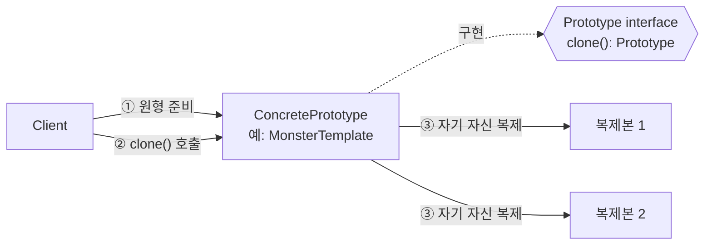
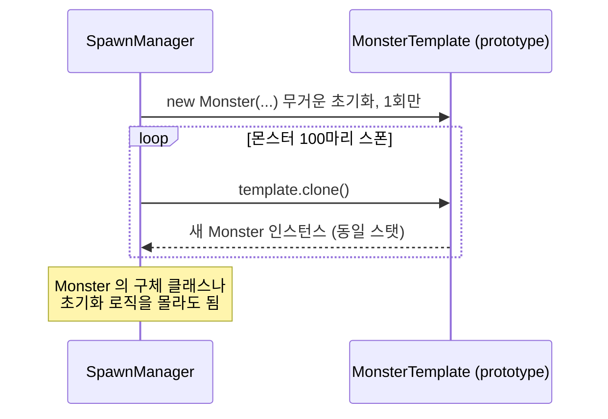
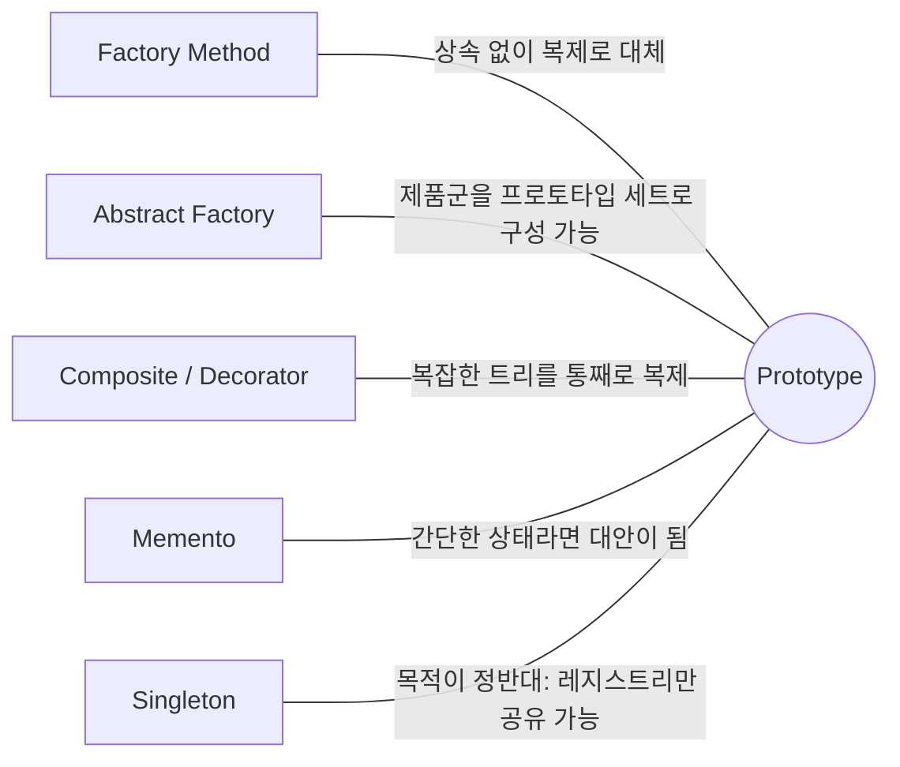

## Description

복잡한 상태를 가진 객체(게임 캐릭터, 그래픽 에디터의 도형 등)를 "복사" 해야 하는 상황을 생각해보자. 필드가 많고 일부는 private 이라 새 인스턴스를 만들어 하나하나 값을 다시 채우는 건 번거롭고 실수하기 쉬움. 게다가 `GraphicTool` 처럼 어떤 도형(Circle, Rectangle 등)이 선택됐는지 구체 타입을 모르는 범용 코드라면, 애초에 `new Circle()` 을 직접 호출할 수조차 없음.

**Prototype Pattern** 은 원형이 되는 인스턴스를 미리 만들어두고, 그 인스턴스가 스스로 자신을 복제(clone)하는 메소드를 제공하게 하는 생성(Creational) 패턴. 복제하는 쪽(`GraphicTool`)은 구체 클래스를 몰라도 `shape.clone()` 만 호출하면 동일한 상태를 가진 새 객체를 얻을 수 있음.

- **핵심**: 객체를 새로 생성(`new`)하는 대신, 기존 객체를 복제(clone)해서 새 객체를 만듦.
- **목적**:
  1. 클라이언트가 복제 대상의 구체 클래스를 몰라도 복제할 수 있게 함.
  2. 복잡한 초기화 로직을 반복하지 않고 재사용.
  3. 상속 없이도 다양한 초기 상태의 객체를 런타임에 만들어냄.

## Examples

- **게임 유닛 스폰**: 몬스터를 매번 `new Monster()` 로 무겁게 초기화(스탯 계산, AI 트리 로드)하는 대신, 미리 만들어둔 템플릿 몬스터를 `clone()` 해서 찍어냄. 없으면 스폰마다 초기화 비용이 반복되고, 있으면 초기화는 한 번, 복제는 N 번으로 끝남.
- **그래픽 편집기 도형 복사**: `GraphicTool` 은 선택된 도형이 `Circle` 인지 `Rectangle` 인지 몰라도 `shape.clone()` 만 호출하면 동일한 도형을 복제할 수 있음.
- **설정(Config) 변형 생성**: 기본 설정을 담은 프로토타입을 하나 두고, 필드 몇 개만 다르게 바꾼 변형(Config A/B/C)을 매번 처음부터 조립하지 않고 복제 후 일부만 수정해서 만듦.

## Structure



몬스터 100 마리를 스폰하는 시나리오로 펼치면 아래와 같음.



- **Prototype**: 스스로를 복제하는 `clone()` 을 선언하는 인터페이스.
- **ConcretePrototype**: 실제 복제 로직을 구현. 단순히 값을 복사하는 것 외에, 연결된 객체 복제나 순환 참조 해소 같은 예외 케이스도 여기서 처리함.
- **SubclassPrototype**: ConcretePrototype 과 같은 목적을 가지면서, 베이스 클래스가 갖지 않은 추가 필드/동작을 확장.
- **Client**: 구체 클래스를 몰라도 `clone()` 만 호출해서 복제본을 얻음.

## Adaptability

다음 상황에서 특히 유용함.

- 복제해야 하는 구체 클래스에 코드가 종속되지 않게 하고 싶을 때.
- 초기화 방법만 다른 서브클래스가 계속 늘어나는 걸 줄이고 싶을 때.
- 새 객체를 초기화하는 것만으로는 부족하고, 기존 객체와 상태가 같은 "유효한 복사본" 이어야 할 때.
- Prototype 객체를 런타임에 동적으로 추가/제거해야 할 때.

## Pros

- **구체 클래스에 의존하지 않고 객체를 복제할 수 있음**: `GraphicTool` 은 `Circle`/`Rectangle` 중 무엇인지 몰라도 복제 가능.
- **반복되는 초기화 코드를 없앨 수 있음**: 무거운 초기화는 프로토타입 생성 시 한 번만 하고, 이후로는 복제만 반복.
- **상속 대신 다른 방법으로 다양한 초기 상태를 제공**: 색깔별 `Circle` 서브클래스를 늘리는 대신, `RedCircle` 인스턴스 하나를 프로토타입으로 등록해두고 복제하면 됨.

## Cons

- **순환 참조가 있는 복잡한 객체는 복제가 까다로움**: 객체 A 가 B 를 참조하고 B 가 다시 A 를 참조하면, `clone()` 내부에서 무한 루프에 빠지지 않도록 이미 복제한 객체를 추적하는 맵 등이 별도로 필요함.
- **얕은 복사(shallow copy)는 내부 참조를 공유해서 의도치 않은 상태 공유 버그를 만들기 쉬움**: 예를 들어 Kotlin `data class` 의 `copy()` 는 기본적으로 얕은 복사.

  ```kotlin
  data class Monster(val name: String, val inventory: MutableList<Item>)

  val original = Monster("Goblin", mutableListOf(Item("Dagger")))
  val clone = original.copy() // 얕은 복사: inventory 리스트를 그대로 공유함
  clone.inventory.add(Item("Shield")) // original.inventory 도 함께 바뀜
  ```

## Relationship with other patterns



| 비교 대상 | 공통점 | Prototype 과의 차이 |
| :--- | :--- | :--- |
| [Factory Method](Factory%20Method%20Pattern.md) | 둘 다 구체 클래스를 감춘 채로 객체를 생성 | Factory Method 는 상속 기반이라 서브클래싱이 필요한 대신 초기화 단계가 없어도 됨. Prototype 은 상속이 필요 없는 대신 복제 로직(clone) 자체가 복잡한 초기화를 대신 처리해야 함. |
| [Abstract Factory](Abstract%20Factory%20Pattern.md) | 함께 쓰이는 경우가 있음 | Abstract Factory 가 Factory Method 세트 대신 Prototype 세트로 구현될 수도 있음 — 제품군을 서브클래싱 없이 프로토타입 등록만으로 확장 가능. |
| [Composite](../structural/Composite%20Pattern.md), [Decorator](../structural/Decorator%20Pattern.md) | 깊은 트리 구조를 다루는 상황에서 함께 쓰임 | Composite/Decorator 로 만든 복잡한 트리 구조를 처음부터 다시 조립하는 대신 통째로 `clone()` 해서 복제할 때 Prototype 이 유용함. |
| [Memento](../behavioral/Memento%20Pattern.md) | 둘 다 객체의 상태를 저장해뒀다가 나중에 활용 | Memento 는 상태를 캡슐화해서 외부에 노출하지 않고 저장(undo/redo 목적). Prototype 은 상태를 가진 객체 자체를 통째로 복제(독립된 새 객체 생성 목적). 상태가 단순하고 외부 리소스 참조가 없다면 Prototype 이 Memento 의 간단한 대안이 될 수 있음. |
| [Singleton](Singleton%20Pattern.md) | 표면적으로는 자주 함께 언급됨 | 목적이 사실상 반대: Singleton 은 인스턴스를 하나만 두는 게 목적, Prototype 은 인스턴스를 복제해서 늘리는 게 목적. 정확히는 "어떤 프로토타입들이 등록돼 있는지 관리하는 레지스트리 객체" 를 Singleton 으로 둘 수 있다는 뜻이지, 프로토타입 인스턴스 자체를 Singleton 으로 만든다는 뜻이 아님. |

## Modern Applicability (DI/Composition Root)

[Composition Root](../general/patterns/Composition%20Root.md) 관점에서 Prototype 은 **1 그룹: 언어가 흡수** 에 속함. Kotlin `data class` 가 자동으로 만들어주는 `copy()` 가 사실상 얕은 `clone()`. GoF 가 `Prototype` 인터페이스 + `ConcretePrototype.clone()` 으로 직접 구현하던 것을, 컴파일러가 대신 생성해줌.

**깊은 복사가 필요하면 직접 챙겨야 함**: `copy()` 는 얕은 복사이므로, 내부에 mutable 참조 필드가 있다면 위 Cons 예시처럼 상태 공유 버그가 날 수 있음. 이 경우 GoF 가 말하던 "복제 프로세스의 특수 케이스 처리" 가 여전히 필요 — `copy(inventory = inventory.toMutableList())` 처럼 내부 필드를 직접 복제해줘야 함.

**Android(Compose) 예시 — UI 상태 갱신**: Jetpack Compose 의 상태 갱신 패턴 자체가 일상적으로 쓰는 Prototype.

```kotlin
data class CheckoutUiState(
    val items: List<CartItem> = emptyList(),
    val isLoading: Boolean = false,
    val error: String? = null,
)

fun onSubmit() {
    // 기존 상태를 복제(clone)하고 일부 필드만 교체 — Prototype 그 자체
    _uiState.update { it.copy(isLoading = true, error = null) }
}
```

**DI 와의 접점은 약함**: Prototype 은 "이미 존재하는 인스턴스를 복제" 하는 것이 핵심이라, "그래프가 새 인스턴스를 만들어 준다" 는 DI Container 의 관심사(그건 Factory Method/Abstract Factory 영역)와는 결이 다름. 그래서 이 패턴은 Composition Root 보다는 값 타입 도메인 객체나 UI 상태를 다루는 코드에서 훨씬 자주 등장함.
