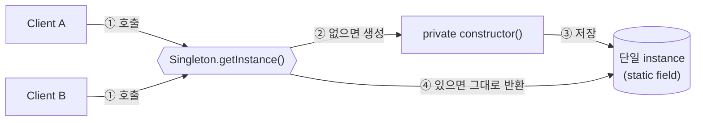
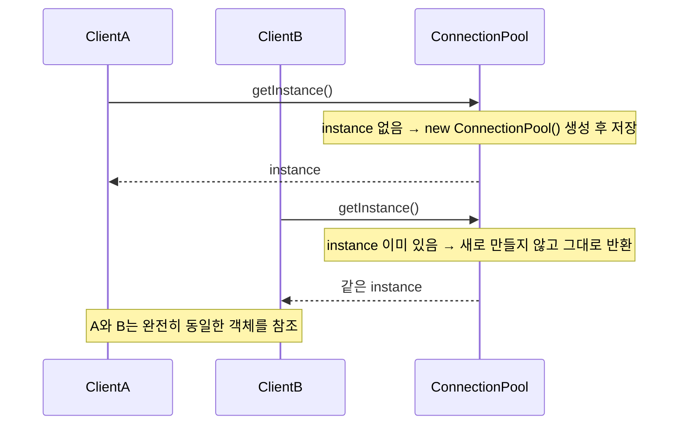
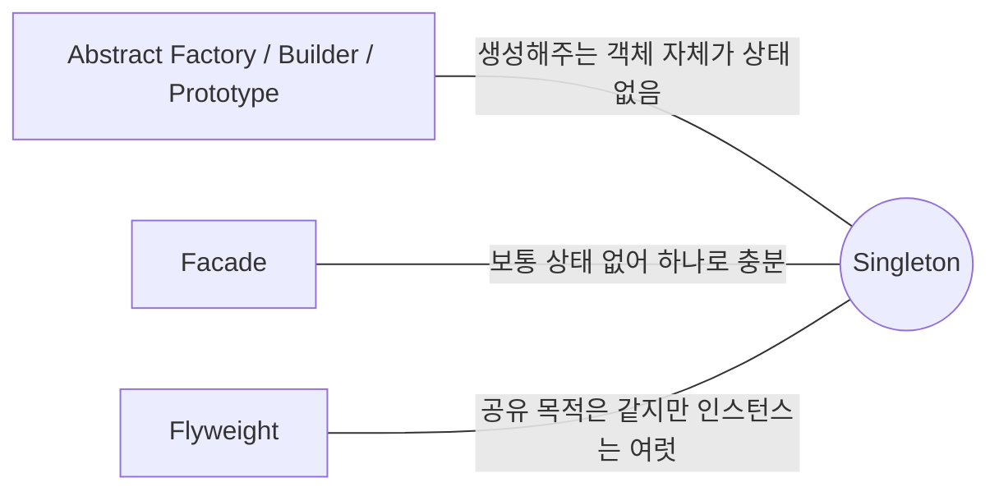

## Description

DB `ConnectionPool` 을 화면마다 `new ConnectionPool()` 로 새로 만든다고 해보자. 서버가 허용하는 최대 커넥션 수를 금방 초과하거나, 인스턴스마다 서로 다른 상태를 들고 있어서 "분명 저장했는데 다른 화면에서는 안 보이는" 버그가 생길 수 있음.

**Singleton Pattern** 은 클래스가 오직 하나의 인스턴스만 갖도록 보장하고, 그 인스턴스에 접근할 수 있는 전역 진입점을 제공하는 생성(Creational) 패턴. 생성자를 `private` 으로 막고, 유일한 인스턴스를 담는 정적 필드와 이를 반환하는 정적 메소드(`getInstance()`)를 두는 방식으로 구현함.

- **핵심**: 클래스의 인스턴스를 오직 하나만 만들고, 어디서든 그 하나에 접근할 수 있게 함.
- **목적**:
  1. 공유 자원(커넥션 풀, 캐시, 설정)의 중복 생성을 막음.
  2. 인스턴스가 여러 개 존재하면 상태 일관성이 깨지는 경우 이를 원천적으로 강제.
  3. 통제된 방식의 전역 접근점을 제공.

## Examples

커넥션 풀 예시 외에 다른 도메인에서도 같은 구조가 쓰인다는 걸 보여주는 예시 두 개. (아래 Structure 부터는 다시 커넥션 풀 예시로 돌아감.)

- **앱 설정 객체(AppConfig)**: 인스턴스가 여러 개면 각자 다른 설정 값을 들고 있어서 "설정을 바꿨는데 다른 화면엔 반영이 안 됨" 같은 버그가 생김. 하나만 있으면 항상 같은 값을 보게 됨.
- **로그 수집기(Logger)**: 로그를 파일 하나에 순서대로 쓰고 싶은데 인스턴스가 여러 개면 파일 핸들 경합이나 순서 꼬임이 생길 수 있음. 하나로 모으면 순서 보장이 쉬워짐.

## Structure



두 클라이언트가 순서대로 접근하는 흐름을 펼치면 아래와 같음.



```kotlin
class ConnectionPool private constructor() {
    companion object {
        private var instance: ConnectionPool? = null

        fun getInstance(): ConnectionPool =
            instance ?: ConnectionPool().also { instance = it }
    }
}

val poolA = ConnectionPool.getInstance()
val poolB = ConnectionPool.getInstance()
// poolA 와 poolB 는 완전히 동일한 인스턴스
```

- **Singleton**: `private` 생성자, 유일한 인스턴스를 담는 static 필드, 그 인스턴스를 반환하는 static `getInstance()` 를 가진 클래스.
- **Client**: 항상 `getInstance()` 를 통해서만 인스턴스에 접근. 직접 생성자를 호출할 방법이 없음.

Client 사용 예는 아래처럼 생성자를 호출하지 않고 전역 접근점만 사용함.

```kotlin
fun loadOrders() {
    val pool = ConnectionPool.getInstance()
    // pool 로 커넥션을 빌려 주문 데이터를 읽음
}
```

## Adaptability

다음 상황에서 특히 유용함.

- 클래스 인스턴스가 정확히 하나여야 하고, 모든 클라이언트가 동일한 인스턴스에 접근할 수 있어야 할 때.
- 인스턴스 생성 비용이 커서(예: 인스턴스화할 때 외부 데이터를 불러오는 시간이 큰 경우) 한 번만 만들어 재사용하고 싶을 때.
- 아무 곳에서나 재할당 가능한 전역 변수보다 통제된 방식의 전역 접근점을 두고 싶을 때.

## Pros

- **인스턴스가 하나뿐임을 보장해서 자원 낭비와 상태 불일치를 막음**: 커넥션 풀이 여러 개 생겨서 커넥션 한도를 넘기는 문제를 방지.
- **생성 비용이 큰 객체를 한 번만 만들고 재사용**: lazy initialization 과 결합하면 실제로 필요해지는 시점까지 생성을 미룰 수도 있음.
- **전역 변수보다 통제된 접근을 제공**: 아무 데서나 재할당할 수 있는 전역 변수와 달리, 생성자를 막아뒀기 때문에 실수로 새 인스턴스를 만드는 것 자체가 원천 차단됨.

## Cons

- **SRP 를 위반하기 쉬움**: `ConnectionPool` 클래스가 "커넥션 관리" 라는 본연의 책임과 "자기 자신의 유일성 보장(`getInstance` 로직)" 이라는 책임을 함께 떠안게 됨 ⇒ **[SRP(Single Responsibility Principle)](../../solid/SRP(Single%20Responsibility%20Principle).md)** 위반.
- **숨겨진 의존성(hidden dependency) 을 만듦**: 어디서든 `getInstance()` 로 접근 가능하다는 게 장점이자 단점 — 함수 시그니처만 봐서는 그 함수가 Singleton 을 사용하는지 알 수 없어서, 코드를 읽는 사람이 실제 의존 관계를 파악하기 어려워짐.
- **테스트가 어려워짐**: 타입으로 노출되는 인터페이스가 없으면 테스트에서 Mock 으로 교체할 방법이 없고, 전역 상태이기 때문에 한 테스트가 바꾼 상태가 다음 테스트로 새어나가(leak) 테스트 실행 순서에 따라 결과가 달라지는 flaky 테스트가 생기기 쉬움.
- **멀티스레드 환경에서 안전한 초기화를 직접 챙겨야 함**: 두 스레드가 동시에 처음 `getInstance()` 를 호출하면 인스턴스가 두 개 생길 수 있는 race condition 이 있음. `synchronized`, double-checked locking 등으로 직접 해결해야 함 (Kotlin 은 `object` 선언으로 이 부분을 언어 차원에서 대신 해결해줌 — 아래 참고).

  ```kotlin
  // Java 스타일: 스레드 안전성을 직접 챙겨야 함
  class ConnectionPool private constructor() {
      companion object {
          @Volatile private var instance: ConnectionPool? = null
          fun getInstance(): ConnectionPool =
              instance ?: synchronized(this) {
                  instance ?: ConnectionPool().also { instance = it }
              }
      }
  }

  // Kotlin: object 선언 하나로 스레드 안전한 lazy singleton
  object ConnectionPool {
      fun borrow(): Connection = TODO()
  }
  ```

  단, `object` 는 초기화 방식만 안전하게 해결해줄 뿐 위의 SRP 위반, 숨겨진 의존성, 테스트 어려움 문제는 그대로 남음 — 아래 [Modern Applicability](#modern-applicability-di-composition-root) 참고.

## Relationship with other patterns



| 비교 대상 | 공통점 | Singleton 과의 차이 |
| :--- | :--- | :--- |
| [Abstract Factory](Abstract%20Factory%20Pattern.md), [Builder](Builder%20Pattern.md), [Prototype](Prototype%20Pattern.md) | ConcreteFactory, Director, 프로토타입 레지스트리 등은 대개 상태가 없어 재사용 가능 | 그 "생성해주는 객체" 자체를 Singleton 으로 구현하는 경우가 흔함. Product(결과물)를 Singleton 으로 만든다는 뜻이 아님 — 이 구분을 혼동하기 쉬움. |
| [Facade](../structural/Facade%20Pattern.md) | 둘 다 흔히 함께 쓰임 | Facade 객체는 보통 상태가 없어 인스턴스 하나로 충분하니 Singleton 으로 구현되는 경우가 많음. |
| [Flyweight](../structural/Flyweight%20Pattern.md) | 둘 다 "인스턴스를 하나만/공유해서 쓴다" 는 인상을 줌 | Flyweight 는 **동일한 내부 상태를 가진 객체를 여러 참조가 공유**해서 메모리를 아끼는 게 목적 — 서로 다른 상태의 인스턴스는 여러 개 존재할 수 있음. Singleton 은 클래스 전체를 통틀어 인스턴스가 **정확히 하나**여야 한다는 제약. 다만 Flyweight 를 관리하는 캐시(pool) 자체는 하나여야 하므로 그 캐시 객체는 Singleton 으로 구현되는 경우가 많음. |

## Modern Applicability (DI/Composition Root)

[Composition Root](../general/patterns/Composition%20Root.md) 관점에서 Singleton 은 **2 그룹: DI Container 가 흡수** 에 속함. DI Container 의 스코프(scope) 지정 기능이 "인스턴스를 하나만 만든다" 는 Singleton 의 역할을 대신함.

**"그래도 결국 인스턴스는 하나여야 하지 않나?"** 맞음 — 이 부분은 그대로 유지됨. 달라지는 건 **접근 방식**. GoF Singleton 은 `getInstance()` 라는 정적 메소드로 아무 코드에서나 직접 접근(숨겨진 의존성). DI Container 는 생성자 주입으로 의존성이 코드에 명시적으로 드러나면서도, 그래프가 해당 타입에 대해 스코프 내에서 인스턴스를 하나만 만들어 공유함. 즉 "하나만 만든다" 는 책임은 Container 로 옮겨가고, 클래스 자신은 자기가 Singleton 이라는 사실 자체를 몰라도 됨 — 위 Cons 에서 지적한 SRP 위반이 해결됨.

**Android 예시 (Metro)**

```kotlin
@Inject
@SingleIn(AppScope::class)
class ConnectionPool(private val config: DbConfig) // private 생성자도, getInstance() 도 없음

@Inject
class OrderRepository(private val pool: ConnectionPool) // 명시적 의존성, 테스트에서 가짜로 교체 가능

@DependencyGraph(AppScope::class)
interface AppGraph {
    val orderRepository: OrderRepository
}

val graph = createGraph<AppGraph>()
val a = graph.orderRepository
val b = graph.orderRepository
// a.pool 과 b.pool 은 항상 같은 인스턴스 — @SingleIn(AppScope::class) 가 그래프 생명주기 동안 유일성을 보장
```

`ConnectionPool` 은 평범한 클래스일 뿐이고, "AppScope 안에서 인스턴스를 하나만 유지한다" 는 책임은 `@SingleIn` 스코프 어노테이션과 `AppGraph` 로 완전히 빠져나감. 테스트에서는 `AppGraph` 대신 가짜 `ConnectionPool` 을 주입한 테스트용 그래프를 구성하면 되므로, GoF Singleton 의 고질적인 테스트 어려움 문제도 함께 해결됨.
