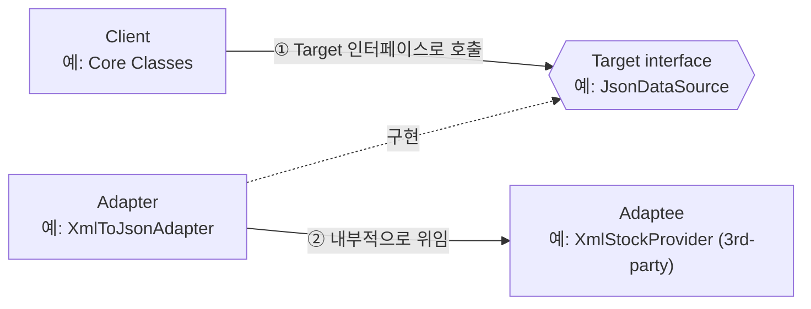
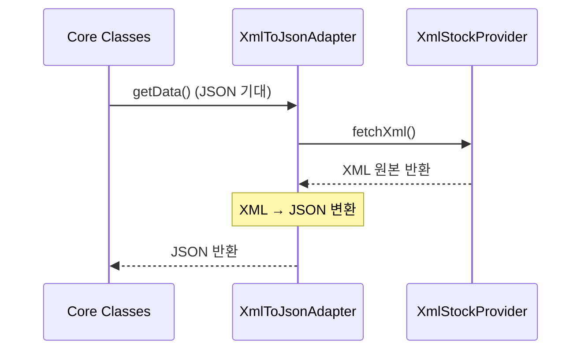
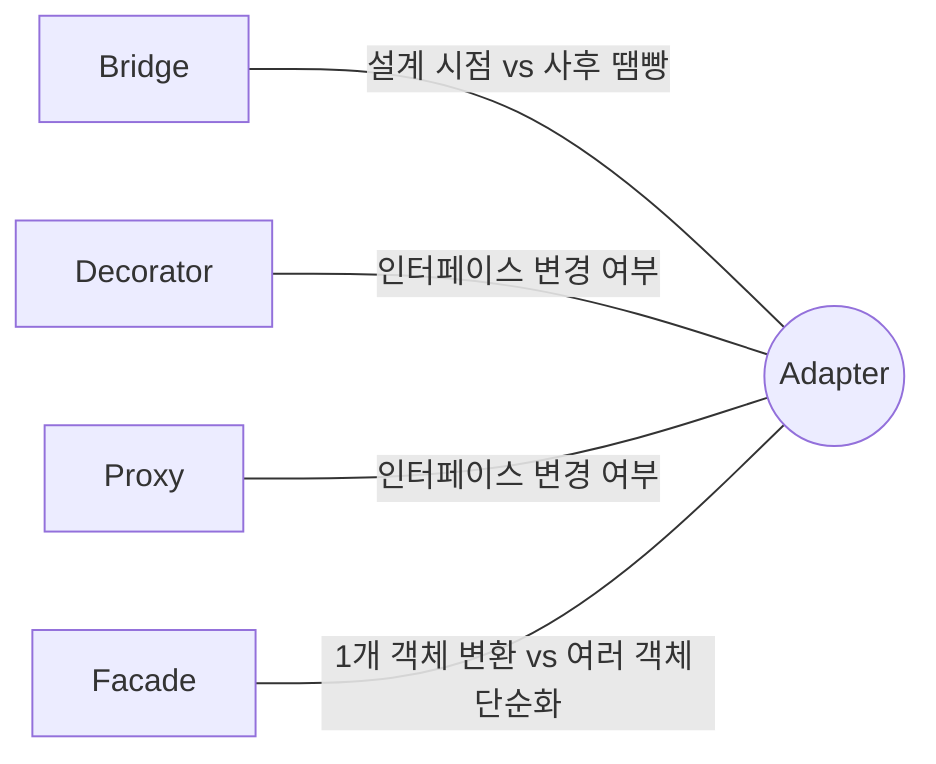

## Description

주식 데이터를 XML 로 주는 외부 API 와, JSON 만 받는 분석 라이브러리를 함께 써야 한다고 해보자. 두 인터페이스가 안 맞는다고 `Core Classes` 를 뜯어고치거나 분석 라이브러리 소스를 수정할 수는 없음 — 둘 다 내가 통제할 수 없는 코드이기 때문.

**Adapter Pattern** 은 이럴 때 기존 두 인터페이스 중 어느 쪽도 건드리지 않고, 그 사이에 변환 전담 클래스를 하나 끼워 넣어 문제를 해결하는 구조(Structural) 패턴. `XmlToJsonAdapter` 하나만 새로 만들면 `Core Classes` 는 여전히 XML 만 다루면서도 JSON 만 받는 라이브러리와 협업할 수 있음.

- **핵심**: 서로 호환되지 않는 인터페이스를 가진 두 객체 사이에 변환기를 두어 함께 동작하게 만듦.
- **목적**:
  1. 이미 존재하는 클래스(주로 3rd-party 라이브러리)를 원본 코드 수정 없이 재사용.
  2. 인터페이스 변환 로직을 한 클래스에 모아 **[SRP(Single Responsibility Principle)](../../solid/SRP(Single%20Responsibility%20Principle).md)** 를 지킴.
  3. 새 어댑터를 추가해도 기존 클라이언트 코드는 그대로 두어 **[OCP(Open Closed Principle)](../../solid/OCP(Open%20Closed%20Principle).md)** 를 지킴.

## Examples

- **외부 API 연동**: XML 만 주는 결제 게이트웨이와 JSON 만 받는 내부 서비스가 있다면, Adapter 없이는 내부 서비스 코드에 XML 파싱을 억지로 끼워 넣어야 함. `PaymentGatewayAdapter` 를 두면 내부 서비스는 JSON 인터페이스만 계속 바라봄.
- **레거시 코드 재사용**: 예전에 짠 `LegacyLogger.writeLog(String)` 을 새 `Logger` 인터페이스(`log(LogEvent)`) 를 쓰는 시스템에 넣고 싶다면, `LegacyLoggerAdapter` 하나로 감싸면 됨. `LegacyLogger` 코드는 한 줄도 안 건드림.
- **콜백 API 를 Flow 로 변환**: 레거시 카메라 SDK 가 `onFrameAvailable(ByteArray)` 같은 콜백 인터페이스만 제공한다면, Compose 화면에서 자연스럽게 구독하려면 `Flow` 로 감싸야 함. `CameraFrameAdapter` 가 콜백을 `callbackFlow { }` 로 변환해주면, 나머지 코드는 `Flow<Bitmap>` 만 알면 됨 — SDK 의 콜백 인터페이스는 한 줄도 안 바꿈.

## Structure



실제 요청이 오갈 때는 아래 순서로 동작함.



(object adapter 기준. 다중 상속을 지원하는 언어라면 Adapter 가 Target 을 구현함과 동시에 Adaptee 를 상속하는 class adapter 도 가능하지만, Kotlin/Java 등 대부분의 현대 언어는 클래스 다중 상속을 지원하지 않아 object adapter 가 사실상 표준.)

- **Target**: Client 가 기대하는 인터페이스 (`JsonDataSource`).
- **Adaptee**: 기존에 존재하지만 Target 과 인터페이스가 다른 클래스 (`XmlStockProvider`, 3rd-party 라이브러리 등).
- **Adapter**: Target 을 구현하면서 내부적으로 Adaptee 를 감싸 호출을 위임. 변환 로직이 이 클래스 안에 갇혀 있음.
- **Client**: Target 인터페이스만 알고 사용. Adaptee 의 존재를 몰라도 됨.

## Adaptability

다음 상황에서 특히 유용함.

- 기존 클래스를 쓰고 싶은데 인터페이스가 나머지 코드와 맞지 않을 때.
- 상위 클래스에 공통 기능을 추가할 수 없는 여러 기존 하위 클래스를 재사용하고 싶을 때.
- 3rd-party 라이브러리나 레거시 코드처럼 직접 수정할 수 없는 코드를 내 코드 스타일에 맞춰 쓰고 싶을 때.

## Pros

- **변환 로직이 한 곳에 모임**: XML→JSON 변환 코드가 `XmlToJsonAdapter` 안에만 있어서, 이 변환이 잘못됐을 때 어디를 봐야 하는지 명확함 ⇒ **[SRP(Single Responsibility Principle)](../../solid/SRP(Single%20Responsibility%20Principle).md)**.
- **기존 코드를 건드리지 않고 새 어댑터를 추가 가능**: 결제 게이트웨이가 하나 더 늘어도 `PaymentGatewayAdapterB` 를 새로 추가할 뿐, 기존 `PaymentGatewayAdapterA` 나 Client 코드는 그대로 ⇒ **[OCP(Open Closed Principle)](../../solid/OCP(Open%20Closed%20Principle).md)**.
- **domain layer 테스트가 쉬워짐**: Client 는 Target 인터페이스에만 의존하므로, 테스트에서는 Adaptee 대신 가짜(Fake/Mock) Target 구현체를 넣어주면 됨.

## Cons

- **클래스와 인터페이스가 늘어나 복잡도가 증가함**: 변환기 하나 추가하려고 인터페이스 + 클래스가 새로 생김. 인터페이스가 하나뿐이고 앞으로도 안 바뀔 거라면 그냥 서비스 클래스를 직접 고치는 게 더 간단할 수 있음.
- **다중 상속 기반 class adapter 는 언어 제약을 받음**: Kotlin/Java/Dart 등 클래스 다중 상속을 지원하지 않는 언어에서는 애초에 선택지가 object adapter 하나뿐임.

## Relationship with other patterns



| 비교 대상 | 공통점 | Adapter 와의 차이 |
| :--- | :--- | :--- |
| [Bridge](Bridge%20Pattern.md) | 둘 다 실제 작업을 다른 객체에 위임하는 Composition 구조 | Bridge 는 추상화와 구현이 **처음부터** 서로 독립적으로 발전하도록 설계됨(사전 설계). Adapter 는 이미 존재하고 서로 호환되지 않는 클래스를 나중에 맞추기 위해 씀(사후 땜빵). 태어난 시점이 다름. |
| [Decorator](Decorator%20Pattern.md), [Proxy](Proxy%20Pattern.md) | 셋 다 감싼 객체에 호출을 위임하는 Wrapper 구조 | Adapter 는 감싼 객체에 **다른** 인터페이스를 제공(호환 안 되던 걸 맞춤). Proxy 는 감싼 객체와 **같은** 인터페이스를 제공(접근 제어가 목적). Decorator 는 **같은 인터페이스를 유지한 채 기능을 덧붙임**. 인터페이스를 바꾸느냐/유지하느냐, 유지한다면 왜 유지하느냐가 갈림. |
| [Facade](Facade%20Pattern.md) | 둘 다 기존 코드를 새 인터페이스 뒤에 숨김 | Adapter 는 보통 **객체 하나**의 기존 인터페이스를 클라이언트가 기대하는 형태로 맞추는 게 목적(호환성). Facade 는 **여러 객체(서브시스템)** 를 하나의 단순한 인터페이스로 묶어서 복잡도를 낮추는 게 목적(단순화). 대상이 하나냐 여러 개냐, 목적이 호환이냐 단순화냐가 다름. |

## Modern Applicability (DI/Composition Root)

[Composition Root](../general/patterns/Composition%20Root.md) 관점에서 Adapter 는 **3 그룹: 여전히 설계의 핵심** 에 속함. Adapter 는 "누구를 생성할지" 를 다루는 패턴이 아니라 "서로 다른 두 인터페이스 사이를 어떻게 연결할지" 를 다루는 객체 관계 패턴이라, DI Container 가 아무리 발전해도 Container 가 대신 판단해 줄 수 없음 — 변환 로직 자체는 여전히 사람이 짜야 함.

**"그래도 결국 누군가는 Adaptee 를 알아야 하지 않나?"** 맞음. Adapter 패턴은 그 지식을 없애는 게 아니라 `XmlToJsonAdapter` 라는 한 클래스 안에 가둠. 나머지 코드는 `JsonDataSource` 인터페이스만 알면 됨. Composition Root 는 여기서 "어떤 Adapter 구현체를 Target 인터페이스에 묶을지" 를 선언하는 지점 역할을 함.

**Android 예시 (Metro)** — 콜백 기반 3rd-party SDK 를 코루틴/Flow 인터페이스로 맞추는, Compose 시대에 가장 흔한 Adapter 활용 사례.

```kotlin
interface JsonDataSource {
    fun fetch(): String // JSON
}

// Adaptee: 3rd-party, 인터페이스를 바꿀 수 없음
class XmlStockProvider {
    fun fetchXml(): String = "<stock>...</stock>"
}

@Inject
class XmlToJsonAdapter(private val provider: XmlStockProvider) : JsonDataSource {
    override fun fetch(): String = convertXmlToJson(provider.fetchXml())
}

@Inject
class StockViewModel(private val dataSource: JsonDataSource) // XML 인지 전혀 모름

@DependencyGraph(AppScope::class)
interface AppGraph {
    val stockViewModel: StockViewModel

    @Binds
    fun bindDataSource(impl: XmlToJsonAdapter): JsonDataSource
}
```

`AppGraph` 의 `@Binds` 선언이 "`XmlStockProvider` 를 아는 유일한 지점" 임을 명시함. `StockViewModel` 은 `XmlStockProvider` 라는 이름조차 몰라도 됨.
