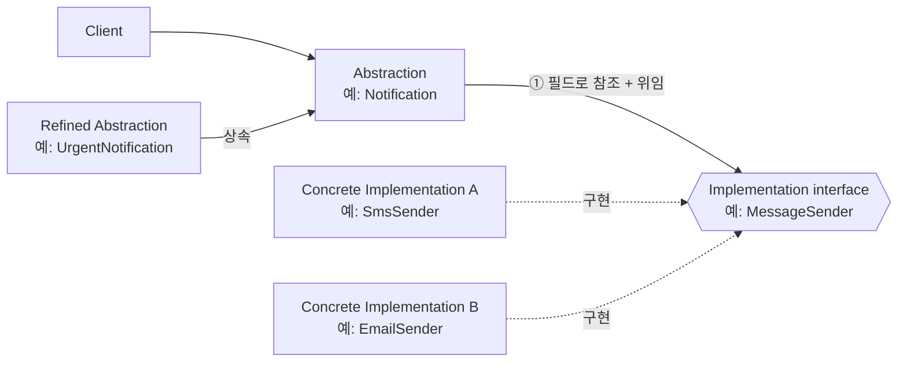
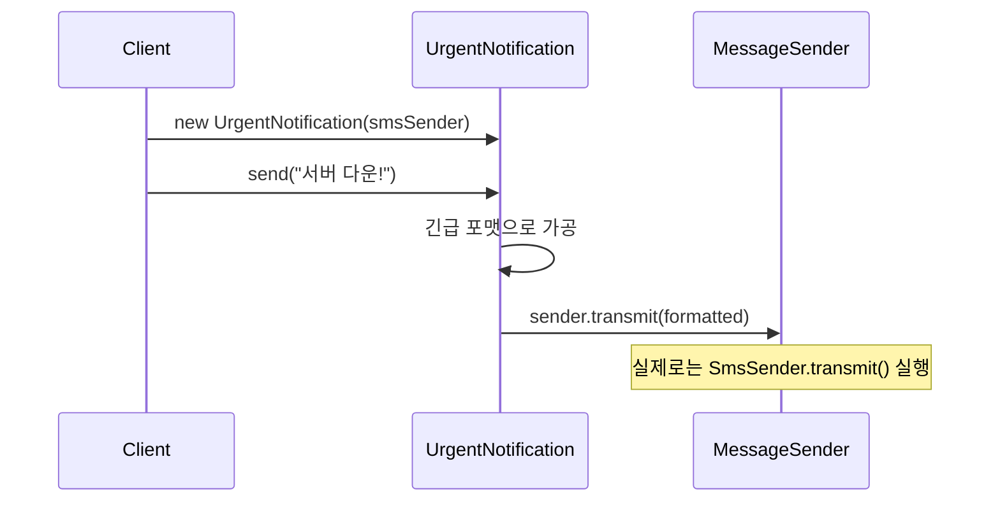
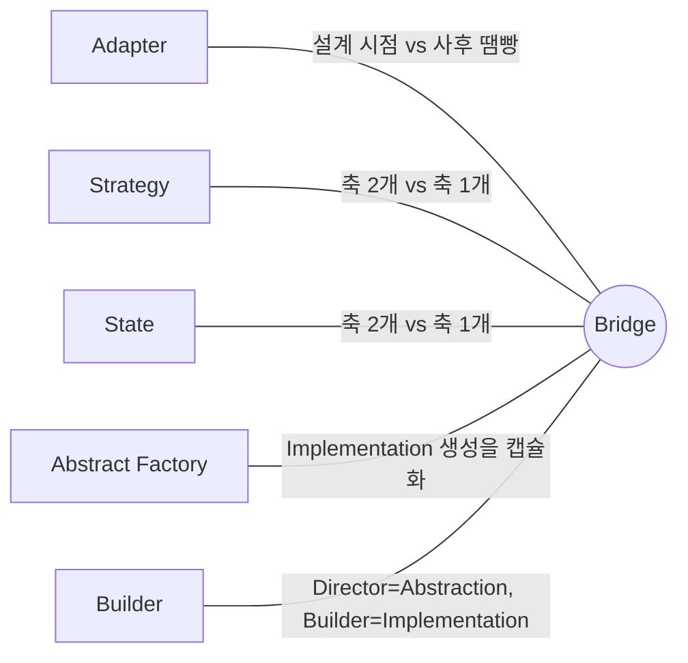

## Description

도형(`Shape`)을 `Circle`, `Square` 로 나누고, 각 도형을 다시 렌더링 방식(`Raster`, `Vector`)별로 나눈다고 해보자. 상속만으로 풀면 `RasterCircle`, `VectorCircle`, `RasterSquare`, `VectorSquare` 처럼 도형 종류 × 렌더링 방식 조합만큼 클래스가 곱셈으로 늘어남. 렌더링 방식이 하나 더 생기면 기존 도형 개수만큼 클래스를 또 새로 만들어야 함.

**Bridge Pattern** 은 이렇게 독립적으로 변할 수 있는 두 축(추상화·구현)을 하나의 상속 계층에 억지로 우겨넣지 않고, 각각 별도의 계층으로 분리한 뒤 둘을 Composition 으로 연결하는 구조(Structural) 패턴. `Shape` 계층과 `Renderer` 계층을 나누면, 도형이 늘어도 렌더링 방식은 그대로 재사용되고 그 반대도 마찬가지임.

- **핵심**: 추상화(Abstraction)와 구현(Implementation)을 별도의 클래스 계층으로 분리하고, 둘을 Composition 으로 연결해 각각 독립적으로 확장 가능하게 만듦.
- **목적**:
  1. 상속 하나로 두 축(예: 도형 종류 × 렌더링 방식)을 표현할 때 생기는 클래스 조합 폭발을 막음.
  2. 구현을 런타임에 교체 가능하게 만듦 — 상속은 컴파일 타임에 구현이 고정되지만 Bridge 는 그렇지 않음.
  3. 추상화와 구현이 각자 독립적으로 새 서브클래스를 추가해도 서로 영향받지 않도록 하여 **[OCP(Open Closed Principle)](../../solid/OCP(Open%20Closed%20Principle).md)** 를 지킴.

## Examples

- **크로스플랫폼 UI**: `Window` 라는 추상화를 Windows/macOS/Linux 용 `WindowImpl` 과 분리하면, 새 위젯(`Dialog`, `Button`)이 추가돼도 플랫폼별 구현 3개를 새로 안 만들어도 됨. Bridge 없이는 `WindowsDialog`, `MacDialog`, `LinuxDialog` 식으로 조합이 곱셈으로 늘어남.
- **영속성 계층**: `Repository` 추상화와 `Database`/`FileSystem` 구현을 분리하면, 저장 방식을 DB→파일로 바꿔도 `Repository` 를 쓰는 코드는 그대로임.
- **메시지 발송**: `Notification`(Abstraction: `send()`, `sendUrgently()`) 과 `MessageSender`(Implementation: `SmsSender`, `EmailSender`) 를 분리하면, 알림 종류가 늘어도 발송 수단 구현은 재사용되고, 발송 수단이 늘어도 알림 종류 쪽 코드는 그대로임.

## Structure



실제 호출 흐름은 아래와 같음.



- **Abstraction**: 상위 수준의 제어 로직을 담음. `Implementation` 타입 객체를 필드로 들고, 실제 작업은 위임함 (`Notification`).
- **Refined Abstraction**: `Abstraction` 을 상속해 변형을 추가한 것 (`UrgentNotification`). 없어도 됨 — 선택 사항.
- **Implementation**: 플랫폼/구현 세부사항에 대한 인터페이스. `Abstraction` 은 오직 이 인터페이스를 통해서만 구현체와 소통함 (`MessageSender`).
- **Concrete Implementation**: `Implementation` 인터페이스를 구현한 실제 클래스 (`SmsSender`, `EmailSender`). 플랫폼 종속적인 코드가 여기 들어감.
- **Client**: `Abstraction` 과만 상호작용하고, 필요하면 어떤 `Concrete Implementation` 을 연결할지 결정.

## Adaptability

다음 상황에서 특히 유용함.

- 하나의 monolithic 클래스를 여러 축(관심사)으로 나누고 싶을 때. 예: 영속성 계층에서 DB 접근 방식과 파일시스템 접근 방식을 모두 지원해야 하는 경우.
- 추상화와 구현 양쪽 모두 서브클래스로 독립적으로 확장 가능해야 할 때.
- 구현을 런타임에 교체해야 할 때.
- 상속만으로 표현하면 클래스 수가 두 축의 곱만큼 늘어나는 상황일 때.

## Pros

- **플랫폼 독립적인 클래스/앱을 만들 수 있음**: `Notification` 은 `MessageSender` 가 SMS 인지 이메일인지 모르고도 동작함.
- **클라이언트 코드는 상위 수준 추상화와만 작동**: 클라이언트는 `Notification.send()` 만 호출하면 됨 — 내부에서 어떤 `MessageSender` 가 쓰이는지는 노출되지 않음.
- **추상화와 구현을 각각 독립적으로 확장 가능**: `Notification` 서브클래스(`UrgentNotification`)를 추가하거나 `MessageSender` 구현(`PushSender`)을 추가해도 서로 영향 없음 ⇒ **[OCP(Open Closed Principle)](../../solid/OCP(Open%20Closed%20Principle).md)**.
- **관심사가 분리됨**: `Abstraction` 은 상위 로직에만, `Implementation` 은 플랫폼 세부사항에만 집중 ⇒ **[SRP(Single Responsibility Principle)](../../solid/SRP(Single%20Responsibility%20Principle).md)**.

## Cons

- **이미 응집도가 높은(축이 하나뿐인) 클래스에 적용하면 오히려 복잡해짐**: 확장 축이 애초에 하나뿐이라면 인터페이스 계층을 두 겹으로 나누는 비용이 이득보다 클 수 있음.
- **간접 호출 한 단계가 추가됨**: `Abstraction → Implementation` 위임 경로가 생기므로, 아주 단순한 경우엔 오히려 코드를 따라가기 번거로워질 수 있음.

## Relationship with other patterns



| 비교 대상 | 공통점 | Bridge 와의 차이 |
| :--- | :--- | :--- |
| [Adapter](Adapter%20Pattern.md) | 둘 다 다른 객체에 위임하는 Composition 구조 | Bridge 는 추상화와 구현이 **처음부터** 독립적으로 발전하도록 사전 설계된 구조. Adapter 는 이미 존재하는 호환 안 되는 클래스를 사후에 맞추는 땜빵. |
| [Strategy](../behavioral/Strategy%20Pattern.md), [State](../behavioral/State%20Pattern.md) | 셋 다 Composition 으로 다른 객체에 작업을 위임하는 구조가 비슷해 보임 | Bridge 는 **두 개의 독립적인 계층**(추상화 축 + 구현 축)을 분리하는 구조적 패턴. Strategy/State 는 **하나의 축**(알고리즘 또는 상태)만 다루는 행위 패턴. Bridge 의 목적은 클래스 계층 설계, Strategy/State 의 목적은 런타임 행동 교체. |
| [Abstract Factory](../creational/Abstract%20Factory%20Pattern.md) | 함께 쓰기 좋음 | Bridge 의 `Implementation` 중 일부가 특정 `Abstraction` 하고만 짝이 맞아야 할 때, Abstract Factory 로 그 조합 관계를 캡슐화해서 Client 가 잘못된 조합을 생성하지 못하게 할 수 있음. |
| [Builder](../creational/Builder%20Pattern.md) | 함께 쓰기 좋음 | Builder 의 `Director` 를 Bridge 의 `Abstraction` 역할로, 서로 다른 `Builder` 구현체들을 `Implementation` 역할로 대응시키는 조합이 가능함. |

## Modern Applicability (DI/Composition Root)

[Composition Root](../general/patterns/Composition%20Root.md) 관점에서 Bridge 는 **3 그룹: 여전히 설계의 핵심** 에 속함. Bridge 는 "두 계층을 어떻게 나눌지" 를 결정하는 설계 패턴이라, DI Container 는 이미 나뉜 두 계층을 배선해줄 뿐 계층을 나누는 설계 자체를 대신해주지 않음.

**"그래도 결국 누군가는 Concrete Implementation 을 알아야 하지 않나?"** 맞음. Bridge 가 없애는 건 그 지식이 아니라, `Abstraction` 코드 곳곳에 플랫폼 분기(if-else)가 흩어지는 것. Composition Root 는 "지금 이 실행 환경에는 어떤 `Implementation` 을 연결할지" 를 한 곳에서 결정하는 지점이 됨.

**Android 예시 (Metro)** — 플랫폼(안드로이드 버전, 디바이스 종류)별로 구현이 갈리는 알림 발송 기능.

```kotlin
interface MessageSender { // Implementation
    fun transmit(text: String)
}

@Inject class SmsSender : MessageSender { /* ... */ }
@Inject class PushSender : MessageSender { /* ... */ }

abstract class Notification(protected val sender: MessageSender) { // Abstraction
    abstract fun send(message: String)
}

@Inject
class UrgentNotification(sender: MessageSender) : Notification(sender) {
    override fun send(message: String) = sender.transmit("[긴급] $message")
}

@DependencyGraph(AppScope::class)
interface AppGraph {
    val urgentNotification: UrgentNotification

    @Provides
    fun provideMessageSender(sms: SmsSender, push: PushSender): MessageSender =
        if (Build.VERSION.SDK_INT >= 26) push else sms
}
```

`AppGraph` 가 "이 기기에서는 어떤 `MessageSender` 를 쓸지" 를 결정하는 유일한 지점. `UrgentNotification` 은 자신이 SMS 위에서 도는지 Push 위에서 도는지 전혀 모름 — 축 2개(알림 종류, 발송 수단)가 서로의 존재를 모른 채 각자 확장됨.
