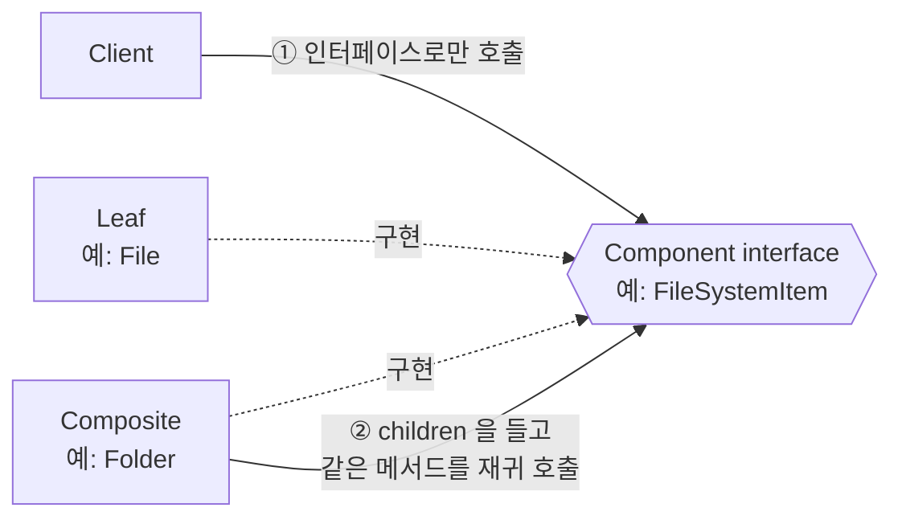
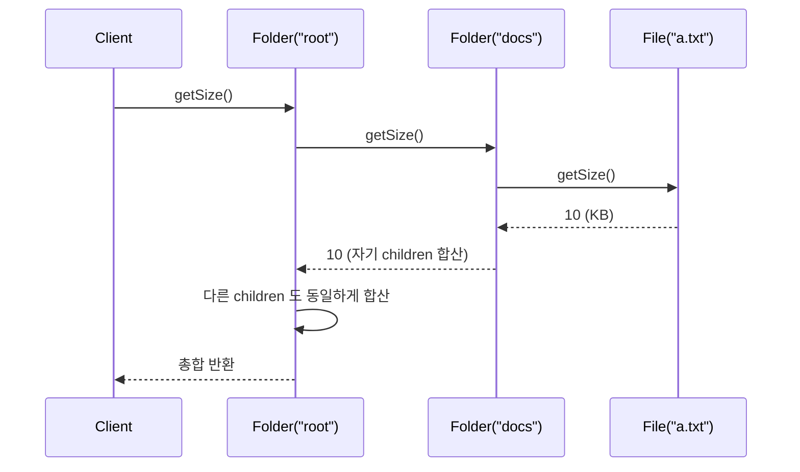
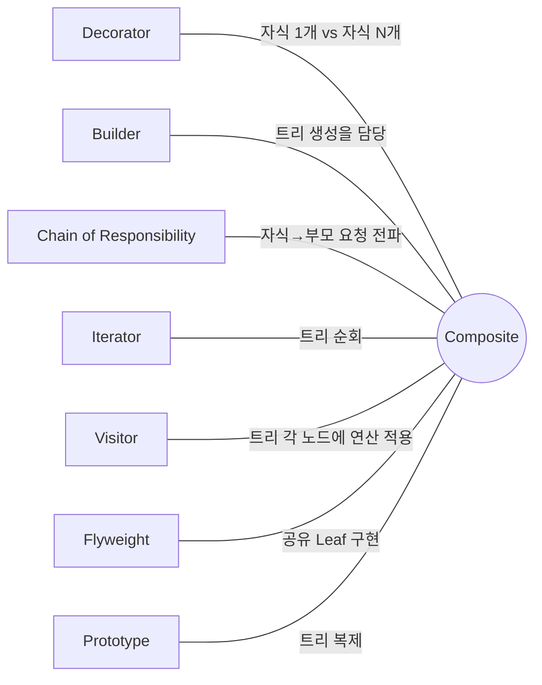

## Description

파일 탐색기를 만든다고 해보자. `File` 은 크기가 정해져 있고, `Folder` 는 안에 `File` 도 있고 또 다른 `Folder` 도 있을 수 있음. "이 폴더의 전체 용량은?" 을 구하려면 `File` 이면 그냥 크기를 반환하고, `Folder` 면 안에 있는 항목들을 하나씩 다시 검사해야 하는데, 클라이언트 코드에서 매번 `if (item is File) … else if (item is Folder) …` 로 분기하면 트리가 깊어질수록 코드가 지저분해짐.

**Composite Pattern** 은 이렇게 부분 - 전체 계층(part-whole hierarchy)을 가진 구조에서, 개별 객체(Leaf)와 그 객체들의 묶음(Composite)을 같은 인터페이스로 다루게 만드는 구조(Structural) 패턴. `File` 과 `Folder` 가 똑같이 `getSize()` 를 구현하게 만들면, 클라이언트는 지금 다루는 게 파일인지 폴더인지 몰라도 `getSize()` 하나만 호출하면 됨 — 재귀는 `Folder` 내부에 숨음.

- **핵심**: 개별 객체(Leaf)와 그 객체들의 집합(Composite)을 같은 인터페이스로 묶어, 클라이언트가 트리 구조를 재귀적으로 다루는 코드를 직접 짜지 않아도 되게 함.
- **목적**:
  1. 트리 형태의 객체 구조(파일 시스템, UI 컴포넌트, 조직도 등)를 다룰 때 재귀 처리를 클라이언트 코드 밖으로 빼냄.
  2. 단순 요소와 복합 요소를 클라이언트가 구분하지 않고 균일하게 처리하도록 함.
  3. 새로운 종류의 Leaf/Composite 를 추가해도 기존 클라이언트 코드가 안 바뀌게 하여 **[OCP(Open Closed Principle)](../../solid/OCP(Open%20Closed%20Principle).md)** 를 지킴.

## Examples

- **파일 시스템**: `File`, `Folder` 를 `FileSystemItem` 인터페이스로 묶으면, 폴더 용량 계산 코드가 폴더가 몇 겹 중첩되든 한 함수(재귀 호출)로 끝남. Composite 없이는 중첩 깊이만큼 분기/루프를 직접 손으로 짜야 함.

파일 시스템 예시 외에 다른 도메인에서도 같은 구조가 쓰임. (아래 Structure 부터는 다시 파일 시스템 예시로 돌아감.)

- **UI 컴포넌트 트리**: `Button` 같은 개별 위젯과 `Row`/`Column` 같은 레이아웃 컨테이너를 같은 `Widget` 인터페이스로 다루면, 화면을 그리는 코드는 지금 그리는 게 버튼인지 레이아웃인지 몰라도 됨.
- **조직도 급여 합산**: `Employee`(개인)와 `Department`(팀)를 `OrgUnit` 인터페이스로 묶으면, "이 부서 전체 인건비" 계산이 부서가 몇 단계로 중첩되든 동일한 `getTotalSalary()` 호출로 끝남.

## Structure



`Folder.getSize()` 호출 하나가 트리를 타고 내려가는 흐름은 아래와 같음.



```kotlin
interface FileSystemItem { // Component
    fun getSize(): Int
}

class File(private val sizeKb: Int) : FileSystemItem { // Leaf
    override fun getSize() = sizeKb
}

class Folder(private val children: List<FileSystemItem>) : FileSystemItem { // Composite
    override fun getSize() = children.sumOf { it.getSize() } // 재귀
}

fun printTotalSize(root: FileSystemItem) { // Client
    println(root.getSize()) // File 인지 Folder 인지 몰라도 됨
}
```

- **Component**: `Leaf` 와 `Composite` 가 공통으로 구현하는 인터페이스 (`FileSystemItem`). Client 는 이 인터페이스만 앎.
- **Leaf**: 자식이 없는 말단 객체 (`File`). 실제 동작(크기 반환 등)을 직접 수행.
- **Composite**: 자식들(`Component` 목록)을 들고 있고, 자신에게 온 요청을 각 자식에게 위임한 뒤 결과를 취합 (`Folder`).
- **Client**: `Component` 인터페이스로만 트리와 상호작용. 지금 다루는 노드가 Leaf 인지 Composite 인지 구분하지 않음.

Client 사용 예는 아래처럼 루트 노드를 `FileSystemItem` 으로만 다룸.

```kotlin
val root: FileSystemItem = Folder(listOf(File(10), Folder(listOf(File(5)))))
printTotalSize(root)
```

## Adaptability

다음 상황에서 특히 유용함.

- 부분 - 전체 계층(트리 구조)을 구현해야 할 때. 예: 파일 시스템, UI 컴포넌트 트리, 조직도.
- 클라이언트 코드가 단순 요소와 복합 요소를 구분하지 않고 균일하게 처리하길 원할 때.
- 적용 대상을 찾기가 의외로 어려운 패턴이라, "이 객체들 묶음이 트리 구조인가?" 를 발견했을 때 적용을 검토해보는 접근이 잘 맞음.

## Pros

- **기존 코드를 건드리지 않고 새 요소 종류를 추가 가능**: `SymbolicLink` 같은 새 `FileSystemItem` 을 추가해도 `Folder.getSize()` 는 안 바뀜 ⇒ **[OCP(Open Closed Principle)](../../solid/OCP(Open%20Closed%20Principle).md)**.
- **재귀 계산을 다루기 쉬워짐**: "전체 트리를 순회하며 합산" 같은 로직이 `Composite` 클래스 하나에 갇혀 있어서, 클라이언트는 트리 깊이를 신경 쓸 필요가 없음.

## Cons

- **서로 너무 다른 책임을 가진 클래스에는 공통 인터페이스를 뽑기 어려움**: 예를 들어 `File.delete()` 는 자연스럽지만 어떤 Leaf 는 삭제라는 개념 자체가 없을 수 있음 — 억지로 인터페이스를 맞추면 일부 구현체에서 빈 메서드나 예외 던지기가 늘어남.
- **인터페이스를 과도하게 일반화하면 오히려 이해하기 어려워짐**: 모든 케이스를 다 포괄하려다 `Component` 인터페이스 자체가 무슨 역할인지 애매해질 수 있음.

## Relationship with other patterns



| 비교 대상 | 공통점 | Composite 와의 차이 |
| :--- | :--- | :--- |
| [Decorator](Decorator%20Pattern.md) | 둘 다 재귀적 Composition 구조라 다이어그램이 비슷함 | Decorator 는 감싼 객체 **1 개**에 새 책임을 덧붙이는 것, Composite 는 자식 **여러 개**(0~N 개)의 결과를 취합("요약")하는 것. Decorator 를 자식이 1 개뿐인 Composite 로 볼 수도 있음. 둘을 함께 써서 Composite 트리의 특정 노드에만 Decorator 로 기능을 얹는 것도 가능함. |
| [Builder](../creational/Builder%20Pattern.md) | 함께 쓰기 좋음 | Builder 는 복잡한 Composite 트리를 단계적으로(종종 재귀적으로) 조립하는 역할을 함 — Composite 자체의 구조와는 별개로 "어떻게 생성할지" 를 담당. |
| [Chain of Responsibility](../behavioral/Chain%20of%20Responsibility%20Pattern.md) | 둘 다 재귀적 구조를 가짐 | Composite 와 자주 함께 쓰임: Leaf 가 요청을 처리하지 못하면 부모(Composite)에게, 부모는 다시 자신의 부모에게 전달하는 식으로 트리의 루트까지 요청을 전파하는 데 Chain of Responsibility 를 활용할 수 있음. |
| [Iterator](../behavioral/Iterator%20Pattern.md) | 함께 쓰기 좋음 | Composite 트리를 순회(traverse)하는 역할을 Iterator 가 담당. Composite 자체는 순회 방법을 규정하지 않음. |
| [Visitor](../behavioral/Visitor%20Pattern.md) | 함께 쓰기 좋음 | Composite 트리의 각 노드(Leaf/Composite 구분 없이)에 새로운 연산을 적용하고 싶을 때 Visitor 를 사용 — Composite 클래스들을 수정하지 않고 연산을 추가할 수 있음. |
| [Flyweight](Flyweight%20Pattern.md) | 함께 쓰기 좋음 | Composite 트리에 동일한 Leaf 가 대량으로 반복된다면, 그 Leaf 를 Flyweight 로 구현해서 RAM 을 아낄 수 있음. |
| [Prototype](../creational/Prototype%20Pattern.md) | 함께 쓰기 좋음 | Composite(그리고 Decorator)를 많이 쓰는 설계에서는, 복잡한 트리 구조를 처음부터 다시 조립하는 대신 Prototype 으로 통째로 복제하면 이득을 볼 수 있음. |

## Modern Applicability (DI/Composition Root)

[Composition Root](../general/patterns/Composition%20Root.md) 관점에서 Composite 는 **3 그룹: 여전히 설계의 핵심** 에 속함. Composite 는 "객체들이 어떤 관계(트리)로 얽혀 있는가" 를 다루는 패턴이라, 이건 애초에 DI Container 가 대신 풀어줄 수 있는 문제가 아님 — Container 는 객체를 어떻게 "생성" 할지 담당할 뿐, 생성된 객체들이 트리로 어떻게 조합되는지는 여전히 코드로 짜야 함.

**"그래도 결국 누군가는 트리 구조를 알아야 하지 않나?"** 맞음. Composite 가 없애는 건 "트리 구조를 아는 코드" 가 아니라, 그 구조를 순회하는 재귀 로직이 클라이언트 곳곳에 중복되는 것. `Component` 인터페이스 뒤로 재귀가 숨음.

**Android 예시 (Metro)** — Jetpack Compose 의 `@Composable` 트리 자체가 Composite 패턴의 살아있는 예시임. `Text` 같은 리프 컴포저블과 `Column` 같은 컨테이너 컴포저블이 똑같이 "컴포지션에 참여하는 노드" 로 다뤄짐. 여기서는 Compose 트리 대신, 같은 구조를 명시적 클래스로 표현한 예시로 DI 연결 지점을 보여줌.

```kotlin
interface FileSystemItem { // Component
    fun getSize(): Int
}

@Inject
class File(private val name: String, private val sizeKb: Int) : FileSystemItem {
    override fun getSize() = sizeKb
}

class Folder(private val children: List<FileSystemItem>) : FileSystemItem {
    override fun getSize() = children.sumOf { it.getSize() }
}

@Inject
class StorageViewModel(private val root: FileSystemItem) // File 인지 Folder 인지 모름

@DependencyGraph(AppScope::class)
interface AppGraph {
    val storageViewModel: StorageViewModel

    @Provides
    fun provideRoot(): FileSystemItem =
        Folder(listOf(File("readme.txt", 2), Folder(listOf(File("a.kt", 5)))))
}
```

`Folder` 는 `@Inject` 생성자 대신 `AppGraph` 에서 직접 조립하는 편이 자연스러움 — 트리 모양 자체가 실행 시점에 결정되는 데이터라, Composition Root 는 "루트가 어떤 모양의 트리인지" 를 결정하는 지점이 됨.
