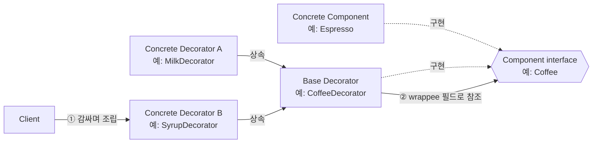
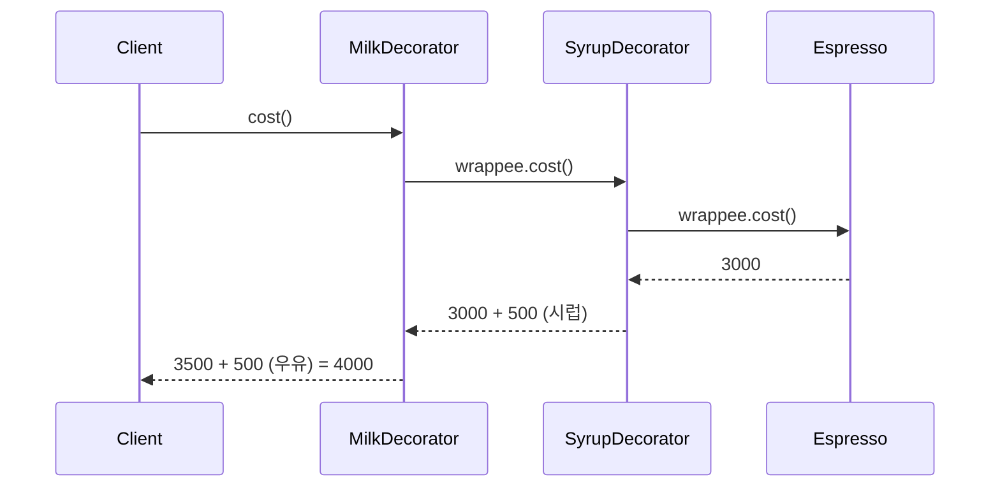
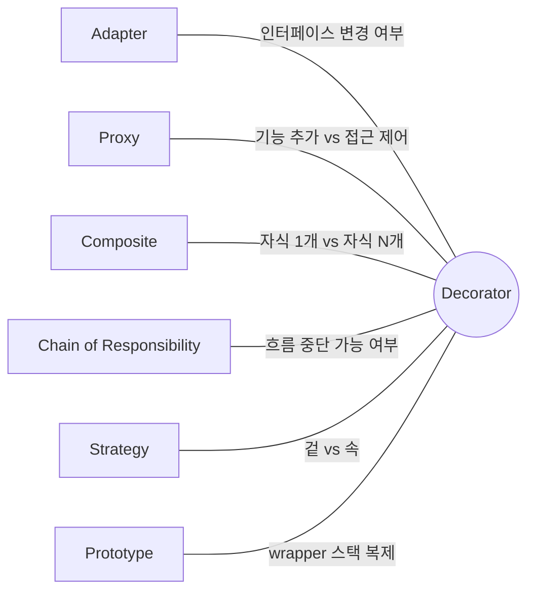

## Description

텍스트 컴포저블에 배경색과 테두리를 추가해야 한다고 해보자. 상속으로 풀면 `BorderedText`, `BackgroundText`, `BorderedBackgroundText` 처럼 조합 경우의 수만큼 컴포넌트가 늘어나고, 이걸 "모든 텍스트가 아니라 특정 인스턴스에만" 적용하고 싶다면 상속으로는 아예 불가능함 — 상속은 클래스 단위로 고정되지, 인스턴스 하나만 골라서 기능을 얹을 수 없기 때문.

**Decorator Pattern** 은 이럴 때 객체를 감싸는 wrapper 객체를 겹겹이 쌓아서, 기존 인터페이스는 그대로 유지한 채 런타임에 필요한 인스턴스에만 책임을 추가하는 구조(Structural) 패턴. Jetpack Compose 의 `Modifier` 가 정확히 이 방식으로 동작함 — `Modifier.background(color).border(1.dp, Color.Gray).padding(8.dp)` 처럼 필요한 `Modifier` 만 그때그때 이어붙이면 되고, 조합마다 새 컴포넌트를 미리 만들어둘 필요가 없음. `Modifier` 체인은 내부적으로 각 `Modifier.Element` 가 다음 요소를 감싸며 레이아웃/그리기 동작을 하나씩 추가하는 구조라, Decorator 패턴 그 자체로 볼 수 있음.

- **핵심**: 객체를 wrapper 로 감싸서, 원래 인터페이스를 유지한 채 동적으로 새 책임을 추가·제거함.
- **목적**:
  1. 상속으로 확장하면 서브클래스가 조합 폭발하는 문제를 Composition 으로 풀어냄.
  2. 런타임에 특정 인스턴스에만 기능을 추가/제거할 수 있게 함 — 상속은 이게 불가능함.
  3. 여러 책임을 가진 monolithic 클래스를 작은 클래스들로 쪼개서 **[SRP(Single Responsibility Principle)](../../solid/SRP(Single%20Responsibility%20Principle).md)** 를 지킴.

## Examples

- **Compose `Modifier` 체이닝**: 스크롤 가능한 화면과 아닌 화면이 섞여 있다면, 상속 없이 `Modifier.verticalScroll(state)` 하나만 이어붙이면 됨. 상속 기반이었다면 "스크롤 가능한 버전" 컴포넌트를 따로 만들어야 했음.
- **네트워크 요청 처리**: 로깅, 재시도, 캐싱을 각각 `LoggingSender`, `RetrySender`, `CachingSender` 로 만들어 겹겹이 감싸면, 특정 요청에만 캐싱을 빼는 식으로 조합을 자유롭게 바꿀 수 있음. 하나의 `Sender` 클래스에 다 넣으면 필요 없는 기능도 항상 따라옴.
- **음료 주문 시스템(카페 예제)**: `Coffee` 에 `MilkDecorator`, `SyrupDecorator` 를 씌우면 가격과 설명이 자동으로 누적됨. 상속으로 풀면 `MilkSyrupCoffee`, `MilkCoffee`, `SyrupCoffee` 처럼 토핑 조합 개수만큼 클래스가 생겨야 함.

## Structure



`MilkDecorator(SyrupDecorator(espresso))` 를 호출하면 아래처럼 안쪽부터 바깥쪽 순서로 실행됨.



- **Component**: `Concrete Component` 와 `Decorator` 가 공통으로 구현하는 인터페이스 (`Coffee`). 상태를 갖지 않는, 가볍고 순수한 인터페이스로 유지하는 게 좋음.
- **Concrete Component**: 기본 동작을 구현하는 원본 객체 (`Espresso`). Decorator 에 의해 동작이 바뀔 수 있음.
- **Base Decorator**: `Component` 인터페이스로 감싼 객체(wrappee)를 필드로 참조. `Concrete Component` 든 다른 `Decorator` 든 감쌀 수 있음.
- **Concrete Decorator**: `Base Decorator` 를 상속해 실제로 추가할 동작을 정의 (`MilkDecorator`, `SyrupDecorator`).
- **Client**: `Concrete Component` 를 원하는 `Decorator` 들로 겹겹이 감싸 조립하는 쪽. 조합의 순서와 개수를 Client 가 결정함.

## Adaptability

다음 상황에서 특히 유용함.

- 런타임 중 특정 객체에만 행동을 추가하고 싶고, 그 객체를 쓰는 다른 코드는 건드리고 싶지 않을 때.
- 상속으로 객체 행동을 확장하는 게 불가능하거나(final 클래스 등) 어색할 때(조합 폭발).
- 준비된 여러 개의 작은 Decorator 를 자유롭게 조합해서 기능을 만들고 싶을 때.

주의할 점도 있음.

- Decorator 가 몇 개 겹쳐 있는지에 따라 동작이 달라진다면 순서 관리에 신경 써야 함.
- 코드를 짜다가 "이게 객체의 겉을 바꾸는 건지 속(알고리즘)을 바꾸는 건지" 헷갈린다면, 속을 바꾸는 거라면 [Strategy Pattern](../behavioral/Strategy%20Pattern.md) 이 더 적절할 수 있음.
- 같은 조합을 자주 쓴다면 Decorator 만으로 계속 조립하기보다 [Builder Pattern](../creational/Builder%20Pattern.md) 이나 static factory method 로 조합 자체를 감싸는 것도 고려할 만함.

## Pros

- **서브클래스 없이 객체를 확장 가능**: `Espresso` 를 상속하지 않고도 `MilkDecorator` 로 감싸서 우유 추가 기능을 만듦.
- **런타임에 책임을 추가/제거 가능**: 주문이 들어올 때마다 필요한 Decorator 만 그때그때 씌우면 됨 — 컴파일 타임에 클래스를 미리 정해둘 필요 없음.
- **여러 Decorator 를 조합해서 행동을 자유롭게 합칠 수 있음**: `MilkDecorator(SyrupDecorator(espresso))` 처럼 순서와 개수를 자유롭게 바꿀 수 있음.
- **monolithic 클래스를 작은 클래스들로 쪼갤 수 있음**: "우유 추가", "시럽 추가" 로직이 각각 독립된 클래스에 들어가서 하나씩 테스트/수정 가능 ⇒ **[SRP(Single Responsibility Principle)](../../solid/SRP(Single%20Responsibility%20Principle).md)**.

## Cons

- **wrapper 스택 중간에서 특정 wrapper 를 제거하기 어려움**: `MilkDecorator(SyrupDecorator(espresso))` 에서 시럽만 빼려면 스택을 통째로 다시 조립해야 함 — wrapper 는 자신을 감싼 다른 wrapper 를 모름.
- **Decorator 끼리 순서에 의존하지 않게 구현하는 게 까다로움**: 예를 들어 "할인율 적용" Decorator 와 "세금 적용" Decorator 의 순서가 바뀌면 최종 가격이 달라질 수 있음 — 이런 부작용 없이 구현하려면 신경 쓸 게 많음.
- **초기 조립 코드가 지저분해지기 쉬움**: `new C(new B(new A(base)))` 식으로 감싸는 코드 자체가 길어지고 가독성이 떨어짐.

## Relationship with other patterns



| 비교 대상 | 공통점 | Decorator 와의 차이 |
| :--- | :--- | :--- |
| [Adapter](Adapter%20Pattern.md) | 둘 다 객체를 감싸는 Wrapper 구조 | Adapter 는 인터페이스를 **바꿔서** 호환을 맞춤. Decorator 는 인터페이스를 **그대로 유지**하면서 기능을 덧붙임. |
| [Proxy](Proxy%20Pattern.md) | 둘 다 같은 인터페이스를 유지한 채 감싼 객체에 위임하는 구조 | Decorator 는 **기능을 추가**하는 게 목적이고, 무엇을 얼마나 감쌀지는 항상 **Client 가 결정**함(합성이 Client 통제 하에 있음). Proxy 는 **접근을 제어**(지연 생성·권한 검사·로깅 등 housekeeping)하는 게 목적이고, 보통 Proxy 자신이 감싼 서비스 객체의 생명주기를 관리함 — Client 는 Proxy 를 진짜 서비스인 줄 알고 쓰는 경우가 많음. |
| [Composite](Composite%20Pattern.md) | 둘 다 재귀적 Composition 구조라 다이어그램이 비슷함 | Decorator 는 자식이 **1개**뿐이고 감싼 객체에 새 책임을 "더함". Composite 는 자식이 **여러 개**이고 자식들의 결과를 "합산/요약" 함. Decorator 를 자식이 1개인 Composite 로 볼 수 있고, 둘을 함께 써서 Composite 트리의 특정 노드만 Decorator 로 확장하는 것도 가능함. |
| [Chain of Responsibility](../behavioral/Chain%20of%20Responsibility%20Pattern.md) | 둘 다 재귀적 구조(감싸거나 연결된 객체에 위임)를 가짐 | Chain of Responsibility 의 handler 는 서로 독립적으로 임의의 처리를 하고, 원하면 요청을 더 이상 전달하지 않을 수 있음(흐름 중단 가능). Decorator 는 항상 감싼 객체를 호출해서 기본 인터페이스와 일관성을 유지해야 하고, 요청의 흐름을 중간에 끊을 수 없음. |
| [Strategy](../behavioral/Strategy%20Pattern.md) | 둘 다 Composition 기반 | Decorator 는 객체의 **겉**(기존 인터페이스는 유지한 채 책임을 덧붙임)을 바꾸고, Strategy 는 객체의 **속**(특정 동작의 알고리즘 자체)을 교체함. |
| [Prototype](../creational/Prototype%20Pattern.md) | 함께 쓰기 좋음 | Decorator(그리고 Composite)를 많이 쓰는 설계에서는, 여러 겹으로 감싼 wrapper 스택을 처음부터 다시 조립하는 대신 Prototype 으로 통째로 복제하면 이득을 볼 수 있음. |

## Modern Applicability (DI/Composition Root)

[Composition Root](../general/patterns/Composition%20Root.md) 관점에서 Decorator 는 **3 그룹: 여전히 설계의 핵심** 에 속함. Decorator 는 "객체를 몇 겹으로, 어떤 순서로 감쌀지" 를 다루는 패턴이라 DI Container 가 조립 자체는 도와줄 수 있어도, 겹치는 순서와 조합 로직은 여전히 설계자가 정해야 함.

**"그래도 결국 누군가는 조합 순서를 알아야 하지 않나?"** 맞음. Decorator 가 없애는 건 "조합을 아는 코드" 가 아니라, 조합 경우의 수만큼 서브클래스를 미리 만들어야 하는 부담. Composition Root 에서 wrapper 를 몇 겹, 어떤 순서로 씌울지 한 번만 결정하면 됨.

**Android 예시 (Metro)** — OkHttp 의 `Interceptor` 체인이 Decorator 패턴의 대표적인 실사례임: 각 Interceptor 가 `Chain` 을 감싸고, 로깅·인증·재시도를 겹겹이 쌓음. 같은 아이디어를 도메인 계층의 `Repository` 에 적용하면 아래처럼 됨.

```kotlin
interface UserRepository { // Component
    suspend fun getUser(id: String): User
}

@Inject
class RemoteUserRepository(private val api: UserApi) : UserRepository { // Concrete Component
    override suspend fun getUser(id: String) = api.fetchUser(id)
}

@Inject
class CachingUserRepository(private val wrappee: UserRepository) : UserRepository { // Decorator
    private val cache = mutableMapOf<String, User>()
    override suspend fun getUser(id: String) =
        cache.getOrPut(id) { wrappee.getUser(id) }
}

@Inject
class LoggingUserRepository(private val wrappee: UserRepository) : UserRepository { // Decorator
    override suspend fun getUser(id: String): User {
        println("fetching $id")
        return wrappee.getUser(id)
    }
}

@DependencyGraph(AppScope::class)
interface AppGraph {
    val userRepository: UserRepository

    @Provides
    fun provideUserRepository(remote: RemoteUserRepository): UserRepository =
        LoggingUserRepository(CachingUserRepository(remote)) // 감싸는 순서를 여기서 결정
}
```

`AppGraph` 의 `provideUserRepository` 가 "몇 겹을, 어떤 순서로 씌울지" 를 결정하는 유일한 지점. `ViewModel` 은 `UserRepository` 뒤에 로깅과 캐싱이 몇 겹 감싸져 있는지 전혀 모름.
