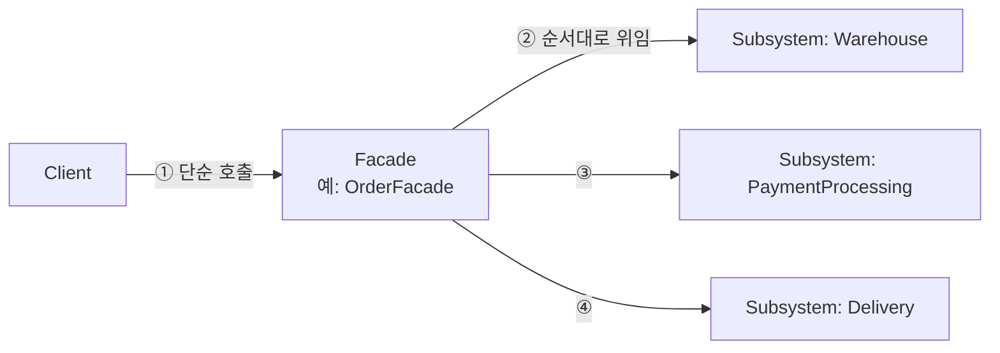
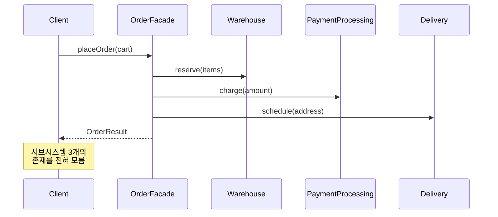
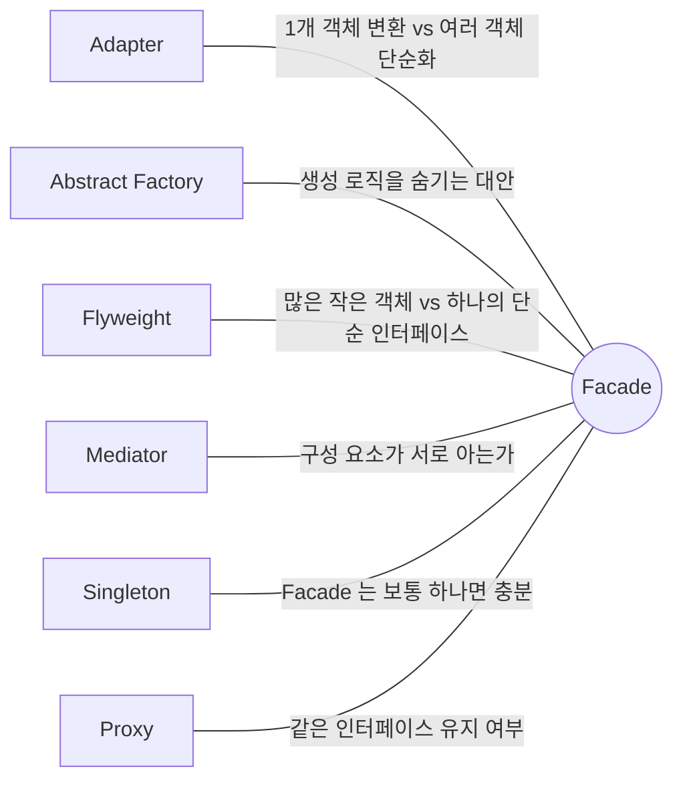

## Description

주문 하나를 처리하려면 재고 확인(`Warehouse`), 결제 처리(`PaymentProcessing`), 포장(`Packaging`), 배송(`Delivery`), 세금 계산(`Taxes`) 을 순서대로 호출해야 한다고 해보자. 주문 화면 코드가 이 5개 서브시스템을 전부 직접 알고 순서까지 맞춰 호출하면, 서브시스템 중 하나만 바뀌어도 주문 화면 코드가 함께 흔들리고, 다른 화면에서 주문을 또 만들 때도 같은 호출 순서를 중복해서 써야 함.

**Facade Pattern** 은 이렇게 여러 서브시스템이 얽힌 복잡한 상호작용을 하나의 단순한 인터페이스 뒤로 감춰서, 클라이언트가 서브시스템 내부 구조를 몰라도 되게 만드는 구조(Structural) 패턴. `OrderFacade.placeOrder()` 하나만 만들어두면, 주문 화면은 5개 서브시스템의 존재조차 몰라도 됨.

- **핵심**: 여러 서브시스템 클래스에 흩어진 기능을 하나의 단순화된 인터페이스로 모아서 제공함.
- **목적**:
  1. 클라이언트가 복잡한 서브시스템 내부를 몰라도 되게 하여 결합도를 낮춤.
  2. 서브시스템을 레이어로 구성하고, 각 레이어의 진입점을 명확히 함.
  3. 거대한 3rd-party API 중 실제로 필요한 일부만 골라서 노출함.

## Examples

- **주문 처리**: `OrderFacade.placeOrder()` 하나로 재고·결제·배송·세금 계산을 다 처리하면, 새로운 화면(모바일 앱, 관리자 콘솔)에서도 5개 서브시스템 호출 순서를 매번 다시 짤 필요가 없음. Facade 없이는 호출 순서가 바뀔 때마다 모든 클라이언트 코드를 찾아 고쳐야 함.

주문 처리 예시 외에 다른 도메인에서도 같은 구조가 쓰임. (아래 Structure 부터는 다시 주문 처리 예시로 돌아감.)

- **미디어 변환 라이브러리**: FFmpeg 같은 라이브러리는 API 가 방대함. `VideoConverterFacade.convertToMp4(file)` 하나만 노출하면, 라이브러리의 나머지 수백 개 API 를 몰라도 필요한 기능은 쓸 수 있음.
- **부트스트랩 코드**: 앱 시작 시 로깅 설정, 원격 설정 로드, 크래시 리포터 초기화, DB 마이그레이션을 각각 호출하는 대신 `AppBootstrapper.initialize()` 하나로 묶으면, 초기화 순서가 바뀌어도 호출부는 그대로임.

## Structure



`placeOrder()` 호출 하나가 내부적으로 여러 서브시스템을 순서대로 조율하는 흐름은 아래와 같음.



```kotlin
interface Warehouse { fun reserve(items: List<Item>) }
interface PaymentProcessing { fun charge(amount: Int) }
interface Delivery { fun schedule(address: String) }

class OrderFacade(
    private val warehouse: Warehouse,
    private val payment: PaymentProcessing,
    private val delivery: Delivery,
) {
    fun placeOrder(cart: Cart): OrderResult {
        warehouse.reserve(cart.items)
        payment.charge(cart.amount)
        delivery.schedule(cart.address)
        return OrderResult.Success
    }
}

// Client
fun onCheckoutClicked(orderFacade: OrderFacade, cart: Cart) {
    orderFacade.placeOrder(cart) // Warehouse/PaymentProcessing/Delivery 존재를 모름
}
```

- **Facade**: 어떤 서브시스템 클래스가 요청 처리에 필요한지 알고, 요청을 적절한 순서로 서브시스템에 위임함 (`OrderFacade`).
- **Additional Facade**: 메인 Facade 가 너무 커지는 것을 막기 위해 특정 기능만 따로 뽑아낸 보조 Facade. 선택 사항.
- **Subsystem**: 실제 기능을 구현하는 클래스들 (`Warehouse`, `PaymentProcessing`, `Delivery`). Facade 의 존재를 전혀 모르고, 서브시스템 객체들끼리는 직접 소통할 수 있음.
- **Client**: 서브시스템을 직접 호출하지 않고 Facade 를 통해서만 기능을 사용함.

Client 사용 예는 아래처럼 Facade 의 단일 진입점만 호출함.

```kotlin
val result: OrderResult = orderFacade.placeOrder(cart)
```

## Adaptability

다음 상황에서 특히 유용함.

- 복잡하게 얽힌 서브시스템에 대해 제한적이지만 단순한 인터페이스가 필요할 때.
- 서브시스템을 레이어로 구성하고, 각 레이어의 진입점을 Facade 로 명확히 하고 싶을 때.
- 모듈 간 결합도를 낮추고 싶을 때 — 서브시스템 내부가 바뀌어도 Facade 인터페이스만 유지되면 클라이언트는 영향받지 않음.
- 방대한 3rd-party API/라이브러리 중 일부 기능만 필요할 때.

## Pros

- **복잡한 서브시스템으로부터 클라이언트 코드를 분리할 수 있음**: 주문 화면 코드는 `OrderFacade` 인터페이스만 알면 되고, 서브시스템이 5개에서 8개로 늘어도 화면 코드는 그대로임.

## Cons

- **모든 클래스에 결합된 "god object" 가 될 위험이 있음**: Facade 에 기능이 계속 추가되다 보면 앱의 거의 모든 서브시스템을 알고 있는 거대한 클래스가 되어, 오히려 Facade 자체가 새로운 병목/결합 지점이 될 수 있음.

## Relationship with other patterns



| 비교 대상 | 공통점 | Facade 와의 차이 |
| :--- | :--- | :--- |
| [Adapter](Adapter%20Pattern.md) | 둘 다 기존 코드를 새로운 인터페이스 뒤에 감춤 | Facade 는 **여러 객체(서브시스템)** 를 단순화해서 새 인터페이스를 정의(목적: 단순화). Adapter 는 **객체 하나**의 기존 인터페이스를 클라이언트가 기대하는 형태로 맞춤(목적: 호환). |
| [Abstract Factory](../creational/Abstract%20Factory%20Pattern.md) | 둘 다 클라이언트로부터 내부 복잡도를 숨김 | 서브시스템 객체가 "어떻게 생성되는지" 를 숨기고 싶다면 Abstract Factory 가 Facade 의 대안이 될 수 있음 — Facade 는 이미 만들어진 서브시스템의 "사용" 을 단순화하고, Abstract Factory 는 "생성" 을 캡슐화함. |
| [Flyweight](Flyweight%20Pattern.md) | 둘 다 구조적 복잡도를 다룸 | Flyweight 는 작고 가벼운 객체를 **많이** 공유해서 만드는 방법을 보여줌. Facade 는 복잡한 서브시스템 전체를 대표하는 **단순한 진입점 하나**를 만드는 방법을 보여줌 — 다루는 객체 수의 방향이 반대(N개를 아끼는 것 vs N개를 감추는 것). |
| [Mediator](../behavioral/Mediator%20Pattern.md) | 둘 다 서로 얽힌 여러 클래스 간의 협업을 조직화하려 함 | Facade 는 Subsystem 에 **새 기능을 추가하지 않고** 단순화된 인터페이스만 제공 — Subsystem 은 Facade 의 존재를 모르고, Subsystem 객체들끼리는 직접 소통 가능. Mediator 는 구성 요소 간의 **소통 자체를 중재**함 — 구성 요소들은 서로를 모르고 오직 Mediator 만 앎. "누가 누구를 아는가" 가 핵심 차이. |
| [Singleton](../creational/Singleton%20Pattern.md) | 함께 쓰기 좋음 | 앱 전체에서 Facade 인스턴스는 보통 하나로 충분하기 때문에 Singleton 으로 만드는 경우가 많음 — 다만 이는 부가적 최적화일 뿐, Facade 의 정의에 필수는 아님. |
| [Proxy](Proxy%20Pattern.md) | 둘 다 복잡한 대상을 감싸고 초기화를 대신 처리함 | Proxy 는 감싼 서비스 객체와 **동일한 인터페이스**를 가져서 서로 교체 가능(상호 교환 가능). Facade 는 서브시스템의 어떤 개별 인터페이스와도 **일치할 필요가 없는**, 완전히 새로운 인터페이스를 정의함. |

## Modern Applicability (DI/Composition Root)

[Composition Root](../general/patterns/Composition%20Root.md) 관점에서 Facade 는 **3 그룹: 여전히 설계의 핵심** 에 속함. Facade 는 "여러 객체를 어떤 순서로 조율할지" 를 다루는 패턴이라, DI Container 는 그 여러 객체를 만들어 Facade 에 주입해줄 뿐 조율 로직 자체는 대신해주지 않음.

**"그래도 결국 누군가는 서브시스템 5개를 다 알아야 하지 않나?"** 맞음. Facade 가 없애는 건 "서브시스템을 아는 코드" 가 아니라, 그 지식이 여러 클라이언트(화면, 테스트, 다른 서비스)에 중복되는 것. 서브시스템 5개를 아는 코드는 `OrderFacade` 안에만 있으면 됨.

**Android 예시 (Metro)** — 여러 매니저/데이터소스를 감싸는 `Repository` 가 Android 에서 가장 흔한 Facade 사례임. Structure 절의 주문 처리 서브시스템을 그대로 이어서 씀.

```kotlin
@Inject class Warehouse { /* 재고 확인/예약 */ }
@Inject class PaymentProcessing { /* 결제 처리 */ }
@Inject class Delivery { /* 배송 예약 */ }

// Facade: 3개 서브시스템을 하나의 단순한 진입점으로 묶음
@Inject
class OrderFacade(
    private val warehouse: Warehouse,
    private val payment: PaymentProcessing,
    private val delivery: Delivery,
) {
    suspend fun placeOrder(cart: Cart): OrderResult {
        warehouse.reserve(cart.items)
        payment.charge(cart.amount)
        delivery.schedule(cart.address)
        return OrderResult.Success
    }
}

@Inject
class CheckoutViewModel(private val orderFacade: OrderFacade) // 서브시스템 3개를 전혀 모름

@DependencyGraph(AppScope::class)
interface AppGraph {
    val checkoutViewModel: CheckoutViewModel
}
```

`CheckoutViewModel` 은 `Warehouse`, `PaymentProcessing`, `Delivery` 라는 이름을 몰라도 됨 — `AppGraph` 가 이 셋을 조립해 `OrderFacade` 를 만들고, `OrderFacade` 가 셋을 조율하는 Facade 역할을 함.
