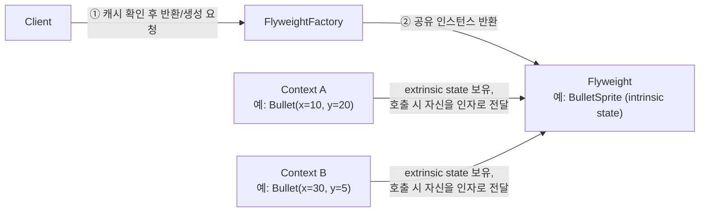
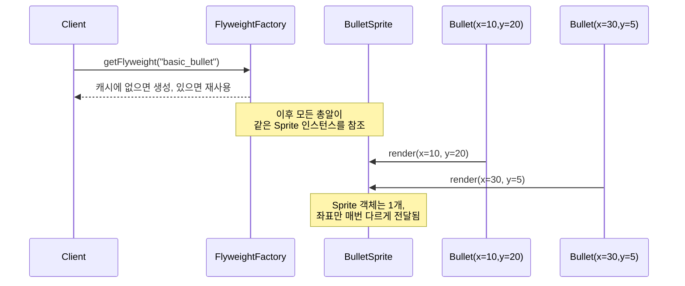
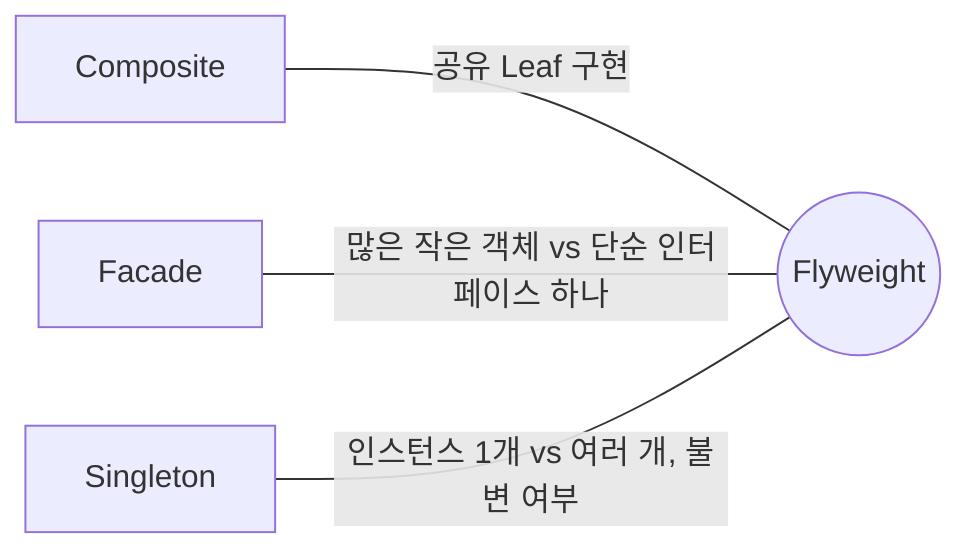

## Description

슈팅 게임에서 총알 10 만 개가 동시에 화면에 떠 있다고 해보자. 총알 객체마다 색상, 크기, 스프라이트 이미지 같은 데이터를 전부 따로 들고 있으면, 사실 이 값들은 거의 모든 총알이 동일한데도 총알 개수만큼 중복 저장되어 RAM 을 순식간에 잡아먹음.

**Flyweight Pattern** 은 이렇게 대량의 유사한 객체가 필요할 때, 객체들 사이에서 변하지 않는 공통 데이터(Intrinsic state)는 하나만 만들어 공유하고, 인스턴스마다 달라지는 데이터(Extrinsic state)만 따로 관리해서 메모리를 아끼는 구조(Structural) 패턴. 총알 10 만 개가 스프라이트 이미지 객체 하나를 공유하고, 위치·속도처럼 각자 다른 값만 별도로 들고 있으면 RAM 사용량이 극적으로 줄어듦.

- **핵심**: 여러 객체가 공유할 수 있는 불변 데이터(Intrinsic state)를 하나의 Flyweight 객체로 뽑아내고, 인스턴스마다 달라지는 데이터(Extrinsic state)는 별도로 관리해서 RAM 사용량을 줄임.
- **목적**:
  1. RAM 부족 문제가 실제로 있을 때, 대량의 유사 객체를 적은 메모리로 표현함.
  2. 성능 최적화가 목적인 패턴이라, RAM 이 실제 병목일 때만 적용을 고려함 — 다른 해결책이 마땅치 않을 때 쓰는 최후의 수단에 가까움.

## Examples

- **게임 파티클/총알**: 총알마다 스프라이트 이미지를 새로 로드하면 총알 10 만 개 = 이미지 10 만 장이 메모리에 올라감. Flyweight 로 스프라이트를 공유하면 이미지는 1 장, 위치 데이터만 10 만 개가 됨.

총알 예시 외에 다른 도메인에서도 같은 구조가 쓰임. (아래 Structure 부터는 다시 총알 예시로 돌아감.)

- **텍스트 에디터의 문자 렌더링**: 문서에 있는 글자 하나하나를 객체로 만들 때, 폰트·크기·색상(Intrinsic) 은 같은 스타일을 쓰는 글자끼리 공유하고, 위치(Extrinsic) 만 글자마다 따로 저장하면 수십만 글자도 감당 가능함.
- **지도 앱의 마커 아이콘**: 지도에 마커 5000 개를 찍을 때 아이콘 이미지를 마커마다 복제하지 않고 하나만 만들어 공유하면, 좌표 데이터만 5000 개 있으면 됨.

## Structure



총알 2 개가 스프라이트 하나를 공유하며 렌더링되는 흐름은 아래와 같음.



```kotlin
class BulletSprite(private val texture: Texture) { // Flyweight: intrinsic state (immutable)
    fun render(x: Int, y: Int) { /* 실제 렌더링, texture 는 공유됨 */ }
}

class FlyweightFactory {
    private val cache = mutableMapOf<String, BulletSprite>()

    fun getFlyweight(type: String): BulletSprite =
        cache.getOrPut(type) { BulletSprite(loadTexture(type)) }
}

class Bullet(private val x: Int, private val y: Int, private val sprite: BulletSprite) { // Context: extrinsic state
    fun draw() = sprite.render(x, y) // 좌표(extrinsic)만 넘기고 sprite(intrinsic)는 공유
}

// Client
val factory = FlyweightFactory()
val bullets = List(100_000) { Bullet(x = it, y = 0, sprite = factory.getFlyweight("basic_bullet")) }
```

- **Flyweight**: 여러 객체가 공유하는 Intrinsic state 를 담는 클래스 (`BulletSprite`). Intrinsic state 는 절대 바뀌면 안 되므로 immutable 하게 만들어야 함. Extrinsic state 는 메서드 인자로 전달받음.
- **FlyweightFactory**: Flyweight 객체를 생성/캐싱/관리함. 요청이 오면 이미 존재하는 Flyweight 인지 확인하고, 없으면 새로 만들어 캐시에 등록한 뒤 반환함.
- **Context**: 각 인스턴스마다 고유한 Extrinsic state 를 담는 클래스 (`Bullet` 의 좌표·속도). Flyweight 를 참조하되, 상태 자체는 Flyweight 밖에서 관리됨.
- **Client**: Extrinsic state 를 계산·저장하고, Flyweight 의 메서드를 호출할 때 그 값을 전달함.

Client 사용 예는 아래처럼 공유 Sprite 는 Factory 에서 받고, 좌표는 Context 가 따로 들고 있음.

```kotlin
val factory = FlyweightFactory()
val bullets = List(100_000) { Bullet(x = it, y = 0, sprite = factory.getFlyweight("basic_bullet")) }
bullets.forEach { it.draw() }
```

## Adaptability

다음 상황에서 특히 유용함.

- 프로그램이 지원해야 하는 객체 수가 가용 RAM 에 비해 지나치게 많을 때.
- 그 객체들 중 상당수의 상태가 다른 객체와 동일하거나 비슷할 때(공유 가능한 Intrinsic state 가 있을 때).

RAM 문제가 실제로 없다면 적용할 이유가 없는 패턴 — "혹시 나중에 메모리가 부족해질까봐" 미리 적용하는 건 과설계에 가까움.

## Pros

- **비슷한 객체를 대량으로 쓸 때 RAM 을 크게 아낄 수 있음**: 총알 10 만 개가 스프라이트 1 개를 공유하면, 스프라이트를 10 만 번 복제하는 것보다 메모리 사용량이 훨씬 적음.

## Cons

- **CPU 와 RAM 의 trade-off 가 생김**: Extrinsic state 를 매번 메서드 인자로 넘기고 계산해야 하므로, 캐싱해뒀던 경우보다 CPU 연산이 늘어날 수 있음.
- **코드가 복잡해짐**: 상태를 Intrinsic/Extrinsic 으로 나누고, Factory 를 통해 캐시를 관리해야 하므로 클래스 하나로 끝날 일이 여러 클래스로 늘어남.

## Relationship with other patterns



| 비교 대상 | 공통점 | Flyweight 와의 차이 |
| :--- | :--- | :--- |
| [Composite](Composite%20Pattern.md) | 함께 쓰기 좋음 | Composite 트리에 동일한 Leaf 가 대량으로 반복된다면, 그 Leaf 를 Flyweight 로 구현해 RAM 을 아낄 수 있음 — 서로 다른 문제(트리 구조 vs 메모리 절약)를 풀지만 조합이 자연스러움. |
| [Facade](Facade%20Pattern.md) | 둘 다 구조적 복잡도를 다룸 | Flyweight 는 작고 가벼운 객체를 **많이 공유**해서 메모리를 아끼는 방법. Facade 는 복잡한 서브시스템을 **단순한 인터페이스 하나**로 감추는 방법. 다루는 객체 수의 방향이 정반대. |
| [Singleton](../creational/Singleton%20Pattern.md) | 공유되는 인스턴스를 통제한다는 점이 비슷해 보임 | 겉보기엔 "모든 공유 상태를 Flyweight 객체 하나로 줄이면 Singleton 아닌가" 싶을 수 있지만 두 가지가 다름. (1) Singleton 은 인스턴스가 정확히 1 개여야 하지만, Flyweight 는 서로 다른 Intrinsic state 조합마다 여러 인스턴스가 존재할 수 있음(Factory 가 종류별로 캐싱). (2) Singleton 객체는 가변(mutable)이어도 되지만, Flyweight 객체는 여러 Context 가 동시에 공유하므로 반드시 불변(immutable)이어야 함. |

## Modern Applicability (DI/Composition Root)

[Composition Root](../general/patterns/Composition%20Root.md) 관점에서 Flyweight 는 **3 그룹: 여전히 설계의 핵심** 에 속함. Flyweight 는 "런타임에 생성되는 대량의 데이터 객체를 어떻게 공유할지" 를 다루는 성능 최적화 패턴이라, `@Inject` 생성자나 DI 그래프가 대신 풀어줄 수 있는 문제가 아님 — 애초에 Flyweight 의 인스턴스들은 앱 시작 시점이 아니라 런타임 중(이미지 로드, 마커 생성 등) 동적으로 계속 만들어지기 때문.

**"그래도 결국 누군가는 캐시 키를 관리해야 하지 않나?"** 맞음. Flyweight 가 없애는 건 "캐시를 관리하는 코드" 가 아니라, 그 캐시 로직이 여러 호출부에 중복되는 것. `FlyweightFactory` 하나에 캐시 관리를 몰아넣고, DI 로는 이 Factory 자체를 하나의 서비스로 주입하는 정도가 실무에서 맞닿는 지점.

**Android 예시 (Metro)** — 이미지/비트맵 캐시(Coil, Glide 같은 라이브러리가 동일한 URL 의 `Bitmap` 을 여러 `ImageView` 가 공유하도록 캐싱하는 것)도 Flyweight 의 흔한 실사례지만, 여기서는 Structure 절의 총알 예시를 그대로 게임 앱에 옮기면 아래와 같은 모양이 됨.

```kotlin
data class Bullet(val type: String, val x: Int, val y: Int) // Context: extrinsic state

@Inject
class BulletRenderer(private val factory: FlyweightFactory) { // Context 들을 순회하며 렌더링
    fun renderAll(bullets: List<Bullet>) {
        bullets.forEach { bullet ->
            factory.getFlyweight(bullet.type).render(bullet.x, bullet.y)
        }
    }
}

@DependencyGraph(AppScope::class)
interface AppGraph {
    val bulletRenderer: BulletRenderer

    @Provides
    fun provideFlyweightFactory(): FlyweightFactory = FlyweightFactory()
}
```

`FlyweightFactory` 를 `AppGraph` 에서 앱 생명주기 동안 하나만 만들어 공유하면, 총알 10 만 개가 화면에 떠 있어도 텍스처는 종류별로 한 번만 로드됨 — DI 는 "Factory 를 하나만 만들어 나눠준다" 는 배선까지만 담당하고, 그 안의 캐시 적중/공유 로직(Flyweight 의 본질)은 여전히 `FlyweightFactory` 코드가 담당함.
