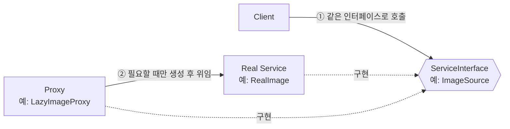
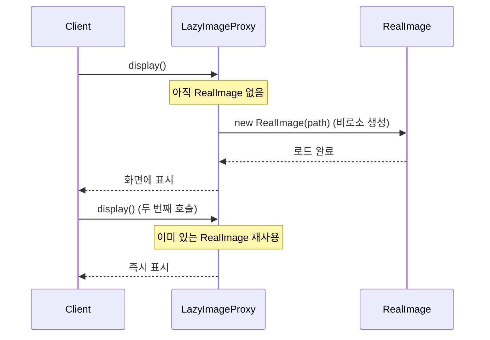
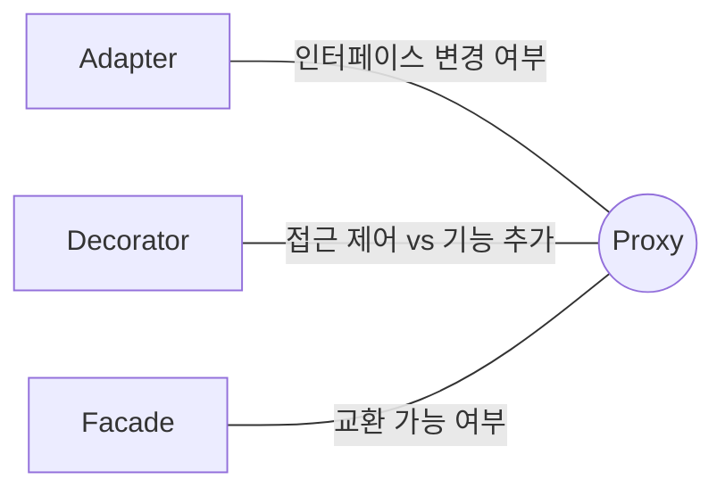

## Description

초기화 비용이 큰 객체(예: 고해상도 이미지, DB 커넥션)가 있는데, 항상 필요한 건 아니라고 해보자. 필요할 때만 만들도록 Lazy Loading 을 직접 구현하면, 그 객체를 사용하는 모든 클라이언트 코드에 "생성됐는지 확인 → 없으면 생성 → 사용" 하는 코드가 중복됨. 게다가 3rd-party 라이브러리 객체라면 그 안에 지연 초기화 로직을 직접 심는 것 자체가 불가능함.

**Proxy Pattern** 은 이럴 때 원본 객체와 똑같은 인터페이스를 구현하는 대역(Proxy) 객체를 하나 만들어서, 클라이언트가 원본인 줄 알고 그 대역을 대신 사용하게 하는 구조(Structural) 패턴. `Proxy` 가 요청을 가로채서 지연 생성, 접근 제어, 로깅 같은 부가 작업을 처리한 뒤 실제 객체(`RealService`)에 위임하면, 클라이언트 코드는 그 사실을 전혀 몰라도 됨.

- **핵심**: 원본 객체와 동일한 인터페이스를 갖는 대역 객체를 두어, 원본에 대한 접근을 제어하거나 부가 작업(지연 생성, 캐싱, 로깅, 권한 검사 등)을 끼워 넣음.
- **목적**:
  1. 원본 서비스 클래스를 수정하지 않고 전처리/후처리 로직을 추가함.
  2. 클라이언트 입장에서는 Proxy 를 쓰는 것과 원본을 직접 쓰는 것이 구분되지 않게 함 — 인터페이스가 동일하기 때문.
  3. 무거운 객체의 생성 시점을 제어(Lazy Initialization)하거나, 원격/외부 자원에 대한 접근을 로컬 객체처럼 다룰 수 있게 함.

## Examples

- **신용카드 (Virtual/Protection Proxy)**: 신용카드는 현금(원본)에 대한 프록시임. 소비자는 현금을 직접 들고 다닐 필요가 없고, 가게 주인도 보증금을 떼일 위험을 감수하지 않아도 됨 — 카드와 현금은 "결제한다" 는 같은 인터페이스를 구현하지만, 카드는 그 사이에 인증·한도 확인 같은 접근 제어를 끼워 넣음.
- **이미지 갤러리 (Virtual Proxy)**: 리스트에 이미지 100장을 보여줄 때 원본 이미지를 전부 미리 로드하면 느림. `ImageProxy` 가 실제 로드는 화면에 보일 때(스크롤로 진입할 때)까지 미루면, 클라이언트(리스트 어댑터) 코드는 "지금 로드해야 하나" 를 신경 쓸 필요가 없음.
- **API 요청 캐싱 (Caching Proxy)**: 같은 API 를 반복 호출하는 코드가 여러 곳에 있다면, 매번 캐시 확인 로직을 중복해서 짜는 대신 `CachingApiProxy` 가 그 사이에서 캐시 적중 여부를 판단하고 없을 때만 실제 API 를 호출하게 만들 수 있음.

## Structure



첫 호출에서만 실제 로딩이 일어나고, 이후엔 캐시된 결과를 바로 반환하는 흐름은 아래와 같음.



- **ServiceInterface**: `Service` 와 `Proxy` 가 공통으로 구현하는 인터페이스 (`ImageSource`). Client 는 이 인터페이스만 앎.
- **Service**: 실제 비즈니스 로직을 담고 있는 원본 객체 (`RealImage`).
- **Proxy**: `Service` 와 동일한 인터페이스를 구현하면서, `Service` 에 대한 참조를 필드로 들고 접근을 제어함. 실제 객체의 생성/삭제 시점을 결정할 수도 있음 (`LazyImageProxy`).
- **Client**: `ServiceInterface` 를 통해서만 소통하므로, 실제로 `RealService` 를 받았는지 `Proxy` 를 받았는지 구분하지 않음.

## Adaptability

다음 상황에서 특히 유용함.

- **Virtual Proxy (Lazy Initialization)**: 생성 비용이 큰 객체를 실제로 필요한 시점까지 미루고 싶을 때.
- **Protection Proxy (Access Control)**: 클라이언트마다 접근 권한이 다른 객체를 다룰 때.
- **Remote Proxy**: 다른 주소 공간(다른 프로세스, 다른 서버)에 있는 객체를 로컬 객체처럼 다루고 싶을 때.
- **Logging Proxy**: 원본 서비스에 대한 요청 기록을 남기고 싶을 때, 원본 코드는 건드리지 않고.
- **Caching Proxy**: 요청 결과를 캐시해서 반복 요청 비용을 줄이고 싶을 때.
- **Smart Reference**: 더 이상 사용되지 않는 무거운 객체를 자동으로 해제하고 싶을 때.

## Pros

- **클라이언트가 서비스 객체의 존재조차 모르게 접근을 제어할 수 있음**: `ImageSource` 인터페이스만 아는 클라이언트는 지금 다루는 게 진짜 이미지인지 아직 안 만들어진 지연 로딩 대역인지 구분하지 못함.
- **클라이언트가 신경 쓰지 않아도 서비스 객체의 생명주기를 관리할 수 있음**: `RealImage` 를 언제 만들지, 언제 해제할지를 `Proxy` 가 대신 결정함.
- **서비스 객체가 아직 준비되지 않았거나 사용할 수 없는 상황에도 동작함**: 네트워크가 아직 안 붙었거나 리소스가 아직 로드되지 않았어도, Proxy 는 우선 존재하고 있다가 준비되면 위임함.
- **기존 코드 수정 없이 새 Proxy 를 추가할 수 있음**: `LoggingProxy` 를 새로 추가해도 `RealImage` 나 `Client` 코드는 안 바뀜 ⇒ **[OCP(Open Closed Principle)](../../solid/OCP(Open%20Closed%20Principle).md)**.

## Cons

- **새로운 클래스가 늘어나 코드가 복잡해질 수 있음**: 인터페이스 하나에 Proxy 종류(Caching, Logging, Protection 등)만큼 클래스가 늘어남.
- **응답이 지연될 수 있음**: Proxy 가 중간에서 캐시 확인, 권한 검사 같은 부가 작업을 하는 동안 원본을 직접 호출할 때보다 응답이 늦어질 수 있음.

## Relationship with other patterns



| 비교 대상 | 공통점 | Proxy 와의 차이 |
| :--- | :--- | :--- |
| [Adapter](Adapter%20Pattern.md) | 둘 다 감싼 객체에 위임하는 Wrapper 구조 | Adapter 는 감싼 객체에 **다른** 인터페이스를 제공(호환이 목적). Proxy 는 감싼 객체와 **같은** 인터페이스를 제공(접근 제어가 목적) — 그래서 Client 입장에선 원본과 Proxy 가 상호 교환 가능함. |
| [Decorator](Decorator%20Pattern.md) | 둘 다 같은 인터페이스를 유지한 채 감싼 객체에 위임하는 구조가 거의 동일해서 가장 헷갈림 | 의도가 다름: Decorator 는 **기능을 추가**하는 게 목적이고, 무엇을 얼마나 감쌀지는 항상 **Client 가 결정**함. Proxy 는 **접근 제어/housekeeping**(지연 생성, 권한 검사, 로깅, 캐싱)이 목적이고, 보통 **Proxy 자신이 서비스 객체의 생명주기를 관리**함 — Client 는 Proxy 를 진짜 서비스인 줄 알고 쓰는 경우가 많다는 점에서 Decorator 보다 더 "숨겨져" 있음. |
| [Facade](Facade%20Pattern.md) | 둘 다 복잡한 대상을 감싸고 스스로 초기화함 | Proxy 는 서비스 객체와 **동일한 인터페이스**를 가져서 상호 교환 가능함. Facade 는 서브시스템의 어떤 개별 인터페이스와도 일치할 필요 없는 **완전히 새로운 인터페이스**를 정의함. |

## Modern Applicability (DI/Composition Root)

[Composition Root](../general/patterns/Composition%20Root.md) 관점에서 Proxy 는 **3 그룹: 여전히 설계의 핵심** 에 속함. 다만 Proxy 는 다른 structural 패턴보다 DI Container/프레임워크와 맞닿는 지점이 유독 많은 패턴임 — 현대 DI Container 와 ORM 라이브러리들이 내부적으로 Proxy 패턴 그 자체로 동작하기 때문.

**"그래도 결국 누군가는 RealService 를 알아야 하지 않나?"** 맞음. Proxy 가 없애는 건 "원본을 아는 코드" 가 아니라, 접근 제어/지연 생성 로직이 클라이언트 곳곳에 중복되는 것. Composition Root 는 "이 인터페이스에 원본을 연결할지, Proxy 를 연결할지" 를 한 곳에서 결정하는 지점이 됨.

**Android 예시 (Metro) — Room/Retrofit 이 만들어주는 프록시.** Room 은 `@Dao` 인터페이스에 대해 컴파일 타임에 실제 구현 클래스(`UserDao_Impl` 같은)를 자동 생성하고, Retrofit 은 런타임에 `interface` 하나로 동적 프록시(dynamic proxy) 를 만들어 HTTP 호출로 위임함. 둘 다 개발자가 인터페이스만 선언하면, "SQL 실행" 또는 "HTTP 요청 변환" 이라는 housekeeping 코드를 프레임워크가 대신 만들어주는 Proxy 패턴의 실사례임. Hilt/Dagger 의 `@AroundInvoke`, Spring AOP 의 프록시 기반 `@Transactional` 도 같은 원리 — 인터페이스 뒤에 프레임워크가 만든 Proxy 를 세워서 부가 로직(트랜잭션, 로깅)을 가로챔.

```kotlin
interface UserApi { // ServiceInterface
    suspend fun getUser(id: String): User
}

// Retrofit 이 런타임에 이 인터페이스의 Proxy 구현체를 동적으로 생성함.
// 개발자는 RealService 에 해당하는 클래스를 직접 작성하지 않음.
@Provides
fun provideUserApi(retrofit: Retrofit): UserApi = retrofit.create(UserApi::class.java)

// 직접 구현하는 경우: 인증 토큰 검사를 끼워 넣는 Protection Proxy
@Inject
class AuthCheckingUserApi(
    private val real: UserApi,
    private val session: SessionManager,
) : UserApi {
    override suspend fun getUser(id: String): User {
        check(session.isLoggedIn()) { "로그인 필요" }
        return real.getUser(id)
    }
}

@DependencyGraph(AppScope::class)
interface AppGraph {
    val userApi: UserApi

    @Provides
    fun provideRetrofitUserApi(retrofit: Retrofit): UserApi = retrofit.create(UserApi::class.java)
}
```

여기서 핵심은, Retrofit 이 `retrofit.create(UserApi::class.java)` 를 호출하는 순간 그 자체가 이미 하나의 **작은 Composition Root**라는 점 — "이 인터페이스에 어떤 Proxy 구현을 연결할지" 를 Retrofit 이라는 프레임워크가 대신 결정해줌. `AppGraph` 는 이 결정을 다시 한 번 감싸서 앱 전체의 단일 배선 지점으로 흡수함. `UserViewModel` 은 지금 손에 든 게 Retrofit 이 만든 동적 프록시인지, 그 위에 인증 체크가 한 겹 더 씌워진 Proxy 인지 전혀 모름.
