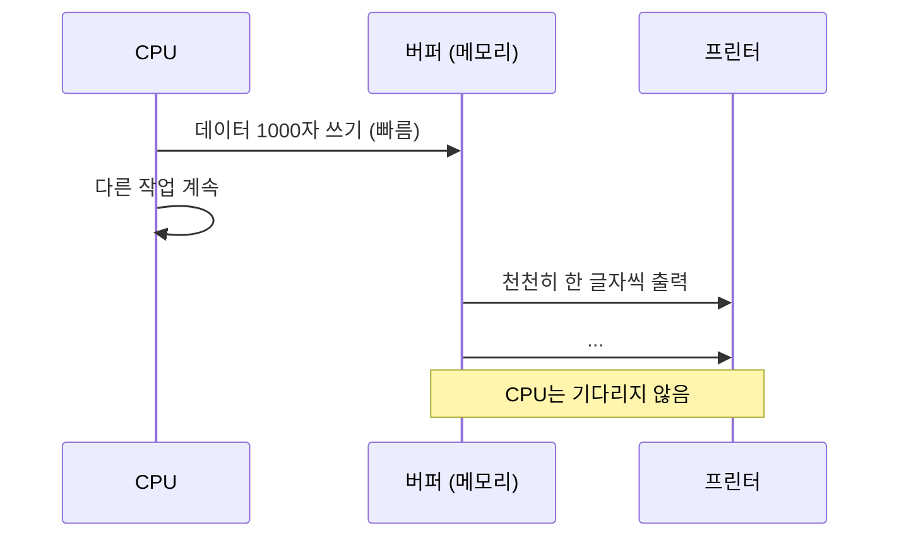
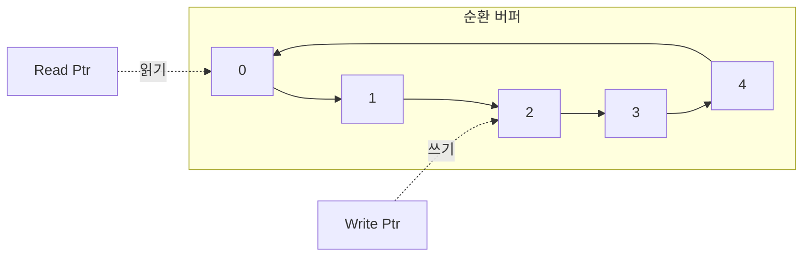
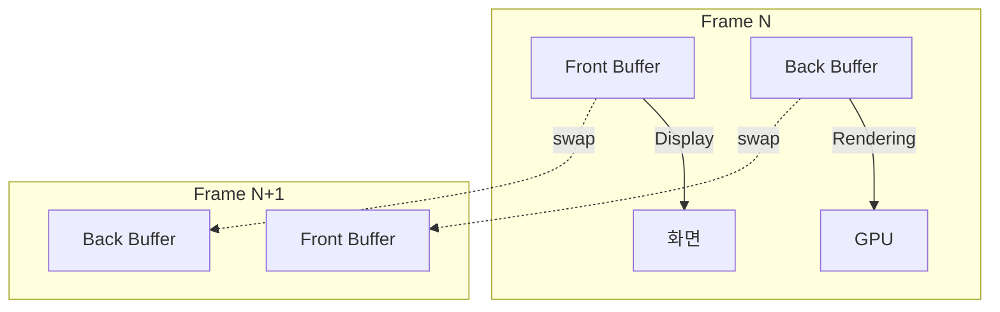
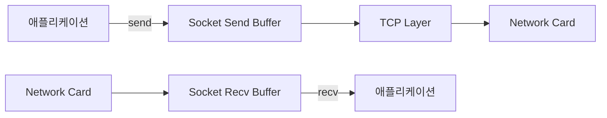

## 버퍼 (Buffer) 란 무엇인가

버퍼는 **데이터를 임시로 저장하는 메모리 영역** 이다. 생산자 (producer) 와 소비자 (consumer) 의 속도 차이를 흡수하거나, 데이터를 모아서 한 번에 처리해 효율을 높이는 역할을 한다.

### 버퍼가 필요하게 된 배경

#### 속도 불일치 문제

1950~1960 년대 초기 컴퓨터는 CPU 와 I/O 장치의 속도 차이가 극심했다:

- **CPU**: 마이크로초 (μs) 단위로 연산
- **타자기/프린터**: 문자당 수십 밀리초 (ms) 소요
- **자기 테이프**: 순차 접근, 되감기에 수 초

CPU 가 타자기에 직접 출력하면, 한 글자를 쓰는 동안 CPU 가 수천 번의 연산을 할 수 있는 시간을 낭비했다.

**해결책**: 출력할 데이터를 메모리 (버퍼) 에 모아두고, CPU 는 다른 작업을 계속한다. 별도의 I/O 프로세서나 DMA(Direct Memory Access) 가 버퍼에서 데이터를 읽어 천천히 출력한다.



#### 입출력 효율성

디스크는 블록 단위 (512B, 4KB) 로 읽고 쓰는 것이 효율적이다. 만약 1 바이트씩 읽으면:

- 디스크 헤드 이동 (seek) 비용: 수 밀리초
- 1 바이트 읽기: 마이크로초

1000 바이트를 읽으려면 1000 번의 seek → 수 초 소요.

**버퍼 활용**: 4KB 를 한 번에 읽어 버퍼에 저장. 이후 요청은 버퍼에서 반환. seek 가 1 회로 줄어든다.

---

## 버퍼의 주요 유형

### 1. 선형 버퍼 (Linear Buffer)

가장 단순한 형태. 배열처럼 연속된 메모리 공간.

```c
char buffer[1024];
int write_pos = 0;

void write_buffer(char c) {
    if (write_pos < 1024) {
        buffer[write_pos++] = c;
    }
}
```

**문제**: 버퍼가 가득 차면 더 이상 쓸 수 없다. 처음부터 다시 사용하려면 데이터를 모두 비워야 한다.

### 2. 순환 버퍼 (Circular Buffer / Ring Buffer)

버퍼의 끝에 도달하면 처음으로 돌아간다. 읽기 포인터 (read) 와 쓰기 포인터 (write) 를 따로 관리한다.



**장점**:
- 공간을 계속 재사용 가능.
- 생산자와 소비자가 독립적으로 동작.

**사용처**:
- 오디오/비디오 스트리밍
- 네트워크 패킷 버퍼
- 키보드 입력 버퍼

```c
#define BUFFER_SIZE 16
char ring_buffer[BUFFER_SIZE];
int read_pos = 0;
int write_pos = 0;

void ring_write(char c) {
    ring_buffer[write_pos] = c;
    write_pos = (write_pos + 1) % BUFFER_SIZE;
}

char ring_read(void) {
    char c = ring_buffer[read_pos];
    read_pos = (read_pos + 1) % BUFFER_SIZE;
    return c;
}
```

**주의**: `write_pos` 가 `read_pos` 를 따라잡으면 버퍼가 가득 찬 상태 (overflow). 락 (lock) 이나 세마포어로 동기화 필요.

### 3. 이중 버퍼링 (Double Buffering)

두 개의 버퍼를 교대로 사용. 하나는 데이터를 채우는 중, 다른 하나는 처리 중.

그래픽에서 **화면 깜빡임 (tearing) 방지**에 사용:

- **Front Buffer**: 화면에 표시 중인 프레임.
- **Back Buffer**: 다음 프레임을 그리는 중.
- 그리기 완료 후 두 버퍼를 swap.



**수직 동기화 (VSync)**: 화면 주사율 (60Hz) 과 버퍼 swap 을 동기화해 tearing 방지.

---

## 운영체제에서의 버퍼 활용

### 파일 I/O 버퍼

`read()` 시스템 콜을 호출할 때마다 디스크 접근하면 비효율적이다. 커널은 **페이지 캐시 (Page Cache)** 를 유지한다.

```c
// 사용자 프로그램
char buf[10];
read(fd, buf, 10);  // 10바이트만 요청
```

커널의 동작:

1. 파일의 해당 페이지 (4KB) 가 페이지 캐시에 있는지 확인.
2. 없으면 디스크에서 4KB 전체를 읽어 캐시에 저장.
3. 캐시에서 10 바이트만 복사해 사용자에게 반환.
4. 이후 같은 페이지 요청은 디스크 접근 없이 캐시에서 반환.

**Write Buffering**:
- `write()` 호출 시 페이지 캐시에만 쓰고 (dirty page), 나중에 디스크에 플러시.
- `fsync()` 호출 시 즉시 디스크 동기화.

### 네트워크 버퍼

TCP/IP 스택은 여러 계층에서 버퍼를 사용한다:

1. **Socket Buffer**: 애플리케이션이 `send()` 로 보낸 데이터를 커널 버퍼에 복사.
2. **TCP Transmit Buffer**: 세그먼트로 나눠 전송. ACK 를 받을 때까지 재전송을 위해 보관.
3. **TCP Receive Buffer**: 순서가 뒤바뀐 세그먼트를 재정렬. 애플리케이션이 `recv()` 로 읽어갈 때까지 대기.



**Flow Control**: 수신 버퍼가 가득 차면, TCP 윈도우 크기를 0 으로 알려 송신측이 대기하게 한다.

### 터미널 버퍼

키보드 입력은 **라인 버퍼링 (Line Buffering)**된다. Enter 키를 누를 때까지 버퍼에 모았다가, 한 줄 전체를 애플리케이션에 전달한다.

```bash
$ cat
hello world↵  # Enter 전까지 버퍼에 저장
hello world   # Enter 후 출력
```

**Canonical Mode**: 백스페이스로 편집 가능. `stty -icanon` 으로 비활성화하면 키를 누르는 즉시 전달 (raw mode).

---

## 그래픽에서의 버퍼

### Frame Buffer

화면에 표시될 픽셀 데이터를 저장하는 메모리 영역. `/dev/fb0` 로 접근 가능 (Linux).

```c
int fd = open("/dev/fb0", O_RDWR);
struct fb_var_screeninfo vinfo;
ioctl(fd, FBIOGET_VSCREENINFO, &vinfo);

// 픽셀 직접 쓰기
char *fbp = mmap(0, screensize, PROT_READ | PROT_WRITE, MAP_SHARED, fd, 0);
fbp[y * vinfo.xres + x] = color;  // (x, y)에 색상 지정
```

### Z-Buffer (Depth Buffer)

3D 그래픽에서 각 픽셀의 깊이 (카메라로부터의 거리) 를 저장. 가까운 물체가 먼 물체를 가린다.

```plaintext
For each triangle:
    For each pixel (x, y):
        if (depth < z_buffer[x][y]):
            frame_buffer[x][y] = color
            z_buffer[x][y] = depth
```

---

## 멀티미디어 버퍼

### 오디오 버퍼

마이크에서 녹음할 때:

1. 사운드 카드가 일정 주기 (예: 10ms) 마다 PCM 샘플을 버퍼에 쓴다.
2. 애플리케이션이 버퍼에서 읽어 처리 (인코딩, 저장 등).

**버퍼가 너무 작으면**: 샘플을 읽어가기 전에 덮어써져 데이터 손실 (underrun).
**버퍼가 너무 크면**: 지연 (latency) 증가. 실시간 통화에서 문제.

**ALSA(Linux)** 설정 예:
```bash
arecord -D hw:0,0 --buffer-size=4096 --period-size=512 -f cd out.wav
# buffer-size: 전체 버퍼 크기
# period-size: 한 번에 전송할 샘플 수
```

### 비디오 버퍼

스트리밍 서비스 (YouTube, Netflix) 는 **버퍼링**을 통해 네트워크 지터 (jitter) 를 흡수한다.

```
네트워크에서 데이터 수신 → 버퍼에 축적 (5~10초)
                          ↓
                    충분히 쌓이면 재생 시작
```

버퍼가 고갈되면 "버퍼링 중…" 메시지 표시.

---

## 안드로이드에서의 버퍼 활용

### Ashmem / DMABuf

카메라 이미지, GPU 프레임 같은 큰 버퍼를 프로세스 간 공유. 복사 없이 (zero-copy) 여러 컴포넌트가 접근.

[[android-kernel#2 Ashmem과 공유 메모리의 진화|안드로이드 커널의 Ashmem]] 참고.

### SurfaceFlinger 의 버퍼 큐

앱이 화면을 그릴 때:

1. `dequeueBuffer()`: 빈 버퍼를 받아옴.
2. 그리기 작업 수행.
3. `queueBuffer()`: SurfaceFlinger 에 제출.
4. SurfaceFlinger 가 합성 후 화면 출력.

트리플 버퍼링 (Front + 2 Back) 으로 부드러운 60fps 유지.

---

## 버퍼 오버플로우와 보안

### 스택 버퍼 오버플로우

C/C++ 에서 경계 검사 없이 버퍼에 쓰면, 인접 메모리를 덮어쓴다.

```c
void vulnerable_function(char *input) {
    char buffer[10];
    strcpy(buffer, input);  // input이 10바이트 초과하면 overflow
}
```

공격자는 반환 주소 (return address) 를 덮어써, 악의적인 코드로 점프시킨다.

**방어**:
- **경계 검사**: `strncpy()`, `snprintf()` 사용.
- **Stack Canary**: 버퍼와 반환 주소 사이에 임의의 값 (canary) 삽입. 함수 반환 시 검증.
- **DEP/NX**: 스택을 실행 불가능하게 표시.
- **ASLR**: 스택 주소 랜덤화.

```c
void safe_function(char *input) {
    char buffer[10];
    strncpy(buffer, input, sizeof(buffer) - 1);
    buffer[sizeof(buffer) - 1] = '\0';  // null terminator 보장
}
```

### Heap 버퍼 오버플로우

동적 할당된 버퍼도 overflow 가능. 인접한 힙 청크의 메타데이터를 손상시켜, 임의 코드 실행 유도.

**방어**: Modern allocators (ptmalloc, jemalloc) 는 메타데이터 검증, guard pages 추가.

---

## 버퍼 크기 설정의 트레이드오프

### 작은 버퍼
- **장점**: 메모리 절약, 낮은 지연 (latency).
- **단점**: 자주 I/O 발생, 오버헤드 증가. Overflow 위험.

### 큰 버퍼
- **장점**: I/O 횟수 감소, throughput 향상.
- **단점**: 메모리 소비, 지연 증가. 캐시 친화성 저하.

**최적 크기**: 워크로드와 하드웨어에 따라 다름.
- 디스크 I/O: 페이지 크기 (4KB) 배수.
- 네트워크: MTU(1500B) 고려.
- 오디오: 지연과 CPU 사용률 균형.

---

## 실전: 버퍼 활용 예제

### 파일 복사 (버퍼 크기에 따른 성능)

```c
// 1바이트씩 복사
char c;
while (read(src, &c, 1) > 0) {
    write(dst, &c, 1);
}
// 10MB 파일 → 수 초 소요

// 4KB 버퍼
char buffer[4096];
int n;
while ((n = read(src, buffer, sizeof(buffer))) > 0) {
    write(dst, buffer, n);
}
// 10MB 파일 → 밀리초 단위
```

### Producer-Consumer with Ring Buffer

```c
#define SIZE 10
int buffer[SIZE];
int head = 0, tail = 0;

void produce(int item) {
    buffer[head] = item;
    head = (head + 1) % SIZE;
}

int consume(void) {
    int item = buffer[tail];
    tail = (tail + 1) % SIZE;
    return item;
}
```

스레드 안전성을 위해 mutex + condition variable 추가 필요.

---

## Buffering 전략

### Unbuffered

즉시 I/O. 예: `stderr` (오류 메시지는 즉시 표시).

### Line Buffered

줄 단위 (newline) 로 플러시. 예: `stdout` (터미널 출력).

### Fully Buffered

버퍼가 가득 차거나 명시적 플러시. 예: 파일 I/O.

```c
setvbuf(fp, NULL, _IONBF, 0);  // unbuffered
setvbuf(fp, NULL, _IOLBF, 0);  // line buffered
setvbuf(fp, NULL, _IOFBF, 4096);  // fully buffered
```

---

## 학습 리소스

**책**:
- *The Linux Programming Interface* (Michael Kerrisk): 파일/네트워크 버퍼링 상세.
- *Computer Graphics: Principles and Practice*: Frame buffer, Z-buffer.

**온라인**:
- [Linux I/O Buffering](https://www.kernel.org/doc/html/latest/filesystems/buffered-writeback.html)
- [TCP Buffer Tuning](https://fasterdata.es.net/network-tuning/tcp-tuning/)

---

## 연결 문서

[[kernel]] - 커널의 페이지 캐시와 I/O 버퍼링

[[android-kernel]] - 안드로이드의 Ashmem 과 DMABuf
