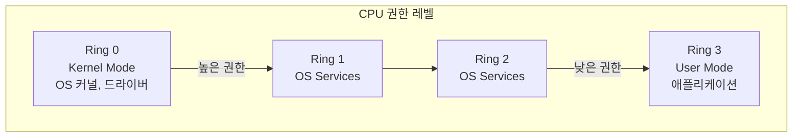
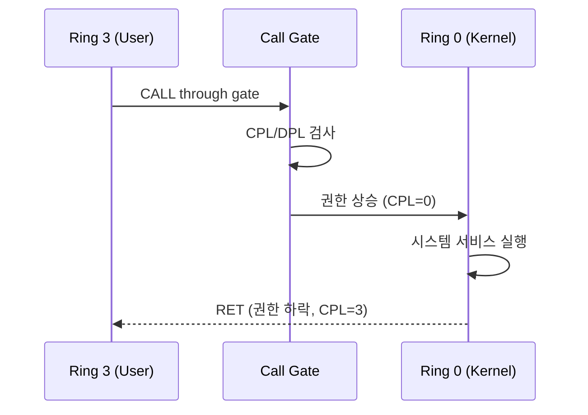
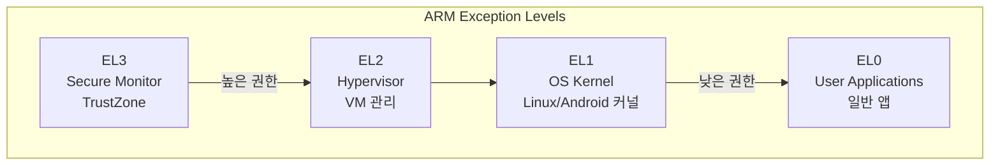
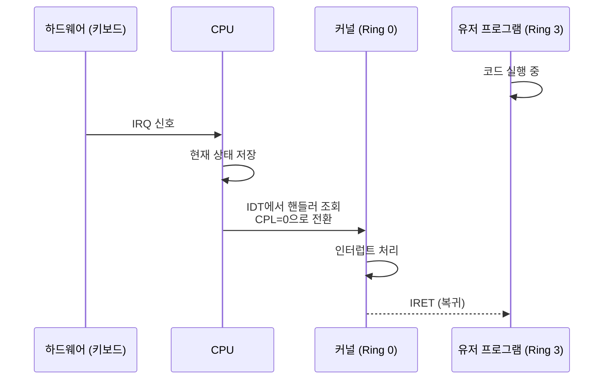
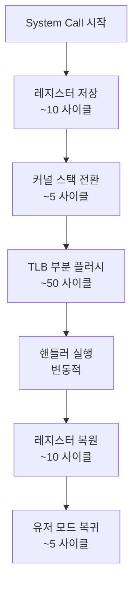
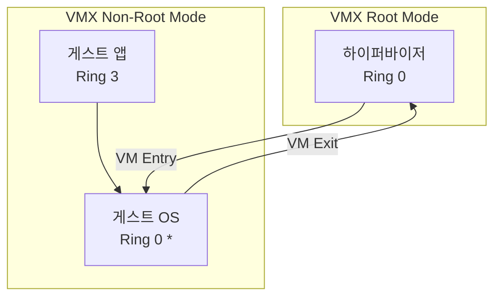

## CPU 권한 레벨(Privilege Levels)이란

CPU 권한 레벨(또는 보호 링, Protection Rings)은 **CPU가 실행 중인 코드에 부여하는 권한의 계층 구조**다. 가장 높은 권한(Ring 0, Kernel Mode)은 하드웨어를 직접 제어할 수 있고, 낮은 권한(Ring 3, User Mode)은 제한된 작업만 수행할 수 있다. 이는 운영체제의 안정성과 보안의 근간이다.

### 왜 권한 레벨이 필요했나

#### 초기 컴퓨터의 문제들 (1950~1960년대)

초기 컴퓨터는 **모든 프로그램이 동일한 권한**으로 실행되었다. 프로그램은 하드웨어를 직접 제어할 수 있었다:

```assembly
; 디스크 컨트롤러에 직접 명령
OUT 0x1F7, AL    ; 디스크에 쓰기 명령
OUT 0x170, DX    ; 디스크 데이터 전송
```

**문제점**:

1. **시스템 불안정**: 프로그램의 버그가 하드웨어를 잘못 제어하면 전체 시스템이 멈추거나 데이터가 손상된다.
   - 예: 디스크 헤드를 잘못된 위치로 이동 → 물리적 손상
   - 예: 타이머를 잘못 설정 → 시스템 시계 오작동

2. **보안 부재**: 악의적인 프로그램이 다른 프로그램의 메모리를 읽거나 수정할 수 있다.
   - 예: 은행 프로그램의 메모리를 읽어 비밀번호 탈취
   - 예: 운영체제 코드를 덮어써서 제어권 탈취

3. **멀티태스킹 불가능**: 여러 프로그램을 안전하게 동시에 실행할 수 없다. 한 프로그램이 CPU 제어를 독점하면 다른 프로그램이 실행될 수 없다.

#### 해결책: 권한 분리 (1960년대 후반)

**Multics**(1965)와 **GE-645** 프로세서가 최초로 **보호 링(Protection Rings)** 개념을 구현했다. 코드를 여러 권한 레벨로 분리:

- **Ring 0** (가장 높은 권한): 운영체제 커널
- **Ring 1-2**: 운영체제 서비스, 드라이버
- **Ring 3** (가장 낮은 권한): 사용자 프로그램

프로그램은 자신의 권한 레벨보다 높은 권한이 필요한 작업을 **직접 수행할 수 없다**. 대신 **운영체제에 요청**(시스템 콜)해야 한다.

---

## Intel x86의 보호 링

### Ring 0~3 구조

Intel 80286(1982)부터 4단계 보호 링을 지원한다:



**실제 사용**:
- 대부분의 운영체제(Linux, Windows)는 **Ring 0**과 **Ring 3**만 사용한다.
- Ring 1-2는 거의 사용되지 않는다(복잡성 증가, 성능 오버헤드).

### Ring 0 (Kernel Mode)

**가능한 작업**:
- 모든 CPU 명령어 실행 가능
- 모든 메모리 주소 접근 가능
- I/O 포트 직접 제어 (IN/OUT 명령어)
- 인터럽트 처리
- 페이지 테이블 수정 ([[virtual-memory#페이지 테이블(Page Table)|페이지 테이블]])
- CPU 제어 레지스터(CR0, CR3 등) 수정

**특권 명령어 예시**:
```assembly
; IDT(Interrupt Descriptor Table) 로드 - Ring 0만 가능
LIDT [idt_descriptor]

; 페이지 테이블 베이스 레지스터 변경
MOV CR3, EAX

; I/O 포트 접근
IN AL, 0x60    ; 키보드에서 읽기
OUT 0x20, AL   ; 인터럽트 컨트롤러에 쓰기
```

Ring 3에서 이런 명령을 시도하면 **General Protection Fault** (GPF, Exception #13) 발생.

### Ring 3 (User Mode)

**제한 사항**:
- 특권 명령어 실행 불가
- 커널 메모리 접근 불가 (페이지 테이블의 User/Supervisor 비트로 제어)
- I/O 포트 직접 접근 불가 (IOPL 플래그로 제어)
- 인터럽트 설정 변경 불가

**허용되는 작업**:
- 일반 연산 (ADD, MUL, JMP 등)
- 자신의 메모리 공간 내 접근
- 시스템 콜을 통한 커널 서비스 요청

---

## 세그먼트와 권한 레벨

### 세그먼트 디스크립터

x86 보호 모드에서 각 메모리 세그먼트는 **디스크립터**로 정의된다. 디스크립터에는 **DPL(Descriptor Privilege Level)** 필드가 있다.

```
세그먼트 디스크립터:
[베이스 주소 | 한계 | DPL | 타입 | 플래그]
                     Ring 0~3
```

**접근 규칙**:
```
CPL (Current Privilege Level) <= DPL
```

- **CPL**: 현재 실행 중인 코드의 권한 레벨 (CS 레지스터의 하위 2비트)
- **DPL**: 세그먼트/게이트의 권한 레벨

예: Ring 3 코드(CPL=3)는 DPL=0인 커널 세그먼트에 접근할 수 없다.

### 콜 게이트(Call Gate)

Ring 3에서 Ring 0으로 **제어된 방식**으로 진입하는 메커니즘.



**시스템 콜의 진화**:
1. **초기**: Call Gate 사용 (복잡, 느림)
2. **Pentium II+**: `SYSENTER`/`SYSEXIT` 명령어 (빠름)
3. **x86-64**: `SYSCALL`/`SYSRET` 명령어

---

## ARM의 예외 레벨(Exception Levels)

ARM 아키텍처(ARMv8-A, 64-bit)는 다른 용어를 사용하지만 유사한 개념이다.

### EL0~EL3 구조



**용도**:
- **EL0**: User Mode. 앱 실행.
- **EL1**: Kernel Mode. 운영체제 커널 (x86의 Ring 0에 해당).
- **EL2**: Hypervisor. 가상 머신 관리 (KVM, Xen).
- **EL3**: Secure Monitor. TrustZone 보안 환경.

**Android에서**:
- 일반 앱: EL0
- Linux 커널: EL1
- 하이퍼바이저(AVF): EL2
- TrustZone(키 관리, DRM): EL3

---

## 모드 전환(Mode Switching)

### User Mode → Kernel Mode

다음 상황에서 자동으로 권한이 상승한다:

#### 1. 시스템 콜(System Call)

사용자 프로그램이 명시적으로 커널 서비스를 요청.

```c
// 사용자 코드 (Ring 3)
int fd = open("/file.txt", O_RDONLY);
```

**x86-64에서의 동작**:
```assembly
; libc의 open() wrapper
mov rax, 2          ; syscall 번호 (open = 2)
mov rdi, filename   ; 첫 번째 인자
mov rsi, flags      ; 두 번째 인자
syscall             ; Ring 3 → Ring 0 전환

; CPU 동작:
; 1. RIP(명령어 포인터)를 저장
; 2. RFLAGS 저장
; 3. MSR (Model-Specific Register)에서 커널 핸들러 주소 로드
; 4. CPL을 0으로 변경
; 5. 커널 스택으로 전환 (RSP 변경)
; 6. 커널 핸들러로 점프
```

**커널에서**:
```c
// arch/x86/entry/entry_64.S
ENTRY(entry_SYSCALL_64)
    // 레지스터 저장
    push %rax
    push %rdi
    // ...
    
    // 시스템 콜 디스패치
    call sys_call_table(, %rax, 8)
    
    // 결과 반환 및 모드 복귀
    sysretq    ; Ring 0 → Ring 3
```

#### 2. 인터럽트(Interrupt)

하드웨어가 CPU에 신호를 보내 즉시 처리 요청.



**IDT(Interrupt Descriptor Table)**:
```
인터럽트 번호 → 핸들러 주소 + DPL
0: Divide by Zero
13: General Protection Fault
14: Page Fault
32: Timer Interrupt
33: Keyboard Interrupt
...
```

#### 3. 예외(Exception)

CPU가 비정상 상황을 감지.

**종류**:
- **Fault** (복구 가능): Page Fault (#14), Divide by Zero (#0)
- **Trap** (의도적): Breakpoint (#3), Overflow (#4)
- **Abort** (치명적): Machine Check (#18)

**Page Fault 예시**:
```c
int *ptr = (int *)0x1000;  // 가상 주소
*ptr = 42;  // 접근 시도
```

1. MMU가 페이지 테이블 조회: Present=0 (페이지가 RAM에 없음)
2. CPU가 Page Fault Exception (#14) 발생
3. Ring 3 → Ring 0 전환
4. 커널의 Page Fault 핸들러 실행:
   ```c
   do_page_fault() {
       // 유효한 주소인가?
       // 디스크에서 페이지 로드
       // 페이지 테이블 업데이트
   }
   ```
5. IRET로 Ring 3 복귀, 명령어 재실행

### Kernel Mode → User Mode

커널 작업 완료 후 유저 모드로 복귀.

**명령어**:
- x86: `IRET` (Interrupt Return)
- x86-64 시스템 콜: `SYSRET`
- ARM: `ERET` (Exception Return)

**동작**:
1. 저장된 유저 스택/레지스터 복원
2. CPL을 3으로 변경
3. 저장된 명령어 주소로 점프

---

## 모드 전환의 비용

### 오버헤드 구성 요소



**측정**:
- 최소 시스템 콜 (`getpid()`): ~100-200ns (현대 CPU)
- 로컬 함수 호출: ~1-2ns
- **약 100배 차이**

**왜 느린가?**:
1. **컨텍스트 저장/복원**: 모든 범용 레지스터 저장 필요
2. **페이지 테이블 전환**: CR3 레지스터 변경 → TLB 플러시
3. **캐시 오염**: 커널 코드가 캐시 라인 차지 → 유저 코드의 캐시 미스 증가
4. **보안 검사**: 파라미터 검증, 권한 확인

### 최적화 기법

#### 1. vDSO (virtual Dynamic Shared Object)

읽기 전용 데이터는 공유 메모리로 제공 → 시스템 콜 불필요.

```c
// Ring 3에서 실행
time_t t = gettimeofday();  // 실제로는 vDSO의 메모리를 읽음
```

커널이 주기적으로 시간 정보를 vDSO 영역에 기록 → 유저 프로그램이 모드 전환 없이 읽음.

#### 2. Batching

여러 작업을 모아서 한 번의 시스템 콜로 처리.

```c
// 비효율적
for (int i = 0; i < 1000; i++) {
    write(fd, &data[i], 1);  // 1000번의 시스템 콜
}

// 효율적
write(fd, data, 1000);  // 1번의 시스템 콜
```

#### 3. 유저 공간 구현

가능하면 유저 공간에서 해결.

예: `malloc()`/`free()`는 대부분 유저 공간 힙에서 처리. `mmap()`으로 큰 청크만 커널에서 할당.

---

## 보안과 권한 레벨

### 권한 상승 공격

**목표**: Ring 3에서 Ring 0 코드 실행 → 시스템 완전 장악.

#### 1. 버퍼 오버플로우 + 커널 취약점

```c
// 취약한 커널 드라이버
void vulnerable_ioctl(char *user_data) {
    char kernel_buffer[64];
    strcpy(kernel_buffer, user_data);  // 경계 검사 없음!
}
```

공격자가 128바이트를 전달 → 스택 오버플로우 → 반환 주소 덮어쓰기 → 악의적인 Ring 0 코드 실행.

**방어**:
- Stack Canary: 버퍼와 반환 주소 사이에 임의 값 삽입, 복귀 전 검증
- SMEP (Supervisor Mode Execution Prevention): Ring 0에서 유저 메모리를 실행 불가
- SMAP (Supervisor Mode Access Prevention): Ring 0에서 유저 메모리 접근 시 명시적 허용 필요

#### 2. Spectre/Meltdown

**Meltdown** (2018):
- CPU의 추측 실행(speculative execution)이 권한 검사 전에 커널 메모리를 읽음
- 캐시에 저장 → 사이드 채널 공격으로 데이터 유출

```c
// Ring 3 (유저 모드)
char *kernel_addr = 0xffffffff81000000;  // 커널 주소
char value = *kernel_addr;  // 권한 위반 → Exception

// 하지만 CPU는 추측 실행으로 미리 읽어서 캐시에 저장
// 공격자는 타이밍 공격으로 캐시 상태 확인 → 값 유추
```

**방어 (KPTI, Kernel Page Table Isolation)**:
- 유저 모드 실행 시 커널 메모리를 페이지 테이블에서 완전히 제거
- 시스템 콜 시에만 커널 페이지 테이블로 전환
- **성능 저하** (~5-30%, 워크로드에 따라 다름)

---

## 가상화와 권한 레벨

### 문제: OS가 Ring 0을 기대함

가상 머신(VM) 내부의 게스트 OS는 자신이 Ring 0에서 실행된다고 가정한다. 하지만 호스트 OS가 이미 Ring 0을 사용 중이다.

### 해결책 1: Paravirtualization (반가상화)

게스트 OS를 수정해 Ring 1에서 실행. 특권 명령어를 하이퍼콜(hypercall)로 대체.

```c
// 원본 코드
asm("cli");  // 인터럽트 비활성화 (Ring 0 필요)

// Paravirtualization
hypercall(HYPERCALL_DISABLE_INTERRUPTS);  // Ring 1에서 호출
```

**단점**: 게스트 OS 수정 필요. Windows 같은 폐쇄 소스는 불가능.

### 해결책 2: 하드웨어 가상화 (VT-x, AMD-V)

CPU가 **새로운 모드**를 추가:

**Intel VT-x**:
- **VMX Root Mode**: 하이퍼바이저 실행 (Ring 0)
- **VMX Non-Root Mode**: 게스트 OS 실행 (Ring 0처럼 보이지만 실제로는 제한됨)



**VM Exit**: 게스트가 특권 명령어 실행 시도 → 자동으로 하이퍼바이저로 전환.

**ARM의 경우**:
- EL2 (Hypervisor Level)에서 하이퍼바이저 실행
- EL1에서 게스트 OS 실행
- 추가 모드 불필요 (아키텍처 자체가 가상화 지원)

---

## 실전: 권한 레벨 확인

### x86 Linux에서 현재 권한 확인

```c
#include <stdio.h>

unsigned short get_cs() {
    unsigned short cs;
    asm("mov %%cs, %0" : "=r"(cs));
    return cs;
}

int main() {
    unsigned short cs = get_cs();
    unsigned short cpl = cs & 3;  // 하위 2비트
    
    printf("CS register: 0x%x\n", cs);
    printf("CPL (Current Privilege Level): %d\n", cpl);
    // 일반 프로그램은 CPL=3 (Ring 3)
    return 0;
}
```

### 커널 모듈에서 확인

```c
// Linux kernel module
static int __init test_init(void) {
    unsigned short cs;
    asm("mov %%cs, %0" : "=r"(cs));
    
    pr_info("Kernel CS: 0x%x, CPL: %d\n", cs, cs & 3);
    // 커널 모듈은 CPL=0 (Ring 0)
    return 0;
}
```

### /proc을 통한 확인

```bash
cat /proc/cpuinfo | grep flags
# 출력에서 확인:
# - vmx: Intel VT-x 지원
# - svm: AMD-V 지원
# - smep: Supervisor Mode Execution Prevention
# - smap: Supervisor Mode Access Prevention
```

---

## 안드로이드에서의 권한 레벨

### 일반 아키텍처 (ARM64)

```
EL3: TrustZone (Secure Monitor)
  └─ 암호화 키 관리, DRM, 생체인증
  
EL2: Hypervisor (pKVM in Android 13+)
  └─ 가상 머신 격리 (AVF, Microdroid)
  
EL1: Linux Kernel
  └─ 안드로이드 커널, 드라이버
  
EL0: User Space
  ├─ System Server
  ├─ Zygote
  └─ 앱 프로세스
```

### SELinux와의 상호작용

CPU 권한 레벨은 **하드웨어 보호**, SELinux는 **정책 기반 보호**.

예: 루팅된 기기에서 `su`로 root 권한 획득 → Ring 0에 접근할 수 있지만, SELinux가 여전히 차단.

```bash
# root 권한으로 실행해도
cat /proc/kmsg  # Permission denied (SELinux 차단)
```

[[android-kernel#6 SELinux 강제 접근 제어|SELinux 상세]] 참고.

---

## 성능 vs 보안 트레이드오프

### Spectre/Meltdown 이후

**완화 기법들**:
1. **KPTI**: 모든 시스템 콜에서 페이지 테이블 전환 → 5-30% 성능 저하
2. **Retpoline**: 간접 점프를 안전한 방식으로 대체 → 5-10% 저하
3. **IBRS** (Indirect Branch Restricted Speculation): CPU 마이크로코드 업데이트 → 변동적

**선택 가능 (커널 부팅 파라미터)**:
```bash
# 모든 완화 비활성화 (위험!)
mitigations=off

# KPTI만 비활성화
nopti

# Spectre v2 완화 비활성화
nospectre_v2
```

보안이 중요한 서버는 활성화. 개인 워크스테이션은 성능을 위해 선택적으로 비활성화 가능.

---

## 학습 리소스

**책**:
- *Intel 64 and IA-32 Architectures Software Developer's Manual*: 권위 있는 공식 문서
- *ARM Architecture Reference Manual*: ARM 아키텍처 상세

**온라인**:
- [OSDev Wiki - CPU Modes](https://wiki.osdev.org/CPU_Modes)
- [Linux Insides - System Calls](https://0xax.gitbooks.io/linux-insides/content/SysCall/)

---

## 연결 문서

[[kernel]] - 커널의 시스템 콜 인터페이스  
[[virtual-memory]] - 메모리 보호와 권한 비트  
[[android-kernel]] - 안드로이드의 TrustZone과 SELinux  
[[buffer]] - 버퍼 오버플로우와 보안
