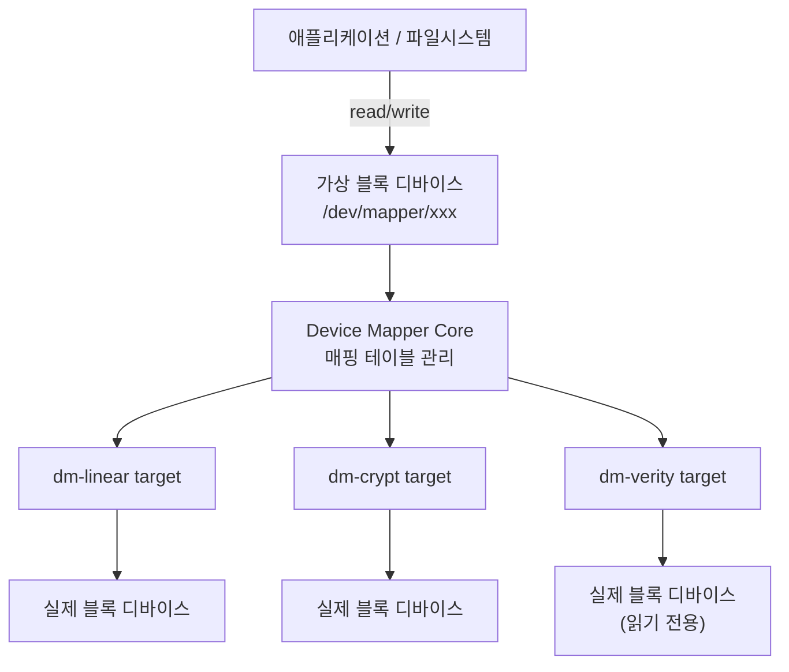
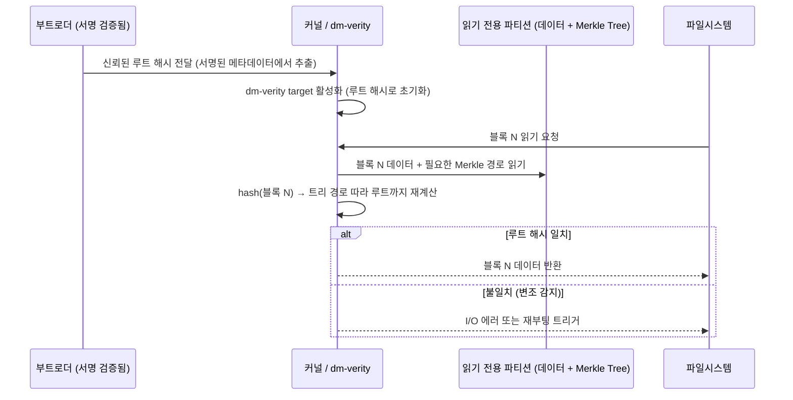

## Device Mapper 란 무엇인가

**Device Mapper(DM)** 는 리눅스 커널이 제공하는 프레임워크로, 하나 이상의 실제(또는 다른 가상) 블록 디바이스 위에 **가상 블록 디바이스**를 쌓아 올릴 수 있게 해준다. 상위 계층(파일시스템, 애플리케이션)은 이 가상 디바이스를 평범한 `/dev/sdX` 처럼 마운트하고 읽고 쓸 뿐이지만, 실제로는 그 아래에서 Device Mapper 가 매핑 테이블에 정의된 규칙에 따라 I/O 요청을 가로채 변형(재배치, 암호화, 검증 등)한 뒤 진짜 하위 디바이스로 전달한다.

핵심 아이디어는 **"블록 디바이스에 대한 I/O 를 가로채는 계층을 커널 안에 표준화된 방식으로 끼워 넣는다"** 는 것이다. 이 계층 하나로 논리 볼륨 관리(LVM), RAID, 디스크 암호화, 무결성 검증까지 전부 구현할 수 있다 — 각각이 별도의 커널 서브시스템이 아니라, Device Mapper 위에 얹힌 서로 다른 **target**(매핑 규칙 플러그인) 일 뿐이다.



### 왜 커널 안에 이런 범용 계층을 뒀나

2000년대 초반 리눅스에서 LVM, 소프트웨어 RAID, 디스크 암호화는 각각 독립적으로 블록 I/O 를 가로채는 방식을 구현하고 있었다. 기능마다 매핑 테이블 관리, I/O 요청 재작성, suspend/resume 처리 같은 공통 로직을 중복 구현해야 했다. **Device Mapper(2.6 커널, 2003년경 안정화)** 는 이 공통 로직을 커널 프레임워크로 뽑아내고, 각 기능은 "매핑 함수 하나만 구현하면 되는 target 모듈" 로 축소했다. 그 결과 새로운 블록 계층 기능(암호화 방식 추가, 새로운 검증 방식 추가 등)을 만들 때 매번 블록 I/O 스택 전체를 다시 다룰 필요 없이, target 하나만 작성하면 되게 됐다.

유저스페이스 도구인 `dmsetup` 과, 그 위에 구축된 LVM2 툴체인(`pvcreate`, `vgcreate`, `lvcreate` 등, [[lvm|LVM]] 참고)이 이 커널 프레임워크를 제어하는 표준 인터페이스다.

## 대표적인 Target 종류

### dm-linear: 가장 단순한 매핑

논리 주소 범위를 물리 주소 범위로 1:1 재배치만 한다. LVM 의 Logical Volume 이 여러 Physical Volume 에 걸쳐 있을 때, 각 구간을 순서대로 이어 붙이는 데 쓰인다.

```bash
# 512바이트 섹터 기준: 논리 주소 0~2047섹터를
# /dev/sdb1의 1000섹터 지점부터 매핑
echo "0 2048 linear /dev/sdb1 1000" | dmsetup create my_linear_dev
```

### dm-crypt: 투명 디스크 암호화

블록을 디스크에 쓰기 직전 암호화하고, 읽어올 때 복호화한다. 상위 파일시스템은 암호화가 존재한다는 사실조차 알 필요가 없다 — 그냥 평범한 블록 디바이스처럼 보인다. LUKS(Linux Unified Key Setup)는 dm-crypt 위에 키 관리 규격을 얹은 것이다.

```bash
cryptsetup luksFormat /dev/sdb1
cryptsetup luksOpen /dev/sdb1 my_encrypted_disk
mkfs.ext4 /dev/mapper/my_encrypted_disk
```

### dm-verity: 읽기 전용 디바이스의 부팅마다 무결성 검증

**dm-verity** 는 [[merkle-tree|Merkle Tree]] 를 이용해, 읽기 전용 블록 디바이스가 **한 블록이라도 변조되었는지를 매 I/O 마다 실시간으로 검증**하는 target 이다.

동작 방식:
1. 이미지를 빌드하는 시점(오프라인)에, 데이터 블록 각각을 해싱하고 그 해시들로 Merkle Tree 를 구성한다. 이 트리는 별도의 hash 디바이스(또는 데이터 뒤에 덧붙인 영역)에 저장된다.
2. 트리의 루트 해시(root hash) 하나만 별도의, 반드시 신뢰할 수 있는 경로(예: 부트로더가 검증한 서명된 메타데이터)로 시스템에 전달된다.
3. 부팅 시 커널이 dm-verity target 을 이 루트 해시로 설정(activate)한다.
4. 이후 파일시스템이 이 디바이스에서 블록을 읽을 때마다, dm-verity 는 그 블록의 해시를 계산하고 Merkle Tree 를 루트까지 따라 올라가며 검증한다. 어느 한 단계라도 저장된 해시와 불일치하면, I/O 에러를 반환하거나(기본 모드) 즉시 패닉/재부팅을 유발한다(강제 모드).



```bash
# veritysetup으로 dm-verity 활성화 (개념적 예시)
veritysetup format /dev/sdb1 /dev/sdb2   # 데이터 파티션, 해시 트리 파티션
# 출력에서 Root hash 값을 얻는다 (예: a1b2c3...)

veritysetup open /dev/sdb1 my_verified_dev /dev/sdb2 a1b2c3...
mount -o ro /dev/mapper/my_verified_dev /mnt/verified
```

## 왜 파일 단위 체크섬이 아니라 블록 디바이스 계층에서 하는가

파일 단위 무결성 검증(예: 각 파일의 SHA-256 을 매니페스트에 저장해두고 실행 전 확인)은 직관적이지만 dm-verity 가 굳이 더 낮은 블록 디바이스 계층에서 동작하는 데는 명확한 이유가 있다.

1. **검증 시점의 문제**: 파일 단위 검증은 보통 "파일을 열 때" 또는 "실행 전에" 한 번 확인한다. 그 확인과 실제 사용 사이에 파일이 바뀔 수 있는 TOCTOU(Time-Of-Check to Time-Of-Use) 공격 여지가 있다. dm-verity 는 **매 블록 I/O 마다** 검증하므로, 커널이 데이터를 실제로 소비하는 바로 그 순간에 검증이 일어난다. 검증과 사용 사이에 끼어들 틈이 없다.
2. **파일시스템 메타데이터까지 보호**: 파일 내용만이 아니라, 그 파일이 어느 디렉토리에 있는지, 권한이 무엇인지 같은 파일시스템 메타데이터 자체도 블록 안에 들어있다. 블록 계층에서 검증하면 파일시스템 구조 자체의 변조(예: setuid 비트 조작, 심볼릭 링크 바꿔치기)도 함께 잡아낸다. 파일 단위 체크섬은 "파일 내용" 만 보고 "파일시스템 구조" 는 놓친다.
3. **커널 초기 검증 가능**: 블록 디바이스 계층 검증은 파일시스템 드라이버보다 아래에서 동작하므로, 상위의 파일시스템 코드 자체가 손상되어 있어도(또는 아직 마운트되지 않은 시점에도) 영향을 받지 않는다. 부팅 극초반, 아직 복잡한 파일시스템 파서를 신뢰하기 전 단계부터 무결성 보장을 시작할 수 있다.
4. **성능**: 매번 파일 전체를 열어 재해싱하는 대신, Merkle Tree 덕분에 실제로 읽은 블록만 그때그때 검증하면 된다([[merkle-tree|Merkle Tree]] 문서의 "부분 검증" 특성).

이렇게 블록 디바이스 계층에서 얻은 "이 파티션은 빌드 시점 그대로다" 라는 보장은, 부트로더의 서명 검증에서 시작해 커널, 그리고 이 dm-verity 검증까지 이어지는 더 큰 신뢰 사슬의 한 단계다. 전체 구조는 [[root-of-trust-and-chain-of-trust]] 문서에서 다룬다.

## 연결 문서

- [[merkle-tree]] - dm-verity 가 사용하는 해시 트리 자료구조 자체
- [[root-of-trust-and-chain-of-trust]] - dm-verity 의 루트 해시가 신뢰 사슬에서 어떤 위치에 있는지
- [[lvm|LVM]] - Device Mapper 위에 구현된 논리 볼륨 관리
- [[kernel]] - 블록 I/O 스택과 커널 서브시스템 전반
