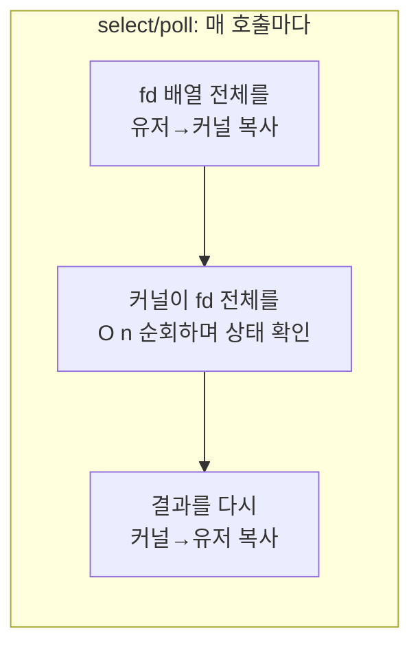
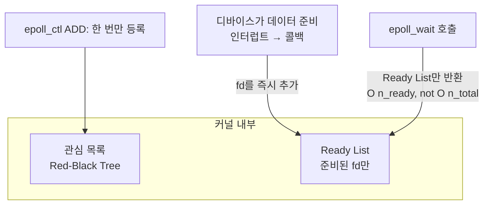
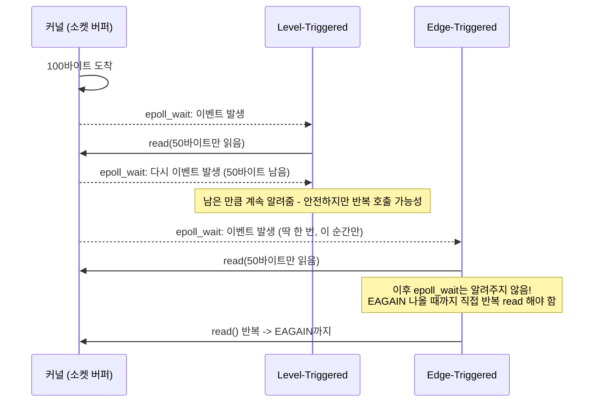

## I/O Multiplexing 문제란

서버 프로그램이든 GUI 애플리케이션이든, 흔히 **하나의 스레드가 수십~수만 개의 file descriptor(소켓, 파이프, 이벤트 fd 등) 중 "지금 읽거나 쓸 준비가 된 것" 을 기다려야 하는 상황**이 생긴다. 이것이 **I/O multiplexing(입출력 다중화)** 문제다.

가장 단순한 접근은 fd 하나당 스레드(또는 프로세스) 하나를 배정해 각각 블로킹 `read()`/`write()` 를 호출하는 것이다. 하지만 연결 수가 수천~수만으로 늘어나면 스레드마다 드는 스택 메모리(기본 8MB 수준)와 컨텍스트 스위칭 비용이 감당할 수 없이 커진다. 이것이 1990 년대 말 **C10K 문제**(동시 접속 1만 개를 어떻게 감당할 것인가)로 알려진 고전적 난제다. 해결책은 "연결 수만큼 스레드를 늘리지 말고, 스레드 하나(또는 소수)가 여러 fd 를 논블로킹으로 감시한다" 는 방향으로 수렴했다.

## select() -> poll() -> epoll() 의 진화

### select() (BSD, 1983)

가장 오래된 API. 감시할 fd 들을 비트마스크(`fd_set`) 에 담아 커널에 넘기면, 커널은 그중 준비된 것들을 표시해 돌려준다.

```c
fd_set readfds;
FD_ZERO(&readfds);
FD_SET(sock1, &readfds);
FD_SET(sock2, &readfds);
int n = select(max_fd + 1, &readfds, NULL, NULL, &timeout);
```

**구조적 한계 세 가지**:
1. **fd 개수 상한**: `fd_set` 은 고정 크기 비트마스크(보통 `FD_SETSIZE=1024`)라서, 감시 가능한 fd 수에 하드 리밋이 있다.
2. **매 호출마다 O(n) 스캔**: 커널은 매번 전달받은 fd 집합 전체를 순회하며 상태를 확인해야 한다. fd 가 10개든 10,000개든 매번 전체를 훑는다.
3. **매 호출마다 fd 집합을 통째로 유저->커널로 복사**: fd_set 이 커질수록 시스템 콜 자체의 비용이 커진다.

### poll() (System V, 1986)

`select()` 의 고정 크기 비트마스크 한계를 없앤 버전. `fd_set` 대신 `struct pollfd` 배열을 쓴다.

```c
struct pollfd fds[3] = {
    { .fd = sock1, .events = POLLIN },
    { .fd = sock2, .events = POLLIN },
    { .fd = sock3, .events = POLLIN },
};
int n = poll(fds, 3, timeout_ms);
```

fd 개수 상한은 사라졌지만, **여전히 매 호출마다 전체 배열을 유저->커널로 복사하고 O(n) 으로 스캔**한다는 근본 문제는 그대로다. fd 수가 많고 그중 실제로 준비된 것이 소수일 때(전형적인 유휴 커넥션이 많은 서버) 이 O(n) 스캔은 순전한 낭비다.



### epoll() (Linux 2.5.44, 2002)

epoll 은 "감시 대상 등록" 과 "이벤트 대기" 를 분리해 이 문제를 근본적으로 해결한다.

1. `epoll_create()` 로 커널 내부에 epoll 인스턴스(관심 목록을 담는 자료구조, 내부적으로 레드-블랙 트리)를 만든다.
2. `epoll_ctl()` 로 fd 를 **한 번만** 등록(`EPOLL_CTL_ADD`)한다. 이후 매번 전체 목록을 다시 넘길 필요가 없다.
3. fd 가 준비되면, 커널은 **해당 fd 를 콜백으로 즉시 ready list 에 추가**한다(디바이스 드라이버가 데이터를 준비할 때 fd 를 깨우는 콜백 메커니즘을 이용).
4. `epoll_wait()` 는 매번 전체 fd 를 스캔하는 대신, **이미 준비된 fd 들만 담긴 ready list 를 그대로 반환**한다 — 감시 중인 fd 총량과 무관하게, 실제로 준비된 fd 개수에 비례하는 비용만 든다.

```c
int epfd = epoll_create1(0);

struct epoll_event ev = { .events = EPOLLIN, .data.fd = sock1 };
epoll_ctl(epfd, EPOLL_CTL_ADD, sock1, &ev);   // 등록은 한 번만

struct epoll_event events[MAX_EVENTS];
while (1) {
    int n = epoll_wait(epfd, events, MAX_EVENTS, -1);  // 준비된 것만 반환
    for (int i = 0; i < n; i++) {
        handle_ready_fd(events[i].data.fd);
    }
}
```



이것이 흔히 말하는 **"select/poll 은 O(n), epoll 은 O(1)"** 이라는 표현의 실제 의미다. 정확히는 `epoll_wait()` 자체의 반환 비용이 "감시 중인 전체 fd 수" 가 아니라 "실제로 준비된 fd 수" 에 비례한다는 뜻이다. fd 수만 개 중 몇 개만 활성 상태인 전형적인 서버 워크로드에서 이 차이는 결정적이다.

## Edge-Triggered vs Level-Triggered

epoll 은 두 가지 알림 모드를 지원하며, 이 둘의 차이를 잘못 이해하면 이벤트를 놓치거나 CPU 를 낭비하는 버그로 이어진다.

- **Level-Triggered(LT, 기본값)**: fd 에 읽을 데이터가 **남아 있는 한** `epoll_wait()` 가 계속 그 fd 를 반환한다. `read()` 를 한 번 호출해서 버퍼를 일부만 비웠어도, 다음 `epoll_wait()` 호출에서 다시 알려준다. `select()`/`poll()` 과 동작 방식이 같아서 직관적이고 안전하다.
- **Edge-Triggered(ET, `EPOLLET` 플래그)**: fd 상태가 **"변화한 순간"에만** 딱 한 번 알린다. 즉 새로 데이터가 도착한 그 엣지(edge)에서만 이벤트가 발생하고, 그 이후 데이터가 남아 있어도 다시 읽으라고 알려주지 않는다. 따라서 ET 모드에서는 이벤트를 받으면 **`EAGAIN` 이 나올 때까지 논블로킹 `read()`/`write()` 를 반복 호출**해서 버퍼를 완전히 비워야 한다. 그렇지 않으면 남은 데이터를 영영 못 받는 상황이 생길 수 있다.



ET 모드는 커널이 ready list 에 같은 fd 를 중복으로 넣지 않아도 되므로 대량 연결 상황에서 약간 더 효율적이지만, 애플리케이션 코드가 더 까다로워진다. nginx 처럼 극한의 성능을 추구하는 서버는 ET 를 선호하고, 범용 이벤트 루프 라이브러리는 흔히 LT 를 기본으로 쓴다.

## 실제 이벤트 루프 구현 사례

- **nginx**: worker 프로세스마다 하나의 epoll 인스턴스로 수만 개의 클라이언트 연결을 단일(또는 소수) 스레드로 처리한다. 이것이 nginx 가 Apache 의 프로세스/스레드-per-connection 모델보다 훨씬 적은 메모리로 높은 동시 접속을 처리할 수 있는 핵심 이유다.
- **Node.js (libuv)**: libuv 는 리눅스에서 epoll, macOS/BSD 에서 kqueue, Windows 에서 IOCP 를 추상화해 동일한 이벤트 루프 API 를 제공한다. Node.js 의 "논블로킹 I/O" 라는 특징은 결국 이 epoll 기반 이벤트 루프 위에 세워져 있다.
- **Redis**: 단일 스레드 이벤트 루프(ae 이벤트 라이브러리)가 epoll(또는 kqueue) 로 다수의 클라이언트 연결을 처리한다.
- **Android init 의 메인 루프**: init 프로세스는 `epoll_wait()` 기반 이벤트 루프로 동작하며, SIGCHLD 시그널 fd, property service 소켓, ueventd 소켓 등 여러 fd 를 하나의 epoll 인스턴스로 동시에 감시한다. PID 1 이 별도 스레드를 fd 마다 두지 않고 단일 이벤트 루프로 부팅 시퀀스를 처리하는 이유도 같은 원리다.

## 연결 문서

- [[kernel]] - 인터럽트, top half/bottom half 등 커널이 이벤트를 처리하는 방식
- [[oom-killer-and-memory-pressure]] - PSI 트리거 fd 를 감시할 때도 동일한 epoll 이벤트 통지 메커니즘을 사용
