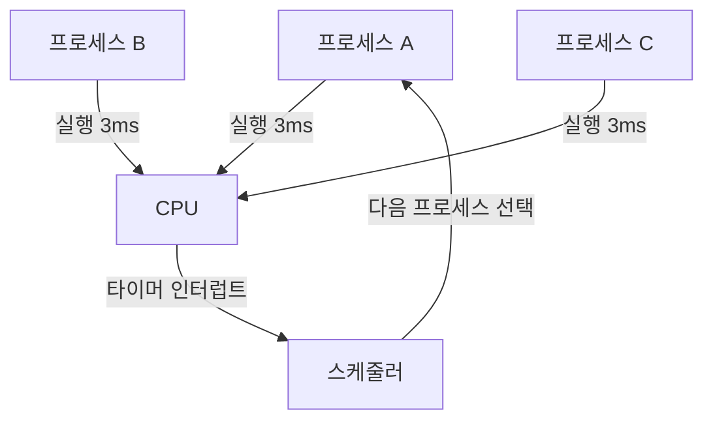
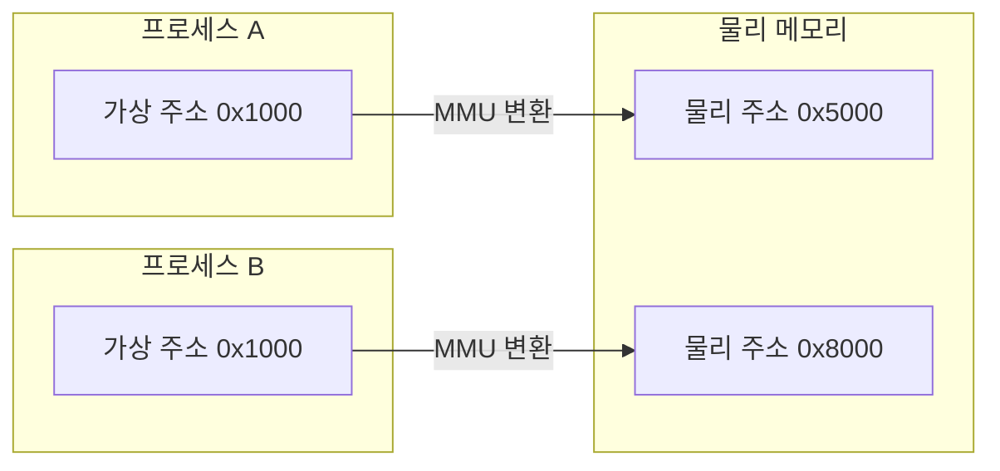
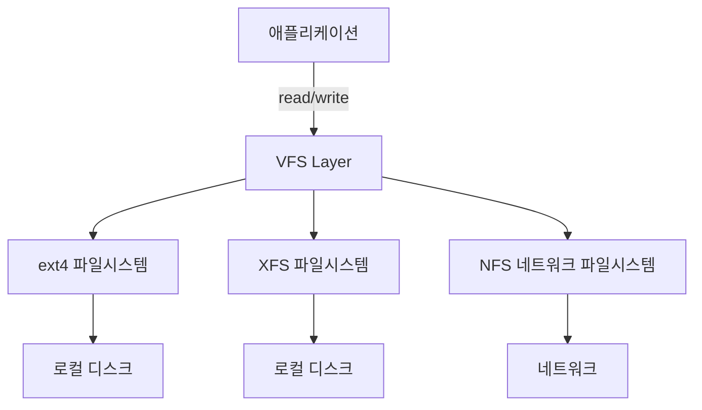
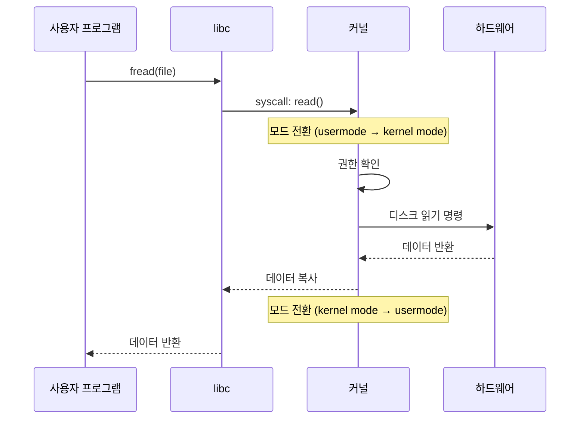
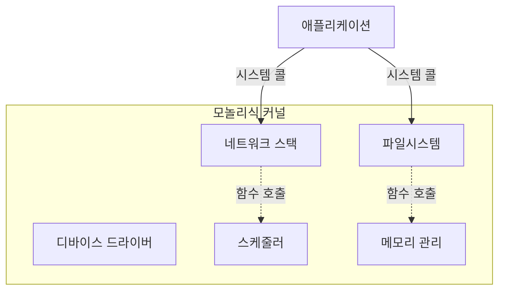
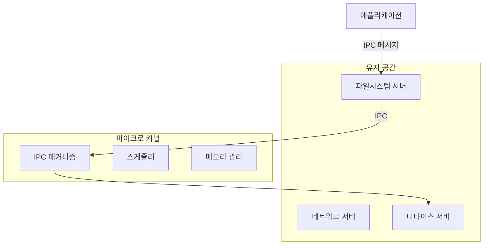
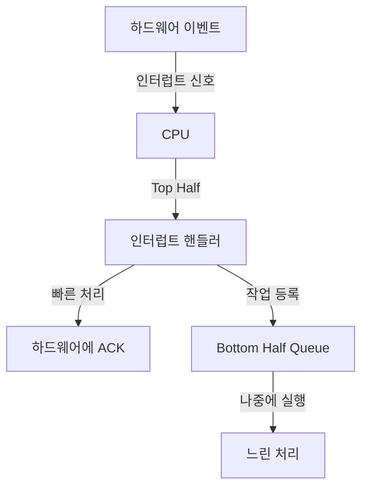
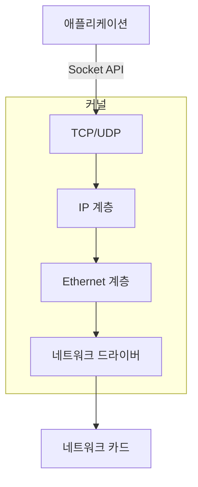

## 커널(Kernel)이란 무엇인가

커널은 운영체제의 핵심 부분으로, 하드웨어와 소프트웨어를 연결하는 계층이다. 애플리케이션들이 하드웨어 자원(CPU, 메모리, 디스크, 네트워크 등)을 안전하고 효율적으로 공유할 수 있도록 중재하고 관리한다.

### 커널이 필요하게 된 역사적 배경

초기 컴퓨터(1940~1950년대)는 한 번에 하나의 프로그램만 실행했다. 프로그램이 하드웨어를 직접 제어했고, 프로그램이 종료되면 다음 프로그램을 로드했다. 이 방식은 단순했지만 몇 가지 문제가 있었다:

1. **자원 낭비**: CPU가 I/O 작업(디스크 읽기 등)을 기다리는 동안 유휴 상태로 있었다.
2. **안전성 부족**: 프로그램의 버그가 전체 시스템을 멈추게 할 수 있었다.
3. **비효율성**: 여러 사용자가 컴퓨터를 공유하려면 물리적으로 차례를 기다려야 했다.

이러한 문제를 해결하기 위해 **멀티프로그래밍** 과 **시분할(time-sharing)** 개념이 등장했다(1960년대). 여러 프로그램을 메모리에 동시에 로드하고, CPU 시간을 빠르게 나눠주면서 마치 동시에 실행되는 것처럼 보이게 했다. 이때 **프로그램들 간의 중재자 역할** 이 필요했고, 이것이 커널의 시작이다.

### 커널의 핵심 역할

#### 1. 프로세스 스케줄링

여러 프로세스가 동시에 실행되려면 CPU를 공정하게 나눠야 한다. 1960년대 **Multics** 시스템에서 처음 구현된 스케줄러는 각 프로세스에 타임슬라이스(time slice)를 할당했다. 현대 리눅스의 **CFS(Completely Fair Scheduler)** 는 이를 발전시켜, 모든 프로세스가 "공정한" CPU 시간을 받도록 보장한다.



**왜 이렇게 설계되었나?**

초기 스케줄러는 단순 라운드로빈 방식이었지만, 이는 CPU 집약적 작업과 I/O 집약적 작업을 구분하지 못했다. 예를 들어, 텍스트 에디터는 사용자 입력을 기다리는 시간이 많아 CPU를 거의 쓰지 않지만, 빠른 응답성이 필요하다. 반면 동영상 인코딩은 CPU를 지속적으로 사용한다. CFS는 각 프로세스의 실제 실행 시간(vruntime)을 추적해, 덜 실행된 프로세스에 우선권을 준다.

#### 2. 메모리 관리

초기 멀티프로그래밍 시스템에서는 메모리를 고정 크기로 나눴다(partition). 하지만 프로그램 크기가 다양해지면서 메모리 낭비가 심했다.

1960년대 말 **[[virtual-memory|가상 메모리]](Virtual Memory)** 개념이 등장했다. 각 프로그램은 자신만의 독립된 주소 공간을 가지고, 실제 물리 메모리는 운영체제가 숨겨서 관리한다. 이를 통해:

- **메모리 격리**: 프로그램 A가 프로그램 B의 메모리를 침범할 수 없다.
- **효율성**: 자주 사용하지 않는 메모리는 디스크로 내보낸다(swap).
- **큰 주소 공간**: 물리 메모리보다 큰 가상 주소 공간을 제공한다.



**왜 페이지 단위로 나눴나?**  

초기에는 프로그램 전체를 메모리에 올리거나 디스크로 내보냈다(swapping). 하지만 프로그램이 커지면서 이는 비효율적이었다. **[[virtual-memory#페이징(Paging)|페이징(Paging)]]** 방식은 메모리를 고정 크기(보통 4KB)로 나눠, 필요한 페이지만 메모리에 올린다. 프로그램은 코드를 순차적으로 실행하고, 데이터도 지역성(locality)을 가지므로, 전체 프로그램의 일부만 메모리에 있어도 대부분의 시간 동안 정상 작동한다.

#### 3. 파일 시스템

초기 컴퓨터는 테이프나 펀치 카드를 사용했다. 데이터는 순차적으로만 접근할 수 있었다. 디스크 드라이브가 등장하면서 **랜덤 액세스** 가 가능해졌고, 파일을 계층적으로 구조화할 필요가 생겼다.

Unix(1970년대)는 **"모든 것은 파일이다"** 라는 철학을 도입했다. 일반 파일뿐만 아니라 디바이스, 프로세스 정보도 파일처럼 다룬다. 이를 위해 **VFS(Virtual File System)** 레이어를 추가해, 다양한 파일 시스템(ext4, XFS, NFS 등)을 통일된 인터페이스로 접근할 수 있게 했다.



**Inode의 등장 배경**

초기 파일 시스템은 파일 이름과 데이터를 직접 연결했다. 하지만 하드 링크(여러 이름이 같은 파일을 가리킴)를 지원하려면 파일의 메타데이터를 분리해야 했다. **Inode**는 파일의 실제 데이터 위치, 권한, 크기, 타임스탬프를 저장하고, 디렉토리는 "파일 이름 → Inode 번호" 매핑만 관리한다.

#### 4. 시스템 콜 인터페이스

프로그램이 하드웨어를 직접 제어하면 위험하다. 예를 들어, 프로그램이 다른 프로세스의 메모리를 읽거나, 디스크를 임의로 포맷할 수 있다. **특권 모드(Privileged Mode)**와 **사용자 모드(User Mode)** 분리가 필요했다.

CPU는 두 가지 모드를 지원한다:
- **커널 모드(Ring 0)**: 모든 명령 실행 가능, 하드웨어 직접 제어.
- **사용자 모드(Ring 3)**: 제한된 명령만 실행 가능, 시스템 콜을 통해 커널에 요청.

**시스템 콜(System Call)**은 사용자 프로그램이 커널에게 "이 작업을 대신 해줘"라고 요청하는 메커니즘이다. 예를 들어, 파일을 읽으려면 `read()` 시스템 콜을 호출한다. 커널은 권한을 확인하고, 디스크 드라이버를 통해 데이터를 읽어 돌려준다.



**왜 시스템 콜은 느린가?**

모드 전환에는 비용이 든다. CPU 레지스터를 저장하고, 페이지 테이블을 교체하고, TLB(Translation Lookaside [[buffer|Buffer]])를 비워야 한다. 캐시 일관성도 영향을 받는다. 하지만 이 비용은 **보안과 안정성**을 위한 필수적인 대가다. vDSO(virtual Dynamic Shared Object) 같은 최적화로 일부 시스템 콜(예: `gettimeofday`)은 모드 전환 없이 유저 공간에서 처리한다.

---

## 커널 아키텍처의 진화

### 모놀리식 커널(Monolithic Kernel)

초기 Unix와 Linux는 **모놀리식** 구조다. 파일 시스템, 네트워크 스택, 디바이스 드라이버가 모두 커널 공간에서 실행된다.

**장점**:
- 컴포넌트 간 통신이 빠르다(함수 호출만으로 충분).
- 성능이 좋다(컨텍스트 스위칭 최소).

**단점**:
- 하나의 드라이버 버그가 전체 시스템을 다운시킬 수 있다.
- 커널 크기가 커진다.



### 마이크로 커널(Microkernel)

1980년대 **Mach**, **L4** 같은 마이크로 커널이 등장했다. 커널은 최소한의 기능(IPC, 스케줄링, 기본 메모리 관리)만 담당하고, 파일 시스템과 드라이버는 유저 공간 프로세스로 분리했다.

**장점**:
- 안정성 향상: 드라이버 크래시가 커널을 멈추지 않는다.
- 모듈화: 컴포넌트를 독립적으로 재시작 가능.

**단점**:
- 성능 저하: 컴포넌트 간 통신에 메시지 패싱 필요, IPC 오버헤드.
- 복잡성 증가: 시스템 설계가 어렵다.



**왜 모놀리식이 여전히 주류인가?**

성능 차이가 결정적이었다. 1990년대 연구([Engler et al.](https://pdos.csail.mit.edu/6.828/2008/readings/exokernel.pdf))에 따르면, 마이크로 커널의 IPC 오버헤드는 모놀리식 대비 3~5배 높았다. Linux 같은 모놀리식 커널은 동적 모듈로 일부 이점(모듈 로드/언로드)을 제공하면서도 성능을 유지했다.

### 하이브리드 접근

**Windows NT**와 **macOS(XNU)**는 하이브리드 방식이다. 기본은 모놀리식이지만, 일부 컴포넌트는 유저 공간으로 분리한다. 예를 들어, Windows의 User32(윈도우 매니저)는 커널 모드였다가 Vista 이후 유저 모드로 이동했다(안정성 향상).

---

## 주요 커널 서브시스템과 설계 결정

### 1. 프로세스 vs 스레드

초기 Unix는 **프로세스**만 지원했다. 각 프로세스는 독립된 메모리 공간을 가졌다. 하지만 1980년대 멀티코어 CPU와 GUI 애플리케이션 등장으로 **경량 프로세스(스레드)** 필요성이 커졌다.

**문제**: 프로세스 생성은 비싸다. `fork()`는 부모 프로세스의 메모리를 복사해야 한다(Copy-on-Write로 최적화되었지만).

**해결**: **스레드**는 같은 주소 공간을 공유하면서 독립적으로 실행된다. 생성 비용이 낮고, 데이터 공유가 쉽다.

**Linux의 접근**: Linux는 스레드를 "공유 메모리를 가진 프로세스"로 구현한다. `clone()` 시스템 콜로 메모리, 파일 디스크립터, 시그널 핸들러 등을 선택적으로 공유한다. 이는 `pthread` 라이브러리의 기반이다.

### 2. 인터럽트 처리

하드웨어(키보드, 디스크, 네트워크 카드)가 작업을 완료하면 CPU에 **인터럽트**를 걸어 알린다. 초기 시스템은 **폴링(Polling)** 방식이었다: CPU가 반복적으로 하드웨어 상태를 확인했다. 이는 CPU를 낭비했다.

**인터럽트 방식**은 하드웨어가 능동적으로 신호를 보낸다. CPU는 즉시 현재 작업을 중단하고, 인터럽트 핸들러를 실행한다.

**문제**: 인터럽트 핸들러가 너무 오래 실행되면, 다른 인터럽트가 지연되거나 누락될 수 있다.

**해결**: **Top Half / Bottom Half** 분리.
- **Top Half**: 인터럽트 핸들러의 필수 부분만 빠르게 실행(예: 네트워크 패킷을 버퍼에 복사).
- **Bottom Half**: 나머지 처리는 나중에 실행(softirq, tasklet, workqueue). 다른 인터럽트가 허용된다.



### 3. 동기화와 락

멀티코어 시대(2000년대~)에는 여러 CPU가 동시에 커널 코드를 실행한다. **Race Condition**(경쟁 상태)이 발생할 수 있다: 두 CPU가 동시에 같은 데이터를 수정하면 불일치가 생긴다.

**해결책**:
- **Spinlock**: 짧은 임계 구역용. 락을 못 얻으면 계속 반복해서 확인(busy-wait).
- **Mutex**: 긴 임계 구역용. 락을 못 얻으면 슬립(대기 큐에 들어감).
- **RCU(Read-Copy-Update)**: 읽기가 압도적으로 많은 경우. 읽기는 락 없이 진행, 쓰기는 복사본을 만들어 업데이트 후 포인터를 원자적으로 교체.

**왜 Spinlock은 sleep하면 안 되나?**  
Spinlock을 잡고 sleep하면, 다른 CPU가 같은 락을 기다리며 무한 루프에 빠질 수 있다. 또한 인터럽트 핸들러는 sleep할 수 없다(다른 프로세스로 스케줄 아웃될 수 없음). 따라서 인터럽트 컨텍스트에서는 Spinlock만 사용 가능하다.

### 4. 페이지 캐시

디스크는 메모리보다 1000배 이상 느리다. 매번 디스크에서 읽으면 성능이 형편없다.

**페이지 캐시(Page Cache)**는 최근 읽은 파일 내용을 메모리에 저장한다. 같은 파일을 다시 읽으면 디스크 접근 없이 캐시에서 반환한다.

**쓰기 최적화**:
- **Write-back**: 쓰기 요청을 메모리에만 반영하고, 나중에 디스크에 플러시. 빠르지만, 시스템 크래시 시 데이터 손실 위험.
- **Write-through**: 즉시 디스크에 쓰기. 느리지만 안전.
- **Journaling**: 파일 시스템(ext4, XFS)은 메타데이터 변경을 저널에 먼저 기록. 크래시 후 빠른 복구 가능.

**왜 fsync()가 필요한가?**  
데이터베이스처럼 데이터 무결성이 중요한 경우, write-back 캐시는 위험하다. `fsync()`는 명시적으로 디스크 플러시를 요청한다. 성능은 떨어지지만, 데이터 안정성을 보장한다.

---

## 커널 모드 vs 유저 모드

### 왜 두 모드로 나눴나?

초기 컴퓨터는 모든 코드가 같은 권한으로 실행되었다. 프로그램의 버그나 악의적인 코드가 전체 시스템을 망칠 수 있었다.

**보호 링(Protection Ring)** 개념은 1970년대 **Multics**에서 도입되었다. Intel x86은 Ring 0~3까지 4단계를 지원하지만, 대부분 OS는 Ring 0(커널)과 Ring 3(유저)만 사용한다.

### 모드 전환의 실제 비용

시스템 콜 하나의 대략적인 비용:
- **컨텍스트 저장**: 유저 모드 레지스터를 저장.
- **페이지 테이블 교체**: 커널 주소 공간으로 전환.
- **TLB 플러시**: 주소 변환 캐시 무효화(일부는 보존 가능).
- **시스템 콜 핸들러 실행**: 실제 작업.
- **복귀**: 유저 모드로 돌아가며 레지스터 복원.

측정 예시: 최신 CPU에서 `getpid()`(거의 아무것도 안 하는 시스템 콜) 실행 시간은 약 100~200 나노초. 로컬 함수 호출은 1~2 나노초. 약 100배 차이.

### vDSO를 통한 최적화

일부 시스템 콜은 실제로 커널 데이터를 수정하지 않는다. 예: `gettimeofday()`, `clock_gettime()`.

**vDSO(virtual Dynamic Shared Object)**는 커널이 유저 공간에 매핑하는 공유 라이브러리다. 시간 정보를 공유 메모리에 기록하면, 유저 프로그램은 모드 전환 없이 읽을 수 있다.

---

## 커널 보안의 진화

### 1. 권한 분리: UID와 Capabilities

전통적인 Unix는 **root(UID 0)**가 모든 권한을 가졌다. "신이냐 아니냐"의 이분법이다. 하지만 웹 서버가 포트 80을 열기 위해 root로 실행되면, 취약점이 생겼을 때 공격자도 모든 권한을 얻는다.

**POSIX Capabilities**(Linux 2.2+)는 권한을 세분화한다:
- `CAP_NET_BIND_SERVICE`: 1024 이하 포트 바인딩.
- `CAP_SYS_ADMIN`: 시스템 관리 작업.
- `CAP_KILL`: 다른 프로세스에 시그널 전송.

웹 서버는 `CAP_NET_BIND_SERVICE`만 가지고 실행될 수 있다.

### 2. ASLR (Address Space Layout Randomization)

**버퍼 오버플로우 공격**은 메모리 주소를 예측해 악의적인 코드로 점프한다. 만약 스택, 힙, 라이브러리 주소가 항상 같다면 공격이 쉽다.

**ASLR**(2000년대 도입)은 프로세스를 실행할 때마다 메모리 레이아웃을 랜덤화한다. 공격자가 주소를 예측할 수 없어 공격이 어려워진다.

**KASLR**(Kernel ASLR)은 커널 자체의 주소도 랜덤화한다.

### 3. SELinux / AppArmor (Mandatory Access Control)

전통적인 권한은 **DAC(Discretionary Access Control)**: 파일 소유자가 권한을 결정한다. 하지만 프로세스가 루트 권한을 얻으면 모든 파일에 접근할 수 있다.

**MAC(Mandatory Access Control)**은 시스템 관리자가 정책을 설정한다. SELinux는 각 프로세스와 파일에 **레이블**(도메인/타입)을 붙이고, "domain X가 type Y에 어떤 작업을 할 수 있는가" 정의한다.

예: 웹 서버(httpd_t)는 `/var/www/html`(httpd_sys_content_t)은 읽을 수 있지만, `/etc/shadow`(shadow_t)는 읽을 수 없다. 루트로 실행되어도 정책이 차단한다.

---

## 네트워킹 스택

### 계층 구조의 이유

초기 네트워크는 특정 하드웨어에 종속적이었다. 1970년대 **OSI 7계층 모델**과 **TCP/IP 모델**이 등장하면서 표준화되었다.

커널의 네트워크 스택도 계층화되어 있다:
1. **L2(링크 계층)**: Ethernet 프레임 처리, MAC 주소.
2. **L3(네트워크 계층)**: IP 라우팅, TTL, 단편화.
3. **L4(전송 계층)**: TCP(연결 지향, 신뢰성) / UDP(비연결, 빠름).



**왜 이렇게 나눴나?**  
계층화는 **모듈성**을 제공한다. 예를 들어, 애플리케이션은 Ethernet이든 Wi-Fi든 상관없이 같은 Socket API를 쓴다. 커널이 하위 계층의 차이를 흡수한다.

### Socket [[buffer|Buffer]] (skb)

패킷이 네트워크 스택을 통과할 때마다 복사하면 비효율적이다. **sk_buff** 구조체는 패킷 데이터의 포인터만 가지고, 각 계층은 헤더를 추가/제거한다(zero-copy).

### eBPF를 통한 확장

전통적으로 네트워크 기능(방화벽, 모니터링)을 추가하려면 커널 모듈이 필요했다. **eBPF**(2014~)는 안전한 샌드박스 프로그램을 커널에 삽입할 수 있게 한다. 검증기(verifier)가 무한 루프나 잘못된 메모리 접근을 차단한다.

**XDP(eXpress Data Path)**는 eBPF를 드라이버 레벨에서 실행해 패킷을 초고속으로 필터링한다(DDoS 방어 등).

---

## 성능 최적화 전략

### 1. CPU 캐시 친화성

현대 CPU는 L1/L2/L3 캐시를 가진다. 메인 메모리 접근은 캐시보다 100배 느리다. 커널은 자주 접근하는 데이터를 같은 캐시 라인에 배치하려 노력한다.

**슬랩 할당자(SLAB/SLUB)**는 커널이 자주 쓰는 객체(task_struct, inode)를 미리 할당해둬, 메모리 단편화를 줄이고 캐시 히트율을 높인다.

### 2. NUMA(Non-Uniform Memory Access)

멀티 소켓 서버는 CPU마다 로컬 메모리가 있다. 원격 메모리 접근은 로컬보다 2~3배 느리다.

커널은 프로세스를 특정 NUMA 노드에 고정하고, 메모리도 같은 노드에서 할당하려 한다.

### 3. Tickless Kernel

전통적으로 커널은 고정 간격(예: 1ms)으로 타이머 인터럽트를 발생시켰다. 하지만 시스템이 유휴 상태일 때도 인터럽트가 발생해 전력을 낭비했다.

**Tickless(NO_HZ)** 모드는 필요할 때만 타이머를 설정한다. 절전 효과가 크다.

---

## 디버깅과 트레이싱

### printk의 한계

`printk()`는 간단하지만, 성능에 영향을 주고, 출력이 많으면 로그가 밀린다.

### ftrace

**ftrace**는 함수 호출을 추적한다. 특정 함수가 얼마나 자주, 얼마나 오래 실행되는지 측정할 수 있다.

```bash
echo function_graph > /sys/kernel/debug/tracing/current_tracer
cat /sys/kernel/debug/tracing/trace
```

### eBPF 기반 도구

**bpftrace**는 eBPF를 쉽게 쓸 수 있는 고급 언어를 제공한다. 예: 시스템 콜 지연 시간 히스토그램.

```bash
bpftrace -e 'tracepoint:syscalls:sys_enter_read { @start[tid] = nsecs; }
             tracepoint:syscalls:sys_exit_read /@start[tid]/ { 
               @ns = hist(nsecs - @start[tid]); 
             }'
```

---

## 커널 개발 실습

### 간단한 커널 모듈

```c
// hello_kernel.c
#include <linux/module.h>
#include <linux/kernel.h>
#include <linux/init.h>

static int __init hello_init(void) {
    pr_info("Hello, Kernel World!\n");
    return 0;
}

static void __exit hello_exit(void) {
    pr_info("Goodbye, Kernel World!\n");
}

module_init(hello_init);
module_exit(hello_exit);

MODULE_LICENSE("GPL");
MODULE_AUTHOR("Your Name");
MODULE_DESCRIPTION("A simple kernel module");
```

```makefile
obj-m += hello_kernel.o

all:
	make -C /lib/modules/$(shell uname -r)/build M=$(PWD) modules

clean:
	make -C /lib/modules/$(shell uname -r)/build M=$(PWD) clean
```

```bash
make
sudo insmod hello_kernel.ko
dmesg | tail
sudo rmmod hello_kernel
dmesg | tail
```

---

## 주요 커널 버전과 변화

- **Linux 0.01 (1991)**: Linus Torvalds가 공개. 단순한 모놀리식 커널.
- **Linux 2.0 (1996)**: SMP(대칭형 멀티프로세싱) 지원.
- **Linux 2.6 (2003)**: O(1) 스케줄러, 향상된 스레드 지원.
- **Linux 3.0 (2011)**: 버전 번호 변경(기술적 변화보다는 심볼).
- **Linux 4.0 (2015)**: Live kernel patching.
- **Linux 5.0 (2019)**: Energy-aware scheduling.
- **Linux 6.0 (2022)**: Rust 지원 시작.

---

## 학습 리소스

**책**:
- *Linux Kernel Development* (Robert Love): 입문자용.
- *Understanding the Linux Kernel* (Bovet, Cesati): 심화.
- *Operating System Concepts* (Silberschatz): 이론.

**온라인**:
- [kernel.org](https://www.kernel.org/): 공식 리눅스 커널 소스.
- [LWN.net](https://lwn.net/): 커널 개발 뉴스.
- [Linux Kernel Labs](https://linux-kernel-labs.github.io/): 실습.

---

## 연결 문서

[[android-kernel]] - 안드로이드 특화 커널 수정 사항
